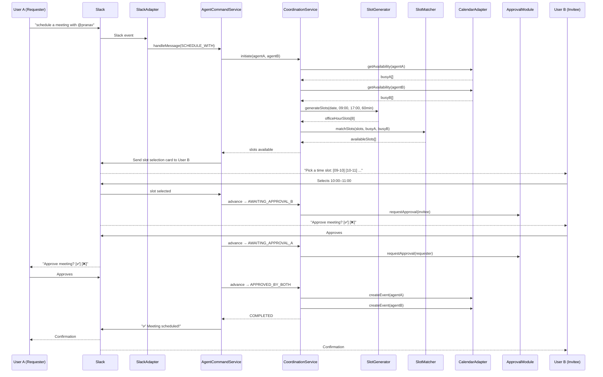

# Agent-to-Agent Deterministic Coordination Flow

## Goal

Implement the full deterministic coordination flow for **"schedule a meeting with @pranav tomorrow in office hours"** — from Slack command reception through two-agent availability matching, slot selection, HITL approval (invitee first), Google Calendar event creation for both agents, and completion notifications.

---

## Gap Analysis: Existing Code vs Spec

| Spec Requirement | Status | Details |
|---|---|---|
| 14-state machine | ✅ Built | [CoordinationState](file:///e:/CoAgent4U/core/coordination-module/src/main/java/com/coagent4u/coordination/domain/CoordinationStateMachine.java#32-79) has all states |
| State transition validation | ✅ Built | [CoordinationStateMachine](file:///e:/CoAgent4U/core/coordination-module/src/main/java/com/coagent4u/coordination/domain/CoordinationStateMachine.java#32-79) with allowed-transition map |
| [Coordination](file:///e:/CoAgent4U/core/coordination-module/src/main/java/com/coagent4u/coordination/domain/Coordination.java#20-109) entity with audit log | ✅ Built | State log with `CoordinationStateLogEntry` |
| Availability fetching (A then B) | ✅ Built | `CoordinationService.initiate()` |
| Proposal generation | ✅ Built | [ProposalGenerator](file:///e:/CoAgent4U/core/coordination-module/src/main/java/com/coagent4u/coordination/domain/ProposalGenerator.java#12-35) |
| Event creation saga with compensation | ✅ Built | [EventCreationSaga](file:///e:/CoAgent4U/core/coordination-module/src/main/java/com/coagent4u/coordination/domain/EventCreationSaga.java#15-61) |
| Invitee-first approval rule | ✅ Built | Service requests invitee approval first |
| **SlotGenerator** (office‑hour slots) | ❌ Missing | Spec requires 09:00–17:00 slot generation |
| **SlotMatcher** (remove busy slots) | ⚠️ Partial | [AvailabilityMatcher](file:///e:/CoAgent4U/core/coordination-module/src/main/java/com/coagent4u/coordination/domain/AvailabilityMatcher.java#17-51) finds first overlap, not all free slots |
| **Slot selection UI** (Slack buttons) | ❌ Missing | User must pick a slot from list |
| **CoordinationInstruction** pattern | ⚠️ Optional | Current direct orchestration is valid hexagonal |
| **NotificationPort for coordination** | ❌ Missing | No Slack messages sent to users during coordination |
| **Structured `[Component]` logging** | ⚠️ Partial | Some logging exists, not in spec format |
| **Slack payload parsing** (blocks.user) | ⚠️ Partial | Only parses @mention from text, not Slack blocks |
| **Requester approval (Step 8)** | ❌ Missing | After invitee approves, must request requester approval |

---

## Architecture Overview



---

## Proposed Changes

### coordination-module — Domain Layer

#### [NEW] [SlotGenerator.java](file:///e:/CoAgent4U/core/coordination-module/src/main/java/com/coagent4u/coordination/domain/SlotGenerator.java)
- Generates office-hour time slots for a given date
- `generateSlots(LocalDate date, LocalTime officeStart, LocalTime officeEnd, int durationMinutes, ZoneId timezone)`
- Returns `List<TimeSlot>` of all possible meeting slots (e.g., 8 one-hour slots from 09:00–17:00)

#### [NEW] [SlotMatcher.java](file:///e:/CoAgent4U/core/coordination-module/src/main/java/com/coagent4u/coordination/domain/SlotMatcher.java)
- Replaces current [AvailabilityMatcher](file:///e:/CoAgent4U/core/coordination-module/src/main/java/com/coagent4u/coordination/domain/AvailabilityMatcher.java#17-51) behaviour for the coordination flow
- `matchSlots(List<TimeSlot> officeSlots, List<AvailabilityBlock> busyA, List<AvailabilityBlock> busyB)`
- Returns `List<TimeSlot>` of all free slots (not just the first one)

#### [MODIFY] [Coordination.java](file:///e:/CoAgent4U/core/coordination-module/src/main/java/com/coagent4u/coordination/domain/Coordination.java)
- Add `List<TimeSlot> availableSlots` field for storing matched slots
- Add `TimeSlot selectedSlot` field for user's selection
- Add `setAvailableSlots()`, `selectSlot()` methods

#### [MODIFY] [MeetingProposal.java](file:///e:/CoAgent4U/core/coordination-module/src/main/java/com/coagent4u/coordination/domain/MeetingProposal.java)
- Already fine — used after slot selection

---

### coordination-module — Application Layer

#### [MODIFY] [CoordinationService.java](file:///e:/CoAgent4U/core/coordination-module/src/main/java/com/coagent4u/coordination/application/CoordinationService.java)
Major refactoring:
- Use `SlotGenerator` + `SlotMatcher` instead of [AvailabilityMatcher](file:///e:/CoAgent4U/core/coordination-module/src/main/java/com/coagent4u/coordination/domain/AvailabilityMatcher.java#17-51)
- [initiate()](file:///e:/CoAgent4U/core/coordination-module/src/main/java/com/coagent4u/coordination/application/CoordinationService.java#70-116): Stop after PROPOSAL_GENERATED state, store available slots
- New `selectSlot(CoordinationId, TimeSlot)`: User B picks a slot → AWAITING_APPROVAL_B
- New `handleApproval(CoordinationId, AgentId, boolean approved)`: Handles invitee and requester approvals
- Add structured `[CoordinationService]` logging at every state transition

#### [MODIFY] [CoordinationProtocolPort.java](file:///e:/CoAgent4U/core/coordination-module/src/main/java/com/coagent4u/coordination/port/in/CoordinationProtocolPort.java)
- Add `selectSlot(CoordinationId, TimeSlot)` method
- Add `handleApproval(CoordinationId, AgentId, boolean approved)` method
- Add `getAvailableSlots(CoordinationId)` method

---

### coordination-module — Ports

#### [NEW] [AgentNotificationPort.java](file:///e:/CoAgent4U/core/coordination-module/src/main/java/com/coagent4u/coordination/port/out/AgentNotificationPort.java)
- Outbound port so coordination can instruct the agent module to send Slack messages
- `sendSlotSelectionRequest(AgentId, CoordinationId, List<TimeSlot>)`
- `sendCoordinationNotification(AgentId, String message)`

---

### agent-module — Application Layer

#### [MODIFY] [AgentCommandService.java](file:///e:/CoAgent4U/core/agent-module/src/main/java/com/coagent4u/agent/application/AgentCommandService.java)
- Update [initiateCollaboration()](file:///e:/CoAgent4U/core/agent-module/src/main/java/com/coagent4u/agent/application/AgentCommandService.java#134-138) to:
  - Extract the date from the parsed intent ("tomorrow")
  - Use [NaturalDateResolver](file:///e:/CoAgent4U/core/agent-module/src/main/java/com/coagent4u/agent/domain/NaturalDateResolver.java#33-214) for date resolution
  - Pass resolved date to `coordinationProtocol.initiate()`
  - After initiate, send slot selection card to invitee via Slack
- Add structured `[AgentService]` logging

---

### messaging-module — Adapter

#### [MODIFY] [SlackNotificationAdapter.java](file:///e:/CoAgent4U/integration/messaging-module/src/main/java/com/coagent4u/messaging/SlackNotificationAdapter.java)
- Add `sendSlotSelectionCard(slackUserId, workspaceId, coordinationId, slots)` method
- Renders Slack Block Kit buttons for each available slot
- Add `sendCoordinationConfirmation()` method

#### [MODIFY] [SlackInteractionHandler.java](file:///e:/CoAgent4U/integration/messaging-module/src/main/java/com/coagent4u/messaging/SlackInteractionHandler.java)
- Handle `slot_select_*` button actions (route to coordination module)
- Handle coordination approval actions (both invitee and requester)

---

### user-module — Port

#### [MODIFY] [NotificationPort.java](file:///e:/CoAgent4U/core/user-module/src/main/java/com/coagent4u/user/port/out/NotificationPort.java)
- Add `sendSlotSelection(SlackUserId, WorkspaceId, String coordinationId, List<TimeSlot> slots)` method

---

### Infrastructure — Persistence

#### [MODIFY] Coordination JPA entity (if exists) or Flyway migration
- Add `available_slots` and `selected_slot` columns if coordination is persisted

---

## Expected Terminal Logs

```
[SlackAdapter] Received command: "schedule a meeting with @pranav tomorrow"
[IntentParser] Parsed intent=SCHEDULE_WITH targetUser=pranav
[DateResolver] Resolved "tomorrow" → 2026-03-09
[AgentService] Initiating coordination: requester=agentA invitee=agentB
[CoordinationService] Coordination abc-123 created → INITIATED
[CoordinationService] abc-123 → CHECKING_AVAILABILITY_A
[CalendarAdapter] Fetching availability for agentA
[CoordinationService] abc-123 → CHECKING_AVAILABILITY_B
[CalendarAdapter] Fetching availability for agentB
[CoordinationService] abc-123 → MATCHING
[SlotGenerator] Generated 8 office-hour slots (09:00–17:00)
[SlotMatcher] Matched 5 free slots after removing busy intervals
[CoordinationService] abc-123 → PROPOSAL_GENERATED (5 slots available)
[NotificationService] Slot selection card sent to User B
--- User B selects 10:00–11:00 ---
[CoordinationService] abc-123 selectedSlot=10:00–11:00
[CoordinationService] abc-123 → AWAITING_APPROVAL_B
[ApprovalService] Approval created for invitee
[NotificationService] Approval card sent to User B
--- User B approves ---
[ApprovalService] Invitee approved
[CoordinationService] abc-123 → AWAITING_APPROVAL_A
[ApprovalService] Approval created for requester
[NotificationService] Approval card sent to User A
--- User A approves ---
[ApprovalService] Requester approved
[CoordinationService] abc-123 → APPROVED_BY_BOTH
[CalendarAdapter] Creating event for agentA in Google Calendar
[CoordinationService] abc-123 → CREATING_EVENT_A
[CalendarAdapter] Creating event for agentB in Google Calendar
[CoordinationService] abc-123 → CREATING_EVENT_B
[CoordinationService] abc-123 → COMPLETED
[NotificationService] Confirmation sent to User A
[NotificationService] Confirmation sent to User B
```

---

## Verification Plan

### Automated Tests
- `SlotGeneratorTest`: Verify 8 slots generated for 09:00–17:00, verify edge cases
- `SlotMatcherTest`: Verify busy intervals correctly remove conflicting slots
- `CoordinationStateMachineTest`: Verify all valid/invalid transitions

### Manual Verification
1. DM bot: `schedule a meeting with @pranav tomorrow`
2. Verify slot selection card appears for @pranav with available time slots
3. Select a slot → verify approval card appears for @pranav
4. @pranav approves → verify approval card appears for requester
5. Requester approves → verify events created in both Google Calendars
6. Verify confirmation messages sent to both users
7. Check terminal logs match expected format
