# CoAgent4U - Product Requirements Document (PRD)

**Version:** 1.0  
**Date:** February 14, 2026  
**Status:** Draft - MVP Specification  
**Author:** System Architecture & Product Management Team

---

## Document Index

1. [Executive Summary](#1-executive-summary)
2. [Product Overview](#2-product-overview)
   - 2.1 [Vision Statement](#21-vision-statement)
   - 2.2 [Product Positioning](#22-product-positioning)
   - 2.3 [Core Value Proposition](#23-core-value-proposition)
3. [Strategic Objectives](#3-strategic-objectives)
   - 3.1 [MVP Goals](#31-mvp-goals)
   - 3.2 [Success Metrics](#32-success-metrics)
4. [Scope Definition](#4-scope-definition)
   - 4.1 [In Scope (MVP)](#41-in-scope-mvp)
   - 4.2 [Out of Scope (MVP)](#42-out-of-scope-mvp)
   - 4.3 [Future Roadmap](#43-future-roadmap)
5. [User Personas & Scenarios](#5-user-personas--scenarios)
   - 5.1 [Primary User Persona](#51-primary-user-persona)
   - 5.2 [User Journey](#52-user-journey)
   - 5.3 [Use Case Scenarios](#53-use-case-scenarios)
6. [Functional Requirements](#6-functional-requirements)
   - 6.1 [User Onboarding & Authentication](#61-user-onboarding--authentication)
   - 6.2 [Personal Agent Engine](#62-personal-agent-engine)
   - 6.3 [Agent-to-Agent (A2A) Coordination Engine](#63-agent-to-agent-a2a-coordination-engine)
   - 6.4 [Slack Integration](#64-slack-integration)
   - 6.5 [Calendar Management](#65-calendar-management)
   - 6.6 [Approval Workflows](#66-approval-workflows)
   - 6.7 [Data Management](#67-data-management)
7. [Non-Functional Requirements](#7-non-functional-requirements)
   - 7.1 [Performance](#71-performance)
   - 7.2 [Security](#72-security)
   - 7.3 [Scalability](#73-scalability)
   - 7.4 [Reliability & Availability](#74-reliability--availability)
   - 7.5 [Maintainability](#75-maintainability)
   - 7.6 [Usability](#76-usability)
8. [System Architecture](#8-system-architecture)
   - 8.1 [Hexagonal Architecture Overview](#81-hexagonal-architecture-overview)
   - 8.2 [Domain Layer](#82-domain-layer)
   - 8.3 [Application Layer](#83-application-layer)
   - 8.4 [Ports](#84-ports)
   - 8.5 [Adapters](#85-adapters)
   - 8.6 [Infrastructure Layer](#86-infrastructure-layer)
9. [Data Architecture](#9-data-architecture)
   - 9.1 [Data Model](#91-data-model)
   - 9.2 [Data Flow](#92-data-flow)
   - 9.3 [Data Storage](#93-data-storage)
   - 9.4 [Data Retention](#94-data-retention)
10. [Integration Specifications](#10-integration-specifications)
    - 10.1 [Slack Integration](#101-slack-integration)
    - 10.2 [Google Calendar Integration](#102-google-calendar-integration)
    - 10.3 [Authentication Services](#103-authentication-services)
11. [User Interface Specifications](#11-user-interface-specifications)
    - 11.1 [Slack Chat Interface](#111-slack-chat-interface)
    - 11.2 [Web Platform Interface](#112-web-platform-interface)
12. [Coordination Protocol Specification](#12-coordination-protocol-specification)
    - 12.1 [Protocol Overview](#121-protocol-overview)
    - 12.2 [Message Types](#122-message-types)
    - 12.3 [State Machine](#123-state-machine)
    - 12.4 [Coordination Flow](#124-coordination-flow)
13. [Error Handling & Edge Cases](#13-error-handling--edge-cases)
    - 13.1 [Error Categories](#131-error-categories)
    - 13.2 [Error Handling Strategies](#132-error-handling-strategies)
    - 13.3 [Edge Case Scenarios](#133-edge-case-scenarios)
14. [Security & Privacy](#14-security--privacy)
    - 14.1 [Authentication & Authorization](#141-authentication--authorization)
    - 14.2 [Data Encryption](#142-data-encryption)
    - 14.3 [API Security](#143-api-security)
    - 14.4 [Audit Logging](#144-audit-logging)
15. [GDPR Compliance](#15-gdpr-compliance)
    - 15.1 [Data Minimization](#151-data-minimization)
    - 15.2 [Consent Management](#152-consent-management)
    - 15.3 [User Rights](#153-user-rights)
    - 15.4 [Data Protection](#154-data-protection)
    - 15.5 [Retention Policies](#155-retention-policies)
16. [Technical Stack](#16-technical-stack)
    - 16.1 [Backend Technologies](#161-backend-technologies)
    - 16.2 [Frontend Technologies](#162-frontend-technologies)
    - 16.3 [Infrastructure](#163-infrastructure)
    - 16.4 [Third-Party Services](#164-third-party-services)
17. [Deployment Architecture](#17-deployment-architecture)
    - 17.1 [Environment Strategy](#171-environment-strategy)
    - 17.2 [Containerization](#172-containerization)
    - 17.3 [CI/CD Pipeline](#173-cicd-pipeline)
18. [Testing Strategy](#18-testing-strategy)
    - 18.1 [Unit Testing](#181-unit-testing)
    - 18.2 [Integration Testing](#182-integration-testing)
    - 18.3 [End-to-End Testing](#183-end-to-end-testing)
    - 18.4 [Security Testing](#184-security-testing)
19. [Monitoring & Observability](#19-monitoring--observability)
    - 19.1 [Metrics Collection](#191-metrics-collection)
    - 19.2 [Logging Strategy](#192-logging-strategy)
    - 19.3 [Alerting](#193-alerting)
20. [Release Plan](#20-release-plan)
    - 20.1 [Phased Rollout](#201-phased-rollout)
    - 20.2 [Rollback Strategy](#202-rollback-strategy)
21. [Dependencies & Assumptions](#21-dependencies--assumptions)
    - 21.1 [External Dependencies](#211-external-dependencies)
    - 21.2 [Assumptions](#212-assumptions)
    - 21.3 [Constraints](#213-constraints)
22. [Risks & Mitigation](#22-risks--mitigation)
23. [Appendices](#23-appendices)
    - 23.1 [Glossary](#231-glossary)
    - 23.2 [References](#232-references)

---

## 1. Executive Summary

CoAgent4U is a deterministic Personal Agent Coordination Platform that enables two users to seamlessly complete shared tasks through personal agents operating within Slack. The MVP focuses on validating structured Agent-to-Agent (A2A) coordination using meeting scheduling as the primary use case.

### Key Highlights

- **Product Type:** Personal Agent Coordination Platform (not a chatbot)
- **MVP Use Case:** Two-user meeting scheduling via Slack
- **Core Innovation:** Deterministic A2A Coordination Engine
- **Architecture:** Hexagonal architecture with clear separation of concerns
- **Integration:** Slack workspace + Google Calendar
- **Governance Model:** Human-in-the-Loop (HITL) with mandatory approvals
- **Compliance:** GDPR-compliant by design
- **Technology Stack:** Java 21, Spring Boot 3.x, PostgreSQL, React 18

### Strategic Importance

The MVP validates the fundamental coordination framework that will power future multi-use-case expansion including travel coordination, expense splitting, restaurant reservations, and autonomous task orchestration.

---

## 2. Product Overview

### 2.1 Vision Statement

To create a scalable personal agent coordination platform that enables personal agents to collaborate on behalf of users, executing shared tasks with deterministic transparency, human oversight, and complete data sovereignty. Coordination Engine executes a deterministic state-machine-driven negotiation protocol between personal agents. It does not directly call external APIs but operates through defined outbound ports.
### 2.2 Product Positioning

**CoAgent4U is NOT JUST A:**
- A simple chatbot
- A scheduling automation script
- An AI-powered assistant
- A standalone calendar tool

**CoAgent4U IS:**
- A Deterministic Personal Agent Coordination Platform
- A Human-in-the-Loop governance system
- A structured task negotiation framework
- An auditable execution engine

### 2.3 Core Value Proposition

1. **For Users:**
   - Eliminate manual back-and-forth for scheduling
   - Maintain control through approval workflows
   - Transparent agent operations
   - Data privacy and security

2. **For Organizations:**
   - Scalable coordination framework
   - Predictable and auditable operations
   - GDPR-compliant by design
   - Future-proof architecture for multi-use-case expansion

---

## 3. Strategic Objectives

### 3.1 MVP Goals

1. **Primary Goal:** Validate structured Agent-to-Agent coordination for shared task execution
2. **Secondary Goals:**
   - Demonstrate deterministic orchestration without LLM dependency
   - Establish HITL governance patterns
   - Prove integration feasibility with Slack and Google Calendar
   - Create extensible architecture for future use cases

### 3.2 Success Metrics

| Metric Category | KPI | Target (MVP) |
|----------------|-----|--------------|
| **Functional** | Successful meeting scheduling completion rate | >95% |
| **Functional** | Agent coordination accuracy | 100% (deterministic) |
| **Performance** | Average scheduling coordination time | <30 seconds |
| **Performance** | System uptime | >99.5% |
| **User Experience** | User approval response time | <5 minutes (median) |
| **Security** | Zero unauthorized data access incidents | 100% |
| **Compliance** | GDPR compliance audit score | 100% |
| **Technical** | Code test coverage | >80% |

---

## 4. Scope Definition

### 4.1 In Scope (MVP)

#### 4.1.1 Platform Capabilities
- Slack workspace-level app installation
- User authentication and authorization via CoAgent4U web platform
- Personal agent provisioning per user
- Deterministic A2A coordination engine
- Google Calendar integration (read/write)
- Human-in-the-loop approval workflows
- Audit logging and data access transparency

#### 4.1.2 Use Cases
- **Personal Tasks:**
  - Add single calendar events with approval
  - Check personal availability
  - View schedule summary
  - Detect and handle scheduling conflicts

- **Collaborative Tasks:**
  - Two-user meeting scheduling
  - Availability matching
  - Deterministic time slot proposal
  - Dual approval workflow
  - Calendar event creation
  - Approval timeout mechanisms


#### 4.1.3 User Journeys
- Workspace admin installs Slack app
- Users authenticate via CoAgent4U website
- Users connect Google Calendar
- Users request personal calendar operations
- Users initiate collaborative scheduling
- Users approve/reject coordination proposals

### 4.2 Out of Scope (MVP)

- ❌ LLM/AI-based coordination (post-MVP)
- ❌ Multi-user coordination (3+ agents)
- ❌ Recurring meeting scheduling
- ❌ Working hours/business hours configuration
- ❌ Multiple time zone support
- ❌ Calendar integrations beyond Google Calendar
- ❌ Rejection modification workflows
- ❌ User roles beyond basic user (no admin/manager hierarchy)
- ❌ Mobile native applications
- ❌ Autonomous recurring task orchestration
- ❌ Other use cases (travel, expenses, restaurant booking)

### 4.3 Future Roadmap

**Phase 2 (Post-MVP):**
- AI-enhanced negotiation capabilities
- Multiple time zone handling
- Working hours configuration
- Recurring meeting support
- Approval timeout policies

**Phase 3:**
- Multi-user coordination (3+ agents)
- Additional use cases (travel, expenses, dining)
- Advanced preference learning
- Autonomous task orchestration
- Integration of A2A Protocol with customized layers

**Phase 4:**
- Multi-calendar support (Outlook, Apple Calendar)
- Integration with additional chat platforms
- Enterprise-grade analytics dashboard

---

## 5. User Personas & Scenarios

### 5.1 Primary User Persona

**Name:** Alex Chen  
**Role:** Product Manager  
**Organization:** Mid-size Tech Company (50-200 employees)  
**Tech Proficiency:** High  
**Daily Tools:** Slack, Google Calendar, Gmail, Jira

#### Characteristics
- Schedules 10-15 meetings per week
- Works across multiple time zones (future)
- Values efficiency and automation
- Privacy-conscious
- Prefers transparent, controllable systems

#### Pain Points
- Wastes 30-60 minutes daily on scheduling back-and-forth
- Context switching between Slack and Calendar
- Difficult to find mutually available slots
- Manual conflict checking
- Lacks visibility into scheduling status

#### Goals
- Reduce time spent on scheduling
- Maintain control over calendar
- Quick meeting setup with colleagues
- Transparent agent operations

### 5.2 User Journey

#### 5.2.1 Onboarding Journey

```
Step 1: Slack App Installation
└─ Workspace admin installs CoAgent4U app
└─ App appears in Slack workspace

Step 2: User Authentication
└─ User visits CoAgent4U web platform
└─ Authenticates via Slack OAuth
└─ Account created and linked to Slack user

Step 3: Service Connection
└─ User connects Google Calendar via OAuth
└─ Permissions granted for calendar read/write
└─ Personal agent provisioned

Step 4: Ready to Use
└─ User can invoke agent via Slack
└─ Agent has scoped calendar access
```

#### 5.2.2 Personal Task Journey

```
User Action: "@CoAgent4U add gym tomorrow at 7 AM"
└─ Agent parses intent: Create event
└─ Agent checks calendar for conflicts
   ├─ No Conflict
   │  └─ Agent generates event proposal
   │  └─ User receives approval request in Slack
   │  └─ User approves
   │  └─ Event created in Google Calendar
   │  └─ Confirmation sent to user
   │
   └─ Conflict Detected
      └─ Agent identifies conflicting event
      └─ User receives conflict notification
      └─ "Conflicting with 'Team Standup' at 7:00 AM. Add anyway?"
      └─ User decides: Approve or Reject
```

#### 5.2.3 Collaborative Scheduling Journey

```
User A Action: "@CoAgent4U schedule a meeting with @UserB Friday evening"

Step 1: Intent Extraction (Agent A)
└─ Agent A parses: Collaborative scheduling request
└─ Participants: User A, User B
└─ Timeframe: Friday evening
└─ Duration: Default (30 min or configurable)

Step 2: Availability Check (Agent A)
└─ Agent A queries User A's calendar
└─ Identifies free slots on Friday evening
   ├─ Conflict Detected
   │  └─ Agent A notifies User A: "Your friday evening slots are conflicting with other events. schedule anyway?"
   │  └─ User decides: Approve or Reject
   │
   └─ Free slots found
      └─ Agent A extracts available windows

Step 3: A2A Coordination Initiated
└─ Coordination Engine contacts Agent B
└─ Coordination state: INITIATED

Step 4: Availability Matching (Agent B)
└─ Agent B queries User B's calendar
└─ Agent B identifies free slots on Friday evening
└─ Coordination Engine performs deterministic matching
   ├─ No overlapping free slots
   │  └─ Agent A notifies User A: "No common availability found"
   │  └─ Coordination terminates
   │
   └─ Common slots identified
      └─ Coordination Engine generates proposal
      └─ Coordination state: PROPOSAL_GENERATED

Step 5: Approval Request (User B)
└─ Agent B sends approval request to User B in Slack
└─ Proposal: "Meeting with User A on Friday 6:00 PM - 6:30 PM"
└─ Interactive buttons: [Approve] [Reject]
└─ Coordination state: AWAITING_APPROVAL_B

Step 6: User B Response
   ├─ User B Rejects
   │  └─ Agent A notifies User A: "User B declined the proposal"
   │  └─ Coordination state: REJECTED
   │
   └─ User B Approves
      └─ Coordination state: APPROVED_BY_B

Step 7: Approval Request (User A)
└─ Agent A sends approval request to User A
└─ Proposal: "Meeting with User B on Friday 6:00 PM - 6:30 PM"
└─ Interactive buttons: [Approve] [Reject]
└─ Coordination state: AWAITING_APPROVAL_A

Step 8: User A Response
   ├─ User A Rejects
   │  └─ Coordination terminates
   │  └─ Coordination state: REJECTED
   │
   └─ User A Approves
      └─ Coordination state: APPROVED_BY_BOTH

Step 9: Event Creation
└─ Agent A creates calendar event in User A's calendar
└─ Agent B creates calendar event in User B's calendar
└─ Coordination state: COMPLETED
└─ Both users receive confirmation

Step 10: Audit Logging
└─ Full coordination flow logged
└─ Approval history recorded
└─ Timestamps captured
```

### 5.3 Use Case Scenarios

#### UC-001: Add Personal Calendar Event

**Actor:** User  
**Preconditions:**
- User authenticated
- Google Calendar connected
- Personal agent provisioned

**Main Flow:**
1. User invokes agent: `@CoAgent4U add team lunch next Tuesday at noon`
2. Agent parses intent and extracts structured data
3. Agent checks calendar for conflicts at the specified time
4. No conflict found
5. Agent generates event proposal
6. Agent sends approval request to user via Slack
7. User clicks [Approve]
8. Agent creates event in Google Calendar
9. Agent sends confirmation to user

**Alternative Flow 3a: Conflict Detected**
1. Agent identifies conflicting event "Project Review at 12:00 PM"
2. Agent sends conflict notification to user
3. User receives: "Conflicting with 'Project Review' at 12:00 PM. Add anyway?"
4. User can approve (create despite conflict) or reject

**Postconditions:**
- Calendar event created (if approved)
- Audit log entry created
- User receives confirmation

---

#### UC-002: Two-User Meeting Scheduling

**Actors:** User A (Requester), User B (Invitee)  
**Preconditions:**
- Both users authenticated
- Both have Google Calendar connected
- Both have personal agents provisioned
- Both users in same Slack workspace

**Main Flow:**
1. User A invokes: `@CoAgent4U schedule a meeting with @UserB Friday evening`
2. Agent A parses intent
3. Agent A checks User A's calendar for Friday evening availability
4. Free slots found: [6:00 PM - 9:00 PM]
5. Coordination Engine initiates A2A coordination
6. Agent B checks User B's calendar for Friday evening
7. Free slots found: [5:00 PM - 7:00 PM]
8. Coordination Engine performs deterministic matching
9. Common slot identified: [6:00 PM - 7:00 PM]
10. Coordination Engine generates proposal: 6:00 PM - 6:30 PM (default 30 min)
11. Agent B sends approval request to User B
12. User B clicks [Approve]
13. Agent A sends approval request to User A
14. User A clicks [Approve]
15. Agent A creates event in User A's calendar
16. Agent B creates event in User B's calendar
17. Both users receive confirmation

**Alternative Flow 4a: No Free Slots (User A)**
1. Agent A finds no availability Friday evening
2. Agent A notifies User A: "No availability found for Friday evening"
3. Coordination terminates

**Alternative Flow 7a: No Free Slots (User B)**
1. Agent B finds no availability Friday evening
2. Coordination Engine identifies no common slots
3. Agent A notifies User A: "No common availability with User B on Friday evening"
4. Coordination terminates

**Alternative Flow 12a: User B Rejects**
1. User B clicks [Reject]
2. Coordination terminates
3. Agent A notifies User A: "User B declined the meeting proposal"

**Alternative Flow 14a: User A Rejects**
1. User A clicks [Reject]
2. Coordination terminates
3. No calendar events created

**Postconditions:**
- Calendar events created in both calendars (if both approve)
- Full coordination flow logged in audit trail
- Both users have visibility into coordination outcome

---

#### UC-003: User Onboarding

**Actor:** New User  
**Preconditions:**
- CoAgent4U Slack app installed in workspace
- User has Slack account in workspace

**Main Flow:**
1. User visits CoAgent4U web platform URL
2. User clicks "Sign in with Slack"
3. Slack OAuth flow initiated
4. User grants permissions
5. OAuth callback creates user account
6. User redirected to dashboard
7. User sees "Connect Google Calendar" option
8. User clicks "Connect Google Calendar"
9. Google OAuth flow initiated
10. User grants calendar permissions
11. OAuth callback stores refresh token
12. Personal agent instance provisioned
13. User sees confirmation: "Setup complete. Go to Slack to start using CoAgent4U"

**Postconditions:**
- User account created
- Slack user ID mapped to CoAgent4U user
- Google Calendar connected
- Personal agent ready

---

#### UC-004: View Data Access & Permissions

**Actor:** User  
**Preconditions:**
- User authenticated on web platform

**Main Flow:**
1. User navigates to "Data & Permissions" section
2. System displays connected services
3. System shows calendar access scope
4. System displays recent agent actions log
5. User can review what data agent accessed
6. User can revoke calendar permissions
7. User can delete account and all data

**Postconditions:**
- User has visibility into agent data access
- User retains control over permissions

---

## 6. Functional Requirements

### 6.1 User Onboarding & Authentication

#### REQ-AUTH-001: Slack App Installation
**Priority:** P0  
**Description:** Workspace admin must be able to install CoAgent4U Slack app at workspace level.

**Acceptance Criteria:**
- Admin can install app from Slack App Directory
- Installation requires workspace admin permissions
- App appears in workspace app list after installation
- All workspace members can mention/interact with the app

---

#### REQ-AUTH-002: User Authentication via Web Platform
**Priority:** P0  
**Description:** Users must authenticate via CoAgent4U web platform using Slack OAuth.

**Acceptance Criteria:**
- Web platform provides "Sign in with Slack" button
- OAuth flow redirects to Slack authorization page
- User grants required permissions (identity, workspace)
- OAuth callback creates user account
- User session established with JWT token
- Slack user ID mapped to CoAgent4U user ID

---

#### REQ-AUTH-003: Google Calendar Connection
**Priority:** P0  
**Description:** Users must connect Google Calendar to enable agent calendar access.

**Acceptance Criteria:**
- Web platform provides "Connect Google Calendar" interface
- Google OAuth flow initiated
- User grants calendar read/write permissions
- OAuth refresh token stored securely
- Connection status displayed to user
- User can disconnect calendar from web platform

---

#### REQ-AUTH-004: Personal Agent Provisioning
**Priority:** P0  
**Description:** System automatically provisions personal agent instance upon successful calendar connection.

**Acceptance Criteria:**
- Agent instance created per user
- Agent linked to user's Slack ID and CoAgent4U user ID
- Agent has scoped access to user's calendar
- Agent can be invoked via Slack
- Agent state initialized

---

### 6.2 Personal Agent Engine

#### REQ-AGENT-001: Intent Parsing (Personal Tasks)
**Priority:** P0  
**Description:** Personal agent must parse user commands for calendar operations using deterministic rules and passed on to LLM for fallback. LLM fallback is strictly limited to intent interpretation and must not influence coordination state transitions or proposal selection logic.

**Acceptance Criteria:**
- Agent recognizes calendar event creation commands
- Agent extracts: event title, date, time, duration
- Agent handles natural language time expressions (tomorrow, next Tuesday, etc.)
- Agent defaults to 30-minute duration if not specified
- Intent parsing is deterministic and rule-based
- Parsing errors provide clear user feedback
- If Intent parsing is failed after deterministic and rule based mechanism, then it is passed to cloud based LLM.

**Examples:**
- `@CoAgent4U add gym tomorrow at 7 AM` → Event: "gym", Date: tomorrow, Time: 7:00 AM, Duration: 30 min
- `@CoAgent4U add dentist appointment next Monday 2 PM for 1 hour` → Event: "dentist appointment", Date: next Monday, Time: 2:00 PM, Duration: 60 min

---

#### REQ-AGENT-002: Calendar Availability Check
**Priority:** P0  
**Description:** Agent must check user's calendar for conflicts before proposing event creation.

**Acceptance Criteria:**
- Agent queries Google Calendar API for events in target time window
- Agent identifies overlapping events
- Conflict detection considers event start/end times
- Agent returns conflict status and details

---

#### REQ-AGENT-003: Conflict Notification
**Priority:** P0  
**Description:** When conflict detected, agent must notify user and request decision.

**Acceptance Criteria:**
- Agent sends Slack message identifying conflicting event
- Message format: "Conflicting with '[Event Title]' at [Time]. Add anyway?"
- Interactive buttons provided: [Approve] [Reject]
- User choice recorded
- Approval proceeds to event creation
- Rejection cancels operation

---

#### REQ-AGENT-004: Personal Event Approval
**Priority:** P0  
**Description:** Agent must request user approval before creating calendar events.

**Acceptance Criteria:**
- Agent generates event proposal
- Agent sends approval request via Slack with interactive buttons
- Proposal includes: event title, date, time, duration
- User can approve or reject
- Approval triggers event creation
- Rejection cancels operation

---

#### REQ-AGENT-005: Calendar Event Creation
**Priority:** P0  
**Description:** Agent must create calendar event in Google Calendar upon approval.

**Acceptance Criteria:**
- Agent invokes Google Calendar API create event endpoint
- Event created with approved parameters
- Event includes title, start time, end time
- API errors handled gracefully
- Success confirmation sent to user
- Failure notification sent to user with error details

---

#### REQ-AGENT-006: Personal Schedule Summary
**Priority:** P1  
**Description:** Agent should provide summary of user's calendar when requested.

**Acceptance Criteria:**
- User can request: `@CoAgent4U show my schedule today`
- Agent retrieves events for specified time range
- Agent formats events in readable list
- Agent sends summary via Slack
- It would be summarized with the help of LLM.

---

### 6.3 Agent-to-Agent (A2A) Coordination Engine

#### REQ-COORD-001: Collaborative Intent Recognition
**Priority:** P0  
**Description:** Agent must recognize collaborative scheduling requests involving two users.

**Acceptance Criteria:**
- Agent detects mention of another user (@username)
- Agent identifies scheduling keywords: "schedule", "meeting", "meet"
- Agent extracts: target user, timeframe, duration (optional)
- Collaborative intent triggers A2A coordination flow

**Examples:**
- `@CoAgent4U schedule a meeting with @john Friday evening`
- `@CoAgent4U set up time with @sarah next week`

---

#### REQ-COORD-002: Deterministic Coordination Protocol
**Priority:** P0  
**Description:** Coordination Engine must execute deterministic orchestration logic for agent collaboration.

**Acceptance Criteria:**
- Coordination follows predefined state machine
- No LLM/AI used in coordination logic
- State transitions are deterministic and auditable
- Coordination states include: INITIATED, CHECKING_AVAILABILITY_A, CHECKING_AVAILABILITY_B, MATCHING, PROPOSAL_GENERATED, AWAITING_APPROVAL_B, AWAITING_APPROVAL_A, APPROVED_BY_BOTH, CREATING_EVENT_B, CREATING_EVENT_A, REJECTED, COMPLETED, FAILED

---

#### REQ-COORD-003: Requester Availability Check
**Priority:** P0  
**Description:** Agent A must check requester's(User A) calendar availability before initiating coordination.

**Acceptance Criteria:**
- Agent A queries requester's calendar for specified timeframe
- Free slots identified
- If no free slots, coordination terminates with notification
- If free slots found, coordination proceeds to invitee check

---

#### REQ-COORD-004: Invitee Availability Check
**Priority:** P0  
**Description:** Coordination Engine must request Agent B to check invitee's(User B) calender availability.

**Acceptance Criteria:**
- Coordination Engine call availability request to Agent B
- Agent B queries invitee's calendar
- Agent B returns free slots to Coordination Engine
- Response includes time windows

---

#### REQ-COORD-005: Availability Matching Algorithm
**Priority:** P0  
**Description:** Coordination Engine must deterministically match availability windows from both users.

**Acceptance Criteria:**
- Engine compares free slots from both calendars
- Engine identifies overlapping time windows
- If no overlap, coordination terminates with notification
- If overlap exists, engine selects optimal slot (earliest available)
- Matching algorithm is deterministic and repeatable

---

#### REQ-COORD-006: Proposal Generation
**Priority:** P0  
**Description:** Coordination Engine must generate structured meeting proposal from matched availability.

**Acceptance Criteria:**
- Proposal includes: participants, date, start time, end time, duration
- Default duration: 30 minutes
- Proposal time within overlapping availability
- Proposal formatted for user presentation

---

#### REQ-COORD-007: Invitee Approval Request
**Priority:** P0  
**Description:** Agent B must send approval request to invitee (User B) first.

**Acceptance Criteria:**
- Agent B sends Slack message to User B
- Message includes proposal details
- Interactive buttons: [Approve] [Reject]
- Approval state tracked: AWAITING_APPROVAL_B
- User response captured

---

#### REQ-COORD-008: Invitee Rejection Handling
**Priority:** P0  
**Description:** System must handle invitee rejection in MVP by terminating coordination.

**Acceptance Criteria:**
- If User B rejects, coordination state changes to REJECTED
- Coordination terminates
- Agent A notifies User A: "[User B] declined the meeting proposal"
- No calendar events created
- Coordination flow logged

---

#### REQ-COORD-009: Requester Approval Request
**Priority:** P0  
**Description:** Agent A must send approval request to requester (User A) after invitee approves.

**Acceptance Criteria:**
- Triggered only if User B approved
- Agent A sends Slack message to User A
- Message includes proposal details
- Interactive buttons: [Approve] [Reject]
- Approval state tracked: AWAITING_APPROVAL_A
- User response captured

---

#### REQ-COORD-010: Dual Approval Event Creation
**Priority:** P0  
**Description:** System must create calendar events in both users' calendars only after both approve.

**Acceptance Criteria:**
- Triggered only if both User A and User B approved
- Agent A creates event in User A's calendar
- Agent B creates event in User B's calendar
- Both events have identical details: title, start time, end time
- System must create calendar events in both users' calendars only after both approvals using a Saga-based compensating transaction model.
- Coordination state: COMPLETED
- Both users receive confirmation

---

#### REQ-COORD-011: Coordination State Management
**Priority:** P0  
**Description:** System must maintain and track coordination state throughout the lifecycle.

**Acceptance Criteria:**
- Each coordination instance has unique ID
- State transitions logged with timestamps
- Current state queryable
- State machine enforces valid transitions
- Invalid state transitions rejected

---

#### REQ-COORD-012: No Common Availability Handling
**Priority:** P0  
**Description:** System must gracefully handle scenarios where no common availability exists.

**Acceptance Criteria:**
- If no overlapping slots found, coordination terminates
- Agent A notifies User A: "No common availability with [User B] for [timeframe]"
- Coordination state: FAILED
- No approval requests sent

---

### 6.4 Slack Integration

#### REQ-SLACK-001: Workspace-Level App Installation
**Priority:** P0  
**Description:** CoAgent4U must be installable at Slack workspace level only.

**Acceptance Criteria:**
- App listed in Slack App Directory
- Installation requires workspace admin permissions
- App available to all workspace members after installation
- No user-level installation option

---

#### REQ-SLACK-002: Bot Mention Recognition
**Priority:** P0  
**Description:** System must recognize and respond to bot '/CoAgent' command in Slack.

**Acceptance Criteria:**
- Bot responds to `/CoAgent` mentions
- Bot ignores messages without mention
- Bot can be mentioned in channels and DMs
- Message content parsed after mention trigger

---

#### REQ-SLACK-003: Interactive Message Components
**Priority:** P0  
**Description:** System must use Slack interactive components for approval workflows.

**Acceptance Criteria:**
- Approval requests include interactive buttons
- Buttons: [Approve] [Reject]
- Button clicks trigger backend API calls
- Button state updates after user action
- Disabled buttons show action taken

---

#### REQ-SLACK-004: Real-Time Notifications
**Priority:** P0  
**Description:** System must send real-time notifications to users via Slack.

**Acceptance Criteria:**
- Notifications for approval requests
- Notifications for coordination outcomes
- Notifications for errors
- Notifications include relevant context
- Notifications sent to user's DM channel

---

### 6.5 Calendar Management

#### REQ-CAL-001: Google Calendar OAuth Integration
**Priority:** P0  
**Description:** System must integrate with Google Calendar using OAuth 2.0.

**Acceptance Criteria:**
- OAuth consent screen configured
- Scopes requested: `calendar.events`
- Refresh token stored securely
- Token refresh automated
- OAuth revocation supported

---

#### REQ-CAL-002: Calendar Read Operations
**Priority:** P0  
**Description:** System must read calendar events to check availability.

**Acceptance Criteria:**
- Query events within specified time range
- Retrieve event details: title, start, end
- Handle pagination for large result sets
- Respect calendar API rate limits
- Graceful handling of API errors

---

#### REQ-CAL-003: Calendar Write Operations
**Priority:** P0  
**Description:** System must create calendar events via Google Calendar API.

**Acceptance Criteria:**
- Create events with title, start time, end time
- Events created in user's primary calendar
- Event IDs returned and stored
- Duplicate event prevention
- API error handling

---

#### REQ-CAL-004: Single Time Zone (MVP)
**Priority:** P0  
**Description:** MVP assumes single time zone; no time zone conversion.

**Acceptance Criteria:**
- All times interpreted in user's local time zone
- No time zone conversion logic
- Calendar API calls use user's default calendar time zone
- Time zone handling deferred to post-MVP

---

#### REQ-CAL-005: No Recurring Events (MVP)
**Priority:** P0  
**Description:** MVP does not support recurring event scheduling.

**Acceptance Criteria:**
- Only single occurrence events supported
- Recurring event requests not recognized
- Future roadmap item

---

### 6.6 Approval Workflows

#### REQ-APPR-001: Mandatory Approval for Personal Events
**Priority:** P0  
**Description:** All personal calendar event creations require user approval.

**Acceptance Criteria:**
- Agent cannot create events without approval
- Approval request sent via Slack
- User can approve or reject
- Approval requests expire in 12 hours for MVP.

---

#### REQ-APPR-002: Mandatory Approval for Collaborative Events
**Priority:** P0  
**Description:** Both users must approve collaborative meeting proposals.

**Acceptance Criteria:**
- Invitee (User B) approves first
- Requester (User A) approves second
- Both approvals required before event creation
- Single rejection terminates coordination

---

#### REQ-APPR-003: Approval Request Format
**Priority:** P0  
**Description:** Approval requests must present clear, actionable information.

**Acceptance Criteria:**
- Request includes event details
- Request includes context (personal vs collaborative)
- Interactive buttons clearly labeled
- Request is visually distinct in Slack

---

#### REQ-APPR-004: Approval Response Handling
**Priority:** P0  
**Description:** System must process user approval responses correctly.

**Acceptance Criteria:**
- Button clicks captured via Slack interaction API
- User choice recorded (approve/reject)
- Appropriate action triggered
- User receives confirmation of action
- Idempotent response handling (duplicate clicks ignored)

---

#### REQ-APPR-005: Only Timeout option of 12 hours in MVP
**Priority:** P0  
**Description:** Approval requests expire's in 12 hours for MVP.

**Acceptance Criteria:**
- Requests remain open for next 12 hours
- Users can respond within that time period
- If no approval in time period then automatic rejection

---

### 6.7 Data Management

#### REQ-DATA-001: User Data Storage
**Priority:** P0  
**Description:** System must store minimum required user data.

**Acceptance Criteria:**
- Service connections: Google Calendar OAuth tokens
- Agent preferences (if any)
- No calendar event data stored locally (query on-demand)

---

#### REQ-DATA-002: Coordination Log Storage
**Priority:** P0  
**Description:** System must log all coordination flows for auditability.

**Acceptance Criteria:**
- Each coordination instance logged
- Log includes: participants, state transitions, timestamps, approvals, outcome
- Logs retained per GDPR requirements
- Logs queryable by user

---

#### REQ-DATA-003: Audit Trail
**Priority:** P0  
**Description:** System must maintain audit trail of agent actions.

**Acceptance Criteria:**
- Every agent action logged
- Log includes: user, action type, timestamp, outcome
- Logs accessible via web platform
- Logs retained per GDPR requirements
- Logs can be downloaded too

---

#### REQ-DATA-004: Data Access Transparency
**Priority:** P0  
**Description:** Users must be able to view what data the agent accesses.

**Acceptance Criteria:**
- Web platform displays connected services
- Web platform shows recent agent actions
- Users can review calendar access history
- Clear explanation of data usage

---

#### REQ-DATA-005: Data Deletion
**Priority:** P0  
**Description:** Users must be able to delete their account and all associated data.

**Acceptance Criteria:**
- Web platform provides "Delete Account" option
- Deletion removes: user profile, OAuth tokens, agent instance, logs
- Deletion is irreversible
- Confirmation via sign in required before deletion
- Deletion completes within 30 days (GDPR)

---

## 7. Non-Functional Requirements

### 7.1 Performance

#### REQ-PERF-001: Coordination Latency
**Priority:** P0  
**Requirement:** End-to-end coordination time from request to approval request delivery must be <30 seconds under normal conditions.

**Acceptance Criteria:**
- 95th percentile coordination latency <30 seconds
- Measured from user command to approval request in Slack
- Excludes user approval response time

---

#### REQ-PERF-002: Calendar API Response Time
**Priority:** P0  
**Requirement:** Calendar availability queries must complete within 5 seconds.

**Acceptance Criteria:**
- Google Calendar API calls timeout after 5 seconds
- Retry logic implemented for transient failures
- User notified if persistent failures occur

---

#### REQ-PERF-003: Slack Message Delivery
**Priority:** P0  
**Requirement:** Slack notifications must be delivered within 2.5 seconds of trigger.

**Acceptance Criteria:**
- 95th percentile message delivery <2.5 seconds
- Async delivery mechanism
- Delivery failures logged and retried

---

#### REQ-PERF-004: Database Query Performance
**Priority:** P1  
**Requirement:** Database queries must execute within 200ms.

**Acceptance Criteria:**
- Indexed columns for frequent queries
- Query optimization for coordination state lookups
- Connection pooling configured

---

### 7.2 Security

#### REQ-SEC-001: OAuth Token Storage
**Priority:** P0  
**Requirement:** OAuth tokens must be encrypted at rest.

**Acceptance Criteria:**
- Refresh tokens encrypted using AES-256
- Encryption keys stored in secure key management system
- Tokens decrypted only for API calls

---

#### REQ-SEC-002: HTTPS Communication
**Priority:** P0  
**Requirement:** All external communication must use HTTPS/TLS 1.2+.

**Acceptance Criteria:**
- Web platform served over HTTPS
- API endpoints HTTPS only
- TLS 1.2 or higher enforced
- Valid SSL certificates

---

#### REQ-SEC-003: API Authentication
**Priority:** P0  
**Requirement:** All API endpoints must authenticate requests.

**Acceptance Criteria:**
- JWT-based authentication for web platform APIs
- Slack signature verification for Slack API callbacks
- Unauthorized requests rejected with 401

---

#### REQ-SEC-004: Input Validation
**Priority:** P0  
**Requirement:** All user inputs must be validated and sanitized.

**Acceptance Criteria:**
- Command parsing validates input format
- SQL injection prevention
- XSS prevention in web platform
- Malicious payload detection

---

#### REQ-SEC-005: Secure Session Management
**Priority:** P0  
**Requirement:** User sessions must be securely managed.

**Acceptance Criteria:**
- JWT tokens with expiration (24 hours)
- Refresh token rotation
- Session invalidation on logout
- No session fixation vulnerabilities

---

### 7.3 Scalability

#### REQ-SCALE-001: Concurrent Users
**Priority:** P1  
**Requirement:** System must support 100 concurrent users in MVP.

**Acceptance Criteria:**
- Load testing validates 100 concurrent users
- No performance degradation under load
- Horizontal scaling planned for future

---

#### REQ-SCALE-002: Database Scalability
**Priority:** P1  
**Requirement:** Database must handle growth in users and coordination logs.

**Acceptance Criteria:**
- PostgreSQL configured with connection pooling
- Indexing strategy for frequent queries
- Partition strategy for log tables

---

#### REQ-SCALE-003: Stateless Application Layer
**Priority:** P1  
**Requirement:** Application layer must be stateless to enable horizontal scaling.

**Acceptance Criteria:**
- No in-memory session state
- All state persisted to database
- Multiple instances can run concurrently

---

### 7.4 Reliability & Availability

#### REQ-REL-001: System Uptime
**Priority:** P0  
**Requirement:** System must maintain 99.5% uptime during business hours.

**Acceptance Criteria:**
- Uptime monitored
- Planned maintenance during off-peak hours
- Graceful degradation strategies

---

#### REQ-REL-002: Error Recovery
**Priority:** P0  
**Requirement:** System must recover gracefully from transient errors.

**Acceptance Criteria:**
- Retry logic for external API calls
- Circuit breaker pattern for failing services
- User notified of persistent failures

---

#### REQ-REL-003: Data Backup
**Priority:** P0  
**Requirement:** Database must be backed up daily.

**Acceptance Criteria:**
- Automated daily backups
- Backups retained for 30 days
- Backup restoration tested monthly

---

### 7.5 Maintainability

#### REQ-MAINT-001: Code Quality
**Priority:** P0  
**Requirement:** Codebase must maintain high quality standards.

**Acceptance Criteria:**
- Code review required for all changes
- Static analysis tools integrated (SonarQube)
- Code coverage >80%
- Consistent coding standards enforced

---

#### REQ-MAINT-002: Logging
**Priority:** P0  
**Requirement:** System must implement comprehensive logging.

**Acceptance Criteria:**
- Structured logging (JSON format)
- Log levels: DEBUG, INFO, WARN, ERROR
- Correlation IDs for request tracing
- PII excluded from logs

---

#### REQ-MAINT-003: Monitoring
**Priority:** P0  
**Requirement:** System must be instrumented for monitoring.

**Acceptance Criteria:**
- Metrics collected: request rate, latency, error rate
- Dashboards for key metrics
- Alerts configured for anomalies

---

### 7.6 Usability

#### REQ-USE-001: Intuitive Commands
**Priority:** P0  
**Requirement:** Agent commands must be intuitive and natural.

**Acceptance Criteria:**
- Commands use natural language patterns
- Clear error messages for unrecognized commands
- Examples provided in documentation

---

#### REQ-USE-002: Clear Feedback
**Priority:** P0  
**Requirement:** System must provide clear feedback for all operations.

**Acceptance Criteria:**
- Success confirmations sent
- Error messages explain what went wrong
- Status updates during long operations

---

#### REQ-USE-003: Approval UX
**Priority:** P0  
**Requirement:** Approval requests must be clear and actionable.

**Acceptance Criteria:**
- All relevant details displayed
- Clear action buttons
- No ambiguity in choices
- Visual distinction from regular messages

---

## 8. System Architecture

### 8.1 Hexagonal Architecture Overview

CoAgent4U follows **Hexagonal Architecture (Ports and Adapters)** to ensure:
- **Domain logic isolation:** Core business rules are independent of external systems and frameworks.
- **Testability:** The domain and application layers can be tested without requiring Slack, databases, or external APIs.
- **Flexibility:** Infrastructure adapters (e.g., Slack, Google Calendar) can be replaced without impacting core logic.
- **Maintainability:** Clear separation of responsibilities reduces coupling and improves long-term evolvability.

#### Architecture Layers  

```mermaid
flowchart LR

    %%==============================================================
    %% ZONE 1 — ACTORS
    %%==============================================================
    subgraph Z1["👥  ACTORS"]
        direction TB
        A_WEB["🌐  Web User\n─────────────\nBrowser · HTTPS\nOAuth 2.0 Redirect"]
        A_REQ["💬  Requester\n─────────────\nSlack Client\nSlash Commands · Messages"]
        A_INV["✅  Invitee\n─────────────\nSlack Client\nApprovals · Confirmations"]
    end

    %%==============================================================
    %% ZONE 2 — PRIMARY DRIVING ADAPTERS
    %%==============================================================
    subgraph Z2["🔌  PRIMARY ADAPTERS  ·  Driving"]
        direction TB

        subgraph PA_WEB["🖥️  REST API Adapter  ·  Spring MVC"]
            PA_W["POST  /auth/register\nGET   /schedule\nPOST  /service/connect\nDEL   /service/disconnect\nGET   /oauth2/callback\n──────────────────\n🔒  JWT Bearer Auth\n🔄  OAuth2 Redirect Handler\n🚦  Rate Limiter  100 req/min"]
        end

        subgraph PA_SLACK["⚡  Slack Inbound Adapter  ·  Events API"]
            PA_S["Slash Command Dispatcher\nBlock Kit Action Handler\nApproval Response Handler\n──────────────────\n🔐  HMAC-SHA256 Signature Check\n📦  Payload Parser & Validator"]
        end
    end

    %%==============================================================
    %% ZONE 3 — APPLICATION CORE
    %%==============================================================
    subgraph CORE["⬡  APPLICATION CORE  ·  CoAgent4U Platform"]
        direction TB

        subgraph IP_ZONE["◀  INBOUND PORTS"]
            direction LR
            IP1["HandleMessageUseCase\n· agent-module"]
            IP2["ViewScheduleUseCase\n· agent-module"]
            IP3["CreatePersonalEventUseCase\n· agent-module"]
            IP4["RegisterUserUseCase\nConnectServiceUseCase\nDisconnectServiceUseCase\n· user-module"]
            IP5["CreateApprovalUseCase\nDecideApprovalUseCase\n· approval-module"]
            IP6["CoordinationProtocolPort\n· coordination-module\n⚠️  agent-module access only"]
        end

        subgraph DOMAIN["🧠  DOMAIN LOGIC"]
            direction LR

            subgraph UM["👤  user-module"]
                UM_N["User  «aggregate root»\n────────────────\nSlackIdentity  «entity»\nServiceConnection  «entity»\n────────────────\nUserConnectionStatus  «value»\n────────────────\nRegister · Connect\nDisconnect · Delete"]
            end

            subgraph AM["🤖  agent-module  ·  CalendarPort Owner"]
                AM_N["Agent  «aggregate root»\n────────────────\nIntentParser  «domain svc»\nConflictDetector  «domain svc»\n────────────────\nAvailabilityBlock  «value»\nEventConfirmation  «value»\nAgentProfile  «value»\n────────────────\n✦  AgentAvailabilityPort impl\n✦  AgentEventExecutionPort impl\n✦  AgentProfilePort impl"]
            end

            subgraph CM["🔄  coordination-module  ·  State Machine Engine"]
                CM_N["Coordination  «aggregate root»\n────────────────\nCoordinationStateMachine\nAvailabilityMatcher\nProposalGenerator\nEventCreationSaga  «compensating»\n────────────────\nINITIATED → CHECKING_AVAIL\n→ MATCHING → PROPOSAL\n→ AWAITING_APPROVAL\n→ APPROVED → CREATING\n→ COMPLETED  ·  FAILED"]
            end

            subgraph APPM["✅  approval-module"]
                AP_N["Approval  «aggregate root»\n────────────────\nExpirationPolicy  «domain svc»\n────────────────\nApprovalStatus  «value»\n────────────────\nPersonal · Collaborative\nDual-approval enforcement\nTimeout expiration"]
            end

            AM  -->|"🔗  CoordinationProtocolPort\ninitiate · advance · terminate"| CM
            AM  -->|"🔗  ApprovalPort"| APPM
            AM  -->|"🔗  UserQueryPort"| UM
            CM  -->|"🔗  AgentAvailabilityPort\n     AgentEventExecutionPort\n     AgentProfilePort"| AM
            APPM -.->|"📡  ApprovalDecisionMade\n      ApprovalExpired"| AM
        end

        subgraph OP_ZONE["OUTBOUND PORTS  ▶"]
            direction LR
            OP1["CalendarPort\n🚫  agent-module ONLY"]
            OP2["LLMPort\n· agent-module only"]
            OP3["NotificationPort\n· agent · approval · user"]
            OP4["PersistencePorts\nUser · Agent\nCoordination · Approval"]
            OP5["DomainEventPublisher\n· infrastructure async"]
        end

        IP_ZONE --> DOMAIN
        DOMAIN  --> OP_ZONE
    end

    %%==============================================================
    %% ZONE 4 — SECONDARY DRIVEN ADAPTERS
    %%==============================================================
    subgraph Z4["🔌  SECONDARY ADAPTERS  ·  Driven"]
        direction TB

        subgraph SA_CAL["📅  calendar-module  ·  integration"]
            SA_C["GoogleCalendarAdapter\nimplements CalendarPort\n──────────────────\n🔑  OAuth Token Lifecycle\n📊  FreeBusy Queries\n📝  Event CRUD  create · delete\n🔄  Transparent Token Refresh\n🔒  AES-256-GCM Token Decrypt"]
        end

        subgraph SA_MSG["💬  messaging-module  ·  integration"]
            SA_M["SlackNotificationAdapter\nimplements NotificationPort\n──────────────────\n🎨  Block Kit Formatter\n📋  Approval Prompt Builder\n📆  Schedule Summary Renderer\n✉️  Confirmation · Error Delivery"]
        end

        subgraph SA_LLM["🧠  llm-module  ·  future-ready"]
            SA_L["GroqLLMAdapter\nimplements LLMPort\n──────────────────\n✍️  Prompt Construction\n🎯  Fallback Intent Classification\n📝  Schedule Summarization\n⚙️  Response Parsing"]
        end

        subgraph SA_PER["🗄️  persistence  ·  infrastructure"]
            SA_P["PostgreSQL Adapters\nimplements all PersistencePorts\n──────────────────\n🗃️  JPA Entity Mappings\n📚  Spring Data Repositories\n✈️  Flyway Migrations\n──────────────────\nusers · slack_identities\nservice_connections · agents\ncoordinations · state_log\napprovals · audit_logs"]
        end
    end

    %%==============================================================
    %% ZONE 5 — EXTERNAL SYSTEMS
    %%==============================================================
    subgraph Z5["🌍  EXTERNAL SYSTEMS"]
        direction TB
        EXT_SLACK["⚡  Slack Platform\nEvents API · REST · Block Kit"]
        EXT_GCAL["📅  Google Calendar API\nREST · OAuth 2.0 · FreeBusy"]
        EXT_GROQ["🤖  Groq LLM API\nREST · Chat Completions"]
        EXT_DB[("🗄️  PostgreSQL 15\nPrimary Datastore\nusers · agents\ncoordinations\napprovals · audit_logs")]
    end

    %%==============================================================
    %% CROSS-CUTTING CONCERNS
    %%==============================================================
    subgraph CC["⚙️  CROSS-CUTTING CONCERNS  ·  infrastructure"]
        direction LR

        subgraph SEC["🔒  security"]
            SEC_N["JWT  ·  REST API stateless auth\nOAuth 2.0  ·  Google PKCE flow\nAES-256-GCM  ·  secrets at rest\nHMAC-SHA256  ·  Slack sig verify\nCaffeine Bucket  ·  rate limiting"]
        end

        subgraph OBS["📊  monitoring  ·  observability"]
            OBS_N["📡  DomainEventPublisher → Audit Handler\nCoordinationStateChanged  «async»\nPersonalEventCreated  «async»\nApprovalDecisionMade  «async»\n────────────────────────\n💚  Spring Actuator  health · info\n📈  Micrometer  coordination latency\n📝  Structured JSON  correlation IDs"]
        end
    end

    %%==============================================================
    %% WIRING — ACTORS & EXTERNAL
    %%==============================================================
    A_WEB -->|"HTTPS / JSON"| PA_WEB
    A_REQ -->|"Slack messages"| EXT_SLACK
    A_INV -->|"Slack messages"| EXT_SLACK
    EXT_SLACK -->|"Webhook POST\n🔐 Sig Verified"| PA_SLACK

    %%==============================================================
    %% WIRING — DRIVING → INBOUND PORTS
    %%==============================================================
    PA_WEB   --> IP4
    PA_WEB   --> IP2
    PA_SLACK --> IP1
    PA_SLACK --> IP3
    PA_SLACK --> IP5

    %%==============================================================
    %% WIRING — OUTBOUND PORTS → DRIVEN ADAPTERS
    %%==============================================================
    OP1 -->|"🔒  agent-module ONLY\n❌  coordination forbidden\n❌  all others forbidden"| SA_CAL
    OP2 --> SA_LLM
    OP3 --> SA_MSG
    OP4 --> SA_PER

    %%==============================================================
    %% WIRING — DRIVEN ADAPTERS → EXTERNAL SYSTEMS
    %%==============================================================
    SA_CAL --> EXT_GCAL
    SA_MSG -->|"outbound notifications"| EXT_SLACK
    SA_LLM --> EXT_GROQ
    SA_PER --> EXT_DB

    %%==============================================================
    %% WIRING — CROSS-CUTTING
    %%==============================================================
    PA_WEB   -.->|"JWT validation"| SEC
    PA_SLACK -.->|"sig verification"| SEC
    SA_CAL   -.->|"decrypt · refresh"| SEC
    OP5      -.->|"async domain events"| OBS

    %%==============================================================
    %% STYLES — UX FRIENDLY PALETTE
    %%==============================================================

    %% Zone 1 — Actors: warm slate
    style Z1     fill:#1e293b,stroke:#475569,color:#e2e8f0,stroke-width:2px
    style A_WEB  fill:#0f172a,stroke:#38bdf8,color:#bae6fd,stroke-width:1px
    style A_REQ  fill:#0f172a,stroke:#38bdf8,color:#bae6fd,stroke-width:1px
    style A_INV  fill:#0f172a,stroke:#38bdf8,color:#bae6fd,stroke-width:1px

    %% Zone 2 — Primary Adapters: ocean blue
    style Z2       fill:#0c2340,stroke:#0ea5e9,color:#e0f2fe,stroke-width:2px
    style PA_WEB   fill:#0a1e35,stroke:#38bdf8,color:#bae6fd,stroke-width:1px
    style PA_SLACK fill:#0a1e35,stroke:#38bdf8,color:#bae6fd,stroke-width:1px
    style PA_W     fill:#071628,stroke:#0284c7,color:#7dd3fc,stroke-width:1px
    style PA_S     fill:#071628,stroke:#0284c7,color:#7dd3fc,stroke-width:1px

    %% Zone 3 — Core Hexagon: rich indigo/violet
    style CORE    fill:#120e28,stroke:#818cf8,color:#e0e7ff,stroke-width:3px
    style IP_ZONE fill:#1e1a3a,stroke:#6366f1,color:#c7d2fe,stroke-width:1px,stroke-dasharray:6 3
    style DOMAIN  fill:#16122e,stroke:#7c3aed,color:#ede9fe,stroke-width:2px
    style UM      fill:#1e1a3a,stroke:#a78bfa,color:#ede9fe,stroke-width:1px
    style AM      fill:#1e1a3a,stroke:#a78bfa,color:#ede9fe,stroke-width:1px
    style CM      fill:#1e1a3a,stroke:#a78bfa,color:#ede9fe,stroke-width:1px
    style APPM    fill:#1e1a3a,stroke:#a78bfa,color:#ede9fe,stroke-width:1px
    style UM_N    fill:#0f0d1f,stroke:#7c3aed,color:#ddd6fe,stroke-width:1px
    style AM_N    fill:#0f0d1f,stroke:#7c3aed,color:#ddd6fe,stroke-width:1px
    style CM_N    fill:#0f0d1f,stroke:#7c3aed,color:#ddd6fe,stroke-width:1px
    style AP_N    fill:#0f0d1f,stroke:#7c3aed,color:#ddd6fe,stroke-width:1px
    style OP_ZONE fill:#1e1a3a,stroke:#6366f1,color:#c7d2fe,stroke-width:1px,stroke-dasharray:6 3
    style IP1 fill:#13103a,stroke:#4f46e5,color:#c7d2fe,stroke-width:1px
    style IP2 fill:#13103a,stroke:#4f46e5,color:#c7d2fe,stroke-width:1px
    style IP3 fill:#13103a,stroke:#4f46e5,color:#c7d2fe,stroke-width:1px
    style IP4 fill:#13103a,stroke:#4f46e5,color:#c7d2fe,stroke-width:1px
    style IP5 fill:#13103a,stroke:#4f46e5,color:#c7d2fe,stroke-width:1px
    style IP6 fill:#13103a,stroke:#4f46e5,color:#c7d2fe,stroke-width:1px
    style OP1 fill:#13103a,stroke:#4f46e5,color:#c7d2fe,stroke-width:1px
    style OP2 fill:#13103a,stroke:#4f46e5,color:#c7d2fe,stroke-width:1px
    style OP3 fill:#13103a,stroke:#4f46e5,color:#c7d2fe,stroke-width:1px
    style OP4 fill:#13103a,stroke:#4f46e5,color:#c7d2fe,stroke-width:1px
    style OP5 fill:#13103a,stroke:#4f46e5,color:#c7d2fe,stroke-width:1px

    %% Zone 4 — Driven Adapters: emerald/teal
    style Z4     fill:#032221,stroke:#10b981,color:#d1fae5,stroke-width:2px
    style SA_CAL fill:#021a18,stroke:#34d399,color:#a7f3d0,stroke-width:1px
    style SA_MSG fill:#021a18,stroke:#34d399,color:#a7f3d0,stroke-width:1px
    style SA_LLM fill:#021a18,stroke:#34d399,color:#a7f3d0,stroke-width:1px
    style SA_PER fill:#021a18,stroke:#34d399,color:#a7f3d0,stroke-width:1px
    style SA_C   fill:#011210,stroke:#059669,color:#6ee7b7,stroke-width:1px
    style SA_M   fill:#011210,stroke:#059669,color:#6ee7b7,stroke-width:1px
    style SA_L   fill:#011210,stroke:#059669,color:#6ee7b7,stroke-width:1px
    style SA_P   fill:#011210,stroke:#059669,color:#6ee7b7,stroke-width:1px

    %% Zone 5 — External Systems: warm amber
    style Z5        fill:#1c1108,stroke:#f59e0b,color:#fef3c7,stroke-width:2px
    style EXT_SLACK fill:#130d04,stroke:#fbbf24,color:#fde68a,stroke-width:1px
    style EXT_GCAL  fill:#130d04,stroke:#fbbf24,color:#fde68a,stroke-width:1px
    style EXT_GROQ  fill:#130d04,stroke:#fbbf24,color:#fde68a,stroke-width:1px
    style EXT_DB    fill:#130d04,stroke:#d97706,color:#fde68a,stroke-width:1px

    %% Cross-cutting — cool stone
    style CC    fill:#0c0a09,stroke:#44403c,color:#d6d3d1,stroke-width:2px,stroke-dasharray:8 4
    style SEC   fill:#1c1917,stroke:#78716c,color:#e7e5e4,stroke-width:1px
    style OBS   fill:#1c1917,stroke:#78716c,color:#e7e5e4,stroke-width:1px
    style SEC_N fill:#0f0d0c,stroke:#57534e,color:#d6d3d1,stroke-width:1px
    style OBS_N fill:#0f0d0c,stroke:#57534e,color:#d6d3d1,stroke-width:1px
```




---

### 8.2 Domain Layer

---

## Overview

The **Domain Layer** sits at the protected center of the hexagonal architecture — **Zone 3 (Application Core)** in the CoAgent4U architecture diagram. It contains all core business logic and is completely independent of frameworks, external APIs, and infrastructure concerns.

Two fundamental rules govern every object in this layer:

1. **No outward reach.** Domain entities and domain services never invoke external systems directly. All outbound interactions occur exclusively via **Outbound Ports** — interfaces declared inside the domain and implemented by adapters in Zone 4.
2. **No cross-module entity ownership.** Each module owns its aggregate roots exclusively. Cross-module data access occurs only through port interfaces, never through shared entity references or shared tables.

The authoritative module decomposition — including port contracts, dependency rules, and ArchUnit fitness functions — is defined in **arc42 Section 5**. This section documents the domain model within that structure.

---

## Hexagonal Architecture Alignment

The domain layer maps directly onto the hexagonal architecture zones as follows:

```
┌─────────────────────────────────────────────────────────────────┐
│  ZONE 3  ·  APPLICATION CORE  (The Hexagon)                     │
│                                                                  │
│  ┌─────────────────────────────────────────────────────────┐    │
│  │  INBOUND PORTS  «interface»                              │    │
│  │  HandleMessageUseCase · ViewScheduleUseCase              │    │
│  │  RegisterUserUseCase · ConnectServiceUseCase             │    │
│  │  CreateApprovalUseCase · CoordinationProtocolPort        │    │
│  └──────────────────────────┬──────────────────────────────┘    │
│                             │                                    │
│  ┌──────────────────────────▼──────────────────────────────┐    │
│  │  DOMAIN MODULES                                          │    │
│  │                                                          │    │
│  │  ┌─────────────┐  ┌─────────────┐  ┌─────────────┐     │    │
│  │  │ user-module │  │agent-module │  │coordination │     │    │
│  │  │             │  │             │  │   -module   │     │    │
│  │  │ User «AR»   │  │ Agent «AR»  │  │Coordination │     │    │
│  │  │ SlackIdent. │  │IntentParser │  │  «AR»       │     │    │
│  │  │ ServiceConn │  │ConflictDet. │  │StateMachine │     │    │
│  │  └─────────────┘  └─────────────┘  │Availability │     │    │
│  │                                    │ Matcher     │     │    │
│  │  ┌─────────────┐                   │Proposal Gen │     │    │
│  │  │  approval   │                   └─────────────┘     │    │
│  │  │   -module   │                                        │    │
│  │  │ Approval«AR»│                                        │    │
│  │  │ Expiration  │                                        │    │
│  │  │   Policy    │                                        │    │
│  │  └─────────────┘                                        │    │
│  └──────────────────────────┬──────────────────────────────┘    │
│                             │                                    │
│  ┌──────────────────────────▼──────────────────────────────┐    │
│  │  OUTBOUND PORTS  «interface»                             │    │
│  │  CalendarPort · LLMPort · NotificationPort               │    │
│  │  PersistencePorts · DomainEventPublisher                 │    │
│  └─────────────────────────────────────────────────────────┘    │
│                                                                  │
└─────────────────────────────────────────────────────────────────┘
```

**Key constraint visible in the diagram:**
The `coordination-module` has **zero dependency on `CalendarPort`**. There is no arrow from `coordination-module` to `calendar-module` in the architecture diagram. All calendar access flows through `agent-module` via the three Agent Capability Ports — `AgentAvailabilityPort`, `AgentEventExecutionPort`, and `AgentProfilePort`. This is the **Agent Sovereignty** principle enforced at both the dependency graph and ArchUnit level.

---

## Domain Entities

### 1. User `«aggregate root»` · *user-module*

The central identity entity. One `User` maps to exactly one Slack identity and owns zero or more service connections. Provisioning a `User` also triggers provisioning of exactly one `Agent` in *agent-module*.

```
User {
  userId:       UUID          // system-generated, immutable
  slackUserId:  String        // Slack workspace-scoped user ID
  email:        String
  agentId:      UUID          // reference to Agent aggregate — never embedded
  createdAt:    Timestamp
  preferences:  UserPreferences
}
```

**Owned tables:** `users`

---

### 2. SlackIdentity `«entity»` · *user-module*

Stores the Slack workspace identity linked to a `User`. Enables reverse-lookup from an inbound Slack event to a domain `User` without coupling the Slack adapter to the domain model directly.

```
SlackIdentity {
  slackUserId:   String       // Slack-assigned user ID
  workspaceId:   String       // Slack workspace / team ID
  displayName:   String
  linkedUserId:  UUID         // FK → User.userId
}
```

**Owned tables:** `slack_identities`

---

### 3. ServiceConnection `«entity»` · *user-module*

Represents a connected external service (currently Google Calendar). Stores the encrypted OAuth token. Token encryption/decryption is handled by the `security` infrastructure module — the domain entity holds only the ciphertext.

```
ServiceConnection {
  connectionId:    UUID
  userId:          UUID
  serviceType:     ServiceType       // GOOGLE_CALENDAR
  encryptedToken:  String            // AES-256-GCM encrypted at rest
  tokenExpiresAt:  Timestamp
  status:          ConnectionStatus  // CONNECTED | EXPIRED | REVOKED
}
```

**Owned tables:** `service_connections`

> **Architecture note:** OAuth token management (exchange, storage, refresh) is an infrastructure concern handled by `security` and `calendar-module` adapters. It is not a domain-level port or domain service.

---

### 4. Agent `«aggregate root»` · *agent-module*

The personal autonomous agent for each user. Acts as the **sole gateway** to the user's calendar data and external integrations. The `Agent` is the only domain entity that can trigger `CalendarPort` calls — all such calls are delegated inward from the three Agent Capability Ports consumed by *coordination-module*.

```
Agent {
  agentId:             UUID
  userId:              UUID          // reference to User — never embedded
  status:              AgentStatus   // ACTIVE | INACTIVE
  connectedServices:   List<ServiceConnection>
  capabilities:        List<Capability>
}
```

**Owned tables:** `agents`

**Agent Capability Ports implemented by this aggregate:**

| Port | Declared In | Responsibility |
|------|-------------|----------------|
| `AgentAvailabilityPort` | coordination-module | Fetch calendar events → compute free/busy blocks → return `List<AvailabilityBlock>` |
| `AgentEventExecutionPort` | coordination-module | Create or delete a calendar event via `CalendarPort` |
| `AgentProfilePort` | coordination-module | Return presentation-safe user and agent metadata |

---

### 5. Coordination `«aggregate root»` · *coordination-module*

Represents a single A2A scheduling negotiation instance. Owns the state machine lifecycle from `INITIATED` through to `COMPLETED` or `FAILED`. Holds a reference to approvals via `ApprovalRef` value objects — it never embeds or owns the `Approval` aggregate.

```
Coordination {
  coordinationId:     UUID
  requesterAgentId:   UUID
  inviteeAgentId:     UUID
  state:              CoordinationState
  proposal:           MeetingProposal     // value object — owned by coordination-module
  approvals:          List<ApprovalRef>   // references only — Approval owned by approval-module
  createdAt:          Timestamp
  completedAt:        Timestamp
}
```

**Owned tables:** `coordinations`, `coordination_state_log`

> **Note:** `ApprovalRef` is a value object containing `approvalId` and `decision` only. The full `Approval` aggregate is owned exclusively by *approval-module* and is never accessed directly by *coordination-module*.

---

### 6. MeetingProposal `«value object»` · *coordination-module*

Immutable proposal generated by `ProposalGenerator` from a matched `TimeSlot`. Embedded within the `Coordination` aggregate — it has no independent identity.

```
MeetingProposal {
  proposalId:    UUID
  participants:  List<UserId>
  suggestedTime: TimeSlot
  duration:      Duration
  title:         String
  timezone:      ZoneId
}
```

---

### 7. Approval `«aggregate root»` · *approval-module*

Represents a single approval request issued to a user — either for a personal calendar action or as part of a collaborative coordination. Enforces the Human-in-the-Loop governance contract: no calendar event is created without an explicit user decision.

```
Approval {
  approvalId:      UUID
  coordinationId:  UUID            // reference — not a join or embedded object
  userId:          UUID
  type:            ApprovalType    // PERSONAL | COLLABORATIVE
  decision:        Decision        // PENDING | APPROVED | REJECTED
  expiresAt:       Timestamp
  decidedAt:       Timestamp
}
```

**Owned tables:** `approvals`

---

### 8. AvailabilityBlock `«value object»` · *agent-module*

The unit of availability data returned by `AgentAvailabilityPortImpl` to *coordination-module*. Represents a single contiguous time window with a status. The *coordination-module* never sees raw `CalendarEvent` objects — only pre-computed `AvailabilityBlock` instances.

```
AvailabilityBlock {
  start:   Instant
  end:     Instant
  status:  BlockStatus    // FREE | BUSY | TENTATIVE
}
```

---

### 9. EventConfirmation `«value object»` · *agent-module*

Returned by `AgentEventExecutionPortImpl` to *coordination-module* after a calendar event is successfully created. Contains the external `eventId` needed for saga compensation (deletion) if the second event creation fails.

```
EventConfirmation {
  agentId:      UUID
  eventId:      String    // Google Calendar event ID
  calendarId:   String
  confirmedAt:  Instant
}
```

---

### 10. AgentProfile `«value object»` · *agent-module*

Presentation-safe metadata returned by `AgentProfilePort`. Contains only what *coordination-module* needs to format a proposal for display — display name, timezone, locale. Contains no sensitive data, no OAuth tokens, no raw calendar data.

```
AgentProfile {
  agentId:      UUID
  displayName:  String
  timezone:     ZoneId
  locale:       Locale
}
```

> **Architecture note:** *coordination-module* must not depend on `UserQueryPort`. All user metadata required for proposal formatting must be retrieved via `AgentProfilePort`. This is enforced by Maven module dependency rules and an ArchUnit fitness function.

---

## Domain Services

Domain services are pure business logic components. They are stateless, depend on no external infrastructure, and are scoped strictly to their owning module. All external data they operate on must be passed in by the application layer — they never call ports themselves.

---

### 1. IntentParser · *agent-module*

Parses raw Slack message text into structured `ParsedIntent` objects. Primary strategy is deterministic rule-based parsing. Falls back to `LLMPort` only when rule-based parsing yields no confident match. The fallback is triggered by the application layer — `IntentParser` itself has no port dependency.

**Extracts:** action type, participant references, requested time range, event duration, and title.

**Consumed by:** `HandleMessageUseCase` in *agent-module*.

---

### 2. ConflictDetector · *agent-module*

Accepts a list of `CalendarEvent` objects and a proposed `TimeSlot`. Returns a `ConflictReport` identifying any overlapping events. Used by `AgentAvailabilityPortImpl` to compute free/busy blocks before returning `List<AvailabilityBlock>` to *coordination-module*.

**Key constraint:** `ConflictDetector` operates on data fetched by `CalendarPort`. It is never called by *coordination-module* directly — the result is abstracted as `AvailabilityBlock` before crossing the module boundary.

---

### 3. AvailabilityMatcher · *coordination-module*

Accepts `List<AvailabilityBlock>` from Agent A and Agent B — both provided by `AgentAvailabilityPort`. Computes overlapping free windows across both sets. Returns a ranked `List<TimeSlot>` ordered by preference.

**Key constraint:** Operates purely on pre-computed `AvailabilityBlock` objects. Has zero awareness of `CalendarPort` or any calendar infrastructure. This enforces the Agent Sovereignty principle — the *coordination-module* never touches raw calendar data.

---

### 4. ProposalGenerator · *coordination-module*

Constructs a `MeetingProposal` value object from the top-ranked `TimeSlot` returned by `AvailabilityMatcher`. Applies default duration if none was specified in the original request. Uses `AgentProfilePort` data (timezone, display name) to format the proposal for presentation.

**Consumed by:** `CoordinationStateMachine` during the `MATCHING → PROPOSAL_GENERATED` transition.

---

### 5. CoordinationStateMachine · *coordination-module*

Governs all state transitions of the `Coordination` aggregate. Enforces the legal transition table below. Rejects any transition that violates the protocol. Every state change is persisted via `CoordinationPersistencePort` before the method returns — no in-memory coordination state is ever authoritative.

| From State | Trigger | To State |
|------------|---------|----------|
| `INITIATED` | Scheduling request received | `CHECKING_AVAILABILITY_A` |
| `CHECKING_AVAILABILITY_A` | Agent A availability fetched | `CHECKING_AVAILABILITY_B` |
| `CHECKING_AVAILABILITY_B` | Agent B availability fetched | `MATCHING` |
| `MATCHING` | Overlap found | `PROPOSAL_GENERATED` |
| `MATCHING` | No overlap | `FAILED` |
| `PROPOSAL_GENERATED` | Proposal sent to invitee | `AWAITING_APPROVAL_B` |
| `AWAITING_APPROVAL_B` | Invitee approves | `AWAITING_APPROVAL_A` |
| `AWAITING_APPROVAL_B` | Invitee rejects or timeout | `REJECTED` |
| `AWAITING_APPROVAL_A` | Requester approves | `APPROVED_BY_BOTH` |
| `AWAITING_APPROVAL_A` | Requester rejects or timeout | `REJECTED` |
| `APPROVED_BY_BOTH` | Saga initiated | `CREATING_EVENT_A` |
| `CREATING_EVENT_A` | Agent A confirms event | `CREATING_EVENT_B` |
| `CREATING_EVENT_A` | Agent A fails | `FAILED` |
| `CREATING_EVENT_B` | Agent B confirms event | `COMPLETED` |
| `CREATING_EVENT_B` | Agent B fails → compensate via Agent A | `FAILED` |

**Saga compensation:** When `CREATING_EVENT_B` fails, `EventCreationSaga` instructs Agent A to delete the already-created event via `AgentEventExecutionPort.deleteEvent()` before transitioning to `FAILED`. This ensures no orphaned calendar events are left in a user's calendar.

---

### 6. ExpirationPolicy · *approval-module*

Evaluates whether a `PENDING` approval has exceeded its allowed decision window. Triggered by a scheduled timeout job in the infrastructure layer. On expiry, publishes `ApprovalExpired` as a domain event consumed asynchronously by *agent-module*, which then invokes `CoordinationProtocolPort.terminate()` to advance the coordination state machine to `REJECTED`.

**Consumed by:** `ApprovalService` in *approval-module* during the timeout check cycle.

---

## Module → Domain Object Ownership

The table below is the authoritative ownership map. No module may instantiate, persist, or mutate an aggregate root owned by another module.

| Module | Aggregate Roots | Value Objects & Entities | Owned Tables |
|--------|----------------|--------------------------|--------------|
| `user-module` | `User` | `SlackIdentity`, `ServiceConnection`, `UserConnectionStatus` | `users`, `slack_identities`, `service_connections` |
| `agent-module` | `Agent` | `AvailabilityBlock`, `EventConfirmation`, `AgentProfile` | `agents` |
| `coordination-module` | `Coordination` | `MeetingProposal`, `ApprovalRef` | `coordinations`, `coordination_state_log` |
| `approval-module` | `Approval` | `ApprovalStatus` | `approvals` |

**Enforcement mechanisms:**

- Maven module dependencies prevent compile-time cross-module entity access
- ArchUnit fitness functions assert no cross-module aggregate instantiation at test time
- Integration tests verify no shared table access across module boundaries

---

## Domain Event Catalogue

Domain events are published via `DomainEventPublisher` (outbound port) and consumed asynchronously via the in-memory event bus. They decouple modules without introducing synchronous coupling.

| Event | Published By | Consumed By | Trigger |
|-------|-------------|-------------|---------|
| `UserRegistered` | user-module | agent-module | New user created → provision agent |
| `AgentProvisioned` | agent-module | monitoring | Agent created for user |
| `CoordinationStateChanged` | coordination-module | monitoring | Any state machine transition |
| `CoordinationCompleted` | coordination-module | agent-module, monitoring | Both events created |
| `CoordinationFailed` | coordination-module | agent-module, monitoring | Unrecoverable failure |
| `ApprovalDecisionMade` | approval-module | agent-module | User approved or rejected |
| `ApprovalExpired` | approval-module | agent-module | Timeout exceeded |
| `PersonalEventCreated` | agent-module | monitoring | Personal calendar event created |

> **Non-blocking guarantee:** Domain event consumers are async and non-blocking. A failure in any event consumer (e.g. monitoring) never affects the outcome of the coordination state machine. This is the async side-effect model described in arc42 Section 5.4.
---

### 8.3 Application Layer

## Overview

The **Application Layer** sits between the **Inbound Ports** and the **Domain Layer** inside Zone 3 of the hexagonal architecture. Application services are the concrete implementations of inbound port interfaces — they are what driving adapters (Zone 2) actually invoke.

Application services have one responsibility: **orchestrate domain objects and outbound port calls to fulfil a use case**. They contain no business logic themselves. Business rules live exclusively in domain entities and domain services (Section 8.2). Infrastructure concerns live in adapters (Zone 4).

Three rules govern every application service in CoAgent4U:

1. **Thin orchestrators only.** An application service coordinates — it never implements business logic directly. Conditions, validations, and decisions belong in the domain layer.
2. **Ports, not adapters.** Application services depend on port interfaces only. They have no knowledge of `GoogleCalendarAdapter`, `SlackNotificationAdapter`, or any concrete adapter class.
3. **No cross-module service calls.** Application services do not call each other across module boundaries. Cross-module coordination happens exclusively via port interfaces — `CoordinationProtocolPort`, `ApprovalPort`, `UserQueryPort`.

---

## Hexagonal Architecture Alignment

The application layer is the implementation layer of the inbound ports. Each application service corresponds to one or more inbound port interfaces shown on the left boundary of the hexagon:

```
 ZONE 2  ·  PRIMARY ADAPTERS (Driving)
 ─────────────────────────────────────────────────────────────────
  🖥️  REST API Adapter          ⚡  Slack Inbound Adapter
  ├── POST /auth/register        ├── Slash Command Dispatcher
  ├── GET  /schedule             ├── Block Kit Action Handler
  ├── POST /service/connect      └── Approval Response Handler
  ├── DEL  /service/disconnect
  └── GET  /oauth2/callback
 ─────────────────────────────────────────────────────────────────
                         │ calls inbound ports
                         ▼
 ZONE 3  ·  APPLICATION CORE  ──────────────────── INBOUND PORTS
 ┌─────────────────────────────────────────────────────────────┐
 │  ◀  INBOUND PORTS                                           │
 │  ┌───────────────────────────────────────────────────────┐  │
 │  │ HandleMessageUseCase        → AgentCommandService      │  │
 │  │ ViewScheduleUseCase         → AgentCommandService      │  │
 │  │ CreatePersonalEventUseCase  → AgentCommandService      │  │
 │  │ RegisterUserUseCase         → UserManagementService    │  │
 │  │ ConnectServiceUseCase       → UserManagementService    │  │
 │  │ DisconnectServiceUseCase    → UserManagementService    │  │
 │  │ DeleteUserUseCase           → UserManagementService    │  │
 │  │ CreateApprovalUseCase       → ApprovalService          │  │
 │  │ DecideApprovalUseCase       → ApprovalService          │  │
 │  │ CoordinationProtocolPort    → CoordinationService      │  │
 │  │   [internal — agent-module only]                       │  │
 │  └───────────────────────────────────────────────────────┘  │
 │                         │                                    │
 │  ┌──────────────────────▼────────────────────────────────┐  │
 │  │  APPLICATION SERVICES  (this section)                  │  │
 │  │  AgentCommandService  ·  CoordinationService           │  │
 │  │  UserManagementService  ·  ApprovalService             │  │
 │  │  DataAccessService                                     │  │
 │  └──────────────────────┬────────────────────────────────┘  │
 │                         │ calls domain + outbound ports      │
 │  ┌──────────────────────▼────────────────────────────────┐  │
 │  │  DOMAIN LAYER  (Section 8.2)                           │  │
 │  │  Entities · Aggregates · Domain Services               │  │
 │  └──────────────────────┬────────────────────────────────┘  │
 │                         │                                    │
 │  ┌──────────────────────▼────────────────────────────────┐  │
 │  │  OUTBOUND PORTS  ▶                                     │  │
 │  │  CalendarPort · LLMPort · NotificationPort             │  │
 │  │  PersistencePorts · DomainEventPublisher               │  │
 │  └───────────────────────────────────────────────────────┘  │
 └─────────────────────────────────────────────────────────────┘
                         │ implemented by
                         ▼
 ZONE 4  ·  SECONDARY ADAPTERS (Driven)
 ─────────────────────────────────────────────────────────────────
  📅 GoogleCalendarAdapter   💬 SlackNotificationAdapter
  🧠 GroqLLMAdapter          🗄️  PostgreSQLAdapters
```

---

## Application Services

---

### 1. AgentCommandService · *agent-module*

**Implements:** `HandleMessageUseCase`, `ViewScheduleUseCase`, `CreatePersonalEventUseCase`

**Purpose:** The primary handler for all user-initiated agent commands arriving from both the Slack inbound adapter and the REST API adapter. Orchestrates the intent parsing → routing → execution pipeline for personal agent operations.

**Consumed by:**
- `SlackInboundAdapter` — for slash commands and message events
- `RestApiAdapter` — for `GET /schedule` dashboard queries

#### Responsibilities

| Use Case | Orchestration Steps |
|----------|-------------------|
| `HandleMessageUseCase` | Receive parsed Slack payload → invoke `IntentParser` (rule-based, with `LLMPort` fallback) → route resolved intent to appropriate downstream use case → publish result via `NotificationPort` |
| `ViewScheduleUseCase` | Resolve `Agent` from `userId` → call `CalendarPort.getEvents()` for requested range → format schedule summary → return to caller |
| `CreatePersonalEventUseCase` | Validate event details → invoke `ConflictDetector` → call `ApprovalPort` to create personal approval request → on `ApprovalDecisionMade(APPROVED)` event → call `CalendarPort.createEvent()` → publish `PersonalEventCreated` |

#### Outbound Port Dependencies

| Port | Purpose |
|------|---------|
| `CalendarPort` | Fetch events, create personal events — *agent-module only, never coordination-module* |
| `LLMPort` | Fallback intent classification when rule-based parsing yields no confident match |
| `ApprovalPort` | Create personal approval requests before calendar writes |
| `AgentPersistencePort` | Load and save `Agent` aggregate |
| `UserQueryPort` | Resolve user identity from `userId` |
| `NotificationPort` | Deliver command results and confirmations via Slack |
| `DomainEventPublisher` | Publish `PersonalEventCreated`, `AgentProvisioned` |

#### Collaborative Scheduling Handoff

When `IntentParser` resolves a `SCHEDULE_MEETING` intent involving another user, `AgentCommandService` does **not** execute the scheduling itself. It invokes `CoordinationProtocolPort.initiate()` — handing control to *coordination-module*. `AgentCommandService` receives the result asynchronously via `CoordinationCompleted` / `CoordinationFailed` domain events.

```
HandleMessageUseCase
  └── IntentParser.parse(rawText)
        ├── PERSONAL_EVENT  → CreatePersonalEventUseCase
        ├── CHECK_SCHEDULE  → ViewScheduleUseCase
        └── SCHEDULE_MEETING → CoordinationProtocolPort.initiate()
                                        │
                               coordination-module takes over
```

---

### 2. CoordinationService · *coordination-module*

**Implements:** `CoordinationProtocolPort`

**Purpose:** Implements the deterministic A2A negotiation protocol. Manages the full coordination lifecycle from initiation through dual-approval to saga-based event creation. This service is the **only** implementation of `CoordinationProtocolPort` and may be invoked **exclusively by agent-module**.

> ⚠️ **Access restriction:** `CoordinationProtocolPort` is an internal inbound port. It must not be exposed to or invoked by driving adapters (REST API, Slack adapter), approval-module, or user-module directly. All invocations must route through agent-module.

**Consumed by:** `AgentCommandService` (*agent-module* only)

#### Responsibilities

| Method | Orchestration Steps |
|--------|-------------------|
| `initiate(requesterAgentId, inviteeAgentId, request)` | Create `Coordination` aggregate in `INITIATED` state → persist via `CoordinationPersistencePort` → invoke `AgentAvailabilityPort` for both agents → run `AvailabilityMatcher` → run `ProposalGenerator` → transition to `PROPOSAL_GENERATED` → notify invitee via agent-module |
| `advance(coordinationId, agentId, message)` | Load `Coordination` → validate transition via `CoordinationStateMachine` → apply transition → persist state → trigger next protocol step |
| `terminate(coordinationId, agentId, reason)` | Load `Coordination` → transition to `REJECTED` or `FAILED` → persist → notify both users via agent-module → publish `CoordinationFailed` |

#### Outbound Port Dependencies

| Port | Purpose |
|------|---------|
| `AgentAvailabilityPort` | Request availability from each user's agent — *never* calls CalendarPort directly |
| `AgentEventExecutionPort` | Instruct agents to create or delete calendar events during saga execution |
| `AgentProfilePort` | Retrieve display name and timezone for proposal formatting |
| `CoordinationPersistencePort` | Load and save `Coordination` aggregate — all state changes persisted before method returns |
| `DomainEventPublisher` | Publish `CoordinationStateChanged`, `CoordinationCompleted`, `CoordinationFailed` |

#### EventCreationSaga — Compensation Flow

When `APPROVED_BY_BOTH` is reached, `CoordinationService` executes the `EventCreationSaga`:

```
APPROVED_BY_BOTH
  └── AgentEventExecutionPort.createEvent(agentA, slot, details)
        ├── SUCCESS → EventConfirmation(eventId_A)
        │     └── AgentEventExecutionPort.createEvent(agentB, slot, details)
        │           ├── SUCCESS → EventConfirmation(eventId_B) → COMPLETED
        │           └── FAILURE → AgentEventExecutionPort.deleteEvent(agentA, eventId_A)
        │                               └── FAILED (compensated)
        └── FAILURE → FAILED (no compensation needed)
```

No calendar event is ever left orphaned in a user's calendar after a saga failure.

---

### 3. UserManagementService · *user-module*

**Implements:** `RegisterUserUseCase`, `ConnectServiceUseCase`, `DisconnectServiceUseCase`, `DeleteUserUseCase`

**Purpose:** Manages the full user lifecycle — from initial Slack-based registration through Google Calendar OAuth connection to account deletion. This is the primary entry point for all operations originating from the **Web Platform** (REST API adapter).

**Consumed by:**
- `RestApiAdapter` — register, connect, disconnect, delete via web platform
- `SlackInboundAdapter` — initial user registration on first Slack interaction

#### Responsibilities

| Use Case | Orchestration Steps |
|----------|-------------------|
| `RegisterUserUseCase` | Validate Slack identity → create `User` aggregate → create `SlackIdentity` entity → persist via `UserPersistencePort` → publish `UserRegistered` event → agent-module provisions `Agent` asynchronously |
| `ConnectServiceUseCase` | Receive OAuth authorization code (from `/oauth2/callback`) → exchange for token pair via OAuth 2.0 PKCE flow (infrastructure/security) → encrypt token (AES-256-GCM) → create `ServiceConnection` entity → persist → notify user via `NotificationPort` |
| `DisconnectServiceUseCase` | Load `ServiceConnection` → revoke OAuth token via security infrastructure → set status to `REVOKED` → persist → notify user |
| `DeleteUserUseCase` | Cascading deletion: revoke all service connections → delete `User`, `SlackIdentity`, `ServiceConnection` records → publish `UserDeleted` event → agent-module handles `Agent` deletion asynchronously |

#### Outbound Port Dependencies

| Port | Purpose |
|------|---------|
| `UserPersistencePort` | Load and save `User` aggregate, `SlackIdentity`, `ServiceConnection` |
| `NotificationPort` | Confirm connection, disconnection, and registration outcomes |
| `DomainEventPublisher` | Publish `UserRegistered`, `UserDeleted` |

> **OAuth note:** The OAuth token exchange, encryption, and storage flow is an infrastructure concern coordinated between the `security` module and the `calendar-module` adapter. `UserManagementService` receives an already-exchanged, already-encrypted token from the REST adapter and stores it — it does not implement OAuth mechanics itself.

---

### 4. ApprovalService · *approval-module*

**Implements:** `CreateApprovalUseCase`, `DecideApprovalUseCase`

**Purpose:** Manages the complete approval lifecycle for both personal calendar actions and collaborative coordination proposals. Enforces the Human-in-the-Loop governance contract — no calendar event may be created without an explicit, non-expired user decision.

**Consumed by:**
- `AgentCommandService` (*agent-module*) — via `ApprovalPort` to create personal approvals
- `SlackInboundAdapter` — delivers approval decisions from Slack Block Kit button actions
- `RestApiAdapter` — delivers approval decisions from the web platform

#### Responsibilities

| Use Case | Orchestration Steps |
|----------|-------------------|
| `CreateApprovalUseCase` | Create `Approval` aggregate in `PENDING` state → persist via `ApprovalPersistencePort` → schedule expiry via `ExpirationPolicy` → deliver approval prompt to user via `NotificationPort` (Block Kit interactive message) |
| `DecideApprovalUseCase` | Load `Approval` → validate not expired → record `decision` (APPROVED / REJECTED) → persist → publish `ApprovalDecisionMade` domain event |

#### Approval Type Routing

`ApprovalDecisionMade` is published with an `ApprovalType` field. *agent-module* listens and routes accordingly:

| ApprovalType | agent-module Action |
|--------------|-------------------|
| `PERSONAL` | Execute the personal calendar action directly via `CalendarPort` |
| `COLLABORATIVE` | Invoke `CoordinationProtocolPort.advance()` to progress the coordination state machine |

#### Timeout Handling

`ExpirationPolicy` is evaluated by a scheduled job in the infrastructure layer. On expiry:

```
ExpirationPolicy.isExpired(approval)
  └── TRUE → Approval.status = EXPIRED
                └── DomainEventPublisher.publish(ApprovalExpired)
                      └── agent-module (async consumer)
                            ├── PERSONAL  → notify user of expiry
                            └── COLLABORATIVE → CoordinationProtocolPort.terminate()
                                                       └── CoordinationService → REJECTED
```

#### Outbound Port Dependencies

| Port | Purpose |
|------|---------|
| `ApprovalPersistencePort` | Load and save `Approval` aggregate |
| `NotificationPort` | Deliver approval prompts (Block Kit) and decision confirmations |
| `DomainEventPublisher` | Publish `ApprovalDecisionMade`, `ApprovalExpired` |

> **State isolation note:** `ApprovalService` does **not** directly update coordination state. It publishes `ApprovalDecisionMade` and lets *agent-module* mediate the state transition via `CoordinationProtocolPort`. This preserves the Agent Sovereignty principle — coordination state changes are always initiated by agent-module.

---

### 5. DataAccessService · *agent-module*

**Implements:** `ViewScheduleUseCase` (audit and history queries)

**Purpose:** Provides data transparency for the web platform dashboard. Enables users to inspect their agent's action history, view past coordinations, and audit what events were created on their behalf. Read-only — it performs no writes and triggers no state changes.

**Consumed by:**
- `RestApiAdapter` — dashboard views for schedule, history, agent actions

#### Responsibilities

| Query | Orchestration Steps |
|-------|-------------------|
| View schedule | Load `Agent` → call `CalendarPort.getEvents()` for requested range → format and return |
| View coordination history | Query `CoordinationPersistencePort` for all coordinations involving this user's `agentId` → return summary list |
| View agent actions | Query `AuditPersistencePort` for audit log entries associated with `userId` → return chronological list |

#### Outbound Port Dependencies

| Port | Purpose |
|------|---------|
| `CalendarPort` | Fetch current and upcoming calendar events for schedule view |
| `AgentPersistencePort` | Load `Agent` aggregate |
| `UserQueryPort` | Resolve user from session identity |

---

## Use Case → Inbound Port Mapping

The table below is the complete mapping from driving adapter entry points to application service use cases to the inbound port interfaces they implement. This is the definitive reference for which adapter invokes which service.

| Driving Adapter | Entry Point | Inbound Port | Application Service | Module |
|-----------------|------------|--------------|---------------------|--------|
| Slack Inbound | Slash command / message event | `HandleMessageUseCase` | `AgentCommandService` | agent-module |
| Slack Inbound | Block Kit approval button | `DecideApprovalUseCase` | `ApprovalService` | approval-module |
| Slack Inbound | First interaction | `RegisterUserUseCase` | `UserManagementService` | user-module |
| REST API | `POST /auth/register` | `RegisterUserUseCase` | `UserManagementService` | user-module |
| REST API | `POST /service/connect` | `ConnectServiceUseCase` | `UserManagementService` | user-module |
| REST API | `DEL  /service/disconnect` | `DisconnectServiceUseCase` | `UserManagementService` | user-module |
| REST API | `GET  /schedule` | `ViewScheduleUseCase` | `AgentCommandService` / `DataAccessService` | agent-module |
| REST API | `GET  /oauth2/callback` | `ConnectServiceUseCase` | `UserManagementService` | user-module |
| REST API | Approval decision endpoint | `DecideApprovalUseCase` | `ApprovalService` | approval-module |
| Internal only | agent-module → coordination | `CoordinationProtocolPort` | `CoordinationService` | coordination-module |

---

## Inter-Service Orchestration Flows

The following flows document how application services collaborate across module boundaries via port interfaces for the three primary user-facing scenarios.

---

### Flow 1 · Personal Event Creation

```
SlackInboundAdapter
  └── HandleMessageUseCase (AgentCommandService)
        └── IntentParser → PERSONAL_EVENT intent
              └── ConflictDetector → no conflict
                    └── ApprovalPort.createApproval(PERSONAL)   [→ ApprovalService]
                                              │
                                    NotificationPort → Slack approval prompt
                                              │
                                    User clicks Approve in Slack
                                              │
                    SlackInboundAdapter → DecideApprovalUseCase (ApprovalService)
                                              │
                                    DomainEventPublisher → ApprovalDecisionMade(PERSONAL)
                                              │
                          agent-module (async consumer)
                                    └── CalendarPort.createEvent()
                                              │
                                    GoogleCalendarAdapter → Google Calendar API
                                              │
                                    NotificationPort → confirmation to user
                                              │
                                    DomainEventPublisher → PersonalEventCreated
```

---

### Flow 2 · Collaborative Scheduling

```
SlackInboundAdapter
  └── HandleMessageUseCase (AgentCommandService)
        └── IntentParser → SCHEDULE_MEETING intent
              └── CoordinationProtocolPort.initiate()   [→ CoordinationService]
                    │
                    ├── AgentAvailabilityPort.getAvailability(agentA)
                    │     └── AgentCommandService → CalendarPort.getEvents() → ConflictDetector
                    │
                    ├── AgentAvailabilityPort.getAvailability(agentB)
                    │     └── AgentCommandService → CalendarPort.getEvents() → ConflictDetector
                    │
                    ├── AvailabilityMatcher → matched TimeSlot
                    ├── ProposalGenerator → MeetingProposal
                    │
                    ├── NotificationPort → approval prompt to Invitee (User B)
                    │     └── User B approves → DecideApprovalUseCase (ApprovalService)
                    │             └── ApprovalDecisionMade(COLLABORATIVE)
                    │                   └── agent-module → CoordinationProtocolPort.advance()
                    │
                    ├── NotificationPort → approval prompt to Requester (User A)
                    │     └── User A approves → DecideApprovalUseCase (ApprovalService)
                    │             └── ApprovalDecisionMade(COLLABORATIVE)
                    │                   └── agent-module → CoordinationProtocolPort.advance()
                    │
                    └── EventCreationSaga
                          ├── AgentEventExecutionPort.createEvent(agentA) → CalendarPort
                          └── AgentEventExecutionPort.createEvent(agentB) → CalendarPort
                                └── CoordinationCompleted → notify both users
```

---

### Flow 3 · Google Calendar Connect

```
Browser (Web Platform)
  └── GET /oauth2/authorize  (redirects to Google OAuth consent screen)
        │
  Google OAuth consent → GET /oauth2/callback?code=...
        │
  RestApiAdapter
    └── ConnectServiceUseCase (UserManagementService)
          ├── security infrastructure → exchange code for token pair (PKCE)
          ├── security infrastructure → AES-256-GCM encrypt tokens
          ├── ServiceConnection entity created with CONNECTED status
          ├── UserPersistencePort.save()
          └── NotificationPort → "Google Calendar connected" confirmation
```

---

## Application Layer Constraints

The following constraints govern all application services. They are enforced by Maven module dependencies and ArchUnit fitness functions.

| Constraint | Rule | Enforcement |
|------------|------|-------------|
| No business logic in services | All conditions and decisions must delegate to domain entities or domain services | Code review + ArchUnit |
| Ports only, no adapters | Application services may only import port interfaces — never adapter implementations | Maven compile scope |
| No cross-module service calls | Services communicate across modules via port interfaces only — never by directly invoking another module's application service | ArchUnit layer rule |
| CoordinationProtocolPort is internal | Only agent-module may invoke `CoordinationProtocolPort` — driving adapters may not | Maven module dependency |
| CalendarPort is agent-module only | No application service outside agent-module may declare a dependency on `CalendarPort` | Maven module dependency + ArchUnit |
| Stateless services | No application service holds state between requests — all authoritative state is persisted via PersistencePort before the method returns | ArchUnit + no instance fields |
| Deterministic coordination | `CoordinationService` must never invoke `LLMPort` or any AI-based system — all matching and proposal logic must be deterministic | Maven module dependency |
---

### 8.4 Ports

## Overview

**Ports** are the boundary layer of the hexagonal architecture. They are pure Java interfaces — no implementation, no framework annotations, no infrastructure imports. They define the **contract** between the domain and the outside world in the domain's own language.

There are two kinds:

- **Inbound Ports** — interfaces declared by the application layer and implemented by application services. Driving adapters (Zone 2) call these to push intent into the system.
- **Outbound Ports** — interfaces declared by the domain/application layer and implemented by driven adapters (Zone 4). Application services call these to reach external systems without knowing anything about them.

Two rules apply to every port in CoAgent4U:

1. **Ports are declared inside the domain.** An outbound port interface lives in the module that needs it — not in the adapter that implements it. `CalendarPort` lives in *agent-module*, not in *calendar-module*.
2. **Ports speak domain language.** Port method signatures use domain types (`UserId`, `AgentId`, `TimeSlot`, `AvailabilityBlock`) — never infrastructure types (`HttpResponse`, `ResultSet`, `JsonNode`).

---

## Hexagonal Architecture Alignment

Ports are the boundary ring of the hexagon — the membrane that separates the protected domain core from adapters on both sides:

```
 ZONE 2  ·  PRIMARY ADAPTERS (Driving)
 ┌─────────────────────┐   ┌──────────────────────────┐
 │  🖥️  REST API        │   │  ⚡  Slack Inbound         │
 │  Adapter            │   │  Adapter                 │
 └──────────┬──────────┘   └─────────────┬────────────┘
            │  calls                     │  calls
            ▼                            ▼
 ═══════════════════════════════════════════════════════
  INBOUND PORTS  «interface»  ◀  (left boundary of hexagon)
  ───────────────────────────────────────────────────────
  HandleMessageUseCase          CreatePersonalEventUseCase
  ViewScheduleUseCase           RegisterUserUseCase
  ConnectServiceUseCase         DisconnectServiceUseCase
  DeleteUserUseCase             CreateApprovalUseCase
  DecideApprovalUseCase         CoordinationProtocolPort*
 ═══════════════════════════════════════════════════════
            │  implemented by
            ▼
 ┌─────────────────────────────────────────────────────┐
 │  APPLICATION SERVICES  (Section 8.3)                │
 │  AgentCommandService  ·  CoordinationService        │
 │  UserManagementService  ·  ApprovalService          │
 │  DataAccessService                                  │
 └──────────────────────┬──────────────────────────────┘
                        │  orchestrates
                        ▼
 ┌─────────────────────────────────────────────────────┐
 │  DOMAIN LAYER  (Section 8.2)                        │
 │  Aggregates  ·  Entities  ·  Domain Services        │
 │                                                     │
 │  App services fetch data via outbound ports         │
 │  and pass plain objects into domain services        │
 └──────────────────────┬──────────────────────────────┘
                        │  calls
                        ▼
 ═══════════════════════════════════════════════════════
  OUTBOUND PORTS  «interface»  ▶  (right boundary of hexagon)
  ───────────────────────────────────────────────────────
  CalendarPort*        LLMPort              NotificationPort
  UserPersistencePort  AgentPersistencePort
  CoordinationPersistencePort               ApprovalPersistencePort
  AgentAvailabilityPort  AgentEventExecutionPort  AgentProfilePort
  DomainEventPublisher
 ═══════════════════════════════════════════════════════
            │  implemented by
            ▼
 ZONE 4  ·  SECONDARY ADAPTERS (Driven)
 ┌──────────────┐ ┌──────────────┐ ┌────────────┐ ┌──────────────┐
 │ 📅 calendar  │ │ 💬 messaging │ │ 🧠 llm     │ │ 🗄️ persist.  │
 │    module    │ │    module    │ │    module  │ │    module    │
 └──────────────┘ └──────────────┘ └────────────┘ └──────────────┘

 * CalendarPort: agent-module declares and consumes — all other modules forbidden
 * CoordinationProtocolPort: coordination-module declares — agent-module invokes only
```

---

## Inbound Ports

Inbound ports are interfaces that driving adapters (REST API, Slack) call to trigger application behaviour. They are implemented by application services. Each interface is declared in the module that owns the use case.

---

### 1. HandleMessageUseCase · *agent-module*

**Implemented by:** `AgentCommandService`
**Called by:** `SlackInboundAdapter`

Receives a parsed inbound Slack message and routes it to the appropriate agent action. This is the primary entry point for all conversational user interaction.

```java
public interface HandleMessageUseCase {

    /**
     * Processes an inbound Slack message for the given user.
     * Delegates to IntentParser to resolve intent, then routes
     * to the appropriate downstream use case or port.
     *
     * @param userId  resolved domain UserId from Slack identity
     * @param command parsed Slack message payload
     */
    void handle(UserId userId, SlackMessageCommand command);
}
```

---

### 2. ViewScheduleUseCase · *agent-module*

**Implemented by:** `AgentCommandService`, `DataAccessService`
**Called by:** `SlackInboundAdapter`, `RestApiAdapter`

Returns a user's schedule for a requested date range. Read-only — triggers no state changes.
Application service fetches events via `CalendarPort` and passes them to formatting logic — the domain service never calls `CalendarPort` itself.

```java
public interface ViewScheduleUseCase {

    /**
     * Returns the user's calendar events for the specified range.
     * Application service fetches via CalendarPort and formats result.
     *
     * @param userId    the requesting user
     * @param query     requested date range and display preferences
     * @return          formatted schedule summary
     */
    ScheduleSummary viewSchedule(UserId userId, ScheduleQuery query);
}
```

---

### 3. CreatePersonalEventUseCase · *agent-module*

**Implemented by:** `AgentCommandService`
**Called by:** `SlackInboundAdapter`

Creates a personal calendar event. Triggers an approval request before any calendar write.
Application service calls `ConflictDetector` with data it fetched from `CalendarPort` — the domain service receives plain `List<CalendarEvent>` objects, not a port reference.

```java
public interface CreatePersonalEventUseCase {

    /**
     * Initiates personal event creation for the given user.
     * Application service: fetches existing events via CalendarPort →
     * passes to ConflictDetector → if no conflict, creates approval
     * request via ApprovalPort → executes on ApprovalDecisionMade event.
     *
     * @param userId   the requesting user
     * @param command  event details: title, time, duration
     */
    void createPersonalEvent(UserId userId, CreateEventCommand command);
}
```

---

### 4. UserManagementUseCases · *user-module*

**Implemented by:** `UserManagementService`
**Called by:** `RestApiAdapter` (primary), `SlackInboundAdapter` (registration only)

Manages the full user lifecycle. These are the primary inbound ports for the web platform channel.

```java
public interface RegisterUserUseCase {

    /**
     * Creates a new User aggregate from a Slack identity.
     * Publishes UserRegistered event — agent-module provisions
     * Agent asynchronously in response.
     *
     * @param slackUserId   Slack-assigned user ID
     * @param workspaceId   Slack workspace ID
     * @param email         user email
     */
    void registerUser(SlackUserId slackUserId, WorkspaceId workspaceId, Email email);
}

public interface ConnectServiceUseCase {

    /**
     * Links an external service (Google Calendar) to the user's account.
     * Receives an already-exchanged, already-encrypted OAuth token from
     * the REST adapter — does not implement OAuth mechanics itself.
     * Token encryption is an infrastructure concern handled by the
     * security module before this port is called.
     *
     * @param userId            the requesting user
     * @param encryptedToken    AES-256-GCM encrypted OAuth token pair
     * @param serviceType       the service being connected (GOOGLE_CALENDAR)
     */
    void connectService(UserId userId, EncryptedToken encryptedToken, ServiceType serviceType);
}

public interface DisconnectServiceUseCase {

    /**
     * Revokes and removes a connected external service.
     * Sets ServiceConnection status to REVOKED and persists.
     *
     * @param userId        the requesting user
     * @param serviceType   the service to disconnect
     */
    void disconnectService(UserId userId, ServiceType serviceType);
}

public interface DeleteUserUseCase {

    /**
     * Cascading deletion of all user data.
     * Revokes all service connections → deletes User, SlackIdentity,
     * ServiceConnection records → publishes UserDeleted event →
     * agent-module handles Agent deletion asynchronously.
     *
     * @param userId    the user to delete
     */
    void deleteUser(UserId userId);
}
```

---

### 5. ApprovalUseCases · *approval-module*

**Implemented by:** `ApprovalService`
**Called by:** `AgentCommandService` via `ApprovalPort` (create), `SlackInboundAdapter` and `RestApiAdapter` (decide)

```java
public interface CreateApprovalUseCase {

    /**
     * Creates a new Approval aggregate in PENDING state.
     * Delivers an interactive approval prompt to the user via
     * NotificationPort (Slack Block Kit or web notification).
     * Schedules expiry via ExpirationPolicy.
     *
     * @param userId        user who must decide
     * @param request       approval context: type, coordination reference, details
     * @return              approvalId for correlation
     */
    ApprovalId createApproval(UserId userId, ApprovalRequest request);
}

public interface DecideApprovalUseCase {

    /**
     * Records a user's approval decision (APPROVED or REJECTED).
     * Validates the approval is not expired before recording.
     * Publishes ApprovalDecisionMade — agent-module routes based
     * on ApprovalType:
     *   PERSONAL      → execute personal calendar action via CalendarPort
     *   COLLABORATIVE → CoordinationProtocolPort.advance()
     *
     * ApprovalService does NOT directly update coordination state.
     *
     * @param approvalId    the approval being decided
     * @param userId        the deciding user (must match approval owner)
     * @param decision      APPROVED or REJECTED
     */
    void decide(ApprovalId approvalId, UserId userId, Decision decision);
}
```

---

### 6. CoordinationProtocolPort · *coordination-module*

**Implemented by:** `CoordinationService`
**Called by:** `AgentCommandService` (*agent-module* only)

> ⚠️ **Access restriction:** This is an internal inbound port. It must not be exposed to or invoked by driving adapters (REST API, Slack adapter), *approval-module*, or *user-module*. All invocations must route exclusively through *agent-module*. Enforced by Maven module dependency and ArchUnit fitness function.

```java
public interface CoordinationProtocolPort {

    /**
     * Initiates a new A2A coordination instance.
     * CoordinationService creates Coordination aggregate → fetches
     * availability from both agents via AgentAvailabilityPort →
     * runs AvailabilityMatcher (receives plain AvailabilityBlock
     * objects — never calls CalendarPort directly) →
     * runs ProposalGenerator → transitions to PROPOSAL_GENERATED.
     *
     * @param requesterAgentId  agent initiating the request
     * @param inviteeAgentId    agent being invited
     * @param request           scheduling constraints: duration, window, title
     * @return                  coordinationId for subsequent advance/terminate calls
     */
    CoordinationId initiate(
        AgentId requesterAgentId,
        AgentId inviteeAgentId,
        SchedulingRequest request
    );

    /**
     * Advances the coordination state machine by one transition.
     * Validates the transition is legal per CoordinationStateMachine
     * before applying. Persists state before returning.
     *
     * @param coordinationId    the coordination to advance
     * @param agentId           the agent triggering the advance
     * @param message           protocol message carrying transition payload
     */
    void advance(
        CoordinationId coordinationId,
        AgentId agentId,
        ProtocolMessage message
    );

    /**
     * Terminates a coordination instance.
     * Transitions to REJECTED or FAILED depending on reason.
     * Notifies both users via agent-module.
     * Publishes CoordinationFailed domain event.
     *
     * @param coordinationId    the coordination to terminate
     * @param agentId           the agent triggering termination
     * @param reason            termination reason: REJECTED | TIMEOUT | ERROR
     */
    void terminate(
        CoordinationId coordinationId,
        AgentId agentId,
        TerminationReason reason
    );
}
```

---

## Outbound Ports

Outbound ports are interfaces declared inside the domain that application services call to reach external systems. They are implemented by driven adapters in Zone 4. The domain has no knowledge of the implementing class — only the interface.

---

### 1. CalendarPort · *agent-module* (sole owner)

**Declared in:** `agent-module`
**Implemented by:** `GoogleCalendarAdapter` (*calendar-module*)
**Called by:** `AgentCommandService` application service only

> 🚫 **Agent Sovereignty enforcement:** No module other than *agent-module* may declare a dependency on `CalendarPort`. *coordination-module* accesses calendar data exclusively via `AgentAvailabilityPort` and `AgentEventExecutionPort`. Enforced by Maven module dependency scope and ArchUnit.

```java
public interface CalendarPort {

    /**
     * Fetches calendar events for a user within the given time range.
     * Called by AgentCommandService — result passed as plain
     * List<CalendarEvent> into ConflictDetector domain service.
     * ConflictDetector never calls this port directly.
     *
     * @param userId    the user whose calendar is being queried
     * @param range     the time range to query
     * @return          list of calendar events in the range
     */
    List<CalendarEvent> getEvents(UserId userId, TimeRange range);

    /**
     * Creates an event in the user's Google Calendar.
     * Called by AgentCommandService for personal events,
     * and by AgentEventExecutionPortImpl for coordination saga events.
     *
     * @param userId    the user whose calendar receives the event
     * @param details   event metadata: title, slot, duration, description
     * @return          the Google Calendar-assigned event ID
     */
    EventId createEvent(UserId userId, EventDetails details);

    /**
     * Deletes an event from the user's Google Calendar.
     * Called during EventCreationSaga compensation when Agent B's
     * event creation fails — Agent A's already-created event
     * must be deleted to avoid orphaned calendar entries.
     *
     * @param userId    the user whose calendar event is deleted
     * @param eventId   the Google Calendar event ID to delete
     */
    void deleteEvent(UserId userId, EventId eventId);
}
```

---

### 2. LLMPort · *agent-module*

**Declared in:** `agent-module`
**Implemented by:** `GroqLLMAdapter` (*llm-module*)
**Called by:** `AgentCommandService` application service (fallback path only)

> **Future-ready:** LLM integration is optional and auxiliary. It is not part of coordination logic and not required for core MVP operation. If `LLMPort` is unavailable, `IntentParser` returns a `LOW_CONFIDENCE` result and the user is asked to rephrase.

```java
public interface LLMPort {

    /**
     * Classifies a raw user message into a structured intent.
     * Invoked by AgentCommandService only when rule-based
     * IntentParser yields a LOW_CONFIDENCE result.
     * Result is passed as a plain ParsedIntent object back
     * to the application service — domain never calls this port.
     *
     * @param prompt    constructed prompt including message and context
     * @return          classified intent with confidence score
     */
    ParsedIntent classifyIntent(LLMPrompt prompt);

    /**
     * Generates a human-readable summary of a schedule.
     * Used by ViewScheduleUseCase for natural language output.
     *
     * @param prompt    schedule data formatted as a prompt
     * @return          natural language schedule summary
     */
    String summarizeSchedule(LLMPrompt prompt);
}
```

---

### 3. NotificationPort · *agent-module*, *approval-module*, *user-module*

**Declared in:** shared port — consumed by three modules
**Implemented by:** `SlackNotificationAdapter` (*messaging-module*)
**Called by:** `AgentCommandService`, `ApprovalService`, `UserManagementService`

```java
public interface NotificationPort {

    /**
     * Sends a plain informational message to a user via Slack.
     * Used for confirmations, errors, and status updates.
     *
     * @param userId    recipient user
     * @param message   formatted domain message
     */
    void sendMessage(UserId userId, Message message);

    /**
     * Delivers an interactive approval prompt to a user.
     * Rendered as a Slack Block Kit message with Approve / Reject
     * buttons. Button action payload routes back to
     * DecideApprovalUseCase via SlackInboundAdapter.
     *
     * @param userId    user who must approve or reject
     * @param request   approval prompt content and metadata
     */
    void sendApprovalRequest(UserId userId, ApprovalRequest request);

    /**
     * Delivers a meeting proposal notification to a user.
     * Includes proposed time, participants, and duration.
     * Used by coordination-module via agent-module's capability ports
     * — coordination-module never calls NotificationPort directly.
     *
     * @param userId    recipient user
     * @param proposal  the meeting proposal to present
     */
    void sendProposal(UserId userId, MeetingProposal proposal);
}
```

---

### 4. PersistencePorts · *all modules*

**Implemented by:** `PostgreSQLAdapters` (*persistence* infrastructure module)

Each module declares its own persistence port. No module may call another module's persistence port. This enforces the no-shared-tables rule — each module's data is accessed only through its own port.

```java
// ── user-module ──────────────────────────────────────────────────
public interface UserPersistencePort {

    void save(User user);
    Optional<User> findById(UserId userId);
    Optional<User> findBySlackUserId(SlackUserId slackUserId);
    void delete(UserId userId);
}

// ── agent-module ─────────────────────────────────────────────────
public interface AgentPersistencePort {

    void save(Agent agent);
    Optional<Agent> findById(AgentId agentId);
    Optional<Agent> findByUserId(UserId userId);
}

// ── coordination-module ──────────────────────────────────────────
public interface CoordinationPersistencePort {

    void save(Coordination coordination);
    Optional<Coordination> findById(CoordinationId coordinationId);
    List<Coordination> findByAgentId(AgentId agentId);

    /**
     * Appends a state transition record to coordination_state_log.
     * Called on every CoordinationStateMachine transition — the
     * complete state history is always recoverable from the log.
     */
    void appendStateLog(CoordinationId coordinationId, CoordinationStateLogEntry entry);
}

// ── approval-module ──────────────────────────────────────────────
public interface ApprovalPersistencePort {

    void save(Approval approval);
    Optional<Approval> findById(ApprovalId approvalId);
    List<Approval> findPendingByUserId(UserId userId);
}

// ── monitoring ───────────────────────────────────────────────────
public interface AuditPersistencePort {

    /**
     * Persists an audit log entry.
     * Called asynchronously by monitoring module's domain event
     * handler — never called from application services directly.
     */
    void appendAuditLog(AuditLogEntry entry);
    List<AuditLogEntry> findByUserId(UserId userId, TimeRange range);
}
```

---

### 5. Agent Capability Ports · *coordination-module* declared

These ports form the Agent Sovereignty boundary. They are **declared by** *coordination-module* (which needs them) but **implemented by** *agent-module* (which owns the data). This inversion is the architectural mechanism that prevents *coordination-module* from ever touching calendar infrastructure directly.

```java
// Declared in: coordination-module
// Implemented in: agent-module (AgentAvailabilityPortImpl)
public interface AgentAvailabilityPort {

    /**
     * Requests availability data from a user's personal agent.
     *
     * Implementation in agent-module:
     *   1. AgentAvailabilityPortImpl resolves Agent aggregate
     *   2. Application service calls CalendarPort.getEvents()
     *   3. Returns List<CalendarEvent> to ConflictDetector domain service
     *   4. ConflictDetector computes free/busy blocks from plain event objects
     *   5. Returns List<AvailabilityBlock> — coordination-module never
     *      sees raw CalendarEvent objects or touches CalendarPort
     *
     * @param agentId       the agent whose availability is requested
     * @param range         time range to query
     * @param constraints   scheduling preferences (working hours, buffers)
     * @return              pre-computed availability blocks
     */
    List<AvailabilityBlock> getAvailability(
        AgentId agentId,
        TimeRange range,
        SchedulingConstraints constraints
    );
}

// Declared in: coordination-module
// Implemented in: agent-module (AgentEventExecutionPortImpl)
public interface AgentEventExecutionPort {

    /**
     * Instructs a user's personal agent to create a calendar event.
     * Called by EventCreationSaga during APPROVED_BY_BOTH → CREATING_EVENT_A/B.
     *
     * Implementation in agent-module:
     *   1. AgentEventExecutionPortImpl resolves Agent aggregate
     *   2. Application service calls CalendarPort.createEvent()
     *   3. Returns EventConfirmation with Google Calendar eventId
     *      (needed for saga compensation if second event creation fails)
     *
     * @param agentId   the agent whose calendar receives the event
     * @param slot      confirmed time slot
     * @param details   event metadata: title, description, participants
     * @return          confirmation containing the external eventId
     */
    EventConfirmation createEvent(
        AgentId agentId,
        TimeSlot slot,
        EventDetails details
    );

    /**
     * Instructs a user's personal agent to delete a calendar event.
     * Called by EventCreationSaga for compensation:
     * if Agent B's event creation fails, Agent A's already-created
     * event is deleted via this port to prevent orphaned entries.
     *
     * @param agentId   the agent whose calendar event is deleted
     * @param eventId   the external event ID returned by createEvent
     */
    void deleteEvent(AgentId agentId, EventId eventId);
}

// Declared in: coordination-module
// Implemented in: agent-module (AgentProfilePortImpl)
public interface AgentProfilePort {

    /**
     * Returns presentation-safe metadata for proposal formatting.
     * Contains only display name, timezone, and locale.
     * Contains NO sensitive data, OAuth tokens, or raw calendar data.
     *
     * coordination-module must NOT use UserQueryPort for this purpose.
     * All user metadata for proposal formatting must come through this port.
     * Enforced by Maven module dependency + ArchUnit rule.
     *
     * @param agentId   the agent whose profile is requested
     * @return          safe metadata: displayName, timezone, locale
     */
    AgentProfile getProfile(AgentId agentId);
}
```

---

### 6. DomainEventPublisher · *all modules*

**Declared in:** shared infrastructure port
**Implemented by:** in-memory synchronous event bus (infrastructure module)
**Called by:** all application services after state-changing operations

> **Non-blocking guarantee:** Domain event consumers are async. A failure in any consumer (monitoring, audit) never affects the outcome of the operation that published the event. See arc42 Section 5.4.

```java
public interface DomainEventPublisher {

    /**
     * Publishes a domain event to all registered async consumers.
     * Called by application services after successful state changes.
     * The event bus dispatches to consumers non-blockingly —
     * consumer failures do not roll back the originating transaction.
     *
     * @param event     the domain event to publish
     */
    void publish(DomainEvent event);
}
```

**Published events by module:**

| Module | Events Published |
|--------|----------------|
| `user-module` | `UserRegistered`, `UserDeleted` |
| `agent-module` | `AgentProvisioned`, `PersonalEventCreated` |
| `coordination-module` | `CoordinationStateChanged`, `CoordinationCompleted`, `CoordinationFailed` |
| `approval-module` | `ApprovalDecisionMade`, `ApprovalExpired` |

---

## Port Ownership Summary

| Port | Type | Declared In | Implemented By | Called By |
|------|------|-------------|----------------|-----------|
| `HandleMessageUseCase` | Inbound | agent-module | `AgentCommandService` | `SlackInboundAdapter` |
| `ViewScheduleUseCase` | Inbound | agent-module | `AgentCommandService` | `SlackInboundAdapter`, `RestApiAdapter` |
| `CreatePersonalEventUseCase` | Inbound | agent-module | `AgentCommandService` | `SlackInboundAdapter` |
| `RegisterUserUseCase` | Inbound | user-module | `UserManagementService` | `RestApiAdapter`, `SlackInboundAdapter` |
| `ConnectServiceUseCase` | Inbound | user-module | `UserManagementService` | `RestApiAdapter` |
| `DisconnectServiceUseCase` | Inbound | user-module | `UserManagementService` | `RestApiAdapter` |
| `DeleteUserUseCase` | Inbound | user-module | `UserManagementService` | `RestApiAdapter` |
| `CreateApprovalUseCase` | Inbound | approval-module | `ApprovalService` | `AgentCommandService` via `ApprovalPort` |
| `DecideApprovalUseCase` | Inbound | approval-module | `ApprovalService` | `SlackInboundAdapter`, `RestApiAdapter` |
| `CoordinationProtocolPort` | Inbound (internal) | coordination-module | `CoordinationService` | `AgentCommandService` only |
| `CalendarPort` | Outbound | agent-module | `GoogleCalendarAdapter` | `AgentCommandService` only |
| `LLMPort` | Outbound | agent-module | `GroqLLMAdapter` | `AgentCommandService` (fallback) |
| `NotificationPort` | Outbound | shared | `SlackNotificationAdapter` | `AgentCommandService`, `ApprovalService`, `UserManagementService` |
| `UserPersistencePort` | Outbound | user-module | `PostgreSQLAdapter` | `UserManagementService` |
| `AgentPersistencePort` | Outbound | agent-module | `PostgreSQLAdapter` | `AgentCommandService` |
| `CoordinationPersistencePort` | Outbound | coordination-module | `PostgreSQLAdapter` | `CoordinationService` |
| `ApprovalPersistencePort` | Outbound | approval-module | `PostgreSQLAdapter` | `ApprovalService` |
| `AuditPersistencePort` | Outbound | monitoring | `PostgreSQLAdapter` | monitoring event handler (async) |
| `AgentAvailabilityPort` | Outbound (capability) | coordination-module | `AgentAvailabilityPortImpl` in agent-module | `CoordinationService` |
| `AgentEventExecutionPort` | Outbound (capability) | coordination-module | `AgentEventExecutionPortImpl` in agent-module | `CoordinationService` (saga) |
| `AgentProfilePort` | Outbound (capability) | coordination-module | `AgentProfilePortImpl` in agent-module | `CoordinationService` |
| `DomainEventPublisher` | Outbound | shared | in-memory event bus | all application services |

---

## Port Dependency Rules

The following rules are enforced at compile time via Maven module dependencies and at test time via ArchUnit fitness functions.

| Rule | Constraint | Enforcement |
|------|-----------|-------------|
| CalendarPort sole consumer | Only agent-module may import or call `CalendarPort`. All other modules forbidden. | Maven compile scope + ArchUnit |
| CoordinationProtocolPort is internal | Only agent-module may invoke `CoordinationProtocolPort`. Driving adapters may not call it directly. | Maven module dependency + ArchUnit |
| No cross-module persistence | Each module calls only its own `PersistencePort`. `CoordinationService` may not call `UserPersistencePort`. | ArchUnit layer rule |
| Agent capability ports are not CalendarPort | `AgentAvailabilityPort` and `AgentEventExecutionPort` return domain value objects (`AvailabilityBlock`, `EventConfirmation`) — never raw `CalendarEvent` objects or port references. | Code review + interface contract |
| Ports speak domain language | No port method signature may use infrastructure types (`HttpEntity`, `ResultSet`, `JsonNode`). Only domain types permitted. | Code review |
| Domain services do not call ports | Application services call outbound ports and pass plain objects to domain services. Domain services receive only plain domain objects as arguments. | ArchUnit + no port imports in domain package |
| CoordinationService is deterministic | `CoordinationService` must not import or call `LLMPort`. All availability matching and proposal selection must be purely deterministic. | Maven module dependency + ArchUnit |

---

### 8.5 Adapters

## Overview

**Adapters** live at the outer edges of the hexagonal architecture — they are the translation layer between the domain's port language and the technical reality of external systems, protocols, and frameworks. They have one job: **translate**. They contain no business logic, no domain rules, and no decisions.

There are two categories:

- **Primary (Driving) Adapters — Zone 2:** Receive input from the outside world and translate it into inbound port calls. They are the ones that start the conversation.
- **Secondary (Driven) Adapters — Zone 4:** Receive instructions from outbound ports and translate them into calls to external systems. They carry out what the domain has decided.

Three rules govern every adapter in CoAgent4U:

1. **No business logic.** An adapter never decides anything. If a condition needs to be evaluated, it belongs in a domain service or application service — not here.
2. **Port interfaces only.** A primary adapter depends on inbound port interfaces. A secondary adapter implements outbound port interfaces. Neither side holds a reference to a concrete application service or domain object constructor.
3. **Translate, don't enrich.** An adapter maps external data models to domain types and back. It does not add, remove, or interpret data beyond what translation requires.

---

## Hexagonal Architecture Alignment

Adapters sit on the outermost ring of the hexagon — Zone 2 on the driving side and Zone 4 on the driven side. They are the only layer allowed to import framework classes, HTTP libraries, Slack SDKs, or database drivers.

```
 ZONE 1  ·  ACTORS
 ┌──────────────┐  ┌──────────────┐  ┌──────────────┐
 │  🌐 Web User  │  │ 💬 Requester │  │ ✅ Invitee   │
 │  (Browser)   │  │ (Slack)      │  │ (Slack)      │
 └──────┬───────┘  └──────┬───────┘  └──────┬───────┘
        │ HTTPS            │ Slack msg        │ Slack msg
        ▼                  ▼                  ▼
 ═══════════════════════════════════════════════════════════════
  ZONE 2  ·  PRIMARY ADAPTERS  «driving»
  ┌─────────────────────────────┐  ┌──────────────────────────┐
  │  🖥️  RestApiAdapter          │  │  ⚡ SlackInboundAdapter   │
  │  Spring MVC Controllers     │  │  Events API Handler      │
  │  ─────────────────────────  │  │  ────────────────────    │
  │  • JWT validation           │  │  • HMAC-SHA256 verify    │
  │  • OAuth2 callback handler  │  │  • Payload parsing       │
  │  • Request/Response mapping │  │  • Block Kit routing     │
  │  • Rate limiting            │  │  • Slash cmd dispatch    │
  └──────────────┬──────────────┘  └─────────────┬────────────┘
                 │  calls inbound ports            │
 ═══════════════════════════════════════════════════════════════
                 ▼
  ZONE 3  ·  APPLICATION CORE  (The Hexagon)
  ┌────────────────────────────────────────────────────────────┐
  │  INBOUND PORTS ◀                                           │
  │  HandleMessageUseCase  ·  ViewScheduleUseCase              │
  │  RegisterUserUseCase  ·  ConnectServiceUseCase             │
  │  CreateApprovalUseCase  ·  DecideApprovalUseCase           │
  │                                                            │
  │  APPLICATION SERVICES → DOMAIN LAYER                       │
  │                                                            │
  │  OUTBOUND PORTS ▶                                          │
  │  CalendarPort  ·  LLMPort  ·  NotificationPort             │
  │  PersistencePorts  ·  AgentCapabilityPorts                 │
  └──────────────────────────────┬─────────────────────────────┘
                                 │  implemented by
 ═══════════════════════════════════════════════════════════════
  ZONE 4  ·  SECONDARY ADAPTERS  «driven»
  ┌────────────────┐ ┌────────────────┐ ┌──────┐ ┌──────────┐
  │ 📅             │ │ 💬             │ │ 🧠   │ │ 🗄️       │
  │ GoogleCalendar │ │ SlackNotif.    │ │ Groq │ │ PostgreSQL│
  │ Adapter        │ │ Adapter        │ │ LLM  │ │ Adapters  │
  │ ────────────── │ │ ──────────     │ │ Adap.│ │ ────────  │
  │ CalendarPort   │ │ Notification   │ │ LLM  │ │ All       │
  │ impl           │ │ Port impl      │ │ Port │ │ Persistence│
  │                │ │                │ │ impl │ │ Ports impl│
  └───────┬────────┘ └───────┬────────┘ └──┬───┘ └────┬─────┘
          │                  │             │           │
 ═══════════════════════════════════════════════════════════════
  ZONE 5  ·  EXTERNAL SYSTEMS
  ┌──────────────┐ ┌──────────────┐ ┌──────────┐ ┌──────────┐
  │ Google       │ │ Slack        │ │ Groq     │ │ PostgreSQL│
  │ Calendar API │ │ Platform     │ │ LLM API  │ │ 15        │
  └──────────────┘ └──────────────┘ └──────────┘ └──────────┘

  ┄┄┄┄┄┄┄┄┄┄┄┄┄┄┄┄┄┄┄┄┄┄┄┄┄┄┄┄┄┄┄┄┄┄┄┄┄┄┄┄┄┄┄┄┄┄┄┄┄┄┄┄┄┄┄
  CROSS-CUTTING  ·  infrastructure  (not in the main flow)
  ┌──────────────────────────┐  ┌──────────────────────────┐
  │  🔒 Security             │  │  📊 Monitoring            │
  │  JWT · OAuth2 · AES-256  │  │  Actuator · Micrometer   │
  │  HMAC-SHA256 · RateLimit │  │  Audit · Structured Log  │
  └──────────────────────────┘  └──────────────────────────┘
```

---

## Zone 2 — Primary Adapters (Driving)

Primary adapters sit between external actors and inbound ports. They receive raw external input, validate and authenticate it, translate it into domain commands or queries, and invoke the appropriate inbound port. They return results translated back to the external format.

Primary adapters are the **only** layer that imports Slack SDK classes, Spring MVC annotations, or HTTP request/response types.

---

### 1. SlackInboundAdapter · *messaging-module*

**Type:** Primary (Driving)
**Implements:** `SlackInboundPort`
**Calls:** `HandleMessageUseCase`, `DecideApprovalUseCase`, `RegisterUserUseCase`
**External dependency:** Slack Events API, Slack Block Kit Actions API

The sole entry point for all Slack-originated user interactions. Every inbound Slack event — slash commands, messages, and Block Kit button clicks — passes through this adapter before reaching the domain.

#### Responsibilities

| Responsibility | Detail |
|---------------|--------|
| Signature verification | Validates every inbound request using HMAC-SHA256 against the Slack signing secret before any parsing occurs. Requests with invalid signatures are rejected with HTTP 401 immediately — no port is called. |
| Payload parsing | Deserialises the Slack JSON payload (event, command, or block action) into a structured `SlackPayload` object. |
| User resolution | Extracts `slackUserId` from the payload and resolves it to a domain `UserId` via a lightweight identity lookup. Unregistered users trigger `RegisterUserUseCase` before the primary command is processed. |
| Intent routing | Routes the resolved payload to the correct inbound port based on event type — message events go to `HandleMessageUseCase`, Block Kit approval responses go to `DecideApprovalUseCase`. |
| Response delivery | Returns an HTTP 200 acknowledgement to Slack immediately (within 3 seconds as required by Slack's API contract). Actual response messages are delivered asynchronously via `NotificationPort`. |

#### Inbound Event → Port Mapping

| Slack Event Type | Inbound Port Called | Application Service |
|-----------------|--------------------|--------------------|
| `app_mention` / DM message | `HandleMessageUseCase` | `AgentCommandService` |
| Slash command (`/schedule`, `/events`) | `HandleMessageUseCase` | `AgentCommandService` |
| Block Kit button — Approve / Reject | `DecideApprovalUseCase` | `ApprovalService` |
| First interaction (unknown user) | `RegisterUserUseCase` | `UserManagementService` |

#### Key Implementation Notes

```java
@Component
public class SlackInboundAdapter {

    // Dependencies: inbound port interfaces only — no concrete service classes
    private final HandleMessageUseCase handleMessageUseCase;
    private final DecideApprovalUseCase decideApprovalUseCase;
    private final RegisterUserUseCase registerUserUseCase;
    private final SlackSignatureVerifier signatureVerifier;  // security infra

    @PostMapping("/slack/events")
    public ResponseEntity<Void> handleEvent(
            @RequestHeader("X-Slack-Signature") String signature,
            @RequestHeader("X-Slack-Request-Timestamp") String timestamp,
            @RequestBody String rawBody) {

        // Step 1: Verify signature — reject before any parsing
        signatureVerifier.verify(signature, timestamp, rawBody);

        // Step 2: Parse payload — Slack types only here
        SlackEventPayload payload = slackPayloadParser.parse(rawBody);

        // Step 3: Resolve or register user
        UserId userId = resolveOrRegisterUser(payload.getSlackUserId());

        // Step 4: Route to correct inbound port — domain types from here
        switch (payload.getEventType()) {
            case MESSAGE, APP_MENTION, SLASH_COMMAND ->
                handleMessageUseCase.handle(userId, toSlackMessageCommand(payload));
            case BLOCK_ACTION ->
                decideApprovalUseCase.decide(
                    toApprovalId(payload), userId, toDecision(payload));
        }

        // Step 5: Acknowledge immediately — responses sent via NotificationPort
        return ResponseEntity.ok().build();
    }
}
```

> **No business logic here.** `toSlackMessageCommand()`, `toApprovalId()`, and `toDecision()` are pure translation functions — they map Slack payload fields to domain types with no conditionals or rules applied.

---

### 2. RestApiAdapter · *web platform channel*

**Type:** Primary (Driving)
**Implements:** REST API endpoints via Spring MVC
**Calls:** `RegisterUserUseCase`, `ConnectServiceUseCase`, `DisconnectServiceUseCase`, `DeleteUserUseCase`, `ViewScheduleUseCase`, `DecideApprovalUseCase`
**External dependency:** Spring MVC, Spring Security (JWT), OAuth2 Client

The primary adapter for the web platform — the browser-facing management interface where users sign in via Slack OAuth, connect their Google Calendar, view their schedule, and manage their agent.

#### Responsibilities

| Responsibility | Detail |
|---------------|--------|
| JWT validation | Every protected endpoint validates the Bearer token via the `security` infrastructure module before invoking any port. Unauthenticated requests are rejected with HTTP 401. |
| OAuth2 callback handling | Receives the Google OAuth authorization code at `GET /oauth2/callback`, coordinates token exchange via `security` infrastructure, then calls `ConnectServiceUseCase` with the encrypted token. Never stores raw tokens. |
| Request mapping | Translates HTTP request bodies and path parameters into domain command objects. All translation happens in the adapter — domain commands use `UserId`, `Email`, `ServiceType` — never `HttpServletRequest`. |
| Response mapping | Translates domain result objects into HTTP response bodies (JSON). HTTP status codes are determined here — not in application services. |
| Rate limiting | Enforces 100 requests/minute/user via Caffeine token bucket (security infrastructure). Requests exceeding the limit receive HTTP 429. |

#### Endpoint → Port Mapping

| Method | Endpoint | Inbound Port Called | Application Service |
|--------|----------|--------------------|--------------------|
| `POST` | `/auth/register` | `RegisterUserUseCase` | `UserManagementService` |
| `POST` | `/service/connect` | `ConnectServiceUseCase` | `UserManagementService` |
| `DELETE` | `/service/disconnect` | `DisconnectServiceUseCase` | `UserManagementService` |
| `DELETE` | `/user` | `DeleteUserUseCase` | `UserManagementService` |
| `GET` | `/schedule` | `ViewScheduleUseCase` | `DataAccessService` |
| `GET` | `/oauth2/callback` | `ConnectServiceUseCase` | `UserManagementService` |
| `POST` | `/approvals/{id}/decide` | `DecideApprovalUseCase` | `ApprovalService` |

#### OAuth2 Callback Flow

The `/oauth2/callback` endpoint is the only endpoint that coordinates with the `security` infrastructure module before calling a port:

```
GET /oauth2/callback?code=AUTH_CODE&state=STATE
  │
  ├── RestApiAdapter validates state parameter (CSRF protection)
  │
  ├── security infrastructure: exchange AUTH_CODE for token pair (PKCE)
  │
  ├── security infrastructure: AES-256-GCM encrypt token pair
  │
  └── ConnectServiceUseCase.connectService(userId, encryptedToken, GOOGLE_CALENDAR)
        │
        └── UserManagementService persists ServiceConnection
              └── NotificationPort → "Google Calendar connected" confirmation
```

> **OAuth mechanics are not a domain concern.** The adapter handles the HTTP redirect lifecycle. The security infrastructure handles the token exchange. `ConnectServiceUseCase` only ever receives an already-exchanged, already-encrypted token.

---

## Zone 4 — Secondary Adapters (Driven)

Secondary adapters implement outbound port interfaces. They receive instructions from the domain (via application services) and translate them into calls to external systems. They are the ones that do the actual I/O.

Secondary adapters are the **only** layer that imports Google API client libraries, JDBC drivers, Slack Web API clients, or HTTP client frameworks.

---

### 1. GoogleCalendarAdapter · *calendar-module*

**Type:** Secondary (Driven)
**Implements:** `CalendarPort`
**Called by:** `AgentCommandService` application service (sole caller)
**External dependency:** Google Calendar API v3, Google OAuth2 client

> 🚫 **Agent Sovereignty:** This adapter is consumed exclusively by *agent-module* via `CalendarPort`. No other module — including *coordination-module* — has a dependency path to this adapter. *coordination-module* accesses calendar data only via `AgentAvailabilityPort` and `AgentEventExecutionPort`, which return pre-computed domain value objects, never raw Google API responses.

#### Responsibilities

| Responsibility | Detail |
|---------------|--------|
| OAuth token lifecycle | Resolves the user's `ServiceConnection`, decrypts the OAuth token via `security` infrastructure (AES-256-GCM), and transparently refreshes expired tokens before any API call. The domain never handles raw OAuth tokens. |
| FreeBusy queries | Translates `CalendarPort.getEvents(userId, range)` calls into Google Calendar API `Events.list` requests. Maps `Event` API response objects to domain `CalendarEvent` value objects. |
| Event creation | Translates `CalendarPort.createEvent(userId, details)` into Google Calendar API `Events.insert` requests. Returns the Google-assigned `eventId` as a domain `EventId`. |
| Event deletion | Translates `CalendarPort.deleteEvent(userId, eventId)` into Google Calendar API `Events.delete` requests. Used for saga compensation. |
| Error mapping | Maps Google API error responses (401 token expired, 409 conflict, 429 rate limit) to domain exceptions that application services can handle without knowledge of HTTP status codes. |

#### Token Refresh Flow

```
CalendarPort.getEvents(userId, range)
  │
  GoogleCalendarAdapter
    ├── Load ServiceConnection for userId via UserPersistencePort
    ├── Check token expiry
    │     ├── NOT expired → proceed
    │     └── EXPIRED → security.refreshToken(encryptedRefreshToken)
    │                         └── security.encrypt(newTokenPair)
    │                               └── persist updated ServiceConnection
    ├── security.decrypt(encryptedAccessToken)  ← never stored in plain text
    ├── Google Calendar API: Events.list(calendarId, timeMin, timeMax)
    └── Map List<Event> → List<CalendarEvent>   ← domain types returned
```

#### Translation Contract

The adapter translates in both directions — Google API types never cross into the domain:

| Direction | From | To |
|-----------|------|----|
| Inbound (to adapter) | `UserId`, `TimeRange` | Google API `calendarId`, `timeMin`, `timeMax` |
| Outbound (from adapter) | Google `Event` object | Domain `CalendarEvent` value object |
| Inbound (to adapter) | `UserId`, `EventDetails` | Google `Event` insert body |
| Outbound (from adapter) | Google `Event.id` | Domain `EventId` |

---

### 2. SlackNotificationAdapter · *messaging-module*

**Type:** Secondary (Driven)
**Implements:** `NotificationPort`
**Called by:** `AgentCommandService`, `ApprovalService`, `UserManagementService`
**External dependency:** Slack Web API (`chat.postMessage`), Block Kit

Note that `SlackInboundAdapter` (Zone 2) and `SlackNotificationAdapter` (Zone 4) are two separate adapters that both interact with the Slack platform — one receives events, the other sends messages. They may share the same Slack API credentials but serve entirely different port roles.

#### Responsibilities

| Responsibility | Detail |
|---------------|--------|
| Message delivery | Translates `NotificationPort.sendMessage(userId, message)` into Slack `chat.postMessage` API calls. Resolves domain `UserId` to Slack channel ID via identity lookup. |
| Approval prompt formatting | Translates `NotificationPort.sendApprovalRequest(userId, request)` into a structured Slack Block Kit message with interactive Approve / Reject buttons. The `action_id` values in button payloads encode the `approvalId` for correlation when the user clicks. |
| Proposal presentation | Translates `NotificationPort.sendProposal(userId, proposal)` into a formatted Block Kit message showing proposed time, participants, timezone, and duration. |
| Error resilience | Handles Slack API rate limits and delivery failures. Failed notifications are retried with exponential backoff. Notification failures never propagate exceptions to the calling application service — they are logged and published as observability events. |

#### Block Kit Approval Message Structure

```
NotificationPort.sendApprovalRequest(userId, request)
  │
  SlackNotificationAdapter
    ├── Resolve userId → Slack channelId
    ├── Build Block Kit payload:
    │     ┌─────────────────────────────────┐
    │     │ 📅 Meeting Proposal              │
    │     │ With: Alice Smith               │
    │     │ When: Tuesday 3 June, 2:00 PM   │
    │     │ Duration: 30 minutes            │
    │     │                                 │
    │     │  [✅ Approve]   [❌ Reject]      │
    │     │   action_id:      action_id:    │
    │     │   approve:        reject:       │
    │     │   {approvalId}    {approvalId}  │
    │     └─────────────────────────────────┘
    └── Slack API: chat.postMessage(channelId, blocks)
```

When the user clicks Approve or Reject, Slack sends a Block Kit action event back to `SlackInboundAdapter`, which extracts the `approvalId` and calls `DecideApprovalUseCase`. The two adapters collaborate via Slack as the transport — there is no direct adapter-to-adapter call.

---

### 3. GroqLLMAdapter · *llm-module*

**Type:** Secondary (Driven)
**Implements:** `LLMPort`
**Called by:** `AgentCommandService` (fallback path only)
**External dependency:** Groq REST API (`/openai/v1/chat/completions`)

> **Future-ready:** This adapter is optional. If unavailable or disabled, `AgentCommandService` falls back to returning a `LOW_CONFIDENCE` intent response asking the user to rephrase. No other module is affected — `LLMPort` is declared and consumed exclusively in *agent-module*.

#### Responsibilities

| Responsibility | Detail |
|---------------|--------|
| Prompt construction | Translates a `LLMPrompt` domain object (containing raw message text and context) into a structured Groq API request body. Includes system prompt, user message, and response format instructions. |
| Intent classification | Calls `classifyIntent(prompt)` — sends the constructed request to Groq API and parses the JSON response into a domain `ParsedIntent` value object with a confidence score. |
| Schedule summarization | Calls `summarizeSchedule(prompt)` — sends a schedule data prompt and returns a plain string natural language summary. |
| Error handling | Maps Groq API errors (timeout, rate limit, unavailable) to domain exceptions. Application service treats these as `LOW_CONFIDENCE` results — no domain state is affected by LLM unavailability. |

#### Prompt → Domain Type Translation

```
LLMPort.classifyIntent(LLMPrompt)
  │
  GroqLLMAdapter
    ├── Build Groq request:
    │     system: "You are an intent classifier. Respond only in JSON..."
    │     user:   prompt.getRawText()
    │     model:  "llama3-8b-8192"
    │
    ├── POST https://api.groq.com/openai/v1/chat/completions
    │
    ├── Parse JSON response → extract intent fields
    │
    └── Map to ParsedIntent(action, participants, timeRange, confidence)
              ← domain value object returned — Groq types never leave adapter
```

---

### 4. PostgreSQLAdapters · *persistence module*

**Type:** Secondary (Driven)
**Implements:** `UserPersistencePort`, `AgentPersistencePort`, `CoordinationPersistencePort`, `ApprovalPersistencePort`, `AuditPersistencePort`
**Called by:** respective application services per module
**External dependency:** Spring Data JPA, Hibernate, PostgreSQL 15, Flyway

A single infrastructure module provides all persistence port implementations. Each implementation is a separate class scoped to its owning module's port — there is no shared repository class that crosses module boundaries.

#### Responsibilities

| Responsibility | Detail |
|---------------|--------|
| JPA entity mapping | Maps domain aggregate roots and entities to JPA `@Entity` classes. Domain objects are never annotated with JPA annotations — a separate JPA entity class exists for each domain object, with a mapper translating between them. |
| Repository implementations | Each `PersistencePort` implementation delegates to a Spring Data `JpaRepository`. The repository interface is package-private to the persistence module — only the port implementation is visible externally. |
| Schema migrations | Flyway manages all schema changes via versioned migration scripts. The domain model drives schema design — not the other way around. |
| Aggregate boundary enforcement | Each adapter implementation only accesses the tables owned by its module. `CoordinationPersistenceAdapter` never queries `users` or `approvals`. Enforced by table-level access patterns and ArchUnit. |
| State log persistence | `CoordinationPersistenceAdapter` appends a `CoordinationStateLogEntry` on every state machine transition — the full state history is always recoverable from `coordination_state_log`. |

#### Table Ownership by Adapter

| Adapter Class | Port Implemented | Owned Tables |
|---------------|-----------------|--------------|
| `UserPersistenceAdapter` | `UserPersistencePort` | `users`, `slack_identities`, `service_connections` |
| `AgentPersistenceAdapter` | `AgentPersistencePort` | `agents` |
| `CoordinationPersistenceAdapter` | `CoordinationPersistencePort` | `coordinations`, `coordination_state_log` |
| `ApprovalPersistenceAdapter` | `ApprovalPersistencePort` | `approvals` |
| `AuditPersistenceAdapter` | `AuditPersistencePort` | `audit_logs` |

#### Domain ↔ JPA Entity Translation Pattern

Domain aggregates are kept clean of JPA annotations. Each adapter maintains its own JPA entity class and a mapper:

```
Domain Layer                    Persistence Adapter
─────────────────               ────────────────────────────────
Coordination  «aggregate»  ←──  CoordinationMapper.toDomain(CoordinationJpaEntity)
                           ──►  CoordinationMapper.toJpa(Coordination)
                                        │
                                CoordinationJpaEntity  «@Entity»
                                        │
                                CoordinationJpaRepository  «JpaRepository»
                                        │
                                PostgreSQL: coordinations table
```

---

## Cross-Cutting Adapters

These infrastructure components are not in the main left-to-right adapter flow. They provide capabilities consumed by multiple adapters via dependency injection — they do not implement a single domain port but instead support the security and observability concerns that all layers depend on.

---

### 1. Security Infrastructure

**Location:** `infrastructure/security`
**Consumed by:** `RestApiAdapter`, `SlackInboundAdapter`, `GoogleCalendarAdapter`

| Component | Consumed By | Responsibility |
|-----------|------------|----------------|
| `JwtValidator` | `RestApiAdapter` | Validates Bearer tokens on every protected REST request. Extracts `UserId` from validated claims for use in downstream port calls. |
| `OAuth2PkceHandler` | `RestApiAdapter` | Manages the Google OAuth PKCE flow — generates code verifier/challenge, handles `/oauth2/callback`, exchanges authorization code for token pair with Google's token endpoint. |
| `AesTokenEncryption` | `OAuth2PkceHandler`, `GoogleCalendarAdapter` | AES-256-GCM encryption and decryption of OAuth tokens at rest. Tokens are encrypted before persistence and decrypted only at the moment of an API call. Raw tokens never touch the domain layer or persistence layer. |
| `SlackSignatureVerifier` | `SlackInboundAdapter` | HMAC-SHA256 verification of all inbound Slack webhook requests using the Slack signing secret. Rejects requests with invalid signatures before any parsing or port invocation occurs. |
| `CaffeineRateLimiter` | `RestApiAdapter` | Token bucket rate limiting at 100 requests/minute/user. Applied at the adapter layer — never inside application services or the domain. |

---

### 2. Monitoring Infrastructure

**Location:** `infrastructure/monitoring`
**Consumed by:** Domain event bus (async consumer)

The monitoring infrastructure consumes domain events published via `DomainEventPublisher` and handles all observability side effects asynchronously. Failures in monitoring never affect the main coordination or approval workflow.

| Component | Domain Events Consumed | Responsibility |
|-----------|----------------------|----------------|
| `AuditEventHandler` | All `CoordinationStateChanged`, `PersonalEventCreated`, `ApprovalDecisionMade` | Writes structured audit log entries to `audit_logs` table via `AuditPersistencePort`. Async — never blocks the publishing transaction. |
| `MetricsEventHandler` | `CoordinationCompleted`, `CoordinationFailed`, `ApprovalExpired` | Emits dimensional Micrometer metrics: coordination duration, approval latency, failure rate, saga compensation count. Consumed by Prometheus or compatible scraper. |
| `StructuredLogHandler` | All domain events | Writes JSON-structured log entries with correlation IDs that span the full coordination lifecycle — from `INITIATED` to `COMPLETED` or `FAILED`. |
| `HealthIndicator` | — | Custom Spring Actuator health indicators for Slack API connectivity, Google Calendar API reachability, and database connection pool status. |

#### Async Event Flow

```
Application Service
  └── DomainEventPublisher.publish(CoordinationStateChanged)
        │
        in-memory event bus  (non-blocking dispatch)
        │
        ├── AuditEventHandler.onEvent()      → AuditPersistencePort → audit_logs
        ├── MetricsEventHandler.onEvent()    → Micrometer → metrics endpoint
        └── StructuredLogHandler.onEvent()   → JSON log → stdout / log aggregator

 ✓ Failure in any handler does not affect coordination state machine
 ✓ Failure in any handler does not roll back the originating transaction
```

---

## Adapter Responsibility Rules

| Rule | Constraint | Enforcement |
|------|-----------|-------------|
| No business logic in adapters | Adapters contain no conditionals that implement business rules. Routing decisions (which port to call) are allowed — domain decisions (what action to take) are not. | Code review + ArchUnit no-domain-logic-in-adapters rule |
| No domain imports in Zone 5 | Adapters translate to/from domain types but external system responses (Google `Event`, Slack `Payload`) never cross the adapter boundary into application services or domain. | ArchUnit package rule |
| Primary adapters call ports only | `SlackInboundAdapter` and `RestApiAdapter` depend only on inbound port interfaces — never on concrete application service classes. | Maven compile scope + ArchUnit |
| Secondary adapters implement ports only | `GoogleCalendarAdapter`, `SlackNotificationAdapter`, `GroqLLMAdapter`, and `PostgreSQLAdapters` implement outbound port interfaces — they are never called directly by application services. | Maven compile scope |
| No adapter-to-adapter calls | Adapters never call each other directly. If two adapters need to collaborate, the coordination happens through the domain via port calls — or through the external system (as with Slack inbound and outbound). | ArchUnit no-adapter-to-adapter rule |
| Security is infrastructure | JWT validation, OAuth token exchange, AES encryption, and Slack signature verification are performed in adapter or cross-cutting infrastructure — never in application services or domain services. | ArchUnit layer rule |
| Notification failures are non-fatal | `SlackNotificationAdapter` catches and logs delivery failures without re-throwing. Application services must never fail because a notification could not be delivered. | Exception handling contract + integration tests |

---

## Adapter — Port — Module Wiring Summary

The table below is the complete wiring reference — from external system through adapter through port to the module that owns the port.

| Zone | Adapter | Port | Direction | Module |
|------|---------|------|-----------|--------|
| Zone 2 | `SlackInboundAdapter` | `HandleMessageUseCase` | Driving | agent-module |
| Zone 2 | `SlackInboundAdapter` | `DecideApprovalUseCase` | Driving | approval-module |
| Zone 2 | `SlackInboundAdapter` | `RegisterUserUseCase` | Driving | user-module |
| Zone 2 | `RestApiAdapter` | `RegisterUserUseCase` | Driving | user-module |
| Zone 2 | `RestApiAdapter` | `ConnectServiceUseCase` | Driving | user-module |
| Zone 2 | `RestApiAdapter` | `DisconnectServiceUseCase` | Driving | user-module |
| Zone 2 | `RestApiAdapter` | `DeleteUserUseCase` | Driving | user-module |
| Zone 2 | `RestApiAdapter` | `ViewScheduleUseCase` | Driving | agent-module |
| Zone 2 | `RestApiAdapter` | `DecideApprovalUseCase` | Driving | approval-module |
| Zone 4 | `GoogleCalendarAdapter` | `CalendarPort` | Driven | agent-module (sole consumer) |
| Zone 4 | `SlackNotificationAdapter` | `NotificationPort` | Driven | agent-module, approval-module, user-module |
| Zone 4 | `GroqLLMAdapter` | `LLMPort` | Driven | agent-module (sole consumer) |
| Zone 4 | `UserPersistenceAdapter` | `UserPersistencePort` | Driven | user-module |
| Zone 4 | `AgentPersistenceAdapter` | `AgentPersistencePort` | Driven | agent-module |
| Zone 4 | `CoordinationPersistenceAdapter` | `CoordinationPersistencePort` | Driven | coordination-module |
| Zone 4 | `ApprovalPersistenceAdapter` | `ApprovalPersistencePort` | Driven | approval-module |
| Zone 4 | `AuditPersistenceAdapter` | `AuditPersistencePort` | Driven | monitoring (async) |
| CC | `JwtValidator` | — | Cross-cutting | REST API security |
| CC | `OAuth2PkceHandler` | — | Cross-cutting | OAuth2 flow |
| CC | `AesTokenEncryption` | — | Cross-cutting | Token security |
| CC | `SlackSignatureVerifier` | — | Cross-cutting | Slack security |
| CC | `AuditEventHandler` | `AuditPersistencePort` | Async consumer | monitoring |
| CC | `MetricsEventHandler` | — | Async consumer | monitoring |
---

### 8.6 Infrastructure Layer

## Overview

The **Infrastructure Layer** provides cross-cutting technical capabilities that all other layers depend on. It is not part of the main left-to-right flow of the hexagon — it does not sit between actors and the domain. Instead it operates as a supporting foundation beneath and around the hexagon, consumed by adapters and application services via dependency injection.

Infrastructure components never contain business logic. They never call inbound ports. They never directly access domain aggregates. Their sole purpose is to provide reliable, reusable, configurable technical capabilities — security, persistence schema, observability, caching, configuration — that keep the domain and adapters free of technical plumbing.

Three rules govern every infrastructure component in CoAgent4U:

1. **No domain knowledge.** Infrastructure components operate on technical types — tokens, strings, bytes, metrics. They do not interpret the meaning of the data they handle.
2. **Consumed via injection, not inheritance.** Application services and adapters receive infrastructure capabilities via constructor injection of interfaces — never by extending an infrastructure base class.
3. **Failures are non-fatal to the domain.** Infrastructure failures in non-critical components (monitoring, caching, notifications) must never propagate exceptions that break a coordination state machine transition or an approval decision. Failures are logged and reported via health checks.

---

## Hexagonal Architecture Alignment

The infrastructure layer maps to the **Cross-Cutting Concerns** zone at the bottom of the hexagonal architecture diagram. It underpins all five zones without belonging to any one of them:

```
 ZONE 1        ZONE 2            ZONE 3              ZONE 4        ZONE 5
 Actors   →  Primary        →  App Core          →  Secondary  →  External
             Adapters           (Hexagon)             Adapters     Systems
             RestApi            Domain                Calendar
             Slack              App Services          Slack Notif
                                Ports                 LLM
                                                      PostgreSQL
 ┄┄┄┄┄┄┄┄┄┄┄┄┄┄┄┄┄┄┄┄┄┄┄┄┄┄┄┄┄┄┄┄┄┄┄┄┄┄┄┄┄┄┄┄┄┄┄┄┄┄┄┄┄┄┄┄┄┄┄┄┄
 CROSS-CUTTING CONCERNS  ·  infrastructure  «supports all zones»
 ┌─────────────────┐  ┌─────────────────┐  ┌─────────────────┐
 │  🔒 Security     │  │  📊 Monitoring   │  │  ⚙️ Config       │
 │                 │  │                 │  │                 │
 │ JWT             │  │ Actuator        │  │ application.yml │
 │ OAuth2 PKCE     │  │ Micrometer      │  │ Env profiles    │
 │ AES-256-GCM     │  │ Structured Log  │  │ Secrets inject  │
 │ HMAC-SHA256     │  │ Audit Handler   │  │                 │
 │ Rate Limiting   │  │ Health Checks   │  │                 │
 └────────┬────────┘  └────────┬────────┘  └────────┬────────┘
          │                    │                    │
          │  consumed via dependency injection by:  │
          │                                         │
          ├── RestApiAdapter  (JWT, OAuth2, Rate Limiting)
          ├── SlackInboundAdapter  (HMAC-SHA256)
          ├── GoogleCalendarAdapter  (AES-256-GCM, OAuth2)
          ├── All Application Services  (via DomainEventPublisher)
          └── Monitoring event handlers  (Audit, Metrics, Logging)

 ┌─────────────────────────────────────────────────────────────┐
 │  🗄️  Persistence  ·  infrastructure                         │
 │                                                             │
 │  PostgreSQLAdapters  ·  Flyway Migrations                   │
 │  JPA Entity Mappings  ·  Spring Data Repositories           │
 │  Connection Pooling (HikariCP)                              │
 │                                                             │
 │  Implements: UserPersistencePort  ·  AgentPersistencePort   │
 │              CoordinationPersistencePort                    │
 │              ApprovalPersistencePort  ·  AuditPersistencePort│
 └─────────────────────────────────────────────────────────────┘
```

**What the diagram's dashed lines mean:**
Every dashed line from an adapter or application service into the `security` or `monitoring` subgraph represents a cross-cutting infrastructure dependency — consumed but not part of the functional flow. These are `@Autowired` collaborators, not port calls.

---

## 1. Configuration Management

**Location:** `infrastructure/config`

Manages all externalized configuration for the application. No credentials, secrets, or environment-specific values are hardcoded. The domain layer and adapters receive configuration values via Spring's `@Value` injection or typed `@ConfigurationProperties` beans — they never access system environment variables directly.

### Environment Profiles

| Profile | Purpose | Key Differences |
|---------|---------|----------------|
| `dev` | Local development | H2 in-memory DB, Slack request verification disabled, debug logging, LLM fallback always enabled |
| `staging` | Pre-production validation | PostgreSQL, real Slack integration, reduced rate limits, verbose structured logging |
| `production` | Live environment | Full security enforcement, connection pooling tuned, structured JSON logs only, secrets from environment variables |

### Configuration Namespaces

```yaml
# application.yml — structure overview

coagent:
  slack:
    signing-secret: ${SLACK_SIGNING_SECRET}     # injected from environment
    bot-token: ${SLACK_BOT_TOKEN}
    app-id: ${SLACK_APP_ID}

  google:
    client-id: ${GOOGLE_CLIENT_ID}
    client-secret: ${GOOGLE_CLIENT_SECRET}
    redirect-uri: ${GOOGLE_REDIRECT_URI}

  security:
    jwt-secret: ${JWT_SECRET}
    jwt-expiry-minutes: 60
    token-encryption-key: ${AES_ENCRYPTION_KEY}  # 256-bit key, base64 encoded

  coordination:
    approval-timeout-minutes: 60                 # ExpirationPolicy default
    max-availability-window-days: 14             # AvailabilityMatcher search window

  llm:
    enabled: true                                # set false to disable LLM fallback
    groq-api-key: ${GROQ_API_KEY}
    model: llama3-8b-8192
    timeout-ms: 5000

  rate-limiting:
    requests-per-minute: 100                     # per user, REST API only

spring:
  datasource:
    url: ${DATABASE_URL}
    username: ${DATABASE_USERNAME}
    password: ${DATABASE_PASSWORD}
  jpa:
    hibernate:
      ddl-auto: validate                         # Flyway owns schema — never auto
  flyway:
    enabled: true
    locations: classpath:db/migration
```

### Secrets Management

In the current implementation, secrets are injected via environment variables. The configuration module is structured for future migration to Vault or AWS Secrets Manager via a property source adapter swap — no application code changes are required.

| Secret | Environment Variable | Consumer |
|--------|---------------------|---------|
| Slack signing secret | `SLACK_SIGNING_SECRET` | `SlackSignatureVerifier` |
| Slack bot token | `SLACK_BOT_TOKEN` | `SlackNotificationAdapter` |
| Google OAuth client secret | `GOOGLE_CLIENT_SECRET` | `OAuth2PkceHandler` |
| JWT signing secret | `JWT_SECRET` | `JwtValidator`, `JwtIssuer` |
| AES encryption key | `AES_ENCRYPTION_KEY` | `AesTokenEncryption` |
| Groq API key | `GROQ_API_KEY` | `GroqLLMAdapter` |
| Database credentials | `DATABASE_URL`, `DATABASE_USERNAME`, `DATABASE_PASSWORD` | HikariCP connection pool |

> **No secret ever enters the domain layer.** Secrets are consumed exclusively by adapter and infrastructure components. Domain aggregates, application services, and domain services have no access to configuration values.

---

## 2. Database Schema Management

**Location:** `infrastructure/persistence` — Flyway migrations

Flyway manages all schema changes via versioned, immutable migration scripts. The domain model drives schema design — JPA `ddl-auto` is set to `validate` in all non-dev environments, meaning the application fails fast on startup if the schema does not match the expected state.

### Migration Strategy

| Principle | Implementation |
|-----------|---------------|
| Immutable migrations | Once merged, a migration script is never modified. Corrections are made in a new migration version. |
| Forward-only | No rollback migrations. Rollback strategy is a new forward migration that reverses the change. |
| Domain-driven schema | Table structure reflects domain module boundaries — each module's tables are managed in its own migration set. |
| Zero-downtime | Migrations are written to be backward-compatible with the previous application version (add columns as nullable, back-fill, then add constraints in a subsequent migration). |

### Schema Structure by Module

```sql
-- ── user-module ──────────────────────────────────────────────
CREATE TABLE users (
    user_id         UUID PRIMARY KEY,
    email           VARCHAR(255) NOT NULL UNIQUE,
    created_at      TIMESTAMPTZ NOT NULL,
    preferences     JSONB
);

CREATE TABLE slack_identities (
    slack_user_id   VARCHAR(64) PRIMARY KEY,
    workspace_id    VARCHAR(64) NOT NULL,
    display_name    VARCHAR(255),
    linked_user_id  UUID NOT NULL REFERENCES users(user_id) ON DELETE CASCADE
);

CREATE TABLE service_connections (
    connection_id       UUID PRIMARY KEY,
    user_id             UUID NOT NULL REFERENCES users(user_id) ON DELETE CASCADE,
    service_type        VARCHAR(32) NOT NULL,     -- GOOGLE_CALENDAR
    encrypted_token     TEXT NOT NULL,            -- AES-256-GCM ciphertext
    token_expires_at    TIMESTAMPTZ,
    status              VARCHAR(16) NOT NULL      -- CONNECTED | EXPIRED | REVOKED
);

-- ── agent-module ─────────────────────────────────────────────
CREATE TABLE agents (
    agent_id        UUID PRIMARY KEY,
    user_id         UUID NOT NULL REFERENCES users(user_id) ON DELETE CASCADE,
    status          VARCHAR(16) NOT NULL          -- ACTIVE | INACTIVE
);

-- ── coordination-module ──────────────────────────────────────
CREATE TABLE coordinations (
    coordination_id     UUID PRIMARY KEY,
    requester_agent_id  UUID NOT NULL,
    invitee_agent_id    UUID NOT NULL,
    state               VARCHAR(32) NOT NULL,
    proposal            JSONB,
    created_at          TIMESTAMPTZ NOT NULL,
    completed_at        TIMESTAMPTZ
);

CREATE TABLE coordination_state_log (
    log_id              UUID PRIMARY KEY,
    coordination_id     UUID NOT NULL REFERENCES coordinations(coordination_id),
    from_state          VARCHAR(32) NOT NULL,
    to_state            VARCHAR(32) NOT NULL,
    triggered_by        VARCHAR(64),
    transitioned_at     TIMESTAMPTZ NOT NULL
);

-- ── approval-module ──────────────────────────────────────────
CREATE TABLE approvals (
    approval_id         UUID PRIMARY KEY,
    coordination_id     UUID,                     -- nullable for PERSONAL type
    user_id             UUID NOT NULL,
    approval_type       VARCHAR(16) NOT NULL,     -- PERSONAL | COLLABORATIVE
    decision            VARCHAR(16) NOT NULL,     -- PENDING | APPROVED | REJECTED
    expires_at          TIMESTAMPTZ NOT NULL,
    decided_at          TIMESTAMPTZ
);

-- ── monitoring ───────────────────────────────────────────────
CREATE TABLE audit_logs (
    log_id          UUID PRIMARY KEY,
    user_id         UUID,
    event_type      VARCHAR(64) NOT NULL,
    payload         JSONB,
    occurred_at     TIMESTAMPTZ NOT NULL
);
```

### Cross-Module Reference Integrity

Foreign key constraints are used within a module's own tables (e.g. `coordination_state_log → coordinations`). Cross-module references (e.g. `coordinations.requester_agent_id` referencing `agents`) are intentionally stored as plain UUIDs **without** a foreign key constraint. This preserves module independence — modules cannot be coupled at the database level.

---

## 3. Security Infrastructure

**Location:** `infrastructure/security`
**Consumed by:** `RestApiAdapter`, `SlackInboundAdapter`, `GoogleCalendarAdapter` (via dependency injection)

The security infrastructure provides five distinct capabilities. Each is a separate, independently testable component. None of them contain business logic — they enforce technical security contracts only.

---

### 3.1 JWT Authentication

**Component:** `JwtValidator`, `JwtIssuer`
**Consumed by:** `RestApiAdapter` — every protected endpoint

Provides stateless authentication for the web platform REST API. JWTs are issued on successful Slack OAuth sign-in and validated on every subsequent REST request.

```
Web Platform Sign-in Flow:
  Browser → GET /auth/slack/login
    └── redirect to Slack OAuth consent screen
          └── Slack callback → POST /auth/slack/callback
                └── JwtIssuer.issue(userId, email)
                      └── signed JWT  →  Set-Cookie / Authorization header
                            └── stored in browser for subsequent requests

Protected Endpoint Flow:
  Browser → GET /schedule  (Authorization: Bearer <token>)
    └── RestApiAdapter
          └── JwtValidator.validate(token)
                ├── verify signature
                ├── check expiry
                └── extract UserId from claims
                      └── ViewScheduleUseCase.viewSchedule(userId, query)
```

| Property | Value |
|----------|-------|
| Algorithm | HMAC-SHA256 (HS256) |
| Expiry | 60 minutes (configurable via `coagent.security.jwt-expiry-minutes`) |
| Claims | `sub` (UserId), `email`, `iat`, `exp` |
| Storage | HttpOnly, Secure, SameSite=Strict cookie |

---

### 3.2 OAuth 2.0 PKCE Flow

**Component:** `OAuth2PkceHandler`
**Consumed by:** `RestApiAdapter` — `/oauth2/callback` endpoint

Manages the full Google Calendar OAuth 2.0 Authorization Code flow with PKCE (Proof Key for Code Exchange). PKCE is required because the redirect callback is handled server-side in a web application context.

```
PKCE Flow:
  1. Browser → GET /oauth2/authorize
       └── OAuth2PkceHandler.initiateFlow()
             ├── generate code_verifier  (cryptographically random, 128 bytes)
             ├── compute code_challenge = BASE64URL(SHA256(code_verifier))
             ├── store code_verifier in server-side session
             └── redirect → Google OAuth consent screen
                   ?client_id=...
                   &code_challenge=...
                   &code_challenge_method=S256
                   &scope=https://www.googleapis.com/auth/calendar
                   &redirect_uri=https://app.coagent4u.com/oauth2/callback

  2. User grants consent

  3. Google → GET /oauth2/callback?code=AUTH_CODE&state=STATE
       └── OAuth2PkceHandler.handleCallback(code, state)
             ├── retrieve code_verifier from session
             ├── POST https://oauth2.googleapis.com/token
             │     { code, code_verifier, client_id, client_secret, redirect_uri }
             ├── receive { access_token, refresh_token, expires_in }
             ├── AesTokenEncryption.encrypt(tokenPair)
             └── ConnectServiceUseCase.connectService(userId, encryptedToken)
```

> Raw OAuth tokens never enter the domain layer or the persistence layer as plaintext. `OAuth2PkceHandler` encrypts them before passing to `ConnectServiceUseCase`.

---

### 3.3 AES-256-GCM Token Encryption

**Component:** `AesTokenEncryption`
**Consumed by:** `OAuth2PkceHandler` (encrypt on store), `GoogleCalendarAdapter` (decrypt on use)

Provides authenticated encryption of OAuth tokens at rest using AES-256 in GCM mode. GCM provides both confidentiality and integrity — a tampered ciphertext will fail decryption.

```
Encryption (on connect):
  OAuth2PkceHandler
    └── AesTokenEncryption.encrypt(TokenPair)
          ├── generate random 12-byte IV (per encryption operation)
          ├── AES-256-GCM encrypt(plaintext, key, IV)
          ├── produce ciphertext + 16-byte authentication tag
          └── store as: BASE64(IV) + "." + BASE64(ciphertext + tag)
                └── stored in service_connections.encrypted_token

Decryption (on API call):
  GoogleCalendarAdapter
    └── AesTokenEncryption.decrypt(encryptedToken)
          ├── split IV and ciphertext from stored value
          ├── AES-256-GCM decrypt(ciphertext, key, IV, tag)
          ├── verify authentication tag  ← tamper detection
          └── return plaintext TokenPair  ← used for API call, never persisted
```

| Property | Value |
|----------|-------|
| Algorithm | AES-256-GCM |
| Key size | 256 bits |
| IV | 12 bytes, randomly generated per encryption |
| Auth tag | 128 bits |
| Key source | `AES_ENCRYPTION_KEY` environment variable — never in config files |

---

### 3.4 Slack Signature Verification

**Component:** `SlackSignatureVerifier`
**Consumed by:** `SlackInboundAdapter` — every inbound Slack request

Verifies that every inbound Slack webhook request genuinely originated from the Slack platform using HMAC-SHA256. This prevents replay attacks and spoofed webhook payloads.

```
Inbound Slack Request:
  POST /slack/events
  Headers:
    X-Slack-Signature: v0=<hex_digest>
    X-Slack-Request-Timestamp: <unix_timestamp>
  Body: <raw_json_payload>

SlackSignatureVerifier.verify(signature, timestamp, rawBody):
  ├── reject if |now - timestamp| > 5 minutes  ← replay attack prevention
  ├── compute base_string = "v0:" + timestamp + ":" + rawBody
  ├── HMAC-SHA256(base_string, SLACK_SIGNING_SECRET)
  ├── compare computed_signature with X-Slack-Signature (constant-time comparison)
  └── throw UnauthorizedException if mismatch
        └── SlackInboundAdapter returns HTTP 401
              └── no inbound port is ever called on failure
```

---

### 3.5 Rate Limiting

**Component:** `CaffeineRateLimiter`
**Consumed by:** `RestApiAdapter` — all endpoints

Enforces a per-user request rate limit on the REST API to prevent abuse and protect downstream services. Implemented as a token bucket using Caffeine's in-memory cache as the token store.

| Property | Value |
|----------|-------|
| Limit | 100 requests/minute/user |
| Algorithm | Token bucket |
| Cache | Caffeine (in-memory, evicts after 2 minutes of inactivity) |
| Response on exceeded | HTTP 429 with `Retry-After` header |
| Scope | REST API only — Slack events are not rate-limited at this layer |

> Rate limiting applies at the adapter layer only. Application services and domain services have no awareness of rate limits.

---

## 4. Caching

**Location:** `infrastructure/config` — Caffeine cache configuration
**Consumed by:** `GoogleCalendarAdapter`, `AgentPersistenceAdapter`

In-memory caching reduces redundant external API calls and database reads for data that changes infrequently. The cache is strictly non-authoritative — it is a read-through optimisation layer. All writes go directly to the authoritative store (PostgreSQL or Google Calendar API). Cache invalidation occurs on any write to the cached data.

| Cache Name | Cached Data | TTL | Invalidation Trigger |
|------------|------------|-----|---------------------|
| `agent-profile` | `AgentProfile` value objects | 5 minutes | `Agent` aggregate saved |
| `calendar-events` | `List<CalendarEvent>` per user per day | 2 minutes | `CalendarPort.createEvent()` or `deleteEvent()` called |
| `user-identity` | `UserId` ↔ `SlackUserId` mapping | 10 minutes | `User` deleted or updated |

> **Cache is never authoritative.** If a cache miss occurs, the request proceeds to the data source. If the cache is unavailable, the request proceeds normally — there is no cache-or-fail behaviour. This is enforced by wrapping all cache reads in try-catch with fallback to the source.

---

## 5. Logging and Monitoring

**Location:** `infrastructure/monitoring`
**Components:** `AuditEventHandler`, `MetricsEventHandler`, `StructuredLogHandler`, `HealthIndicators`

All monitoring components are **async consumers** of domain events published via `DomainEventPublisher`. They never call application services, domain services, or inbound ports. Monitoring failures never affect the coordination state machine or any domain operation.

---

### 5.1 Structured Logging

**Component:** `StructuredLogHandler`
**Format:** JSON (Logback with Logstash encoder)

Every log entry is a structured JSON object. Free-text messages are not used in production logs. Correlation IDs span the full lifecycle of a coordination from `INITIATED` to `COMPLETED` or `FAILED`, enabling complete end-to-end trace reconstruction from logs alone.

```json
{
  "timestamp": "2025-06-03T14:02:31.456Z",
  "level": "INFO",
  "correlationId": "coord-7f3a1b2c",
  "userId": "usr-a1b2c3",
  "agentId": "agt-d4e5f6",
  "event": "CoordinationStateChanged",
  "fromState": "AWAITING_APPROVAL_B",
  "toState": "AWAITING_APPROVAL_A",
  "module": "coordination-module",
  "durationMs": 142
}
```

| Log Field | Description |
|-----------|-------------|
| `correlationId` | Set at coordination initiation — propagated through all subsequent events in the same coordination lifecycle |
| `userId` | Domain `UserId` — never Slack user ID in logs |
| `event` | The domain event type that triggered this log entry |
| `module` | The module that published the event |
| `durationMs` | Time elapsed since the previous state transition — used for performance analysis |

---

### 5.2 Metrics

**Component:** `MetricsEventHandler`
**Framework:** Micrometer → Prometheus-compatible scrape endpoint at `/actuator/prometheus`

Dimensional metrics are emitted for all coordination and approval lifecycle events. Metrics are tagged with module, state, and outcome dimensions to enable fine-grained dashboards.

| Metric Name | Type | Tags | Description |
|-------------|------|------|-------------|
| `coordination.initiated` | Counter | `module` | Number of coordinations started |
| `coordination.completed` | Counter | `module`, `outcome` (success/failed) | Number of coordinations finished |
| `coordination.duration` | Timer | `module`, `outcome` | End-to-end coordination duration from INITIATED to terminal state |
| `coordination.state.transition` | Counter | `fromState`, `toState` | Count of each state transition |
| `approval.created` | Counter | `type` (PERSONAL/COLLABORATIVE) | Approvals issued |
| `approval.decided` | Counter | `type`, `decision` (APPROVED/REJECTED) | Approval decisions recorded |
| `approval.expired` | Counter | `type` | Approvals that timed out |
| `saga.compensation.triggered` | Counter | — | EventCreationSaga compensations — Agent A event deleted after Agent B failure |
| `calendar.api.call` | Timer | `operation` (getEvents/createEvent/deleteEvent) | Google Calendar API call duration |
| `llm.fallback.invoked` | Counter | — | Times LLM fallback was triggered in IntentParser |

---

### 5.3 Health Checks

**Component:** `HealthIndicators`
**Framework:** Spring Boot Actuator — `/actuator/health`

Custom health indicators expose the availability of each critical external dependency. The health endpoint is used by load balancers for readiness probes and by on-call engineers for incident diagnosis.

| Indicator | Checks | Healthy Condition |
|-----------|--------|------------------|
| `SlackApiHealthIndicator` | `POST https://slack.com/api/api.test` | HTTP 200 with `ok: true` |
| `GoogleCalendarApiHealthIndicator` | OAuth token endpoint reachability | HTTP 200 from Google token endpoint |
| `DatabaseHealthIndicator` | HikariCP connection pool + `SELECT 1` | Active connections available, query succeeds |
| `LlmApiHealthIndicator` | Groq API reachability (non-blocking check) | HTTP 200 — degraded (not down) if unavailable since LLM is optional |

```json
// GET /actuator/health response (production)
{
  "status": "UP",
  "components": {
    "slackApi":         { "status": "UP" },
    "googleCalendarApi":{ "status": "UP" },
    "database":         { "status": "UP", "details": { "pool": "10/20 active" } },
    "llmApi":           { "status": "UP" }
  }
}
```

> **LLM health is degraded, not down.** If `llmApi` reports `DOWN`, the application remains `UP` — intent parsing falls back to rule-based only and users are asked to rephrase if intent is unclear. No coordination or approval functionality is affected.

---

### 5.4 Audit Logging

**Component:** `AuditEventHandler`
**Port:** `AuditPersistencePort` → `AuditPersistenceAdapter` → `audit_logs` table

Provides a tamper-evident, append-only audit trail of all agent actions taken on behalf of users. Audit entries are written asynchronously from domain events — they are never written directly by application services.

#### Events Audited

| Domain Event | Audit Entry Written | Purpose |
|-------------|--------------------|---------| 
| `PersonalEventCreated` | `PERSONAL_EVENT_CREATED` with event details | User can verify what their agent created |
| `CoordinationStateChanged` | `COORDINATION_STATE_TRANSITION` with from/to state | Full coordination timeline recoverable |
| `CoordinationCompleted` | `COORDINATION_COMPLETED` with both event IDs | Confirmation both calendar entries exist |
| `CoordinationFailed` | `COORDINATION_FAILED` with failure reason | Transparency on why scheduling failed |
| `ApprovalDecisionMade` | `APPROVAL_DECISION` with decision and timestamp | Record of explicit user consent |
| `ApprovalExpired` | `APPROVAL_EXPIRED` with expiry timestamp | Record of implicit rejection via timeout |
| `UserDeleted` | `USER_DELETED` with deletion timestamp | Compliance record — written before cascade |

#### Audit Entry Structure

```json
{
  "log_id":       "550e8400-e29b-41d4-a716-446655440000",
  "user_id":      "usr-a1b2c3",
  "event_type":   "COORDINATION_COMPLETED",
  "payload": {
    "coordinationId":  "coord-7f3a1b2c",
    "requesterAgentId": "agt-d4e5f6",
    "inviteeAgentId":   "agt-g7h8i9",
    "eventIdA":        "google_cal_event_abc",
    "eventIdB":        "google_cal_event_xyz",
    "completedAt":     "2025-06-03T14:05:12.000Z"
  },
  "occurred_at":  "2025-06-03T14:05:12.123Z"
}
```

> **Audit entries are immutable.** The `AuditPersistenceAdapter` only implements `appendAuditLog()` — there is no `updateAuditLog()` or `deleteAuditLog()` method in `AuditPersistencePort`. Immutability is enforced at the port interface level.

---

## 6. Domain Event Bus

**Location:** `infrastructure/` — in-memory synchronous dispatch with async consumer invocation
**Port:** `DomainEventPublisher`

The domain event bus decouples the main coordination and approval workflows from their side effects. It is the infrastructure implementation of the async observability model described in arc42 Section 5.4.

### Dispatch Model

```
Application Service
  └── DomainEventPublisher.publish(event)
        │
        Spring ApplicationEventPublisher (in-memory)
        │
        Synchronous dispatch to registered listeners
        │
        ├── @Async AuditEventHandler.onEvent(event)
        │     └── runs in separate thread pool
        │           └── AuditPersistencePort.appendAuditLog()
        │
        ├── @Async MetricsEventHandler.onEvent(event)
        │     └── runs in separate thread pool
        │           └── Micrometer.record()
        │
        └── @Async StructuredLogHandler.onEvent(event)
              └── runs in separate thread pool
                    └── Logback JSON logger
```

### Guarantees and Limitations

| Property | Behaviour |
|----------|-----------|
| Delivery | Best-effort — if the application crashes after publishing but before handler execution, the event is lost |
| Ordering | Not guaranteed across different event types |
| Failure isolation | A handler exception is caught and logged — it never propagates to the publisher |
| Transactionality | Events are published after the database transaction commits — `@TransactionalEventListener(phase = AFTER_COMMIT)` |
| Persistence | Events are not persisted to a message broker in the current implementation — future migration path to Kafka or RabbitMQ via `DomainEventPublisher` adapter swap |

> **`@TransactionalEventListener(phase = AFTER_COMMIT)` is critical.** Publishing the event only after the transaction commits ensures that async consumers (audit, metrics) never observe a state that was subsequently rolled back. A `CoordinationStateChanged` event in the audit log always corresponds to a real, committed state transition.

---

## Infrastructure Dependency Rules

| Rule | Constraint | Enforcement |
|------|-----------|-------------|
| No business logic in infrastructure | Infrastructure components operate on technical types only — they never evaluate domain conditions or make domain decisions | ArchUnit no-domain-logic-in-infrastructure rule |
| No inbound port calls from infrastructure | Infrastructure components never call `HandleMessageUseCase`, `CoordinationProtocolPort`, or any other inbound port | ArchUnit layer rule |
| Domain layer has no infrastructure imports | Domain entities, aggregates, and domain services have no dependency on Spring, Hibernate, or any infrastructure class | Maven compile scope + ArchUnit |
| Secrets never enter the domain | Configuration values and secrets are consumed only by adapter and infrastructure components — never passed into application services or domain services as parameters | Code review + ArchUnit |
| Cache is non-authoritative | All writes bypass the cache and go directly to the authoritative store. Reads fall back to the source on cache miss or cache failure | Integration tests |
| Audit entries are append-only | `AuditPersistencePort` exposes no update or delete operations — immutability enforced at the interface level | Port interface design |
| Event handlers are non-fatal | All `@Async` event handler methods catch exceptions internally and never re-throw. Domain operation outcomes are never affected by monitoring failures | Exception handling contract + integration tests |
| Schema owned by Flyway | JPA `ddl-auto` is set to `validate` in all non-dev environments. The application fails fast on startup if schema does not match migrations | Spring configuration |
| Cross-module FK constraints are explicit UUIDs | Foreign key constraints are not used for cross-module references at the database level. Module independence is preserved at the schema layer | Schema design + code review |

---

## Infrastructure Component Summary

| Component | Location | Consumed By | Purpose |
|-----------|----------|------------|---------|
| `ConfigurationProperties` | `infrastructure/config` | All modules via injection | Typed config beans, secrets injection, env profiles |
| `FlywayMigrations` | `infrastructure/persistence` | Spring Boot startup | Schema versioning and zero-downtime migrations |
| `HikariCP` | `infrastructure/persistence` | All persistence adapters | PostgreSQL connection pooling |
| `JwtValidator` | `infrastructure/security` | `RestApiAdapter` | Validate Bearer tokens on REST requests |
| `JwtIssuer` | `infrastructure/security` | `RestApiAdapter` (sign-in) | Issue JWTs after successful authentication |
| `OAuth2PkceHandler` | `infrastructure/security` | `RestApiAdapter` | Full Google OAuth2 PKCE flow |
| `AesTokenEncryption` | `infrastructure/security` | `OAuth2PkceHandler`, `GoogleCalendarAdapter` | AES-256-GCM encrypt/decrypt OAuth tokens |
| `SlackSignatureVerifier` | `infrastructure/security` | `SlackInboundAdapter` | HMAC-SHA256 webhook request verification |
| `CaffeineRateLimiter` | `infrastructure/security` | `RestApiAdapter` | Token bucket 100 req/min/user |
| `CaffeineCache` | `infrastructure/config` | `GoogleCalendarAdapter`, persistence adapters | Non-authoritative read-through cache |
| `DomainEventPublisher` | `infrastructure/` | All application services | In-memory async event dispatch |
| `AuditEventHandler` | `infrastructure/monitoring` | Domain event bus (async) | Append audit log entries |
| `MetricsEventHandler` | `infrastructure/monitoring` | Domain event bus (async) | Emit Micrometer dimensional metrics |
| `StructuredLogHandler` | `infrastructure/monitoring` | Domain event bus (async) | Write JSON structured log entries |
| `HealthIndicators` | `infrastructure/monitoring` | Spring Actuator | External system health probes |

---

## 9. Data Architecture

### 9.1 Data Model

# 9. Data Architecture

## 9.1 Data Model

The CoAgent4U data model is structured around the four domain modules of the hexagonal architecture — **user-module**, **agent-module**, **coordination-module**, and **approval-module** — each owning its tables exclusively. Cross-module references are stored as plain UUIDs without foreign key constraints, preserving module independence at the database level.

All schema changes are managed by Flyway versioned migrations. The application is configured with `ddl-auto: validate` in all non-development environments, ensuring a fail-fast startup if the schema diverges from the expected state.

---

### Module Table Ownership

| Module | Owned Tables | Aggregate Root |
|--------|-------------|----------------|
| `user-module` | `users`, `slack_identities`, `service_connections` | `User` |
| `agent-module` | `agents` | `Agent` |
| `coordination-module` | `coordinations`, `coordination_state_log` | `Coordination` |
| `approval-module` | `approvals` | `Approval` |
| `monitoring` (infrastructure) | `audit_logs` | — |

---

### Cross-Module Reference Integrity

Foreign key constraints are used **within** a module's own tables (e.g. `coordination_state_log → coordinations`). Cross-module references (e.g. `coordinations.requester_agent_id` referencing `agents`) are intentionally stored as plain UUIDs **without** a foreign key constraint. This preserves module independence — modules cannot be coupled at the database level. This is enforced by schema design and code review.

---

## Core Tables

---

### Table: `users`

**Module:** `user-module` · **Aggregate Root:** `User`

Primary identity record. One user maps to exactly one Slack identity and one Agent. The `username` field is a display attribute only — canonical identity anchors on `user_id` (UUID). Soft deletion is supported via `deleted_at`.

> **Architecture note:** `username` is a display attribute only and not used as an identity anchor. Canonical identity = `user_id` (UUID) mapped to `(team_id, slack_user_id)` in `slack_identities`.

```sql
CREATE TABLE users (
    user_id     UUID PRIMARY KEY,
    username    VARCHAR(50) UNIQUE NOT NULL CHECK (username ~ '^[a-z0-9_]+$'),
    email       VARCHAR(255),
    created_at  TIMESTAMP NOT NULL DEFAULT NOW(),
    updated_at  TIMESTAMP NOT NULL DEFAULT NOW(),
    deleted_at  TIMESTAMP  -- soft delete; non-null means logically deleted
);

CREATE INDEX idx_username    ON users(username);
CREATE INDEX idx_users_email ON users(email);
```

| Column | Type | Constraints | Notes |
|--------|------|-------------|-------|
| `user_id` | UUID | PK | System-generated, immutable |
| `username` | VARCHAR(50) | UNIQUE NOT NULL | Lowercase alphanumeric + underscore only |
| `email` | VARCHAR(255) | nullable | Populated from Slack profile |
| `created_at` | TIMESTAMP | NOT NULL DEFAULT NOW() | |
| `updated_at` | TIMESTAMP | NOT NULL DEFAULT NOW() | |
| `deleted_at` | TIMESTAMP | nullable | Soft delete — non-null means deleted |

---

### Table: `slack_identities`

**Module:** `user-module` · **Entity:** `SlackIdentity`

Stores the Slack workspace identity linked to a `User`. Enables reverse-lookup from an inbound Slack event to a domain `User` without coupling the Slack adapter to the domain model directly. The composite unique constraint `(team_id, slack_user_id)` ensures one Slack identity maps to at most one user per workspace.

```sql
CREATE TABLE slack_identities (
    id            UUID PRIMARY KEY,
    user_id       UUID        NOT NULL REFERENCES users(user_id) ON DELETE CASCADE,
    team_id       VARCHAR(50) NOT NULL,
    slack_user_id VARCHAR(50) NOT NULL,
    created_at    TIMESTAMP   NOT NULL DEFAULT NOW(),
    UNIQUE (team_id, slack_user_id)
);

CREATE INDEX idx_slack_user    ON slack_identities(slack_user_id);
CREATE INDEX idx_slack_team    ON slack_identities(team_id);
CREATE INDEX idx_slack_user_fk ON slack_identities(user_id);
```

| Column | Type | Constraints | Notes |
|--------|------|-------------|-------|
| `id` | UUID | PK | |
| `user_id` | UUID | FK → `users(user_id)` CASCADE | |
| `team_id` | VARCHAR(50) | NOT NULL | Slack workspace / team ID |
| `slack_user_id` | VARCHAR(50) | NOT NULL | Slack-assigned user ID |
| `created_at` | TIMESTAMP | NOT NULL DEFAULT NOW() | |

---

### Table: `agents`

**Module:** `agent-module` · **Aggregate Root:** `Agent`

Represents the personal autonomous agent provisioned for each user. The Agent is the **sole gateway** to the user's calendar data. Provisioned asynchronously via the `UserRegistered` domain event consumed by `agent-module`.

```sql
CREATE TABLE agents (
    agent_id   UUID        PRIMARY KEY,
    user_id    UUID        NOT NULL REFERENCES users(user_id) ON DELETE CASCADE,
    status     VARCHAR(20) NOT NULL,  -- ACTIVE | INACTIVE
    created_at TIMESTAMP   NOT NULL DEFAULT NOW(),
    updated_at TIMESTAMP   NOT NULL DEFAULT NOW()
);

CREATE INDEX idx_agents_user_id ON agents(user_id);
```

| Column | Type | Constraints | Notes |
|--------|------|-------------|-------|
| `agent_id` | UUID | PK | |
| `user_id` | UUID | FK → `users(user_id)` CASCADE | 1:1 with users |
| `status` | VARCHAR(20) | NOT NULL | `ACTIVE` \| `INACTIVE` |
| `created_at` | TIMESTAMP | NOT NULL DEFAULT NOW() | |
| `updated_at` | TIMESTAMP | NOT NULL DEFAULT NOW() | |

---

### Table: `service_connections`

**Module:** `user-module` · **Entity:** `ServiceConnection`

Stores encrypted OAuth tokens for connected external services (currently Google Calendar). Raw tokens never appear in plaintext — they are encrypted with AES-256-GCM before persistence by `AesTokenEncryption` in the security infrastructure, and decrypted only at the moment of an API call by `GoogleCalendarAdapter`.

```sql
CREATE TABLE service_connections (
    connection_id                  UUID        PRIMARY KEY,
    user_id                        UUID        NOT NULL REFERENCES users(user_id) ON DELETE CASCADE,
    service_type                   VARCHAR(50) NOT NULL,  -- GOOGLE_CALENDAR
    oauth_token_encrypted          TEXT        NOT NULL,  -- AES-256-GCM ciphertext
    oauth_refresh_token_encrypted  TEXT        NOT NULL,  -- AES-256-GCM ciphertext
    token_expires_at               TIMESTAMP,
    connected_at                   TIMESTAMP   NOT NULL,
    disconnected_at                TIMESTAMP   -- set on revocation
);

CREATE INDEX idx_service_conn_user_id ON service_connections(user_id);
CREATE INDEX idx_service_conn_type    ON service_connections(service_type);
```

| Column | Type | Constraints | Notes |
|--------|------|-------------|-------|
| `connection_id` | UUID | PK | |
| `user_id` | UUID | FK → `users(user_id)` CASCADE | |
| `service_type` | VARCHAR(50) | NOT NULL | `GOOGLE_CALENDAR` |
| `oauth_token_encrypted` | TEXT | NOT NULL | AES-256-GCM ciphertext of access token |
| `oauth_refresh_token_encrypted` | TEXT | NOT NULL | AES-256-GCM ciphertext of refresh token |
| `token_expires_at` | TIMESTAMP | nullable | Access token expiry |
| `connected_at` | TIMESTAMP | NOT NULL | |
| `disconnected_at` | TIMESTAMP | nullable | Set on `REVOKED` status |

> **Security note:** Token encryption/decryption is handled exclusively by the `security` infrastructure module (`AesTokenEncryption`). The domain entity `ServiceConnection` holds only the ciphertext — raw tokens never enter the domain layer or the persistence layer as plaintext.

---

### Table: `coordinations`

**Module:** `coordination-module` · **Aggregate Root:** `Coordination`

Represents a single A2A scheduling negotiation instance. Stores the full state machine lifecycle from `INITIATED` through to `COMPLETED` or `FAILED`. The `proposal_data` JSONB column embeds the `MeetingProposal` value object.

> **Cross-module FK note:** `requester_agent_id` and `invitee_agent_id` reference `agents.agent_id` semantically but are stored as plain UUIDs without a database-level FK constraint. This preserves `coordination-module` independence from `agent-module` at the schema layer.

```sql
CREATE TABLE coordinations (
    coordination_id    UUID        PRIMARY KEY,
    requester_agent_id UUID        NOT NULL,  -- plain UUID; no FK (cross-module boundary)
    invitee_agent_id   UUID        NOT NULL,  -- plain UUID; no FK (cross-module boundary)
    state              VARCHAR(50) NOT NULL,
    proposal_data      JSONB,                 -- MeetingProposal value object as JSON
    created_at         TIMESTAMP   NOT NULL,
    updated_at         TIMESTAMP   NOT NULL,
    completed_at       TIMESTAMP
);

CREATE INDEX idx_coord_state      ON coordinations(state);
CREATE INDEX idx_coord_created    ON coordinations(created_at);
CREATE INDEX idx_coord_requester  ON coordinations(requester_agent_id);
CREATE INDEX idx_coord_invitee    ON coordinations(invitee_agent_id);
```

| Column | Type | Constraints | Notes |
|--------|------|-------------|-------|
| `coordination_id` | UUID | PK | |
| `requester_agent_id` | UUID | NOT NULL (no FK) | Cross-module UUID reference to `agents` |
| `invitee_agent_id` | UUID | NOT NULL (no FK) | Cross-module UUID reference to `agents` |
| `state` | VARCHAR(50) | NOT NULL | See coordination state machine below |
| `proposal_data` | JSONB | nullable | Embedded `MeetingProposal` value object |
| `created_at` | TIMESTAMP | NOT NULL | |
| `updated_at` | TIMESTAMP | NOT NULL | |
| `completed_at` | TIMESTAMP | nullable | Set on `COMPLETED` or `FAILED` |

**Valid coordination states:**

| State | Description |
|-------|-------------|
| `INITIATED` | Scheduling request received |
| `CHECKING_AVAILABILITY_A` | Fetching Agent A's availability |
| `CHECKING_AVAILABILITY_B` | Fetching Agent B's availability |
| `MATCHING` | Running AvailabilityMatcher |
| `PROPOSAL_GENERATED` | Proposal sent to invitee |
| `AWAITING_APPROVAL_B` | Awaiting invitee decision |
| `AWAITING_APPROVAL_A` | Awaiting requester decision |
| `APPROVED_BY_BOTH` | Both approved — saga initiating |
| `CREATING_EVENT_A` | Creating calendar event for Agent A |
| `CREATING_EVENT_B` | Creating calendar event for Agent B |
| `COMPLETED` | Both events created successfully |
| `REJECTED` | One or both users rejected or timed out |
| `FAILED` | Unrecoverable failure (saga compensation applied if needed) |

**`proposal_data` JSONB structure (`MeetingProposal` value object):**

```json
{
  "proposalId":    "uuid",
  "participants":  ["userId-A", "userId-B"],
  "suggestedTime": {
    "start": "2025-06-03T14:00:00Z",
    "end":   "2025-06-03T14:30:00Z"
  },
  "duration":   "PT30M",
  "title":      "Meeting",
  "timezone":   "Europe/London"
}
```

---

### Table: `coordination_state_log`

**Module:** `coordination-module`

Append-only log of all state machine transitions for each `Coordination` instance. Every `CoordinationStateMachine` transition appends a row here via `CoordinationPersistencePort.appendStateLog()` before the method returns. The complete state history is always fully recoverable from this log.

```sql
CREATE TABLE coordination_state_log (
    log_id             UUID        PRIMARY KEY,
    coordination_id    UUID        NOT NULL REFERENCES coordinations(coordination_id) ON DELETE CASCADE,
    from_state         VARCHAR(50),           -- nullable for the initial INITIATED transition
    to_state           VARCHAR(50) NOT NULL,
    transition_reason  TEXT,
    timestamp          TIMESTAMP   NOT NULL
);

CREATE INDEX idx_coord_state_log_coord     ON coordination_state_log(coordination_id);
CREATE INDEX idx_coord_state_log_timestamp ON coordination_state_log(timestamp);
```

| Column | Type | Constraints | Notes |
|--------|------|-------------|-------|
| `log_id` | UUID | PK | |
| `coordination_id` | UUID | FK → `coordinations(coordination_id)` CASCADE | Intra-module FK — both tables owned by `coordination-module` |
| `from_state` | VARCHAR(50) | nullable | Null for initial `INITIATED` entry |
| `to_state` | VARCHAR(50) | NOT NULL | |
| `transition_reason` | TEXT | nullable | Human-readable reason or trigger description |
| `timestamp` | TIMESTAMP | NOT NULL | |

---

### Table: `approvals`

**Module:** `approval-module` · **Aggregate Root:** `Approval`

Represents a single approval request issued to a user — either for a personal calendar action (`PERSONAL`) or as part of a collaborative coordination (`COLLABORATIVE`). Enforces the Human-in-the-Loop governance contract: no calendar event is created without an explicit, non-expired user decision.

> **Cross-module FK note:** `coordination_id` references `coordinations.coordination_id` semantically but is stored as a plain nullable UUID without a database-level FK constraint, preserving `approval-module` independence from `coordination-module`. `user_id` similarly references `users.user_id` without a cross-module FK.

```sql
CREATE TABLE approvals (
    approval_id      UUID        PRIMARY KEY,
    coordination_id  UUID,                    -- nullable for PERSONAL type; plain UUID (no FK)
    user_id          UUID        NOT NULL,    -- plain UUID; no FK (cross-module boundary)
    approval_type    VARCHAR(20) NOT NULL,    -- PERSONAL | COLLABORATIVE
    decision         VARCHAR(20) NOT NULL DEFAULT 'PENDING',  -- PENDING | APPROVED | REJECTED
    expires_at       TIMESTAMP   NOT NULL,
    decided_at       TIMESTAMP,
    created_at       TIMESTAMP   NOT NULL
);

CREATE INDEX idx_approvals_coord_id ON approvals(coordination_id);
CREATE INDEX idx_approvals_user_id  ON approvals(user_id);
```

| Column | Type | Constraints | Notes |
|--------|------|-------------|-------|
| `approval_id` | UUID | PK | |
| `coordination_id` | UUID | nullable (no FK) | Null for `PERSONAL` type; cross-module UUID reference |
| `user_id` | UUID | NOT NULL (no FK) | Cross-module UUID reference to `users` |
| `approval_type` | VARCHAR(20) | NOT NULL | `PERSONAL` \| `COLLABORATIVE` |
| `decision` | VARCHAR(20) | NOT NULL DEFAULT `'PENDING'` | `PENDING` \| `APPROVED` \| `REJECTED` |
| `expires_at` | TIMESTAMP | NOT NULL | Evaluated by `ExpirationPolicy`; default 60 min |
| `decided_at` | TIMESTAMP | nullable | Set when decision recorded |
| `created_at` | TIMESTAMP | NOT NULL | |

**Approval lifecycle:**

```
PENDING
  ├── User decides before expiry → APPROVED | REJECTED
  │     └── ApprovalDecisionMade event published → agent-module routes:
  │           PERSONAL      → CalendarPort.createEvent()
  │           COLLABORATIVE → CoordinationProtocolPort.advance()
  └── ExpirationPolicy fires → EXPIRED (treated as implicit REJECTED)
        └── ApprovalExpired event → agent-module:
              PERSONAL      → notify user
              COLLABORATIVE → CoordinationProtocolPort.terminate()
```

---

### Table: `audit_logs`

**Module:** `monitoring` (infrastructure) · **Port:** `AuditPersistencePort`

Append-only audit trail of all agent actions taken on behalf of users. Written asynchronously by `AuditEventHandler` consuming domain events from `DomainEventPublisher` — never written directly by application services. Immutable by design: `AuditPersistencePort` exposes only `appendAuditLog()` with no update or delete operations.

```sql
CREATE TABLE audit_logs (
    log_id         UUID         PRIMARY KEY,
    user_id        UUID,                     -- SET NULL on user deletion
    agent_id       UUID,                     -- SET NULL on agent deletion
    action_type    VARCHAR(100) NOT NULL,
    action_details JSONB,
    timestamp      TIMESTAMP    NOT NULL,
    correlation_id UUID
);

CREATE INDEX idx_audit_user_id     ON audit_logs(user_id);
CREATE INDEX idx_audit_timestamp   ON audit_logs(timestamp);
CREATE INDEX idx_audit_correlation ON audit_logs(correlation_id);
```

| Column | Type | Constraints | Notes |
|--------|------|-------------|-------|
| `log_id` | UUID | PK | |
| `user_id` | UUID | SET NULL on delete | Nullable after user deletion (compliance: entry retained) |
| `agent_id` | UUID | SET NULL on delete | Nullable after agent deletion |
| `action_type` | VARCHAR(100) | NOT NULL | See audited events table below |
| `action_details` | JSONB | nullable | Structured event payload |
| `timestamp` | TIMESTAMP | NOT NULL | |
| `correlation_id` | UUID | nullable | Spans full coordination lifecycle for end-to-end tracing |

**Audited domain events and their `action_type` values:**

| Domain Event | `action_type` Written | Purpose |
|-------------|----------------------|---------|
| `PersonalEventCreated` | `PERSONAL_EVENT_CREATED` | User can verify what their agent created |
| `CoordinationStateChanged` | `COORDINATION_STATE_TRANSITION` | Full coordination timeline recoverable |
| `CoordinationCompleted` | `COORDINATION_COMPLETED` | Confirmation both calendar entries exist |
| `CoordinationFailed` | `COORDINATION_FAILED` | Transparency on why scheduling failed |
| `ApprovalDecisionMade` | `APPROVAL_DECISION` | Record of explicit user consent |
| `ApprovalExpired` | `APPROVAL_EXPIRED` | Record of implicit rejection via timeout |
| `UserDeleted` | `USER_DELETED` | Compliance record — written before cascade |

**Example `action_details` payload for `COORDINATION_COMPLETED`:**

```json
{
  "coordinationId":   "coord-7f3a1b2c",
  "requesterAgentId": "agt-d4e5f6",
  "inviteeAgentId":   "agt-g7h8i9",
  "eventIdA":         "google_cal_event_abc",
  "eventIdB":         "google_cal_event_xyz",
  "completedAt":      "2025-06-03T14:05:12.000Z"
}
```

---

## Schema Design Principles

### 1. Module Boundary Enforcement

Each module owns its tables exclusively. No module may read from or write to a table owned by another module. This is enforced by:

- **Per-module `PersistencePort` interfaces** — each module declares and calls only its own port
- **ArchUnit fitness functions** — assert no cross-module table access at test time
- **Integration tests** — verify no shared table access across module boundaries

### 2. Cross-Module References Without FK Constraints

Cross-module references (e.g. `coordinations.requester_agent_id → agents.agent_id`) are stored as plain UUIDs **without** database-level foreign key constraints. This preserves module independence — modules cannot be coupled at the database level. Referential integrity for cross-module references is maintained at the application level through domain logic.

### 3. Flyway Migration Strategy

| Principle | Implementation |
|-----------|---------------|
| Immutable migrations | Once merged, a script is never modified; corrections are new versions |
| Forward-only | No rollback migrations; rollback is a new forward migration |
| Domain-driven schema | Table structure reflects module boundaries |
| Zero-downtime | New columns added as nullable; constraints added in subsequent migration |
| Validation at startup | `ddl-auto: validate` in all non-dev environments — fail fast on schema mismatch |

### 4. JSONB Usage

JSONB columns (`proposal_data`, `action_details`) are used for value objects and audit payloads that do not require querying by individual fields. The `Coordination.proposal_data` column stores the `MeetingProposal` value object, which has no independent identity and is always read and written as a complete unit alongside its parent aggregate.

### 5. Soft Deletion
Only the `users` table implements soft deletion via `deleted_at`. All other tables use hard deletion with `ON DELETE CASCADE` to ensure that deleting a user removes all associated data atomically. The `audit_logs` table uses `ON DELETE SET NULL` to retain audit entries for compliance even after user data is deleted.

---

### 9.2 Data Flow

#### Personal Event Creation Flow

```
User Command (Slack)
    ↓
SlackAdapter receives event
    ↓
AgentCommandService.handleAddEventCommand()
    ↓
IntentParser extracts structured intent
    ↓
CalendarPort.getEvents() → Check conflicts
    ↓
ConflictDetector evaluates overlaps
    ↓
ProposalGenerator creates event proposal
    ↓
NotificationPort.sendApprovalRequest() → User via Slack
    ↓
User approves via button click
    ↓
SlackAdapter receives interaction
    ↓
ApprovalService.processApproval()
    ↓
CalendarPort.createEvent() → Google Calendar
    ↓
AuditLog persisted via PersistencePort
    ↓
NotificationPort.sendMessage() → Confirmation to user
```

#### Collaborative Scheduling Flow

```
User A Command (Slack)
    ↓
SlackAdapter
    ↓
AgentCommandService.handleCommand()
    ↓
IntentParser.parse()
    ↓
(intent type == COLLABORATIVE)
    ↓
CoordinationService.initiateScheduling()
    ↓
IntentParser identifies collaborative intent
    ↓
AgentAvailabilityPort.getAvailability(Agent A) → Agent A internally calls CalendarPort
    ↓
[If no availability] → Terminate & notify
    ↓
CoordinationEngine initiates A2A coordination
    ↓
Coordination entity created & persisted
    ↓
Agent B activated
    ↓
AgentAvailabilityPort.getAvailability(Agent B) → Agent B internally calls CalendarPort
    ↓
AvailabilityMatcher finds overlapping slots
    ↓
[If no overlap] → Terminate & notify
    ↓
ProposalGenerator creates meeting proposal
    ↓
NotificationPort.sendApprovalRequest(User B)
    ↓
User B approves
    ↓
Approval recorded in DB
    ↓
Coordination state updated → AWAITING_APPROVAL_A
    ↓
NotificationPort.sendApprovalRequest(User A)
    ↓
User A approves
    ↓
Approval recorded in DB
    ↓
Coordination state updated → APPROVED_BY_BOTH
    ↓
State → APPROVED_BY_BOTH
    ↓
Saga Execution:
   Step 1: AgentEventExecutionPort.createEvent(Agent A) → Agent A internally calls CalendarPort
   Step 2: AgentEventExecutionPort.createEvent(Agent B) → Agent B internally calls CalendarPort
   Compensation if needed via AgentEventExecutionPort.deleteEvent()
    ↓
State → COMPLETED (if success)
State → FAILED (if compensation executed)
    ↓
AuditLog persisted
    ↓
NotificationPort.sendMessage() → Confirmations to both users
```

---

### 9.3 Data Storage

#### Persistent Storage: PostgreSQL

**Database:** `coagent4u_db`

**Schema:** Version-controlled via Flyway migrations

**Connection Pooling:** HikariCP
- Minimum pool size: 5
- Maximum pool size: 20
- Connection timeout: 30 seconds

**Indexes:** Applied to frequently queried columns
- User lookups: slack_user_id, email
- Coordination queries: state, created_at
- Audit logs: user_id, timestamp, correlation_id

---

#### In-Memory Cache: Caffeine

**Cached Data:**
- User profiles (TTL: 15 minutes)
- Service connections (TTL: 10 minutes)
- Active coordination states may be cached for read-optimization only.
- Database remains the single source of truth.
- Cache is non-authoritative and invalidated immediately on state transition.

**Cache Invalidation:**
- On user data update
- On service connection change
- On coordination state transition

---

### 9.4 Data Retention

#### GDPR-Compliant Retention Policies

**User Data:**
- Retained while account is active
- Deleted within 30 days of account deletion request

**Coordination Logs:**
- Retained for 90 days from coordination completion
- Automatically purged after retention period

**Audit Logs:**
- Retained for 1 year for compliance
- Archived after 1 year, purged after 2 years

**OAuth Tokens:**
- Retained while service connection is active
- Deleted immediately upon service disconnection or account deletion

**Backup Data:**
- Daily backups retained for 30 days
- Backups include user data subject to deletion requests

---

## 10. Integration Specifications

### 10.1 Slack Integration

#### 10.1.1 Slack App Configuration

**App Type:** Workspace App  
**Installation Scope:** Workspace-level only

**OAuth Scopes Required:**
- `chat:write` - Send messages
- `im:write` - Send DMs
- `users:read` - Read user info
- `users:read.email` - Read user email

**Event Subscriptions:**
- `app_mention` - Bot mentioned in channel/DM
- `message.im` - Direct message to bot

**Interactive Components:**
- Enabled for approval buttons
- Request URL: `https://api.coagent4u.com/slack/interactions`

**Slash Commands (Optional P1):**
- `/coagent help`
- `/coagent status`

---

#### 10.1.2 Event Handling

**app_mention Event:**
```json
{
  "type": "app_mention",
  "user": "U123456",
  "text": "@CoAgent4U schedule a meeting with @U789012 Friday evening",
  "channel": "C987654",
  "ts": "1234567890.123456"
}
```

**Processing:**
1. Verify Slack signature
2. Extract user ID and command text
3. Invoke AgentCommandService or CoordinationService
4. Return 200 OK immediately
5. Process asynchronously
6. Send response via `chat.postMessage`

---

#### 10.1.3 Interactive Message Example

**Approval Request:**
```json
{
  "text": "Meeting Approval Request",
  "blocks": [
    {
      "type": "section",
      "text": {
        "type": "mrkdwn",
        "text": "*Meeting with <@U123456>*\n📅 Friday, Feb 14, 2026\n🕕 6:00 PM - 6:30 PM"
      }
    },
    {
      "type": "actions",
      "elements": [
        {
          "type": "button",
          "text": { "type": "plain_text", "text": "Approve" },
          "style": "primary",
          "value": "approve_coord_abc123",
          "action_id": "approve_meeting"
        },
        {
          "type": "button",
          "text": { "type": "plain_text", "text": "Reject" },
          "style": "danger",
          "value": "reject_coord_abc123",
          "action_id": "reject_meeting"
        }
      ]
    }
  ]
}
```

**Button Click Handling:**
1. Verify Slack signature
2. Extract action_id and value
3. Parse coordination_id from value
4. Invoke ApprovalService
5. Update message to show action taken
6. Return 200 OK

---

### 10.2 Google Calendar Integration

#### 10.2.1 OAuth Configuration

**OAuth Scopes:**
- `https://www.googleapis.com/auth/calendar.events`

**OAuth Flow:**
1. User clicks "Connect Google Calendar" on web platform
2. Redirect to Google OAuth consent screen
3. User grants permissions
4. OAuth callback receives authorization code
5. Exchange code for access token + refresh token
6. Store encrypted refresh token in database

---

#### 10.2.2 Calendar API Operations

**Get Events (Availability Check):**
```http
GET https://www.googleapis.com/calendar/v3/calendars/primary/events?
  timeMin=2026-02-14T18:00:00Z&
  timeMax=2026-02-14T21:00:00Z&
  singleEvents=true

Authorization: Bearer {access_token}
```

**Response:**
```json
{
  "items": [
    {
      "id": "event123",
      "summary": "Team Standup",
      "start": { "dateTime": "2026-02-14T18:00:00Z" },
      "end": { "dateTime": "2026-02-14T18:30:00Z" }
    }
  ]
}
```

**Create Event:**
```http
POST https://www.googleapis.com/calendar/v3/calendars/primary/events

Authorization: Bearer {access_token}
Content-Type: application/json

{
  "summary": "Meeting with John Doe",
  "start": { "dateTime": "2026-02-14T18:00:00Z" },
  "end": { "dateTime": "2026-02-14T18:30:00Z" },
  "attendees": [
    { "email": "john.doe@example.com" }
  ]
}
```

---

#### 10.2.3 Token Management

**Access Token Expiry:** 1 hour  
**Refresh Token:** Long-lived, stored encrypted

**Token Refresh Logic:**
```java
if (accessToken.isExpired()) {
    accessToken = refreshAccessToken(refreshToken);
}
```

**Refresh API Call:**
```http
POST https://oauth2.googleapis.com/token

grant_type=refresh_token&
refresh_token={refresh_token}&
client_id={client_id}&
client_secret={client_secret}
```

---

#### 10.2.4 Rate Limiting

**Google Calendar API Limits:**
- 1,000,000 queries per day
- 10 queries per second per user

**CoAgent4U Strategy:**
- Implement exponential backoff
- Cache calendar data where feasible (short TTL)
- Batch requests where possible

---

### 10.3 Authentication Services

#### 10.3.1 Slack OAuth

**Authorization URL:**
```
https://slack.com/oauth/v2/authorize?
  client_id={client_id}&
  scope=chat:write,im:write,users:read,users:read.email&
  redirect_uri=https://app.coagent4u.com/auth/slack/callback
```

**Token Exchange:**
```http
POST https://slack.com/api/oauth.v2.access

client_id={client_id}&
client_secret={client_secret}&
code={authorization_code}&
redirect_uri=https://app.coagent4u.com/auth/slack/callback
```

**Response:**
```json
{
  "ok": true,
  "access_token": "xoxb-...",
  "team": { "id": "T123456", "name": "Workspace Name" },
  "authed_user": {
    "id": "U123456",
    "access_token": "xoxp-..."
  }
}
```

---

#### 10.3.2 Google OAuth

**Authorization URL:**
```
https://accounts.google.com/o/oauth2/v2/auth?
  client_id={client_id}&
  redirect_uri=https://app.coagent4u.com/auth/google/callback&
  response_type=code&
  scope=https://www.googleapis.com/auth/calendar.events&
  access_type=offline&
  prompt=consent
```

**Token Exchange:**
```http
POST https://oauth2.googleapis.com/token

code={authorization_code}&
client_id={client_id}&
client_secret={client_secret}&
redirect_uri=https://app.coagent4u.com/auth/google/callback&
grant_type=authorization_code
```

---
### 10.3.3 User Authentication via Slack OAuth 2.0
**Sign-In Authorization URL:**
```
https://slack.com/oauth/v2/authorize?
  client_id={client_id}&
  scope=openid,profile,email&
  redirect_uri=https://app.coagent4u.com/auth/slack/signin&
  state={random_state_string}&
  user_scope=openid,profile,email
```
**User Token Exchange:**
```http
POST https://slack.com/api/oauth.v2.access
client_id={client_id}&
client_secret={client_secret}&
code={authorization_code}&
redirect_uri=https://app.coagent4u.com/auth/slack/signin
```
**Authentication Response:**
```json
{
  "ok": true,
  "authed_user": {
    "id": "U123456",
    "scope": "openid,profile,email",
    "access_token": "xoxp-...",
    "token_type": "user"
  }
}
```
**User Info Retrieval:**
```http
GET https://slack.com/api/users.identity
Authorization: Bearer xoxp-...
```
**User Info Response:**
```json
{
  "ok": true,
  "user": {
    "id": "U123456",
    "name": "john.doe",
    "email": "john.doe@example.com",
    "image_48": "https://..."
  },
  "team": {
    "id": "T123456",
    "name": "Workspace Name"
  }
}
```
**Session Creation:**
```json
{
  "user_id": "user_uuid",
  "slack_id": "U123456",
  "email": "john.doe@example.com",
  "workspace_id": "T123456",
  "session_token": "jwt_token_here",
  "created_at": 1234567890,
  "expires_at": 1234654290
}
```
**Authentication Flow:**
1. User clicks "Sign in with Slack"
2. User is redirected to Slack login page
3. User approves permissions
4. Slack redirects back to CoAgent4U with an authorization code
5. Backend exchanges the code for tokens (including ID token)
6. Backend validates the ID token and extracts:
   - Slack User ID
   - Slack Team (Workspace) ID
   - Email
7. System checks if this Slack identity is already linked to a CoAgent4U account
   - If linked → log the user in
   - If not linked → ask user to choose a unique username, then create account
8. System generates its own JWT session token
9. JWT is returned to the client
10. User is now authenticated in CoAgent4U
---

#### 10.3.4 JWT Token Management

**Token Structure:**
```json
{
  "sub": "user_uuid",
  "iat": 1234567890,
  "exp": 1234654290
}
```

**Token Expiry:** 24 hours  
**Signing Algorithm:** HS256  
**Secret Key:** Stored in environment variable

---

## 11. User Interface Specifications

### 11.1 Slack Chat Interface

#### 11.1.1 Command Patterns

**Personal Event Commands:**
- `@CoAgent4U add [event] [time]`
- `@CoAgent4U schedule [event] [time]`
- `@CoAgent4U show my schedule [timeframe]`

**Collaborative Commands:**
- `@CoAgent4U schedule a meeting with @user [timeframe]`
- `@CoAgent4U set up time with @user [timeframe]`

**Help Command:**
- `@CoAgent4U help`

---

#### 11.1.2 Response Patterns

**Success Confirmation:**
```
✅ Event created: "Gym"
📅 Tomorrow at 7:00 AM - 7:30 AM
```

**Conflict Notification:**
```
⚠️ Conflicting with "Team Standup" at 7:00 AM.
Add anyway?
[Approve] [Reject]
```

**Coordination Outcome:**
```
✅ Meeting scheduled with @john
📅 Friday, Feb 14 at 6:00 PM - 6:30 PM
Calendar events created for both participants.
```

**Error Message:**
```
❌ No common availability found with @john for Friday evening.
Try suggesting a different timeframe.
```

---

### 11.2 Web Platform Interface

#### 11.2.1 Dashboard

**Components:**
- **Header:** Logo, User menu
- **Sidebar:** Navigation (Dashboard, Connections, Data & Privacy, Settings)
- **Main Content:**
  - Connected Services status
  - Recent agent activities
  - Quick actions

---

#### 11.2.2 Service Connections Page

**Elements:**
- **Google Calendar Card:**
  - Status: Connected / Not Connected
  - Button: "Connect" or "Disconnect"
  - Last synced timestamp

**Connection Flow:**
1. User clicks "Connect Google Calendar"
2. Redirects to Google OAuth
3. User grants permissions
4. Returns to platform with success message

---

#### 11.2.3 Data & Privacy Page

**Sections:**

**1. Connected Services**
- List of connected services
- Data access scope
- Option to revoke

**2. Agent Activity Log**
- Table: Timestamp, Action, Details
- Pagination
- Filters: Date range, Action type

**3. Coordination History**
- List of past coordinations
- Details: Participants, Outcome, Date

**4. Account Management**
- Delete Account button (with confirmation modal via sign in)

---

#### 11.2.4 Settings Page

**Options:**
- User profile (email, Slack username - read-only)
- Notification preferences (future)
- Default meeting duration (future)

---

## 12. Coordination Protocol Specification

### 12.1 Protocol Overview

The **A2A Coordination Protocol** is a deterministic, state-driven process for agent collaboration.
Coordination Engine does not directly access external services (calendar, messaging).
All external interactions are executed by agents under user ownership. Calendar and messaging operations are executed via CalendarPort and NotificationPort implementations.
This MVP uses a custom deterministic coordination protocol. Future iterations will evaluate alignment with the A2A Protocol standard (Google/LF) for cross-vendor interoperability.

**Key Principles:**
- State machine-based execution
- Finite state transitions
- Idempotent operations
- Auditable at every step
- No AI/LLM involvement in MVP

---

### 12.2 Message Types

**Internal Messages (Between Agents):**

**1. AVAILABILITY_REQUEST**
```json
{
  "type": "AVAILABILITY_REQUEST",
  "coordination_id": "coord_123",
  "requester_agent_id": "agent_A",
  "target_agent_id": "agent_B",
  "timeframe": {
    "start": "2026-02-14T18:00:00Z",
    "end": "2026-02-14T21:00:00Z"
  }
}
```

**2. AVAILABILITY_RESPONSE**
```json
{
  "type": "AVAILABILITY_RESPONSE",
  "coordination_id": "coord_123",
  "requester_agent_id": "agent_A",
  "target_agent_id": "agent_B",
  "free_slots": [
    {
      "start": "2026-02-14T17:00:00Z",
      "end": "2026-02-14T19:00:00Z"
    }
  ]
}
```

**3. PROPOSAL**
```json
{
  "type": "PROPOSAL",
  "coordination_id": "coord_123",
  "proposal_id": "prop_456",
  "meeting": {
    "title": "Meeting",
    "start": "2026-02-14T18:00:00Z",
    "end": "2026-02-14T18:30:00Z",
    "participants": ["user_A", "user_B"]
  }
}
```

**4. APPROVAL_RESPONSE**
```json
{
  "type": "APPROVAL_RESPONSE",
  "coordination_id": "coord_123",
  "proposal_id": "prop_456",
  "user_id": "user_B",
  "decision": "APPROVED"
}
```

**5. COORDINATION_COMPLETE**
```json
{
  "type": "COORDINATION_COMPLETE",
  "coordination_id": "coord_123",
  "outcome": "SUCCESS",
  "calendar_events": ["event_A", "event_B"]
}
```

**6. COORDINATION_FAILED**
```json
{
  "type": "COORDINATION_FAILED",
  "coordination_id": "coord_123",
  "reason": "NO_COMMON_AVAILABILITY"
}
```

---

### 12.3 State Machine

**Coordination States:**

| State | Description | Valid Transitions |
|-------|-------------|-------------------|
| `INITIATED` | Coordination started | `CHECKING_AVAILABILITY_A` |
| `CHECKING_AVAILABILITY_A` | Checking requester availability | `CHECKING_AVAILABILITY_B`, `FAILED` |
| `CHECKING_AVAILABILITY_B` | Checking invitee availability | `MATCHING`, `FAILED` |
| `MATCHING` | Matching availability windows | `PROPOSAL_GENERATED`, `FAILED` |
| `PROPOSAL_GENERATED` | Proposal created | `AWAITING_APPROVAL_B` |
| `AWAITING_APPROVAL_B` | Waiting for invitee approval | `APPROVED_BY_B`, `REJECTED` |
| `APPROVED_BY_B` | Invitee approved | `AWAITING_APPROVAL_A` |
| `AWAITING_APPROVAL_A` | Waiting for requester approval | `APPROVED_BY_BOTH`, `REJECTED` |
| `APPROVED_BY_BOTH` | Both approved | `APPROVED_BY_BOTH` |
| `APPROVED_BY_BOTH` | Both approved, saga begins          | `CREATING_EVENT_A`                |
| `CREATING_EVENT_A` | Agent A event creation in progress  | CREATING_EVENT_B, FAILED`        |
| `CREATING_EVENT_B` | Agent B event creation in progress  | `COMPLETED, FAILED`               |
| `COMPLETED` | Events created | (Terminal) |
| `REJECTED` | One or both rejected | (Terminal) |
| `FAILED` | System failure or no availability | (Terminal) |

**State Diagram:**
```
                        ┌───────────────────────┐
                        │       INITIATED       │
                        └─────────────┬─────────┘
                                      │
                                      ▼
                      ┌──────────────────────────────┐
                      │ CHECKING_AVAILABILITY_A      │
                      └─────────────┬────────────────┘
                                    │
                   ┌────────────────┴───────────────┐
                   │                                │
                   ▼                                ▼
   ┌──────────────────────────────┐       ┌────────────────┐
   │ CHECKING_AVAILABILITY_B      │       │     FAILED     │◄───┐
   └─────────────┬────────────────┘       └────────────────┘    │
                 │                                              │
                 ▼                                              │
        ┌──────────────────────┐                                │
        │       MATCHING       │                                │
        └─────────────┬────────┘                                │
                      │                                         │
         ┌────────────┴─────────────┐                           │
         │                          │                           │
         ▼                          ▼                           │
┌──────────────────────┐     ┌────────────────┐                 │
│ PROPOSAL_GENERATED   │     │    FAILED      │─────────────────┘
└─────────────┬────────┘     └────────────────┘
              │
              ▼
   ┌────────────────────────────┐
   │  AWAITING_APPROVAL_B       │
   └─────────────┬──────────────┘
                 │
        ┌────────┴─────────┐
        ▼                  ▼
┌────────────────┐   ┌───────────────────┐
│    REJECTED    │   │   APPROVED_BY_B   │
└────────────────┘   └─────────┬─────────┘
                               │
                               ▼
                    ┌────────────────────────────┐
                    │  AWAITING_APPROVAL_A       │
                    └─────────────┬──────────────┘
                                  │
                        ┌─────────┴─────────┐
                        ▼                   ▼
             ┌────────────────┐   ┌──────────────────────┐
             │    REJECTED    │   │  APPROVED_BY_BOTH    │
             └────────────────┘   └──────────┬───────────┘
                                             │
                                             ▼
                                ┌──────────────────────┐
                                │   CREATING_EVENT_A   │
                                └─────────────┬────────┘
                                              │
                           ┌──────────────────┴──────────────────┐
                           │                                     │
                           ▼                                     ▼
                 ┌────────────────┐                 ┌──────────────────────┐
                 │     FAILED     │                 │   CREATING_EVENT_B   │
                 └────────────────┘                 └─────────────┬────────┘
                                                                   │
                                            ┌──────────────────────┴──────────────────────┐
                                            │                                             │
                                            ▼                                             ▼
                               ┌──────────────────────┐                      ┌────────────────┐
                               │   COMPENSATING_A     │                      │   COMPLETED    │
                               │ (delete eventId_A)   │                      └────────────────┘
                               └─────────────┬────────┘
                                             │
                                             ▼
                                    ┌────────────────┐
                                    │     FAILED     │
                                    └────────────────┘

```

---

### 12.4 Coordination Flow

**Detailed Step-by-Step:**

**1. Initiation**
- User A: `@CoAgent4U schedule meeting with @UserB Friday evening`
- Agent A parses intent
- Coordination entity created, state = INITIATED
- Coordination ID generated

**2. Check Requester Availability**
- State → CHECKING_AVAILABILITY_A
- Agent A queries User A's calendar for "Friday evening"
- Time range: 6:00 PM - 9:00 PM (default evening interpretation)
- Free slots identified or not

**3. Decision Point: Requester Availability**
- **If no free slots:**
  - State → FAILED
  - Notify User A: "No availability Friday evening"
  - Terminate
- **If free slots found:**
  - Proceed to invitee check

**4. Check Invitee Availability**
- State → CHECKING_AVAILABILITY_B
- Coordination Engine sends AVAILABILITY_REQUEST to Agent B
- Agent B queries User B's calendar for same time range
- Free slots identified or not

**5. Decision Point: Invitee Availability**
- **If no free slots:**
  - State → FAILED
  - Notify User A: "No common availability"(via AgentModule)
  - Terminate
- **If free slots found:**
  - Proceed to matching

**6. Availability Matching**
- State → MATCHING
- AvailabilityMatcher compares User A and User B free slots
- Identifies overlapping windows

**7. Decision Point: Common Availability**
- **If no overlap:**
  - State → FAILED
  - Notify User A: "No common availability"
  - Terminate
- **If overlap exists:**
  - Proceed to proposal generation

**8. Proposal Generation**
- State → PROPOSAL_GENERATED
- ProposalGenerator selects earliest overlapping slot
- Creates 30-minute meeting proposal
- Proposal: "Friday 6:00 PM - 6:30 PM"

**9. Invitee Approval Request**
- State → AWAITING_APPROVAL_B
- Agent B sends approval request to User B via Slack
- Interactive buttons: [Approve] [Reject]

**10. Invitee Decision**
- **If User B rejects:**
  - State → REJECTED
  - Notify User A: "User B declined"
  - Terminate
- **If User B approves:**
  - State → APPROVED_BY_B
  - Approval recorded
  - Proceed to requester approval

**11. Requester Approval Request**
- State → AWAITING_APPROVAL_A
- Agent A sends approval request to User A
- Interactive buttons: [Approve] [Reject]

**12. Requester Decision**
- **If User A rejects:**
  - State → REJECTED
  - Notify User B: "User A declined"
  - Coordination terminates
- **If User A approves:**
  - State → APPROVED_BY_BOTH
  - Approval recorded
  - Proceed to event creation

**13. Event Creation**
- Agent A creates calendar event in User A's calendar
- Agent B creates calendar event in User B's calendar
- Both events identical: "Meeting", Friday 6:00 PM - 6:30 PM

**14. Completion**
- State → COMPLETED
- Both users notified: "Meeting scheduled"
- Audit log entry created

No implicit state transitions are permitted.
All transitions must:
- Originate from a valid prior state
- Be persisted transactionally
- Be recorded in coordination_state_log
- Be idempotent
  
---

## 13. Error Handling & Edge Cases

### 13.1 Error Categories

| Category | Examples | Handling Strategy |
|----------|----------|-------------------|
| **Network Errors** | API timeout, connection refused | Retry with exponential backoff |
| **API Errors** | Google Calendar API 500, Slack API 429 (rate limit) | Log error, notify user, retry |
| **Authentication Errors** | Expired OAuth token, invalid token | Refresh token, re-authenticate if needed |
| **Validation Errors** | Invalid time format, unknown user | Immediate feedback to user |
| **Business Logic Errors** | No availability, conflicting event | Deterministic handling, user notification |
| **Data Errors** | Database constraint violation | Rollback transaction, log error |

---

### 13.2 Error Handling Strategies

#### 13.2.1 Google Calendar API Errors

**Error: 401 Unauthorized**
- Cause: Expired access token
- Handling:
  1. Attempt token refresh
  2. If refresh fails, notify user to reconnect calendar
  3. Log event

**Error: 429 Too Many Requests**
- Cause: Rate limit exceeded
- Handling:
  1. Exponential backoff (1s, 2s, 4s, 8s)
  2. Max retries: 3
  3. If still failing, notify user of temporary unavailability

**Error: 500 Internal Server Error**
- Cause: Google service issue
- Handling:
  1. Retry up to 3 times
  2. Notify user if persistent
  3. Log error for monitoring

---

#### 13.2.2 Slack API Errors

**Error: Message delivery failure**
- Handling:
  1. Retry up to 3 times
  2. Log failure
  3. Escalate if critical message (approval request)

**Error: Interactive component timeout**
- Handling:
  1. Return acknowledgment within 3 seconds
  2. Process asynchronously
  3. Update message with outcome

---

#### 13.2.3 Database Errors

**Error: Connection timeout**
- Handling:
  1. Retry query
  2. Check connection pool health
  3. Alert if persistent issue

**Error: Constraint violation**
- Handling:
  1. Rollback transaction
  2. Log error with details
  3. Return user-friendly error message

---

### 13.3 Edge Case Scenarios

#### Edge Case 1: User Deletes Account During Coordination

**Scenario:** User A initiates scheduling, User B deletes account before approval.

**Handling:**
1. Coordination state transitions to FAILED
2. User A notified: "Coordination failed. User no longer exists."
3. Cleanup: Delete coordination record

---

#### Edge Case 2: Calendar Event Deleted Externally

**Scenario:** User manually deletes a scheduled event from Google Calendar.

**Handling (MVP):**
- No synchronization in MVP
- Future: Webhook-based sync to detect deletions

---

#### Edge Case 3: Both Users Approve, But Event Creation Fails

**Scenario:** Network error during event creation in one calendar.

**Handling:**
1. Coordination state remains in APPROVED_BY_BOTH
2. Saga execution initiated
3. If first event creation succeeds and second fails:
   - Execute compensating action (delete first event)
   - Transition state → FAILED
4. Notify both users: "Meeting scheduling failed. No events were created."
5. Log saga execution with correlation ID

---

#### Edge Case 4: Conflicting Approvals (Race Condition)

**Scenario:** Both users click approve simultaneously, but one rejects.

**Handling:**
- Database ensures atomicity via optimistic locking
- First write wins
- Subsequent write rejected with conflict error
- Rare in practice due to sequential approval flow

---

#### Edge Case 5: User Disconnects Calendar After Coordination Started

**Scenario:** User revokes Google Calendar access mid-coordination.

**Handling:**
1. Calendar API call fails with 401
2. Coordination state → FAILED
3. Notify requester: "Coordination failed. Calendar access revoked."

---

#### Edge Case 6: Ambiguous Time Expressions

**Scenario:** User says "schedule meeting next week" without specific day.

**Handling (MVP):**
- Intent parsing requires specific timeframe
- Error response: "Please specify a day (e.g., Monday, Tuesday)"
- Future: AI-based clarification dialog

---

#### Edge Case 7: User Mentions Non-Existent User

**Scenario:** `@CoAgent4U schedule meeting with @nonexistentuser Friday`

**Handling:**
1. Agent attempts to resolve @mention
2. If user not found or not in workspace:
   - Error response: "User @nonexistentuser not found"
   - Coordination does not initiate

---

## 14. Security & Privacy

### 14.1 Authentication & Authorization

#### 14.1.1 User Authentication

**Slack OAuth (User Authentication):**
- Users authenticate via Slack OAuth 2.0 (OpenID Connect).
- Slack provides:
  - `slack_user_id`
  - `team_id` (workspace ID)
- System uses `(team_id, slack_user_id)` as the identity anchor.
- Backend checks `slack_identities` mapping:
  - If mapping exists → retrieve associated `user_id` and `username`.
  - If mapping does not exist → prompt user to choose a unique username and create account.
- `user_id` is used internally by backend as the primary identity.
- `username` is used for client-side display purposes.
- System issues its own JWT for web platform session (Slack token is not used as session).

**Session Management:**
- JWT contains:
  - `sub` = `user_id` (internal identity)
  - `username` (for client display)
- JWT expiration: 24 hours.
- JWT stored in Secure, HttpOnly cookie.
- CSRF protection enabled using state parameter during OAuth and anti-CSRF tokens for web requests.


---

#### 14.1.2 Authorization Model

**Resource Access Control:**
- Users can only access their own data
- Agents operate within user's scope
- Cross-user data access only via coordination protocol

**Role-Based Access (MVP):**
- Single role: `USER`
- No admin or super-user roles in MVP

---

### 14.2 Data Encryption

#### 14.2.1 Encryption at Rest

**Database:**
- PostgreSQL configured with transparent data encryption (TDE)
- OAuth tokens encrypted using AES-256
- Environment variables must be injected via secure runtime secret management (e.g., container secrets, CI/CD secrets).
Plaintext keys must not be committed to source control.

**Encrypted Fields:**
- `oauth_token_encrypted`
- `oauth_refresh_token_encrypted`

---

#### 14.2.2 Encryption in Transit

**HTTPS/TLS:**
- All external communication over HTTPS
- TLS 1.2 minimum, TLS 1.3 preferred
- Valid SSL certificates (Let's Encrypt)

**Internal Communication:**
- Application to database: SSL connection
- Application to external APIs: HTTPS only

---

### 14.3 API Security

#### 14.3.1 Slack Request Verification

**Signature Verification:**
```java
// Slack's signature from request header
String slackSignature = request.getHeader("X-Slack-Signature");

// Timestamp from Slack to prevent replay attacks
String timestamp = request.getHeader("X-Slack-Request-Timestamp");

// Recreate Slack's signed base string: "v0:timestamp:raw_body"
String baseString = "v0:" + timestamp + ":" + requestBody;

// Compute HMAC SHA256 using our Slack signing secret
String computedSignature = "v0=" + hmacSha256(baseString, slackSigningSecret);

// Verify request actually came from Slack
if (!computedSignature.equals(slackSignature)) {
    throw new UnauthorizedException("Invalid Slack signature");
}

// Reject requests older than 5 minutes (prevent replay attacks)
long now = System.currentTimeMillis() / 1000;
if (Math.abs(now - Long.parseLong(timestamp)) > 300) {
    throw new UnauthorizedException("Request too old");
}

```

---

#### 14.3.2 Input Validation & Sanitization

**Validation Rules:**
- All user inputs validated against expected format
- SQL injection prevention via parameterized queries
- XSS prevention via HTML escaping
- Command injection prevention for shell operations (not used in MVP)

---

#### 14.3.3 Rate Limiting

**API Endpoints:**
- Rate limit: 100 requests per minute per user
- Burst allowance: 20 requests
- HTTP 429 response when exceeded

**Implementation:**
- Token bucket algorithm
- Gateway-level rate limiting

---

### 14.4 Audit Logging

#### 14.4.1 Logged Events

**User Actions:**
- Authentication/login
- Service connection/disconnection
- Account deletion
- Approval decisions

**Agent Actions:**
- Calendar access (read/write)
- Event creation
- Coordination initiation
- Approval requests sent

**System Events:**
- API errors
- Authentication failures
- State transitions

---

#### 14.4.2 Log Format

```json
{
  "log_id": "uuid",
  "timestamp": "2026-02-14T18:00:00Z",
  "user_id": "uuid",
  "agent_id": "uuid",
  "action_type": "CALENDAR_EVENT_CREATED",
  "action_details": {
    "event_title": "Meeting",
    "event_time": "2026-02-14T18:00:00Z"
  },
  "correlation_id": "uuid",
  "ip_address": "192.168.1.1" (if applicable)
}
```

---

#### 14.4.3 Log Access

**User Access:**
- Users can view their own audit logs via web platform
- Filterable by date range and action type

**Admin Access:**
- Not applicable in MVP (no admin role)

---

## 15. GDPR Compliance

### 15.1 Data Minimization

**Principle:** Collect only data necessary for functionality.

**Data Collected:**
- User profile: Slack workspace ID, user ID, email
- Service connections: OAuth tokens
- Coordination logs: Minimal metadata (participants, timestamps, outcomes)
- Audit logs: Action types, timestamps

**Data NOT Collected:**
- Calendar event content (except during active coordination)
- Personal messages beyond commands
- Location data
- Biometric data

---

### 15.2 Consent Management

#### 15.2.1 Explicit Consent Points

**1. Slack App Installation:**
- Workspace admin consents to app installation
- Individual users consent to agent interaction

**2. Google Calendar Connection:**
- User explicitly grants calendar access
- OAuth consent screen details permissions

**3. Data Processing:**
- Terms of Service and Privacy Policy acceptance during registration

---

#### 15.2.2 Granular Consent

**Service Connections:**
- Users can connect/disconnect services independently
- Disconnection revokes data access immediately

---

### 15.3 User Rights

#### 15.3.1 Right to Access

**Implementation:**
- Web platform provides "Data & Privacy" section
- Users can view:
  - Connected services
  - Recent agent actions
  - Coordination history
  - Audit logs

**Export Functionality (Future):**
- Download data in JSON format

---

#### 15.3.2 Right to Rectification

**Implementation:**
- Users can update email via web platform
- Service re-connection updates OAuth tokens

---

#### 15.3.3 Right to Erasure

**Implementation:**
- "Delete Account" button on web platform
- Confirmation modal: "This action is irreversible. All data will be deleted within 30 days."
- Deletion process:
  1. User sign in via slack
  2. Mark user as deleted
  3. Revoke all OAuth tokens
  4. Delete agent instance
  5. Purge personal data within 30 days
  6. Anonymize audit logs (replace user_id with "DELETED_USER")

---

#### 15.3.4 Right to Data Portability

**Future Implementation:**
- Export coordination history
- Export preferences
- JSON format

---

#### 15.3.5 Right to Object

**Implementation:**
- Users can disconnect services (object to data processing)
- Users can delete account (object to all processing)

---

### 15.4 Data Protection

#### 15.4.1 Data Security Measures

- Encryption at rest (database)
- Encryption in transit (HTTPS/TLS)
- Access control (authentication/authorization)
- Audit logging
- Regular security audits

---

#### 15.4.2 Data Breach Protocol

**Detection:**
- Monitoring for unauthorized access
- Alerts for anomalous activity

**Response:**
1. Identify scope of breach
2. Contain breach (revoke tokens, disable access)
3. Notify affected users within 72 hours
4. Report to supervisory authority (if required)
5. Implement corrective measures

---

### 15.5 Retention Policies

**User Data:**
- Retained while account active
- Deleted within 30 days of deletion request

**Coordination Logs:**
- Retained for 90 days
- Auto-purged after retention period

**Audit Logs:**
- Retained for 1 year (compliance)
- Archived after 1 year, purged after 2 years

**OAuth Tokens:**
- Retained while service connected
- Deleted immediately upon disconnection

**Backups:**
- Retained for 30 days
- Deletion requests propagated to backups

---

## 16. Technical Stack

### 16.1 Backend Technologies

**Language & Runtime:**
- Java 21 (LTS)
- JVM tuning for performance

**Framework:**
- Spring Boot 3.x
  - Spring Web (REST APIs)
  - Spring Data JPA (ORM)
  - Spring Security (Authentication/Authorization)
  - Spring Actuator (Monitoring)

**Build Tool:**
- Maven 3.9+

**Database:**
- PostgreSQL 15+
- Flyway (Schema migrations)

**Caching:**
- Caffeine (In-memory cache)

**HTTP Client:**
- Spring WebClient (Reactive, non-blocking)

---

### 16.2 Frontend Technologies

**Framework:**
- React 18
- TypeScript

**UI Library:**
- Shadcn/UI (Tailwind-based components)

**State Management:**
- React Context API
- React Query (Server state)

**Build Tool:**
- Vite

**Routing:**
- React Router v6

---

### 16.3 Infrastructure

**Containerization:**
- Docker
- docker-compose (local development)

**Database:**
- PostgreSQL Docker image
- Persistent volumes

**Reverse Proxy (Future):**
- Nginx or Traefik

**Orchestration (Future):**
- Kubernetes (post-MVP)

---

### 16.4 Third-Party Services

**Slack:**
- Slack API (Events, Messaging, Interactive Components)
- Slack OAuth

**Google:**
- Google Calendar API
- Google OAuth 2.0

**Secrets Management:**
- Environment variables (MVP)
- HashiCorp Vault or AWS Secrets Manager (Future)

---

## 17. Deployment Architecture

### 17.1 Environment Strategy

**Environments:**

| Environment | Purpose | URL |
|-------------|---------|-----|
| **Development** | Local development | http://localhost:8080 |
| **Staging** | Pre-production testing | https://staging.coagent4u.com |
| **Production** | Live system | https://app.coagent4u.com |

---

### 17.2 Containerization

**Docker Compose (Development):**
```yaml
version: '3.8'

services:
  postgres:
    image: postgres:15
    environment:
      POSTGRES_DB: coagent4u_db
      POSTGRES_USER: coagent_user
      POSTGRES_PASSWORD: ${DB_PASSWORD}
    volumes:
      - postgres_data:/var/lib/postgresql/data
    ports:
      - "5432:5432"

  backend:
    build: ./backend
    environment:
      SPRING_DATASOURCE_URL: jdbc:postgresql://postgres:5432/coagent4u_db
      SLACK_CLIENT_ID: ${SLACK_CLIENT_ID}
      SLACK_CLIENT_SECRET: ${SLACK_CLIENT_SECRET}
      GOOGLE_CLIENT_ID: ${GOOGLE_CLIENT_ID}
      GOOGLE_CLIENT_SECRET: ${GOOGLE_CLIENT_SECRET}
    depends_on:
      - postgres
    ports:
      - "8080:8080"

  frontend:
    build: ./frontend
    ports:
      - "3000:3000"
    depends_on:
      - backend

volumes:
  postgres_data:
```

---

### 17.3 CI/CD Pipeline

**Pipeline Stages:**

1. **Build:**
   - Compile Java code
   - Build frontend assets
   - Run linters

2. **Test:**
   - Unit tests (JUnit, Jest)
   - Integration tests
   - Code coverage check (>80%)

3. **Security Scan:**
   - Dependency vulnerability scan (OWASP Dependency-Check)
   - Static code analysis (SonarQube)

4. **Build Docker Images:**
   - Tag with commit SHA
   - Push to container registry

5. **Deploy to Staging:**
   - Deploy containers
   - Run smoke tests

6. **Deploy to Production:**
   - Manual approval required
   - Rolling deployment
   - Health checks

**Tools:**
- GitHub Actions or GitLab CI
- Docker Hub or AWS ECR (container registry)

---

## 18. Testing Strategy

### 18.1 Unit Testing

**Coverage Target:** >80%

**Backend (Java/JUnit):**
- Domain logic tests
- Service layer tests
- Utility function tests
- Mock external dependencies (Mockito)

**Frontend (Jest/React Testing Library):**
- Component tests
- Hook tests
- Utility function tests

---

### 18.2 Integration Testing

**Scope:**
- API endpoint tests
- Database integration tests
- External API integration tests (mocked)

**Tools:**
- Spring Boot Test
- Testcontainers (for PostgreSQL)
- WireMock (for external API mocking)

---

### 18.3 End-to-End Testing

**Scenarios:**
- Full user onboarding flow
- Personal event creation
- Collaborative scheduling

**Tools:**
- Playwright or Cypress
- Mocked Slack and Google Calendar APIs

---

### 18.4 Security Testing

**Activities:**
- Penetration testing (manual)
- Automated vulnerability scanning
- OAuth flow security testing
- SQL injection testing
- XSS testing

**Tools:**
- OWASP ZAP
- Burp Suite (manual testing)

---

## 19. Monitoring & Observability

### 19.1 Metrics Collection

**Application Metrics:**
- Request rate (requests/second)
- Response time (latency percentiles: p50, p95, p99)
- Error rate (errors/second)
- Active users
- Coordination completion rate

**System Metrics:**
- CPU usage
- Memory usage
- Database connection pool stats
- Cache hit/miss rate

**Tools:**
- Spring Boot Actuator
- Micrometer (metrics library)
- Prometheus (metrics aggregation)
- Grafana (dashboards)

---

### 19.2 Logging Strategy

**Log Levels:**
- DEBUG: Detailed debugging (development only)
- INFO: General informational messages
- WARN: Warning messages (recoverable issues)
- ERROR: Error messages (requires attention)

**Log Format:**
```json
{
  "timestamp": "2026-02-14T18:00:00Z",
  "level": "INFO",
  "service": "coagent4u-backend",
  "correlation_id": "uuid",
  "message": "Calendar event created",
  "user_id": "uuid",
  "event_id": "event_123"
}
```

**Log Aggregation:**
- ELK Stack (Elasticsearch, Logstash, Kibana) or
- Cloud-based: AWS CloudWatch, Datadog

---

### 19.3 Alerting

**Alert Conditions:**
- Error rate >1% for 5 minutes
- Response time p95 >5 seconds for 5 minutes
- Database connection pool exhausted
- OAuth token refresh failure rate >10%

**Alert Channels:**
- Email
- Slack (internal team channel)
- PagerDuty (critical alerts)

---

## 20. Release Plan

### 20.1 Phased Rollout

**Phase 1: Internal Alpha (Week 1-2)**
- Deploy to staging environment
- Internal team testing
- Bug fixes and refinements

**Phase 2: Private Beta (Week 3-4)**
- Invite 10-20 beta testers
- Gather feedback
- Monitor system performance
- Iterate on UX

**Phase 3: Public MVP Launch (Week 5)**
- Open to all users in selected workspaces
- Marketing and announcement
- Monitor closely for issues

---

### 20.2 Rollback Strategy

**Triggers for Rollback:**
- Critical bug affecting >50% of users
- Data loss or corruption
- Security breach
- System downtime >30 minutes

**Rollback Process:**
1. Stop current deployment
2. Revert to previous Docker image tag
3. Redeploy previous version
4. Verify health checks
5. Notify users if necessary
6. Post-mortem analysis

---

## 21. Dependencies & Assumptions

### 21.1 External Dependencies

**Critical Dependencies:**
- Slack API availability
- Google Calendar API availability
- PostgreSQL uptime

**Mitigation:**
- Graceful degradation where possible
- Retry logic for transient failures
- User notifications for persistent issues

---

### 21.2 Assumptions

1. **User Base:** Initial users are tech-savvy and willing to provide feedback
2. **Workspace Size:** Target workspaces have <500 users
3. **Time Zone:** All users in same time zone (MVP constraint)
4. **Calendar Usage:** Users actively use Google Calendar
5. **Slack Adoption:** Users comfortable with Slack interactions
6. **Internet Connectivity:** Stable internet connection assumed

---

### 21.3 Constraints

**MVP Constraints:**
- Single time zone support
- No recurring meetings
- Approval timeout of 12 hour
- Google Calendar only
- Workspace-level Slack app only
- Two-user coordination only
- Deterministic orchestration (no LLM)

**Technical Constraints:**
- Google Calendar API rate limits
- Slack API rate limits
- PostgreSQL connection limits

---

## 22. Risks & Mitigation

| Risk | Likelihood | Impact | Mitigation |
|------|------------|--------|------------|
| **Slack API changes** | Medium | High | Monitor Slack changelogs, implement versioned API calls |
| **Google Calendar API changes** | Medium | High | Use stable API versions, monitor deprecation notices |
| **Scalability issues** | Medium | Medium | Load testing, horizontal scaling architecture |
| **User adoption low** | Medium | High | User education, onboarding tutorials, feedback loops |
| **Security breach** | Low | Critical | Security audits, penetration testing, encryption |
| **GDPR non-compliance** | Low | Critical | Legal review, privacy audit, regular compliance checks |
| **OAuth token leakage** | Low | High | Encryption, secure storage, regular rotation |
| **Database performance** | Medium | Medium | Indexing, query optimization, connection pooling |
| **Third-party service downtime** | Medium | High | Retry logic, graceful degradation, user notifications |

---

## 23. Appendices

### 23.1 Glossary

| Term | Definition |
|------|------------|
| **A2A** | Agent-to-Agent coordination |
| **HITL** | Human-in-the-Loop; governance model requiring human approval |
| **Coordination** | Structured collaboration between two agents |
| **Personal Agent** | Dedicated agent instance serving a single user |
| **Deterministic Orchestration** | Rule-based, predictable workflow execution without AI/LLM |
| **Hexagonal Architecture** | Architectural pattern separating domain logic from infrastructure |
| **Port** | Interface defining contract between domain and external systems |
| **Adapter** | Implementation of port connecting to specific technology |
| **OAuth** | Open Authorization standard for secure API access |
| **JWT** | JSON Web Token; compact token for authentication |
| **GDPR** | General Data Protection Regulation; EU data privacy law |

---

### 23.2 References

**Standards & Protocols:**
- OAuth 2.0 RFC 6749: https://tools.ietf.org/html/rfc6749
- JWT RFC 7519: https://tools.ietf.org/html/rfc7519
- GDPR Official Text: https://gdpr-info.eu/

**API Documentation:**
- Slack API: https://api.slack.com/
- Google Calendar API: https://developers.google.com/calendar
- Slack Events API: https://api.slack.com/events-api
- Slack Interactive Components: https://api.slack.com/interactivity

**Architectural Patterns:**
- Hexagonal Architecture: https://alistair.cockburn.us/hexagonal-architecture/
- Domain-Driven Design (DDD): Eric Evans

**Technologies:**
- Spring Boot: https://spring.io/projects/spring-boot
- React: https://react.dev/
- PostgreSQL: https://www.postgresql.org/docs/
- Docker: https://docs.docker.com/

---

## Document End

**Document Control:**
- **Version:** 1.0
- **Last Updated:** February 14, 2026
- **Next Review:** Post-MVP launch (Week 6)
- **Approval Status:** Draft - Pending Review

**Stakeholders:**
- Product Management Team
- Engineering Team
- Security & Compliance Team
- Legal Team (GDPR review)

---

*This PRD serves as the comprehensive specification for CoAgent4U MVP development. All team members should refer to this document for authoritative requirements and architectural decisions. Changes to this document require approval from Product Management and Engineering leads.*
