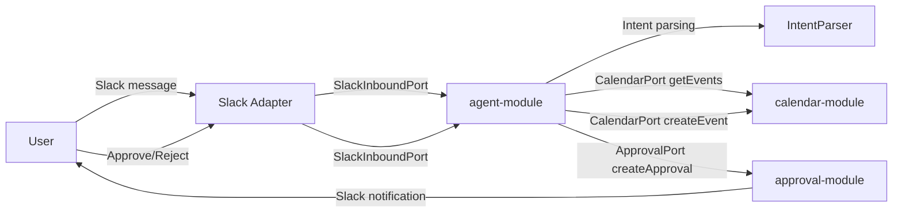
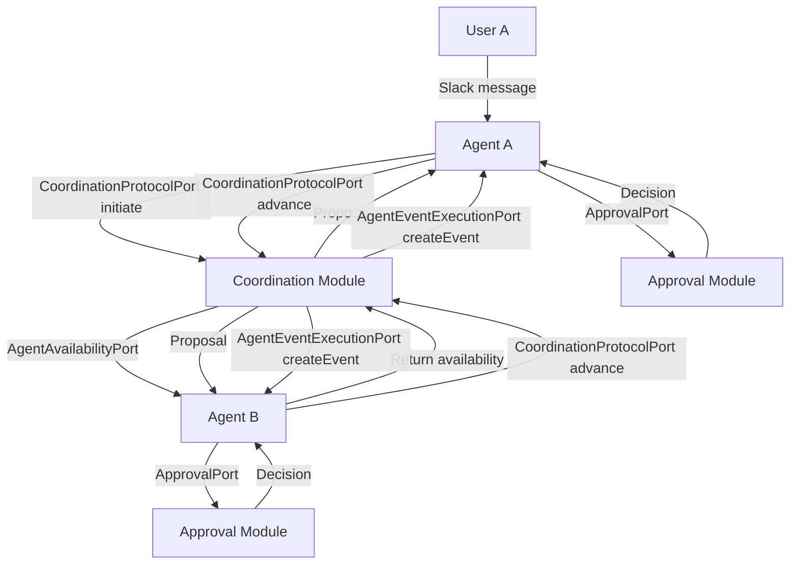

# docs/arc42/01-introduction-and-goals.md

---

## Table of Contents

- [1. Purpose of This Document](#1-purpose-of-this-document)
- [2. Product Vision](#2-product-vision)
- [3. MVP Scope](#3-mvp-scope)
  - [3.1 Use Case 1 — Personal Calendar Management](#31-use-case-1--personal-calendar-management)
  - [3.2 Use Case 2 — Collaborative Scheduling Between Personal Agents](#32-use-case-2--collaborative-scheduling-between-personal-agents)
- [4. Quality Goals](#4-quality-goals)
- [5. Stakeholders](#5-stakeholders)

---

## 1. Purpose of This Document

This document describes the introduction and goals for the CoAgent4U platform architecture. It establishes the business context, defines the MVP scope boundaries, identifies key stakeholders, and articulates the quality goals that drive all architectural decisions. This section corresponds to arc42 Section 1: Introduction and Goals.

CoAgent4U is a Personal Agent Coordination Platform that equips every user with their own Personal AI Agent—an intelligent assistant for managing tasks on their behalf. Built as a Modular Monolith following strict Hexagonal Architecture (Ports & Adapters), the platform enables users to interact with their personal agent via Slack for calendar management in the MVP, while supporting deterministic negotiation protocol executed between autonomous agents for collaborative scheduling with full human-in-the-loop approval. While the MVP focuses on scheduling and calendar management, the platform is designed to scale into a broader personal assistant ecosystem.

---

## 2. Product Vision

CoAgent4U empowers every user with a dedicated Personal AI Agent that acts as a secure, intelligent extension of themselves. While built with an architecture to support any future user-centric task, the MVP specializes in Calendar Management and Scheduling, demonstrating the power of agents to eliminate administrative drudgery.

The platform is built on a Hexagonal Architecture (Ports & Adapters) that cleanly separates core domain logic from external systems. This architectural foundation ensures deterministic reliability, long-term maintainability, and seamless scalability as CoAgent4U evolves from focused scheduling automation into a full-featured personal agent ecosystem.
The platform serves two distinct but integrated functions for the user:

1. A Personal Assistant: The agent autonomously manages the user’s private calendar—parsing with HITL in natural language commands (e.g., "Add gym tomorrow at 7 AM") to create events, check availability, and resolve conflicts within Google Calendar.
2. A Collaborative Coordinator: The agent engages in structured Agent-to-Agent (A2A) coordination, engaging in a deterministic Agent-to-Agent (A2A) coordination protocol to schedule shared meetings through a central negotiation state machine and book two-user meetings without manual back-and-forth.

Core Pillars of the Platform:

* Deterministic Reliability: While the agent utilizes AI for intent understanding, the execution and coordination logic are strictly deterministic. This ensures that the agent is predictable, auditable, and never "hallucinates" a calendar action.
* Human-in-the-Loop (HITL) Sovereignty: The agent acts as a negotiator, not a decider. A mandatory approval workflow ensures the user retains absolute authority over their time and data.
* Privacy-First Architecture: Leveraging a Hexagonal Architecture, the system isolates core personal data from external dependencies. It is GDPR-compliant by design, ensuring that while agents coordinate, they respect strict data boundaries and user privacy.

---

## 3. MVP Scope

The MVP delivers exactly two use cases. No additional features, integrations, or agent capabilities are in scope for this release.

### 3.1 Use Case 1 — Personal Calendar Management

A single user interacts with their Personal AI Agent through Slack to manage their Google Calendar. The agent acts as a secure intermediary between the user and Google Calendar, enabling natural language calendar control without directly accessing Google Calendar.

The supported interactions include:

- Adding a calendar event from a natural language Slack message  
- Retrieving a summary of today’s events  
- Checking availability for a given date or time range  
- Detecting scheduling conflicts  
- Initiating an explicit Human-in-the-Loop (HITL) approval workflow when overlaps occur  

Example user messages:

> "Add gym tomorrow at 7 AM for 1 hour."

> "What’s on my calendar today?"

> "Am I free Friday afternoon?"

The following diagram illustrates the high-level personal scheduling and retrieval flow.

### 3.2 Use Case 2 — Collaborative Scheduling Between Personal Agents

Two personal agents coordinate deterministically to schedule a shared meeting between their respective users. This coordination follows a strict state machine, requires dual approval (both users must explicitly confirm), creates calendar events atomically (both or neither), and produces a full audit trail.

#### Example Scenario

User A sends a Slack message:

> "Schedule a 30-minute sync with User B tomorrow afternoon."

The following diagram illustrates the high-level A2A coordination flow.

The coordination must be deterministic with no AI involvement in the orchestration logic. The state machine governs every transition, and no event is created unless both users have explicitly approved. If either user rejects or a timeout occurs, the coordination is rolled back and both agents return to idle state. Every state transition is persisted for audit purposes.

---

## 4. Quality Goals

The following quality goals are ranked by priority and drive the fundamental architectural decisions for CoAgent4U. These goals were agreed upon with the CTO and represent non-negotiable requirements for the MVP.

| Priority | Quality Goal | Description | Architectural Impact |
|----------|-------------|-------------|---------------------|
| 1 | Determinism | All coordination logic must produce predictable, repeatable outcomes. No AI or probabilistic decision-making in the orchestration path. | State machine for coordination, rule-based orchestrator, LLM isolated to intent parsing only |
| 2 | Security | Every entry point is authenticated, every action is authorized, all external communication is encrypted in transit via TLS. | Slack signature verification, OAuth token handling, JWT for internal APIs, encryption strategy |
| 3 | AgentActivityability | Every state transition, approval decision, and calendar mutation must be recorded with full provenance. | Append-only agent activity, domain events persisted, coordination state history |
| 4 | Data Privacy (GDPR) | Users must be able to request data export and deletion. Personal data handling must comply with GDPR. | Data classification, retention policies, deletion cascades, export endpoints |
| 5 | Reliability | Coordination must be atomic (both events created or neither). System must handle partial failures gracefully. | Saga pattern for atomic creation, idempotency keys, compensation logic |
| 6 | Modularity | The system must support independent evolution of modules without cross-module coupling. | Hexagonal architecture, explicit module boundaries, port-based contracts |
| 7 | Testability | Domain and application logic must be testable without infrastructure. | Zero framework dependency in domain, port-based dependency inversion |

---

## 5. Stakeholders

The following stakeholders have been identified for the CoAgent4U MVP. Each stakeholder has specific concerns that the architecture must address.

| Stakeholder | Role | Key Concerns | Relevant Sections |
|-------------|------|--------------|-------------------|
|  Founding Team | Product owner, architect, backend engineer, DevOps, security reviewer | Clean architecture, modular monolith correctness, long-term scalability path, security posture, realistic MVP scope, maintainability | All sections |
| Early Beta Users | Initial adopters providing product feedback | Seamless Slack experience, intuitive commands, fast coordination, clear approval workflow, reliability | 03 (Context), 06 (Runtime), 07 (Non-Functional Requirements) |

---

*End of 01-introduction.md*
