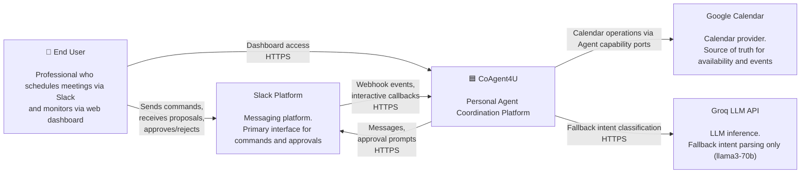
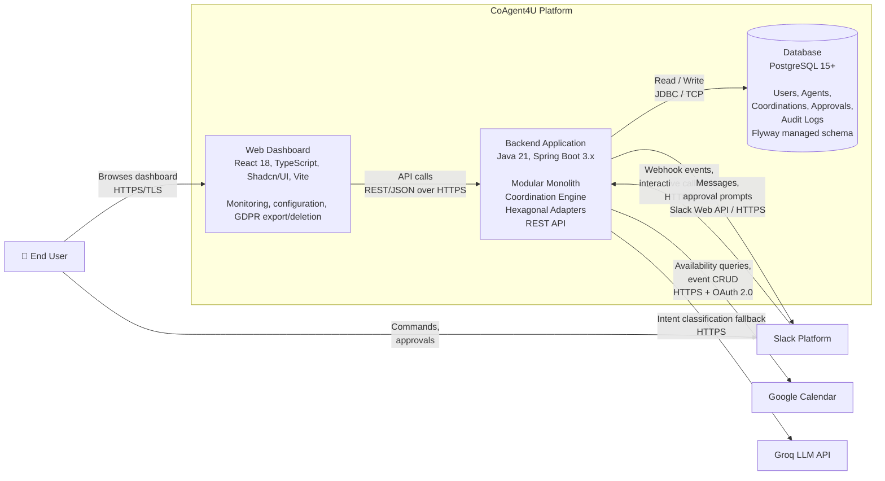
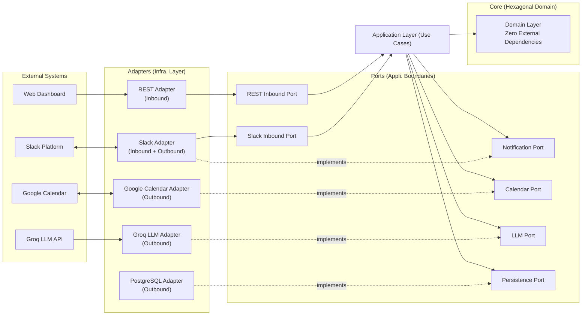

# docs/arc42/03-context-and-scope.md

---

## Table of Contents

- [1. Business Context](#1-business-context)
- [2. External Actors and Systems](#2-external-actors-and-systems)
- [3. C4 Level 1 — System Context Diagram](#3-c4-level-1--system-context-diagram)
- [4. Technical Context](#4-technical-context)
- [5. C4 Level 2 — Container Diagram](#5-c4-level-2--container-diagram)
- [6. External Interface Contracts](#6-external-interface-contracts)
  - [6.1 Slack Integration Contract](#61-slack-integration-contract)
  - [6.2 Google Calendar Integration Contract](#62-google-calendar-integration-contract)
  - [6.3 Groq LLM Integration Contract](#63-groq-llm-integration-contract)
- [7. Boundary Rules](#7-boundary-rules)

---

## 1. Business Context

CoAgent4U sits at the intersection of three external domains: a messaging platform where users issue natural language commands, a calendar system that serves as the source of truth for availability and events, and an LLM service that provides natural language understanding when rule-based parsing is insufficient.

The platform receives scheduling instructions from users through Slack, reads availability from Google Calendar, executes a deterministic negotiation protocol invoked by autonomous agents using a deterministic state machine, obtains explicit human approval before any external mutation, and creates calendar events atomically across both participants' calendars.

The business boundary is clear. CoAgent4U does not own calendars, does not own messaging, and does not own user identity beyond what is needed for agent mapping. It orchestrates across these external systems through well-defined integration contracts while keeping all coordination logic deterministic and auditable.

---

## 2. External Actors and Systems

The following actors and external systems interact with CoAgent4U across its system boundary.

| Actor / System | Type | Direction | Description |
|:---|:---|:---|:---|
| **End User** | Human Actor | Inbound | A professional who sends scheduling commands via Slack and monitors agent activity via the web dashboard. |
| **Slack Platform** | External System | Bidirectional | Receives webhook events (user messages, interactive button clicks) and sends outbound messages (proposals, confirmations, approval prompts). |
| **Google Calendar** | External System | Bidirectional | Read for availability (free/busy queries). Write access for atomic event creation and deletion. |
| **Groq LLM API** | External System | Outbound | Called only when the rule-based IntentParser confidence falls below threshold. Returns structured intent classification. Never participates in coordination logic. |
| **Web Dashboard** | Frontend Client | Inbound | React 18 application that calls the backend REST API for monitoring, configuration, and GDPR actions (data export/deletion). |

---

## 3. C4 Level 1 — System Context Diagram

The System Context diagram shows CoAgent4U as a single system and all external actors and systems it communicates with. This is the highest level of abstraction and answers the question: "What does CoAgent4U interact with?"

Every arrow crossing the CoAgent4U boundary corresponds to a Port in the hexagonal architecture. Inbound arrows map to Inbound Ports. Outbound arrows map to Outbound Ports. No external system is referenced directly from domain logic.

---

## 4. Technical Context

The following table maps every external communication channel to its protocol, direction, and the adapter module responsible for handling it within the hexagonal architecture.

| External System | Protocol | Direction | Adapter Module | Port Interface |
|----------------|----------|-----------|----------------|----------------|
| Slack Events API | HTTPS Webhook | Inbound | messaging-module (SlackAdapter) | SlackInboundPort |
| Slack Web API | HTTPS REST | Outbound | messaging-module (SlackAdapter) | NotificationPort |
| Slack Interactive Messages | HTTPS Webhook | Inbound | messaging-module (SlackAdapter) | SlackInboundPort |
| Google Calendar API | HTTPS REST + OAuth 2.0 | Bidirectional | calendar-module (GoogleCalendarAdapter) | CalendarPort |
| Groq API | HTTPS REST | Outbound | llm-module (GroqLLMAdapter) | LLMPort |
| PostgreSQL | TCP/SQL | Bidirectional | infrastructure/persistence* | PersistencePort |
| Web Dashboard (React 18) | HTTPS REST/JSON | Inbound | infrastructure/security (RESTAdapter) | RESTInboundPort |

The Slack Events API requires a 3-second acknowledgement response (per Slack platform policy, Constraint PC-03). The backend must acknowledge the webhook immediately and process the event asynchronously. This is handled within the SlackAdapter before any domain logic is invoked.

---

## 5. C4 Level 2 — Container Diagram

The Container diagram zooms into CoAgent4U and shows the major deployable units (containers) and how they communicate. For a Modular Monolith, the backend is a single container, but the internal module structure is made visible in the Building Block View (Section 05).

The Web Dashboard is a thin client. It holds no business logic. It authenticates via JWT, calls the backend REST API, and renders responses. 

The Backend Application is the single deployable monolith. Internally it contains all core modules (user, agent, coordination, approval), all integration modules (calendar, messaging, llm), and all infrastructure adapters (persistence, security, config, monitoring). The internal decomposition is detailed in 05-building-block-view.md.

The Database is a single PostgreSQL 15+ instance. Each module owns its tables exclusively. Cross-module data access occurs only through defined Ports, never through shared tables or direct cross-schema joins.

---

## 6. External Interface Contracts

Each external integration has a defined contract that specifies what data crosses the system boundary, in what format, and under what constraints.

### 6.1 Slack Integration Contract

Slack is the primary user-facing interface for the MVP. The integration is bidirectional.

**Inbound (Slack → CoAgent4U):**

Events are received via Slack's Events API as HTTP POST requests to a registered webhook endpoint. Each request includes a signature header (X-Slack-Signature) that must be verified before processing. The payload contains the user's Slack ID,workspace ID, channel, and message text. Interactive message callbacks (approve/reject button clicks) arrive on a separate endpoint with the same signature verification requirement.

All Slack events are first processed by the messaging-module (SlackAdapter). 
The SlackAdapter verifies the signature, acknowledges the webhook, 
and then dispatches the message to the agent-module via its inbound use case interface.
The coordination-module never receives Slack events directly.

The SlackAdapter must acknowledge inbound webhooks within 3 seconds (Slack platform requirement) by returning HTTP 200 immediately, then dispatch the event to the application layer asynchronously.

**Outbound (CoAgent4U → Slack):**

Messages are sent via the Slack Web API (chat.postMessage, chat.update). Approval prompts use Slack's Block Kit with interactive buttons. The messaging-module formats domain notifications into Slack-specific Block Kit JSON. The domain layer never constructs Slack-specific payloads.

### 6.2 Google Calendar Integration Contract

Google Calendar is the source of truth for user availability and event storage.

-***Authentication:*** OAuth 2.0 authorization code flow. The user grants calendar access during onboarding. Tokens (access + refresh) are stored encrypted in PostgreSQL. The calendar-module handles token refresh transparently before every API call.

-***Availability Reads:*** The FreeBusy API endpoint is used to query a user's availability for a given time range. This returns busy intervals without exposing event details, respecting data minimization (GDPR). When daily task summarization or event related data is required, the Google Calendar Events API (events.list) is used to retrieve event metadata (e.g., title, start/end time, attendees) within a defined time window. Access is limited to the minimum required fields.

-***Event Creation:*** Events are created via the Events.insert endpoint. Application-level idempotency is achieved by supplying a deterministic event ID derived from the internal meeting identifier. If a retry occurs, Google Calendar returns a conflict response, preventing duplicate creation. eventId_A must be persisted before proceeding.

During collaborative scheduling, the coordination-module invokes `AgentEventExecutionPort.createEvent()` for each participant. The agent-module internally delegates to `CalendarPort.createEvent()`. If the second participant’s event creation fails, the coordination-module instructs the first agent to compensate via `AgentEventExecutionPort.deleteEvent()`. The coordination-module never calls `CalendarPort` directly.

-***Event Deletion (Compensation):*** If the Saga requires rollback, the calendar-module deletes the previously created event via Events.delete using the stored Google Event ID.

### 6.3 Groq LLM Integration Contract

Groq provides LLM inference for fallback intent parsing only.

-***When Called:*** Only when the rule-based IntentParser returns a confidence score below the configurable threshold (default 0.7). The majority of well-formed messages are handled without any Groq API call.

-***Request:*** The GroqLLMAdapter sends a structured prompt containing the user's raw message and the list of known intents . The model is llama3-70b (configurable in backend only, not user-facing).

-***Response:*** The adapter parses Groq's response into a structured ParsedIntent domain value object containing the classified intent type, extracted parameters (date, time, duration, title), and a confidence score.

**Failure Handling:** If the Groq API is unreachable, times out, or returns an unparseable response, the system returns an UNKNOWN intent and prompts the user to rephrase their message. The LLM failure never blocks or breaks the coordination engine.

---

## 7. Boundary Rules

The following rules govern what may cross the CoAgent4U system boundary.

**No external system is referenced directly from the Domain layer.** Every external interaction is mediated by a Port interface implemented by an Adapter. This is the foundational Hexagonal Architecture rule and is non-negotiable.

**No PII leaves the system boundary except to the original source** (Google Calendar for event creation, Slack for user-directed messages). Calendar data read from Google is used transiently for availability matching and is not stored beyond what is needed for audit purposes.

**All inbound requests must be authenticated and verified before reaching the Application layer.** Slack webhooks are verified via signature. Dashboard API calls are verified via JWT. No anonymous access is permitted to any endpoint except the Slack webhook verification challenge.

**All outbound requests to external APIs must go through adapters that implement circuit breaker patterns, retry logic with exponential backoff, and timeout configuration.** The domain layer is never aware of network failures — it receives domain-level error results from the ports.

**Coordination is not an ingress boundary.** No external system (Slack, Google, Groq, Dashboard) may invoke the coordination-module directly. All coordination lifecycle changes must be initiated through the agent-module via CoordinationProtocolPort. All coordination state transitions must be persisted transactionally before invoking any agent capability port to perform external side effects.

The following diagram summarizes the boundary and adapter mapping.

In this diagram, solid arrows represent data flow direction. Dashed arrows with "implements" labels show which adapter fulfills which port contract. The Domain Layer at the center depends only on Port interfaces — it has no knowledge of Slack, Google, Groq, PostgreSQL, or Spring Boot.

---

*End of 03-context-and-scope.md*
