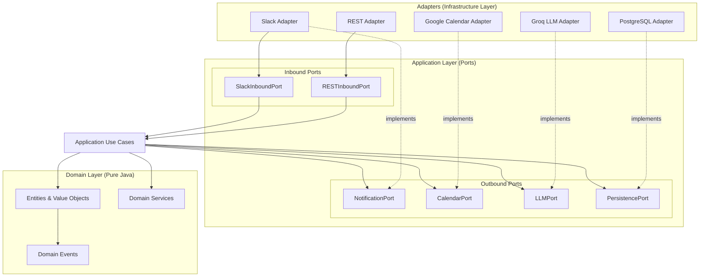
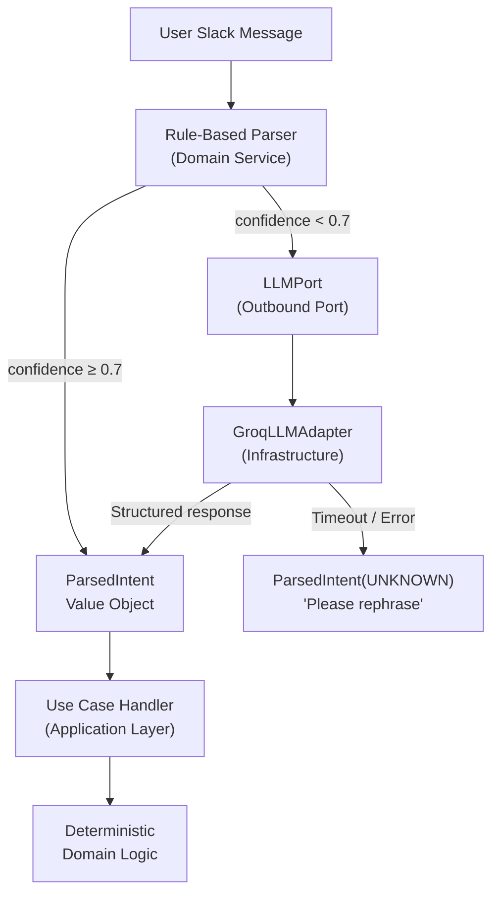
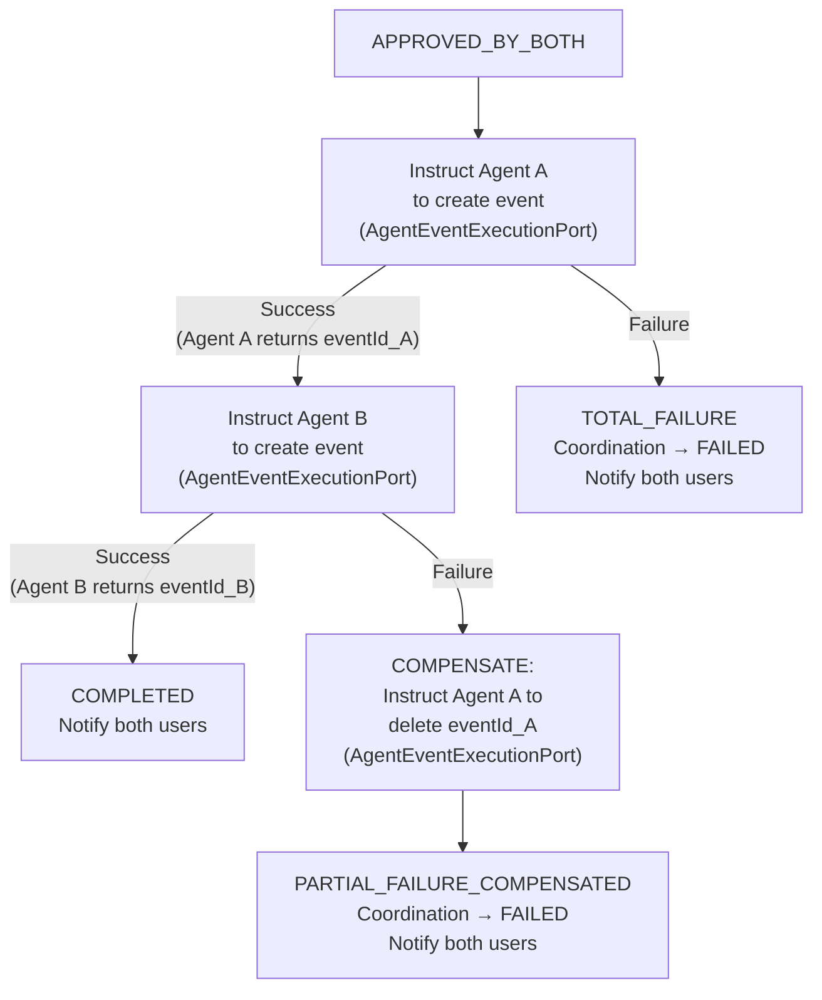
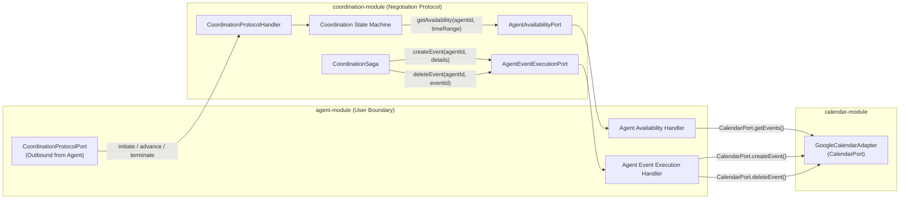
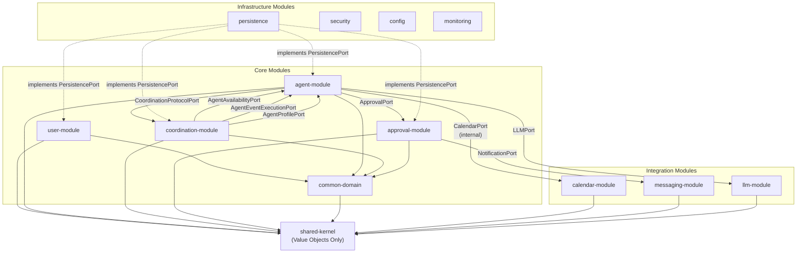
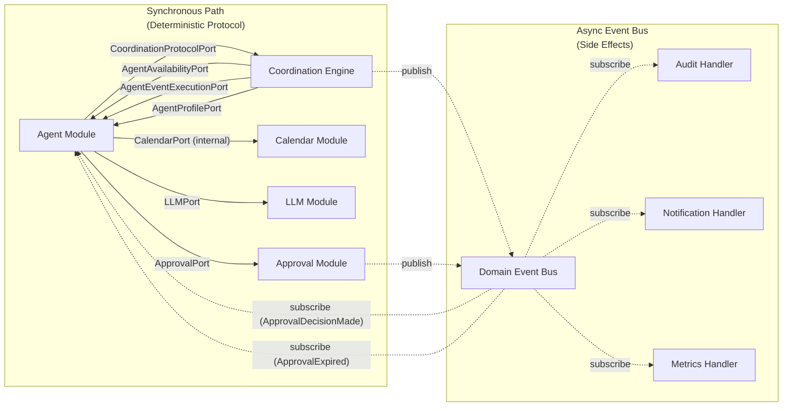

# docs/arc42/04-solution-strategy.md

---

## Table of Contents

- [1. Overview](#1-overview)
- [2. Fundamental Architecture Decisions](#2-fundamental-architecture-decisions)
  - [2.1 Hexagonal Architecture (Ports & Adapters)](#21-hexagonal-architecture-ports--adapters)
  - [2.2 Modular Monolith over Microservices](#22-modular-monolith-over-microservices)
  - [2.3 Deterministic Coordination Engine](#23-deterministic-coordination-engine)
  - [2.4 Two-Tier Intent Parsing with LLM Isolation](#24-two-tier-intent-parsing-with-llm-isolation)
  - [2.5 Human-in-the-Loop Governance](#25-human-in-the-loop-governance)
  - [2.6 Saga Pattern for Atomic Calendar Creation](#26-saga-pattern-for-atomic-calendar-creation)
  - [2.7 Hybrid Internal Communication Model](#27-hybrid-internal-communication-model)
  - [2.8 Agent Sovereignty Principle](#28-agent-sovereignty-principle)
- [3. Technology Selection Rationale](#3-technology-selection-rationale)
  - [3.1 Backend Technology Choices](#31-backend-technology-choices)
  - [3.2 Frontend Technology Choices](#32-frontend-technology-choices)
  - [3.3 Infrastructure Choices](#33-infrastructure-choices)
  - [3.4 Third-Party Service Choices](#34-third-party-service-choices)
- [4. Quality Goal to Strategy Mapping](#4-quality-goal-to-strategy-mapping)
- [5. Module Decomposition Strategy](#5-module-decomposition-strategy)
  - [5.1 Module Inventory](#51-module-inventory)
  - [5.2 Module Dependency Rules](#52-module-dependency-rules)
  - [5.3 Module Dependency Diagram](#53-module-dependency-diagram)
- [6. Cross-Module Communication Strategy](#6-cross-module-communication-strategy)
- [7. Data Ownership Strategy](#7-data-ownership-strategy)
- [8. Security Strategy Overview](#8-security-strategy-overview)
- [9. GDPR Strategy Overview](#9-gdpr-strategy-overview)
- [10. Extraction Readiness](#10-extraction-readiness)

---

## 1. Overview

This section documents the fundamental strategic decisions that shape the CoAgent4U architecture. Each decision is traced back to a quality goal from [01-introduction.md](./01-introduction-and-goals.md) Section 4, a constraint from [02-constraints.md](./02-constraints.md), or a stakeholder concern. The decisions here are deliberate trade-offs — each one was chosen over named alternatives, and the reasoning is made explicit.

The solution strategy rests on eight pillars:

| # | Pillar | Summary |
|:--|:-------|:--------|
| 1 | Strict Hexagonal Architecture | Domain purity, zero framework dependency in core |
| 2 | Modular Monolith | Deployment simplicity with clear internal boundaries |
| 3 | Deterministic Coordination Engine | State-machine-based negotiation protocol executed between autonomous agents |
| 4 | Two-Tier Intent Parsing | LLM isolated behind outbound port, rule-based parser primary |
| 5 | Human-in-the-Loop Governance | Explicit approval for every calendar mutation |
| 6 | Saga Pattern | Business-level atomicity across two agent-owned calendars |
| 7 | Hybrid Internal Communication | Synchronous port calls for deterministic workflows, event bus for side effects |
| 8 | Agent Sovereignty | Agents are the sole ingress and egress boundary for all user-originated and user-scoped operations |

---

## 2. Fundamental Architecture Decisions

### 2.1 Hexagonal Architecture (Ports & Adapters)

**Decision:** The system is structured as a strict Hexagonal Architecture where the domain layer sits at the center with zero external dependencies. All communication between the domain and the outside world passes through explicitly defined Port interfaces, implemented by Adapter classes in the infrastructure layer.

**Rationale:**

| Quality Goal | How Hexagonal Addresses It |
|:-------------|:---------------------------|
| Determinism (Q1) | Domain logic testable in isolation without external systems |
| Testability (Q7) | Port stubs replace all infrastructure in domain tests |
| Modularity (Q6) | Any adapter can be swapped without touching business logic |

**Alternatives Considered:**

| Alternative | Reason Rejected |
|:------------|:----------------|
| Layered Architecture (N-tier) | JPA annotations leak into domain; hard to enforce no-framework rule |
| Clean Architecture | Structurally equivalent; Hexagonal terminology maps better to integration-heavy system |

**Consequences:**
- Every external system interaction requires a Port + Adapter pair
- Domain Maven module has zero dependencies beyond Java standard library (TC-08)
- Structural overhead justified by testability and replaceability guarantees

### 2.2 Modular Monolith over Microservices

**Decision:** CoAgent4U is deployed as a single process (one Docker container running a Spring Boot application) but is internally decomposed into bounded modules with explicit dependency rules and module-private persistence.

**Rationale:**

| Driver | How Modular Monolith Addresses It |
|:-------|:----------------------------------|
| Founding Team (OC-01) | No distributed system operational overhead |
| Budget constraint (OC-03) | Single container, single database, no service mesh |
| Modularity (Q6) | Bounded contexts with enforced dependency rules |

**Alternatives Considered:**

| Alternative | Reason Rejected |
|:------------|:----------------|
| Pure Monolith (no module boundaries) | Degrades into big ball of mud; painful future extraction |
| Microservices from day one | Operational overhead disproportionate to team size and MVP scope |

**Consequences:**
- Module boundaries enforced via Maven modules and package-level access modifiers
- Each module exposes only Port interfaces to other modules
- Cross-module database access prohibited — interaction only through Ports
- Any module extractable to a separate service by replacing in-process port calls with network calls

### 2.3 Deterministic Coordination Engine

**Decision:**  
The A2A Coordination Engine implements a deterministic negotiation protocol between autonomous agents.

Coordination is not an ingress boundary and does not receive external events directly. 
It is invoked exclusively by agents via explicit coordination ports.

All Slack messages, approval decisions, expirations, and other user-originated signals are first handled by the owning user's agent. The agent then decides whether to initiate, advance, or terminate a coordination instance.

Coordination never reacts to external systems. It reacts only to agent-to-coordination protocol calls.

---

### Rationale

| Quality Goal | How Deterministic Coordination Addresses It |
|--------------|---------------------------------------------|
| Determinism (Q1) | Finite state machine with explicit transitions; same inputs always produce same outputs |
| Auditability (Q3) | Every state transition logged with full provenance |
| Agent Sovereignty (S2.8) | Coordination executes a negotiation protocol exclusively through agent capability ports; it never bypasses agents to reach infrastructure |

| Data Isolation | Coordination receives only value objects (no raw calendar events, no OAuth tokens) |

---

### How It Works

1. Coordination engine requests availability from Agent A via  
   `AgentAvailabilityPort.getAvailability(agentId, dateRange, constraints)`

2. Coordination engine requests availability from Agent B via  
   `AgentAvailabilityPort.getAvailability(agentId, dateRange, constraints)`

3. Each agent internally:
   - Resolves user credentials
   - Delegates to `CalendarPort.getEvents()`
   - Applies `ConflictDetector`
   - Returns `List<AvailabilityBlock>` (no raw event data exposed)

4. `AvailabilityMatcher` (domain service) computes overlapping slots deterministically.

5. `ProposalGenerator` selects the earliest overlapping slot with default 30-minute duration.

6. During saga execution:
   - Coordination engine instructs each agent via  
     `AgentEventExecutionPort.createEvent(agentId, timeSlot, eventDetails)`
   - Agent internally delegates to `CalendarPort.createEvent()`
   - Agent returns `EventConfirmation` containing external event ID
   - Coordination stores event ID only for compensation purposes

7. Compensation (if required):
   - Coordination engine calls  
     `AgentEventExecutionPort.deleteEvent(agentId, eventId)`
   - Agent internally delegates to `CalendarPort.deleteEvent()`

8. For display-safe proposal metadata:
   - Coordination calls  
     `AgentProfilePort.getProfile(agentId)`
   - Agent internally delegates to `UserQueryPort`
   - Only presentation-safe metadata is returned

---

### Explicit Runtime Boundaries

| Operation | Coordination-Module Calls | Agent-Module Internally Delegates To |
|------------|---------------------------|--------------------------------------|
| Check availability | `AgentAvailabilityPort.getAvailability()` | `CalendarPort.getEvents()` → `ConflictDetector` |
| Create calendar event | `AgentEventExecutionPort.createEvent()` | `CalendarPort.createEvent()` |
| Delete calendar event (compensation) | `AgentEventExecutionPort.deleteEvent()` | `CalendarPort.deleteEvent()` |
| Get user display info | `AgentProfilePort.getProfile()` | `UserQueryPort.findUserById()` |
| Send notification | `NotificationPort.send()` | — (handled by messaging-module) |

---

### Explicit Non-Responsibilities

- Coordination never holds, stores, or transmits OAuth tokens.
- Coordination never calls `CalendarPort` directly.
- Coordination never calls `UserQueryPort` directly.
- Coordination never accesses persistence of user-module.
- Coordination never processes raw calendar event payloads.

---

### Alternatives Considered

| Alternative | Reason Rejected |
|-------------|----------------|
| LLM-based negotiation | Non-deterministic, difficult to audit, deferred to Phase 2 |
| Heuristic preference weighting | No user preference model in MVP; state machine accommodates future extensions |
| Coordination directly calling `CalendarPort` | Violates Agent Sovereignty; couples coordination to infrastructure |
| Coordination accessing `UserQueryPort` | Breaks user data isolation boundary |

---

### Consequences

- Coordination states:  
  `INITIATED`, `CHECKING_AVAILABILITY_A`, `CHECKING_AVAILABILITY_B`, `MATCHING`, `PROPOSAL_GENERATED`, `AWAITING_APPROVAL_B`, `APPROVED_BY_B`, `AWAITING_APPROVAL_A`, `APPROVED_BY_BOTH`, `CREATING_EVENT_A`, `CREATING_EVENT_B`, `REJECTED`, `REJECTED`, `COMPLETED`, `FAILED`

- Every transition has explicit trigger and guard condition.
- Invalid transitions are rejected at domain level.
- Coordination-module depends only on agent capability ports — never on infrastructure ports.
- All calendar mutation authority exists strictly inside the agent-module.
- Full state machine documented in `06-runtime-view.md`.

### 2.4 Two-Tier Intent Parsing with LLM Isolation

**Decision:** User messages are parsed through a two-tier strategy:

| Tier | Mechanism | When Used |
|:-----|:----------|:----------|
| Tier 1 | Rule-based IntentParser (deterministic pattern matching) | Always runs first |
| Tier 2 | LLM-backed classifier via `LLMPort`/`GroqLLMAdapter` | Only when Tier 1 confidence < threshold (default 0.7) |

The LLM is used exclusively for intent classification and schedule summarization. It never participates in coordination logic, approval decisions, or calendar mutations.

**Rationale:**

| Concern | How Two-Tier Addresses It |
|:--------|:--------------------------|
| Cost efficiency (OC-03) | Majority of messages handled without external API call |
| Latency | Rule-based parsing is sub-millisecond |
| Robustness | LLM handles typos, informal phrasing, ambiguity |
| Isolation | `LLMPort` abstraction allows provider swaps without domain changes |

**Alternatives Considered:**

| Alternative | Reason Rejected |
|:------------|:----------------|
| LLM-only parsing | Adds latency, cost, and single point of failure for every interaction |
| Rule-based only | Too brittle for natural language variations |

**Consequences:**
- `IntentParser` is a domain service returning `ParsedIntent` value object
- Application layer receives `ParsedIntent` regardless of which tier produced it
- `GroqLLMAdapter` handles prompt construction, API communication, response parsing, error handling
- LLM failure → `ParsedIntent(UNKNOWN)` → user prompted to rephrase; never blocks coordination

### 2.5 Human-in-the-Loop Governance

**Decision:** Every calendar event creation — personal or collaborative — requires explicit human approval before any external mutation occurs. In collaborative flows, both participants must approve. Approval requests expire after 12 hours, triggering automatic rejection.

**Rationale:**

| Driver | How HITL Addresses It |
|:-------|:----------------------|
| Determinism (Q1) | Humans make the final call, not the system |
| PRD mandate | HITL with mandatory approvals is a core product requirement |
| User trust | Agent augments, never overrides |

**Alternatives Considered:**

| Alternative | Reason Rejected |
|:------------|:----------------|
| Auto-approve non-conflicting personal events | Rejected for MVP; trust must be established first. Revisit in "trust tier" feature. |
| No timeout (approvals open indefinitely) | Creates unbounded coordination state; poor UX for other participant |

**Consequences:**
- `approval-module` manages approval lifecycle: creation, pending, decision, expiration
- Scheduled task checks expired approvals every minute (infrastructure layer, business logic in domain)
- `ApprovalExpired` domain event is consumed by the agent-module.
- The agent decides whether the approval relates to a personal action or an active coordination.
- For collaborative approvals, the agent invokes the CoordinationProtocolPort to advance or terminate the coordination state machine.
- All approval decisions and expirations recorded in audit log

### 2.6 Saga Pattern for Atomic Calendar Creation

**Decision:** When both users approve a collaborative meeting, calendar events are created using a Saga pattern with compensating transactions. The `CoordinationSaga` does not call `CalendarPort` directly — it instructs each user's agent to create the event via `AgentEventExecutionPort`, respecting the Agent Sovereignty principle.

**Rationale:**

| Concern | How Saga Addresses It |
|:--------|:----------------------|
| External system limitation | Google Calendar does not support two-phase commit |
| Reliability (Q5) | "Both or neither" via compensation |
| Agent Sovereignty (S2.8) | Each agent owns its user's calendar; coordination only orchestrates |

**Saga Flow:**

| Step | Action | Port Used | Actor |
|:-----|:-------|:----------|:------|
| 1 | Instruct Agent A to create event | `AgentEventExecutionPort` | Agent A |
| 2 | Store `eventId_A` from Agent A response | — | Saga |
| 3 | Instruct Agent B to create event | `AgentEventExecutionPort` | Agent B |
| 4a | Success → Store `eventId_B`, mark COMPLETED | — | Saga |
| 4b | Failure → Instruct Agent A to delete `eventId_A` (compensate) | `AgentEventExecutionPort` | Agent A |

**Alternatives Considered:**

| Alternative | Reason Rejected |
|:------------|:----------------|
| Best-effort (accept inconsistency) | Violates Q5, damages user trust |
| Two-phase commit | Google Calendar API does not support it |
| Coordination calling CalendarPort directly | Violates Agent Sovereignty; couples coordination to infrastructure |

**Consequences:**
- Three possible outcomes:

| Outcome | Description | Final State |
|:--------|:------------|:------------|
| SUCCESS | Both agents create events successfully | COMPLETED |
| PARTIAL_FAILURE_COMPENSATED | Agent B fails, Agent A's event deleted | FAILED |
| TOTAL_FAILURE | Agent A fails, nothing to compensate | FAILED |

- Each outcome logged in coordination state log with full details
- Agents internally call `CalendarPort` — this remains hidden from coordination-module

### 2.7 Hybrid Internal Communication Model

**Decision:** Modules communicate internally using two mechanisms:

| Mechanism | Used For | Guarantee |
|:----------|:---------|:----------|
| Direct synchronous port calls | Deterministic workflows (coordination state transitions, availability queries via agents, saga execution, approval processing) | Deterministic, transactional |
| In-memory domain event bus | Side effects (audit logging, Slack notifications, metrics emission, timeout scheduling) | Async, non-blocking, failure-tolerant |

**Rationale:**

| Driver | How Hybrid Model Addresses It |
|:-------|:------------------------------|
| Determinism (Q1) | Critical path uses synchronous calls — no timing or ordering dependencies |
| Modularity (Q6) | Event bus decouples side-effect consumers from producers |
| Simplicity (OC-01, OC-03) | In-memory Spring `ApplicationEventPublisher` — no external broker |

**Alternatives Considered:**

| Alternative | Reason Rejected |
|:------------|:----------------|
| Fully synchronous (no event bus) | Couples coordination engine directly to audit/messaging modules |
| Fully event-driven | Non-determinism in coordination path |
| External message broker (RabbitMQ, Kafka) | Unnecessary complexity for single-process monolith |

**Consequences:**
- Domain events published via `DomainEventPublisher` port (from `common-domain`)
- Infrastructure implements via Spring `ApplicationEventPublisher`
- Event handlers are `@Async` and transactional where needed
- If decomposed to microservices later, `DomainEventPublisher` adapter swaps to external broker

Stateless Enforcement:

The application layer is stateless. 
No authoritative workflow state (coordination state, approval decisions, saga progress) 
may be stored exclusively in memory. 

All workflow transitions must:
1. Persist state transactionally via PersistencePort
2. Then trigger side effects (notifications, saga calls)

Caffeine cache loss must not affect coordination correctness.

### 2.8 Agent Sovereignty Principle

**Decision:**  
Agents are the sole ingress and egress boundary for all user-scoped operations and lifecycle changes.  

All user-specific data access, external integrations, and coordination lifecycle triggers — including Slack messages, approval decisions, expirations, calendar mutations, and future negotiation signals — must be mediated by the owning user’s Agent.

The coordination-module must never:

- Access `CalendarPort`
- Access `UserPersistencePort`
- Subscribe directly to approval events
- Receive Slack webhooks
- Hold OAuth tokens
- React to infrastructure events

Coordination cannot be invoked by infrastructure adapters or domain event subscribers directly. 
Only agents may invoke CoordinationProtocolPort.

---

### Rationale

| Driver | How Agent Sovereignty Addresses It |
|:-------|:-----------------------------------|
| Data ownership | Each agent is the sole gateway to its user's data and connected services |
| Autonomy | Agents can evolve internal strategies (caching, preferences, policy enforcement) independently |
| Security | Coordination engine never holds credentials or user-scoped access paths |
| Architectural purity | Coordination remains a pure negotiation protocol |
| Extraction readiness | Agents become autonomous services; coordination becomes a protocol service |
| Consistency | All user-originated signals flow through a single boundary |

---

### Ingress Model — Agent as Sole Boundary

In the A2A model, every external interaction flows through an agent:

External System → Agent → Coordination (if required)

This applies to:

- Slack messages
- Approval decisions
- Approval expirations
- Calendar confirmations
- Future negotiation signals

Coordination never subscribes directly to external domain events.
It exposes a `CoordinationProtocolPort` that agents invoke explicitly.

Agents interpret external signals and decide whether to:

- Initiate coordination
- Advance coordination state
- Terminate coordination
- Execute personal actions independently

Coordination reacts only to agent-invoked protocol calls.

---

### What Agent Sovereignty Means in Practice

| Operation | Without Sovereignty (❌) | With Sovereignty (✅) |
|:----------|:------------------------|:---------------------|
| Slack message received | Slack → coordination | Slack → agent → coordination |
| ApprovalDecisionMade (collaborative) | approval → coordination | approval → agent → coordination |
| ApprovalExpired | approval → coordination | approval → agent → coordination |
| Check availability | coordination → CalendarPort | coordination → AgentAvailabilityPort |
| Create calendar event | coordination → CalendarPort | coordination → AgentEventExecutionPort |

---

### Agent Capability Ports

| Port | Direction | Consumed By | Implemented By |
|:-----|:----------|:------------|:---------------|
| `AgentAvailabilityPort` | Outbound (from coordination) | coordination-module | agent-module |
| `AgentEventExecutionPort` | Outbound (from coordination) | coordination-module | agent-module |
| `CoordinationProtocolPort` | Outbound (from agent) | agent-module | coordination-module |

`CoordinationProtocolPort` defines the deterministic negotiation protocol between agents.

---

### Internal Delegation Model

The agent-module internally delegates to infrastructure:

- `CalendarPort`
- `UserQueryPort`
- `LLMPort`
- Messaging adapters
- Approval-module

This delegation is invisible to coordination.

Coordination sees only domain abstractions and protocol calls.

**Alternatives Considered:**

| Alternative | Reason Rejected |
|:------------|:----------------|
| Coordination directly calls CalendarPort | Violates data ownership; coordination holds calendar credentials path; couples coordination to infrastructure |
| Agents negotiate asynchronously via events | Introduces non-determinism; complicates state machine; deferred to post-MVP |
| Shared CalendarService accessible to all modules | Breaks bounded context boundaries; creates implicit coupling |

**Consequences:**
- `CalendarPort` is an internal dependency of `agent-module` only — not exposed to coordination
- Coordination-module's outbound port inventory contains `AgentAvailabilityPort` and `AgentEventExecutionPort`, not `CalendarPort`
- Agent-module's implementation of these ports is free to add caching, rate limiting, or preference logic without affecting coordination
- Future extraction: agents become agent-services; coordination becomes a pure orchestration service calling agent APIs

---

## 3. Technology Selection Rationale

Each technology choice is justified against the quality goals and constraints.

### 3.1 Backend Technology Choices

| Technology | Purpose | Justification |
|:---|:---|:---|
| Java 21 (LTS) | Language & runtime | Long-term support, mature ecosystem, strong type safety for domain modeling, virtual threads for concurrent agent capability calls (future), wide talent pool. Constraint TC-01. |
| Spring Boot 3.x | Framework | Industry-standard. Provides DI, web server, security, actuator, scheduling. Confined to adapter and configuration layers only. Constraint TC-02. |
| Maven 3.9+ | Build tool | Multi-module project enforces module boundaries at build level. Domain module importing Spring class = build failure. Constraint TC-03. |
| PostgreSQL 15+ | Primary persistence | ACID-compliant for coordination state and audit logging. JSONB for flexible proposal data. Constraint TC-04. |
| Flyway | Schema management | Version-controlled migrations. No manual DDL. Constraint TC-05. |
| Caffeine | In-memory cache | Lightweight caching for user profiles, service connections. No external dependency. Constraint TC-06. |
| Spring WebClient | HTTP client | Non-blocking for outbound API calls. Supports timeouts, retry, circuit-breaker. Constraint TC-07. |

### 3.2 Frontend Technology Choices

| Technology | Purpose | Justification |
|:---|:---|:---|
| React 18 + TypeScript | UI framework | Component-based, type-safe. Constraint TC-10 and TC-15. |
| Shadcn/UI + Tailwind | Component library | Pre-built, accessible. Avoids building design system from scratch (OC-01). Constraint TC-11. |
| React Query | Server state | Data fetching, caching, synchronization. Constraint TC-12. |
| Vite | Build tool | Fast HMR for development productivity. Constraint TC-13. |

### 3.3 Infrastructure Choices

| Technology | Purpose | Justification |
|:---|:---|:---|
| Docker | Containerization | Consistent environments. Single Dockerfile for monolith. Constraint TC-16. |
| docker-compose | Local orchestration | Single command to start full stack. Constraint TC-17. |
| Environment variables | Secrets management | Simplest viable for MVP. Future migration to Vault/AWS Secrets Manager via adapter swap. Constraint TC-23. |

### 3.4 Third-Party Service Choices

| Service | Purpose | Justification |
|:---|:---|:---|
| Slack API | User interaction | PRD mandate. Users live in Slack. Constraint TC-20. |
| Google Calendar API | Calendar operations | PRD mandate for MVP. Accessed exclusively through agent-module's internal CalendarPort. Constraint TC-21. |
| Groq API (llama3-70b) | LLM fallback | Fastest inference for open-source models. Abstracted behind LLMPort. Constraint TC-22. |

---

## 4. Quality Goal to Strategy Mapping

| Priority | Quality Goal | Strategies Applied |
|:---|:---|:---|
| 1 | **Determinism** | Finite state machine for coordination (S2.3). Rule-based parser as primary tier (S2.4). LLM isolated behind outbound port (S2.4). Direct synchronous calls for coordination workflow (S2.7). Deterministic availability matching — earliest overlapping slot (S2.3). Coordination executes a deterministic negotiation protocol between agents via capability ports (S2.8).|
| 2 | **Security** | Slack signature verification on every webhook (S8). OAuth 2.0 with encrypted token storage — managed by agents, never exposed to coordination (S2.8, S8). JWT for internal APIs (S8). AES-256 encryption at rest (S8). HTTPS/TLS 1.2+ (S8). Rate limiting (S8). |
| 3 | **Auditability** | Append-only audit log (S7). Every coordination state transition recorded (S2.3). Domain events consumed by audit handler (S2.7). Correlation IDs across full lifecycle (S8). Audit logs queryable from dashboard (S9). |
| 4 | **Data Privacy (GDPR)** | Data minimization — no event content stored beyond coordination (S9). Right to erasure — cascading deletion within 30 days (S9). Right to access — export endpoint (S9). Encrypted PII at rest (S8). Retention policies enforced by scheduled purge (S9). |
| 5 | **Reliability** | Saga pattern with compensation via agent capability ports (S2.6). Idempotency keys on agent-executed mutations (S8). Circuit breaker on outbound adapters (S8). Retry with exponential backoff (S8). 12-hour approval timeout (S2.5). |
| 6 | **Modularity** | Hexagonal architecture with port-based interfaces (S2.1). Maven multi-module enforcement (S2.2). Module-private persistence (S7). Event bus for cross-cutting concerns (S2.7). Agent Sovereignty for clean coordination boundaries (S2.8). Extraction-ready (S10). |
| 7 | **Testability** | Zero framework dependency in domain (S2.1). Port interfaces enable mocking (S2.1). Testcontainers + WireMock for integration (S2.1). State machine exhaustively enumerable (S2.3). Each parser tier testable independently (S2.4). Agent capability ports mockable for coordination tests (S2.8). |

---

## 5. Module Decomposition Strategy

### 5.1 Module Inventory

**Core Modules:**

| Module | Bounded Context | Aggregate Root | Responsibility |
|:---|:---|:---|:---|
| `user-module` | User Identity | `User` | Registration, authentication mapping, profile management, service connection lifecycle, account deletion. Owns `users`, `slack_identities`, `service_connections` tables. |
| `agent-module` | Agent Operations | `Agent` | Personal agent provisioning, sole ingress handling of user-originated events (Slack, approvals), intent parsing (two-tier), personal calendar operations, conflict detection, and implementation of agent capability ports and coordination protocol invocation. |
| `coordination-module` | A2A Coordination | `Coordination` | Coordination state machine, availability matching (using data from agents), proposal generation, saga orchestration via agent capability ports. Owns `coordinations`, `coordination_state_log` tables. |
| `approval-module` | Approval Governance | `Approval` | Approval request lifecycle, dual-approval enforcement, timeout expiration (12h), decision recording, domain event publishing. Owns `approvals` table. |
| `common-domain` | Domain Foundation | — | `DomainEvent` base type, `DomainEventPublisher` port interface. |

**Integration Modules:**

| Module | External System | Port(s) Implemented | Responsibility |
|:---|:---|:---|:---|
| `calendar-module` | Google Calendar | `CalendarPort` | Google Calendar OAuth token management, FreeBusy queries, event CRUD, token refresh. Consumed only by agent-module internally. |
| `messaging-module` | Slack | `NotificationPort`, `SlackInboundPort` | Webhook reception/verification, Block Kit formatting, approval prompt delivery, confirmations. |
| `llm-module` | Groq API | `LLMPort` | Prompt construction, API communication, response parsing, error handling, model configuration. |

**Infrastructure Modules:**

| Module | Responsibility |
|:---|:---|
| `persistence` | PostgreSQL adapter implementations for all PersistencePort contracts. JPA mappings, repositories, Flyway migrations. |
| `security` | JWT, OAuth flows, AES-256 encryption, Slack signature verification, rate limiting. |
| `config` | Externalized configuration, environment-specific profiles, secrets injection. |
| `monitoring` | Actuator, Micrometer metrics, structured logging, health checks. |

### 5.2 Module Dependency Rules

The following rules are enforced at the Maven build level.

**Rule 1 — Inward Dependency Only:** Adapters depend on ports. Ports depend on domain. Domain depends on nothing external. No module may depend on another module's adapter or infrastructure layer.

**Rule 2 — Agent Sovereignty:** The `coordination-module` must not access user data or external integrations directly. It has no dependency on `CalendarPort`, `UserPersistencePort`, or any infrastructure port that touches user-scoped data. All availability queries, proposal confirmations, and event creations must be executed by the owning user's agent through the explicit agent capability ports `AgentAvailabilityPort` and `AgentEventExecutionPort`. These ports are defined in the `coordination-module` and implemented by the `agent-module`.

**Rule 3 — No Shared Tables:** Each module owns its database tables exclusively. The `coordination-module` cannot query the `users` table directly. If coordination requires user-facing information (display name, locale, formatting context), it must obtain it through the relevant agent via an agent capability port. The coordination-module must not directly depend on UserQueryPort.

**Rule 4 — Shared Kernel Minimized:** A minimal shared kernel contains only pure immutable value objects shared across contexts: `UserId`, `AgentId`, `CoordinationId`, `ApprovalId`, `TimeSlot`, `Email`, `Duration`. Zero logic beyond constructor validation.

**Rule 5 — Domain Events Cross Module Boundaries:** When one module needs to react to something in another module without direct coupling, it listens for a domain event. Example: `agent-module` listens for `ApprovalDecisionMade` events.
If the approval relates to a collaborative coordination, the agent invokes `CoordinationProtocolPort` to advance the coordination state machine.

The coordination-module never subscribes directly to approval events.

### 5.3 Module Dependency Diagram

Note: The `coordination-module` has **no arrow** to `calendar-module`. All calendar access flows through `agent-module` via `AgentAvailabilityPort` and `AgentEventExecutionPort`. This is the Agent Sovereignty principle enforced at the dependency graph level.

---

## 6. Cross-Module Communication Strategy

The hybrid communication model described in S2.7 is applied across module boundaries with Agent Sovereignty (S2.8) governing the coordination path.

**Synchronous Port Calls (Primary Path — Deterministic Workflow):**

| Caller | Port | Target | Purpose |
|:-------|:-----|:-------|:--------|
| coordination-module | `AgentAvailabilityPort` | agent-module | Request availability for requester and invitee |
| coordination-module | `AgentEventExecutionPort` | agent-module | Create/delete calendar events during Saga |
| coordination-module | `AgentProfilePort` | agent-module | Resolve user display and agent info for proposals |
| agent-module | `UserQueryPort` | user-module | Resolve user display info for proposals |
| agent-module | `CalendarPort` | calendar-module | Internal: read events, create events, delete events |
| agent-module | `LLMPort` | llm-module | Fallback intent classification, schedule summarization |
| agent-module | `ApprovalPort` | approval-module | Create approval requests and query status |
| agent-module | `CoordinationProtocolPort` | coordination-module | Initiate, advance, or terminate coordination |

The agent-module internally delegates to UserQueryPort, preserving Agent Sovereignty.
These calls are synchronous, transactional where needed, and their success or failure directly affects state machine transitions.

**Critical distinction:** The `coordination-module` never calls `CalendarPort`. It calls `AgentAvailabilityPort` and `AgentEventExecutionPort`, which are implemented by the `agent-module`. The agent-module internally delegates to `CalendarPort`. This indirection is invisible to the coordination-module and preserves Agent Sovereignty.

**Asynchronous Domain Events (Side Effects — Non-Deterministic Path):**

| Publisher | Event | Subscriber | Side Effect |
|:----------|:------|:-----------|:------------|
| coordination-module | `CoordinationStateChanged` | audit handler | Persist to `coordination_state_log` |
| coordination-module | `CoordinationCompleted` | notification handler | Send confirmation to both users |
| coordination-module | `CoordinationFailed` | notification handler | Send failure notification |
| approval-module | `ApprovalDecisionMade` | agent-module | Agent determines whether to execute personal action or invoke coordination protocol |
| approval-module | `ApprovalExpired` | agent-module | Agent decides whether to terminate coordination via CoordinationProtocolPort |

If an event handler fails (e.g., Slack notification delivery fails), the coordination state machine is not affected. The coordination is still COMPLETED even if the confirmation message fails to send. The failed notification is logged and retried.

---

## 7. Data Ownership Strategy

Each module owns its tables exclusively. No module reads from or writes to another module's tables. Cross-module data access occurs only through port interfaces.

| Module | Owned Tables | Access Pattern |
|:---|:---|:---|
| `user-module` | `users`, `slack_identities`, `service_connections` | Other modules call `UserQueryPort`. Never direct SQL. |
| `agent-module` | `agents` | Coordination-module resolves agent IDs through `AgentQueryPort`. Agent capabilities accessed via `AgentAvailabilityPort` and `AgentEventExecutionPort`. |
| `coordination-module` | `coordinations`, `coordination_state_log` | Owns entire coordination lifecycle. Proposal data as JSONB. No access to `agents`, `users`, or `service_connections` tables. |
| `approval-module` | `approvals` | Agent-module creates and queries approvals through `ApprovalPort`. Coordination never interacts directly with approval-module. |
| `infrastructure/persistence` | `audit_logs` | Populated by async audit event handler. Queryable via `AuditQueryPort`. |

This ownership model means that if the `coordination-module` is extracted into a standalone negotiation protocol service, its tables go with it. Agent capability port calls become remote API calls to the Agent Service. The coordination service has no approval, user, or calendar integration dependencies — it is invoked exclusively by agents.

---

## 8. Security Strategy Overview

The security strategy is detailed in [08-cross-cutting-concepts.md](./08-cross-cutting-concepts.md). Overview traced to architecture:

**Inbound Security:**

| Entry Point | Mechanism |
|:------------|:----------|
| Slack webhooks | HMAC-SHA256 signature verification in SlackAdapter before application layer |
| REST API (dashboard) | JWT tokens in Secure HttpOnly cookies. 24h expiry. CSRF protection enabled. |

**Outbound Security:**

| Concern | Mechanism |
|:--------|:----------|
| External API calls | HTTPS/TLS 1.2+ |
| OAuth token storage | AES-256-GCM encryption at rest in PostgreSQL |
| Token refresh | Handled by agent-module's internal CalendarPort adapter transparently |

**Internal Security:**

| Concern | Mechanism |
|:--------|:----------|
| Authorization | Domain layer enforces user-scoping; agents access only their user's data |
| Agent Sovereignty | Coordination engine never holds OAuth tokens, calendar access paths, approval lifecycle control, or external ingress responsibilities. Agents are the sole boundary for all user-scoped operations. |
| Rate limiting | 100 req/min/user via Caffeine-backed token bucket at REST adapter |
| Idempotency | Agent-generated idempotency keys on all calendar mutations |

---

## 9. GDPR Strategy Overview

The GDPR strategy is detailed in [08-cross-cutting-concepts.md](./08-cross-cutting-concepts.md). Overview traced to architecture:

| GDPR Requirement | Architectural Implementation |
|:-----------------|:-----------------------------|
| **Data Minimization** | Calendar event content read transiently by agents during availability checks; not persisted. Only metadata (time slots, participant IDs, state) stored. |
| **Right to Erasure** | `DeleteUserUseCase` (initiated via agent-module) triggers cascading deletion: profile, Slack identity, OAuth tokens, agent, coordination records, and related approvals. Audit logs anonymized (user_id → "DELETED_USER"). Completes within 30 days. |
| **Right to Access** | `ExportUserDataUseCase` aggregates data across modules via query ports. JSON export from dashboard. |
| **Retention** | Coordination logs: 90 days. Audit logs: 1 year active, 1 year archived, then purged. OAuth tokens: deleted immediately on disconnection/deletion. |

---

## 10. Extraction Readiness

While the MVP is deployed as a Modular Monolith, the architecture — particularly the Agent Sovereignty principle — is explicitly designed for future service extraction.

| Module | Extraction Trigger | Extraction Approach |
|:---|:---|:---|
| `coordination-module` | Coordination volume requires independent scaling, or latency SLAs diverge from other modules. | Extract as a standalone **Coordination Service**. It becomes a pure negotiation protocol service invoked exclusively by agent services. It exposes a CoordinationProtocol API consumed by agents. It has no external ingress endpoints. Replace in-process `AgentAvailabilityPort`, `AgentEventExecutionPort`, and `AgentProfilePort` calls with HTTP/gRPC clients targeting the Agent Service. Coordination never interacts with ApprovalPort or UserQueryPort directly. The coordination service has **no calendar integration dependency** — it has never called `CalendarPort` directly, so no calendar logic needs to migrate. Owned tables (`coordinations`, `coordination_state_log`) move to a dedicated database. Domain events become messages on an external broker. |
| `agent-module` | If agent capabilities expand (preference learning, multi-calendar support) or if per-user scaling is needed. | Extract as an **Agent Service**. Each agent instance owns its user's `CalendarPort` integration, `LLMPort` access, approval interactions, and all agent capability port implementations. The Agent Service exposes: - `AgentAvailabilityPort` - `AgentEventExecutionPort` - `AgentProfilePort` as API endpoints consumed by the Coordination Service. In addition, the Agent Service consumes the `CoordinationProtocolPort` exposed by the Coordination Service to initiate, advance, or terminate coordination instances. This establishes a bidirectional A2A protocol:- Agent → Coordination via `CoordinationProtocolPort`, - Coordination → Agent via agent capability ports,  `CalendarPort` remains fully behind the agent-module boundary — it never surfaces as a coordination dependency. |
| `calendar-module` | Google Calendar API rate limits require dedicated management, or multiple providers (Outlook, Apple) are added. | Extract as a **Calendar Gateway** consumed by the Agent Service. The `CalendarPort` interface remains unchanged for the agent-module. The adapter swaps from in-process to HTTP client. |
| `llm-module` | LLM usage expands (agenda generation, preference learning) requiring GPU infrastructure. | Extract as an **LLM Gateway**. `LLMPort` interface unchanged. |
| `messaging-module` | Multiple chat platforms (Slack, Teams, Discord) require dedicated webhook handling. | Extract as a **Messaging Gateway**. Platform-specific webhooks route through gateway, translated to canonical format. |

The key enablers for all extractions:
- Modules communicate only through port interfaces
- Agent Sovereignty ensures coordination has zero infrastructure coupling
- `CalendarPort` is an internal agent concern, never a coordination dependency
- Swapping in-process port for HTTP client is a localized adapter change
