# 5. Building Block View

---

## Table of Contents

- [5.1 Level 0 — System Context (White Box)](#51-level-0--system-context-white-box)
  - [5.1.1 System Context Diagram](#511-system-context-diagram)
  - [5.1.2 Contained Building Blocks](#512-contained-building-blocks)
  - [5.1.3 External System Interfaces](#513-external-system-interfaces)
- [5.2 Level 1 — Module Decomposition (White Box)](#52-level-1--module-decomposition-white-box)
  - [5.2.1 UserModule](#521-usermodule)
  - [5.2.2 CoordinationModule](#522-coordinationmodule)
  - [5.2.3 AgentModule](#523-agentmodule)
  - [5.2.4 ApprovalModule](#524-approvalmodule)
  - [5.2.5 IntegrationModule — Calendar](#525-integrationmodule--calendar)
  - [5.2.6 IntegrationModule — Messaging](#526-integrationmodule--messaging)
  - [5.2.7 IntegrationModule — LLM (Future-Ready)](#527-integrationmodule--llm-future-ready)
  - [5.2.8 Infrastructure — Persistence](#528-infrastructure--persistence)
  - [5.2.9 Infrastructure — Security](#529-infrastructure--security)
  - [5.2.10 Infrastructure — Config](#5210-infrastructure--config)
  - [5.2.11 Infrastructure — Monitoring](#5211-infrastructure--monitoring)
- [5.3 Cross-Module Dependency Summary](#53-cross-module-dependency-summary)
- [5.4 Internal Communication Model](#54-internal-communication-model)

---

## 5.1 Level 0 — System Context (White Box)

### 5.1.1 System Context Diagram

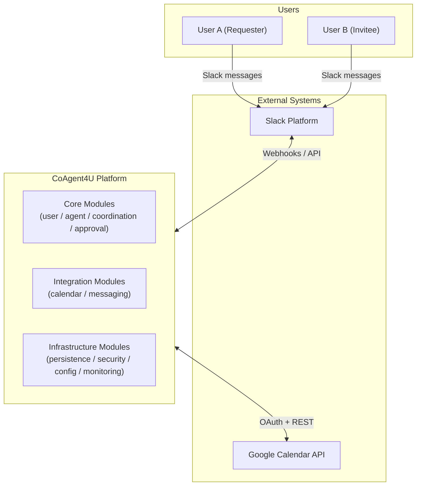
**Note:** LLM integration exists as an optional auxiliary adapter consumed only by agent-module for deterministic fallback intent interpretation. It is not part of coordination logic and not required for MVP core operation.

### 5.1.2 Contained Building Blocks

| Layer | Module | Responsibility |
|-------|--------|----------------|
| Core | user-module | User identity, authentication mapping, profile management, service connection lifecycle |
| Core | agent-module | Personal agent provisioning, intent parsing, calendar operations via CalendarPort, agent capability port implementations |
| Core | coordination-module | A2A coordination state machine, availability matching via agents, proposal generation, saga orchestration via agent capability ports |
| Core | approval-module | Approval request lifecycle, dual-approval enforcement, timeout expiration |
| Integration | calendar-module | Google Calendar adapter — OAuth token management, FreeBusy queries, event CRUD |
| Integration | messaging-module | Slack adapter — webhook reception, signature verification, Block Kit formatting, notification delivery |
| Integration | llm-module | Groq LLM adapter — prompt construction, intent classification fallback (future-ready) |
| Infrastructure | persistence | PostgreSQL adapter implementations for all PersistencePort contracts, Flyway migrations |
| Infrastructure | security | JWT, OAuth flows, AES-256 encryption, Slack signature verification, rate limiting |
| Infrastructure | config | Externalized configuration, environment-specific profiles, secrets injection |
| Infrastructure | monitoring | Actuator, Micrometer metrics, structured logging, health checks |

### 5.1.3 External System Interfaces

| External System | Protocol | Direction | Consuming Module | Purpose |
|-----------------|----------|-----------|------------------|---------|
| Slack Platform | HTTPS REST + WebSocket | Bidirectional | messaging-module | Receive user messages, send notifications, deliver approval prompts |
| Google Calendar API | HTTPS REST + OAuth 2.0 | Bidirectional | calendar-module (consumed only by agent-module) | FreeBusy queries, event CRUD, token refresh |
| Groq LLM API | HTTPS REST | Outbound | llm-module | Intent classification fallback, schedule summarization |

---

## 5.2 Level 1 — Module Decomposition (White Box)

### 5.2.1 UserModule

**Purpose:** Manages user identity, Slack identity mapping, service connection lifecycle (Google Calendar OAuth), and profile data. Provides user resolution services to other modules via query ports.

**Location:** `core/user-module`

**Aggregate Root:** `User`

**Owned Tables:** `users`, `slack_identities`, `service_connections`

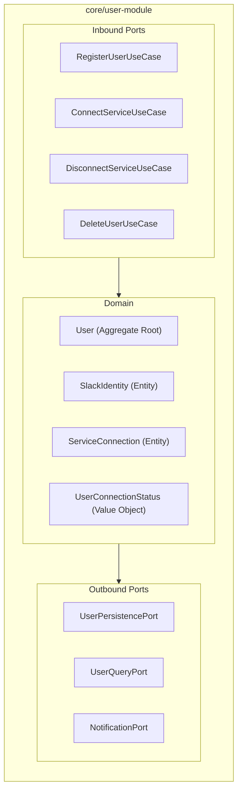

| Port | Type | Description |
|------|------|-------------|
| RegisterUserUseCase | Inbound | Creates user from Slack identity, provisions initial profile |
| ConnectServiceUseCase | Inbound | Links Google Calendar via OAuth, stores encrypted tokens |
| DisconnectServiceUseCase | Inbound | Revokes OAuth tokens, removes service connection |
| DeleteUserUseCase | Inbound | Cascading deletion: profile, identities, connections, agent, coordinations |
| UserPersistencePort | Outbound | CRUD operations on User aggregate |
| UserQueryPort | Outbound | Read-only queries — consumed by coordination-module and agent-module |
| NotificationPort | Outbound | Send user-facing notifications (implemented by messaging-module) |

---

### 5.2.2 CoordinationModule

**Purpose:** Implements the deterministic A2A negotiation protocol between autonomous personal agents. The coordination-module does not own user data, does not access calendar infrastructure, and does not execute business actions directly. It functions purely as a state-machine-driven negotiation and saga orchestration engine between user-owned agents.

**Location:** `core/coordination-module`

**Aggregate Root:** `Coordination`

**Owned Tables:** `coordinations`, `coordination_state_log`

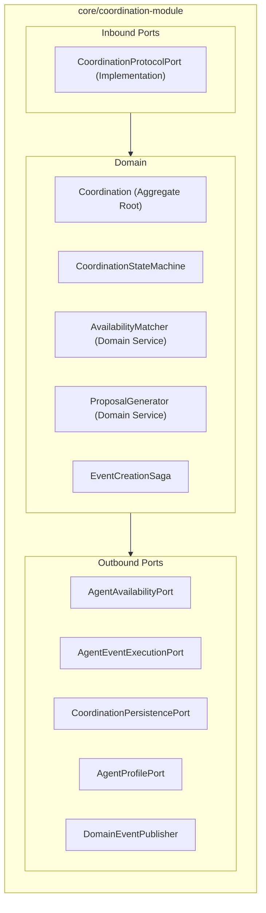

**Inbound Ports:**

| Port | Description |
|------|-------------|
| CoordinationProtocolPort | Defines the deterministic negotiation protocol between personal agents. It is the only ingress interface exposed by the coordination-module and may be invoked exclusively by the agent-module. It allows an agent to initiate, advance, or terminate a coordination instance |

**Outbound Ports:**

| Port | Description | Implemented By |
|------|-------------|----------------|
| AgentAvailabilityPort | `getAvailability(agentId, dateRange, constraints): List<AvailabilityBlock>` — Requests availability from a user's agent | agent-module |
| AgentEventExecutionPort | `createEvent(agentId, timeSlot, eventDetails): EventConfirmation` and `deleteEvent(agentId, eventId): DeletionConfirmation` — Instructs an agent to create or delete a calendar event | agent-module |
| AgentProfilePort | `getAgentProfile(agentId): AgentProfile` — Returns 
presentation-safe agent and user metadata (display name, timezone, locale) for proposal formatting. | agent-module |
| CoordinationPersistencePort | CRUD operations on Coordination aggregate | persistence |
| DomainEventPublisher | Publishes CoordinationStateChanged, CoordinationCompleted, CoordinationFailed events | infrastructure |

**Key Design Constraints:**

* **No CalendarPort dependency.** The coordination-module has zero awareness of calendar infrastructure.
* **No IntegrationModule dependency.** No arrow from coordination-module to any integration module.
* All availability data is obtained exclusively via `AgentAvailabilityPort`.
* All event creation/deletion is performed exclusively via `AgentEventExecutionPort`.
* `AvailabilityMatcher` operates on `List<AvailabilityBlock>` returned by agents — it never fetches calendar data itself.
* `CoordinationSaga` instructs agents to create events; it does not call `CalendarPort`.

**Coordination State Machine:**

| State | Trigger | Next State |
|-------|---------|-----------|
| INITIATED | Scheduling request received | CHECKING_AVAILABILITY_A |
| CHECKING_AVAILABILITY_A | AgentAvailabilityPort.getAvailability(agentA) succeeds | CHECKING_AVAILABILITY_B |
| CHECKING_AVAILABILITY_B | AgentAvailabilityPort.getAvailability(agentB) succeeds | MATCHING |
| MATCHING | AvailabilityMatcher finds overlap | PROPOSAL_GENERATED |
| MATCHING | No overlap found | FAILED |
| PROPOSAL_GENERATED | Proposal sent to invitee | AWAITING_APPROVAL_B |
| AWAITING_APPROVAL_B | Invitee approves | AWAITING_APPROVAL_A |
| AWAITING_APPROVAL_B | Invitee rejects or timeout | REJECTED |
| AWAITING_APPROVAL_A | Requester approves | APPROVED_BY_BOTH |
| AWAITING_APPROVAL_A | Requester rejects or timeout | REJECTED |
| APPROVED_BY_BOTH | Saga: instruct Agent A to create event | CREATING_EVENT_A |
| CREATING_EVENT_A | Agent A confirms event creation | CREATING_EVENT_B |
| CREATING_EVENT_A | Agent A fails | FAILED |
| CREATING_EVENT_B | Agent B confirms event creation | COMPLETED |
| CREATING_EVENT_B | Agent B fails → compensate via Agent A | FAILED |

**Saga Flow (via Agent Capability Ports):**

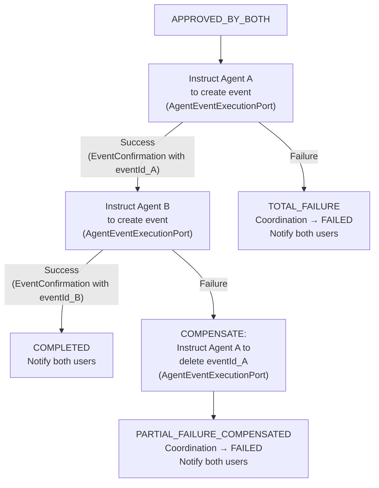

---

### 5.2.3 AgentModule

**Purpose:** Each user has exactly one personal Agent. The Agent is the sole gateway to the user's calendar data and external integrations. It handles intent parsing (two-tier), personal calendar operations, conflict detection, and — critically — implements the agent capability ports consumed by the coordination-module. The AgentModule is the only core module that depends on CalendarPort (provided by calendar-module).

**Location:** `core/agent-module`

**Aggregate Root:** `Agent`

**Owned Tables:** `agents`

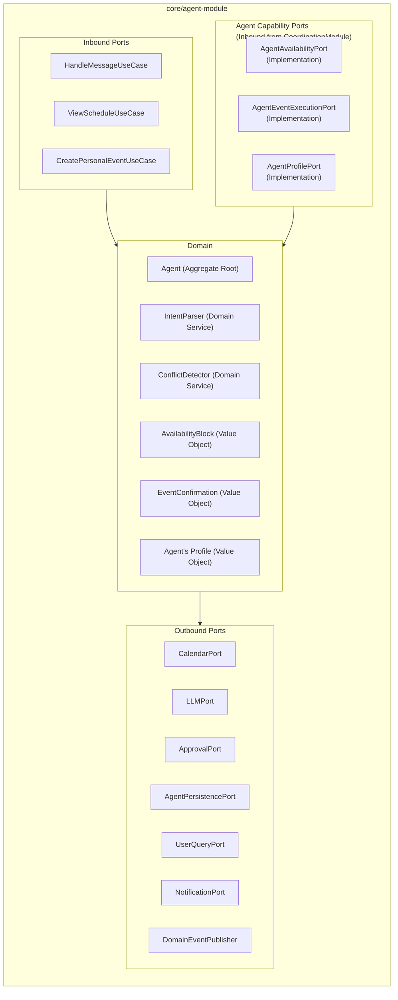

**Inbound Ports (User-Facing):**

| Port | Description |
|------|-------------|
| HandleMessageUseCase | Receives parsed Slack messages, delegates to IntentParser, routes to appropriate action |
| ViewScheduleUseCase | Returns user's schedule summary for a date range |
| CreatePersonalEventUseCase | Creates a personal calendar event (with approval) |

**Agent Capability Ports:**

| Port | Declared In | Description |
|------|-------------|-------------|
| AgentAvailabilityPort | coordination-module | `getAvailability(agentId, dateRange, constraints): List<AvailabilityBlock>` — Fetches the user's calendar events via CalendarPort, computes free/busy blocks, returns availability data. The coordination-module never sees raw calendar data. |
| AgentEventExecutionPort | coordination-module | `createEvent(agentId, timeSlot, eventDetails): EventConfirmation` — Creates a calendar event in the user's calendar via CalendarPort. `deleteEvent(agentId, eventId): DeletionConfirmation` — Deletes a calendar event (saga compensation). |
| AgentProfilePort | coordination-module | `getAgentProfile(agentId)`- Returns presentation-safe agent metadataReturns presentation-safe agent's user and agent metadata |

**Outbound Ports:**

| Port | Description | Implemented By |
|------|-------------|----------------|
| CalendarPort | FreeBusy queries, event CRUD against Google Calendar | calendar-module |
| LLMPort | Fallback intent classification, schedule summarization | llm-module |
| UserQueryPort | For getting info related to user | user-module |
| ApprovalPort | Creates personal approval requests | approval-module |
| AgentPersistencePort | CRUD operations on Agent aggregate | persistence |
| NotificationPort | Sends agent-related notifications to users | messaging-module |
| DomainEventPublisher | Publishes PersonalEventCreated, AgentProvisioned events | infrastructure |

**Internal Delegation Flow:**

When the coordination-module calls `AgentAvailabilityPort.getAvailability(agentId, dateRange, constraints)`:

| Step | Action | Component |
|------|--------|-----------|
| 1 | Receive availability request | AgentAvailabilityPortImpl |
| 2 | Resolve agent and user credentials | Agent aggregate |
| 3 | Fetch calendar events for date range | CalendarPort.getEvents(userId, dateRange) |
| 4 | Compute free/busy blocks from events | ConflictDetector domain service |
| 5 | Return List<AvailabilityBlock> | Back to coordination-module |

When the coordination-module calls `AgentEventExecutionPort.createEvent(agentId, timeSlot, eventDetails)`:

| Step | Action | Component |
|------|--------|-----------|
| 1 | Receive event creation instruction | AgentEventExecutionPortImpl |
| 2 | Resolve agent and user credentials | Agent aggregate |
| 3 | Create event in user's calendar | CalendarPort.createEvent(userId, timeSlot, eventDetails) |
| 4 | Return EventConfirmation with eventId | Back to coordination-module |

**Delegation Diagram:**

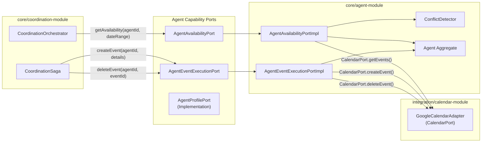

---

### 5.2.4 ApprovalModule

**Purpose:** Manages the approval lifecycle for both personal events (single approval) and collaborative events (dual approval). Enforces Human-in-the-Loop governance. Publishes domain events consumed by agent-module (personal) and coordination-module (collaborative).

**Location:** `core/approval-module`

**Aggregate Root:** `Approval`

**Owned Tables:** `approvals`

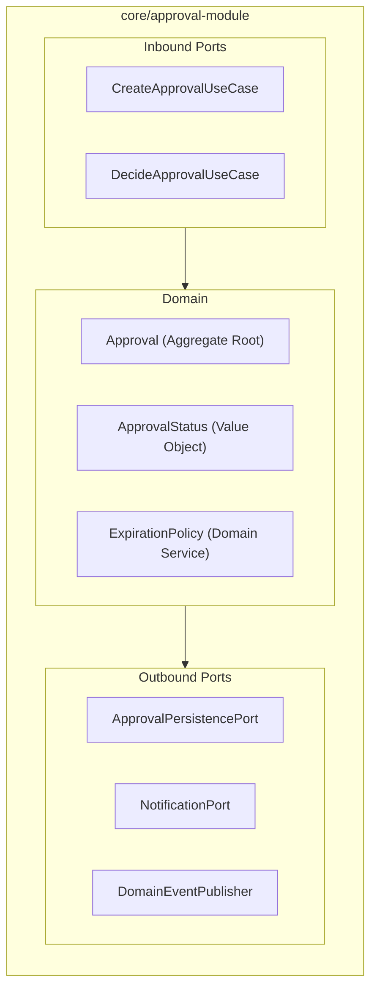

| Port | Type | Description |
|------|------|-------------|
| CreateApprovalUseCase | Inbound | Creates an approval request (personal or collaborative) |
| DecideApprovalUseCase | Inbound | Records approve/reject decision, publishes ApprovalDecisionMade |
| ApprovalPersistencePort | Outbound | CRUD operations on Approval aggregate |
| NotificationPort | Outbound | Sends approval prompts and confirmations via Slack |
| DomainEventPublisher | Outbound | Publishes ApprovalDecisionMade, ApprovalExpired events |

**Domain Event Consumers:**

| Event | Consumer | Action |
|-------|----------|--------|
| ApprovalDecisionMade (PERSONAL) | agent-module | Executes personal action |
| ApprovalDecisionMade (COLLABORATIVE) | agent-module | Invokes CoordinationProtocolPort.advance() |
| ApprovalExpired | agent-module(PERSONAL) |Notifies user |
| ApprovalExpired | agent-module (COLLABORATIVE) | Invokes CoordinationProtocolPort.terminate() |

---

### 5.2.5 IntegrationModule — Calendar

**Purpose:** Provides the CalendarPort adapter for Google Calendar API operations. Handles OAuth token management, FreeBusy queries, event CRUD, token refresh, and rate limiting. This module is a pure adapter provider — it is consumed exclusively by the agent-module. The coordination-module has zero dependency on this module.

**Location:** `integration/calendar-module`

**Port Implemented:** `CalendarPort`

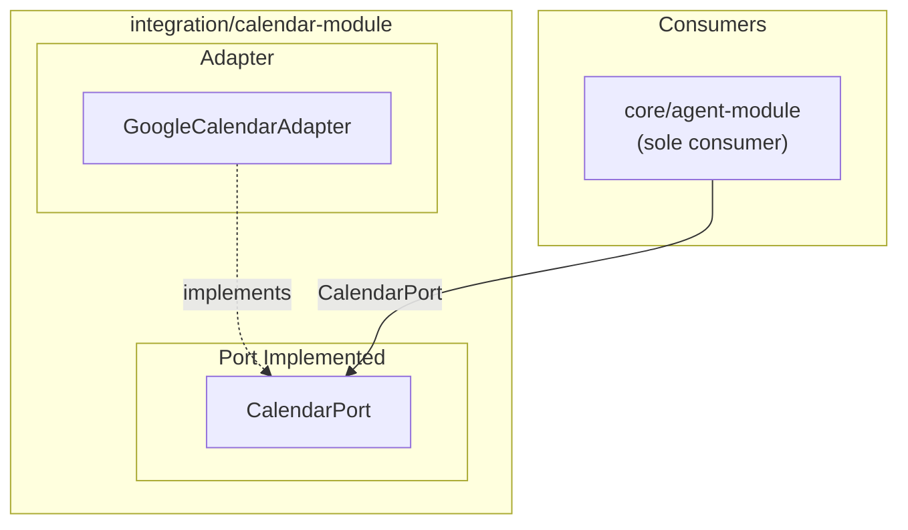

| Operation | Description |
|-----------|-------------|
| getEvents(userId, dateRange) | Fetches calendar events for the given date range via Google Calendar FreeBusy API |
| createEvent(userId, timeSlot, eventDetails) | Creates an event in the user's Google Calendar |
| deleteEvent(userId, eventId) | Deletes an event from the user's Google Calendar |
| refreshToken(userId) | Transparently refreshes expired OAuth tokens |

**Access Restriction:**

| Module | Access to CalendarPort |
|--------|------------------------|
| agent-module | ✅ Sole consumer — delegates from agent capability ports |
| coordination-module | ❌ No dependency — accesses calendar data only via AgentAvailabilityPort and AgentEventExecutionPort |
| approval-module | ❌ No dependency |
| user-module | ❌ No dependency (manages OAuth connections, not calendar operations) |

---

### 5.2.6 IntegrationModule — Messaging

**Purpose:** Provides the NotificationPort and SlackInboundPort adapters for Slack API operations. Handles webhook reception, signature verification, Block Kit message formatting, approval prompt delivery, and confirmation notifications.

**Location:** `integration/messaging-module`

**Ports Implemented:** `NotificationPort`, `SlackInboundPort`

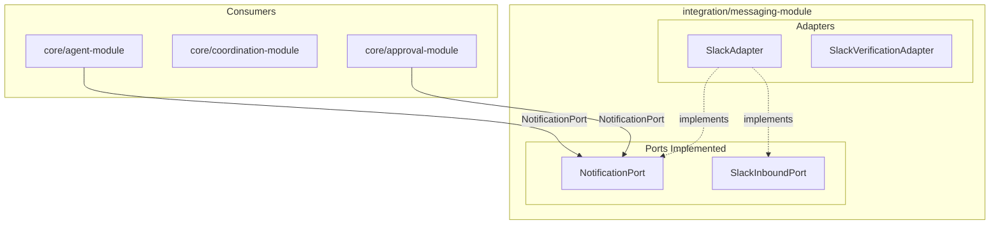

---

### 5.2.7 IntegrationModule — LLM (Future-Ready)

**Purpose:** Provides the LLMPort adapter for Groq LLM API operations. Handles prompt construction, API communication, response parsing, and error handling. Used by agent-module for fallback intent classification and schedule summarization.

**Location:** `integration/llm-module`

**Port Implemented:** `LLMPort`

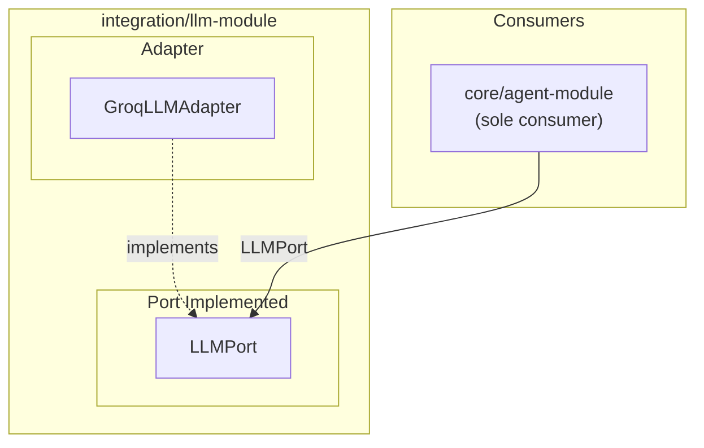

---

### 5.2.8 Infrastructure — Persistence

**Purpose:** Provides PostgreSQL adapter implementations for all PersistencePort contracts across core modules. Manages JPA entity mappings, Spring Data repositories, and Flyway schema migrations.

**Location:** `infrastructure/persistence`

**Ports Implemented:** `UserPersistencePort`, `AgentPersistencePort`, `CoordinationPersistencePort`, `ApprovalPersistencePort`, `AgentActivityPersistencePort`

| Port | Owning Module | Owned Tables |
|------|---------------|--------------|
| UserPersistencePort | user-module | users, slack_identities, service_connections |
| AgentPersistencePort | agent-module | agents |
| CoordinationPersistencePort | coordination-module | coordinations, coordination_state_log |
| ApprovalPersistencePort | approval-module | approvals |
| AgentActivityPersistencePort | monitoring | agent_activities |

---

### 5.2.9 Infrastructure — Security

**Purpose:** Provides security adapter implementations including JWT token management, OAuth 2.0 flows, AES-256-GCM encryption for secrets at rest, Slack webhook signature verification, CSRF protection, and rate limiting.

**Location:** `infrastructure/security`

| Capability | Description |
|------------|-------------|
| JWT | Token issuance and validation for REST API dashboard access |
| OAuth 2.0 | Handles Google Calendar OAuth flows — token exchange, storage, refresh triggers |
| AES-256-GCM | Encryption/decryption of OAuth tokens and PII at rest in PostgreSQL |
| Slack Signature | HMAC-SHA256 verification on all inbound Slack webhooks |
| Rate Limiting | Caffeine-backed token bucket — 100 req/min/user at REST adapter layer |

---

### 5.2.10 Infrastructure — Config

**Purpose:** Manages externalized configuration, environment-specific profiles (dev, staging, production), and secrets injection via environment variables. Future migration path to Vault/AWS Secrets Manager via adapter swap.

**Location:** `infrastructure/config`

---

### 5.2.11 Infrastructure — Monitoring

**Purpose:** Provides observability infrastructure including Spring Boot Actuator endpoints, Micrometer metrics emission, structured JSON logging, health checks, and agent activity population via domain event consumption.

**Location:** `infrastructure/monitoring`

| Capability | Description |
|------------|-------------|
| Actuator | Health, info, metrics endpoints |
| Micrometer | Dimensional metrics for coordination duration, approval latency, agent response times |
| Structured Logging | JSON log format with correlation IDs across full coordination lifecycle |
| AgentActivity Handler | Async consumer of CoordinationStateChanged events → writes to agent_activities table |

---

## 5.3 Cross-Module Dependency Summary

### Dependency Matrix

| From ↓ / To → | user-module | agent-module | coordination-module | approval-module | calendar-module | messaging-module | llm-module | persistence | security |
|---------------|-------------|--------------|---------------------|-----------------|-----------------|------------------|------------|-------------|----------|
| user-module | — | | | | | ✅ NotificationPort | | ✅ UserPersistencePort | |
| agent-module | ✅ UserQueryPort | — | ✅ CoordinationProtocolPort | ✅ ApprovalPort | ✅ CalendarPort | ✅ NotificationPort | ✅ LLMPort | ✅ AgentPersistencePort | |
| coordination-module | ❌ | ✅ AgentAvailabilityPort, AgentEventExecutionPort, AgentProfilePort | ❌ | ❌ | ❌ | | | ✅ CoordinationPersistencePort | |
| approval-module | | | | — | | ✅ NotificationPort | | ✅ ApprovalPersistencePort | |

### Key Dependency Rules

| Rule | Description | Enforcement |
|------|-------------|-------------|
| Agent Sovereignty | The coordination-module has zero direct access to user-scoped data or infrastructure. All calendar access must go through agent-module via AgentAvailabilityPort and AgentEventExecutionPort. The coordination-module exposes exactly one inbound interface: CoordinationProtocolPort, and only agent-module may invoke it. Coordination must not receive Slack events, REST calls, or approval events directly.  | Maven module dependency, ArchUnit fitness function |
| CalendarPort Sole Consumer | Only agent-module depends on calendar-module. No other core module may import or reference CalendarPort. | Maven module dependency |
| No Shared Tables | Each module owns its tables exclusively. Cross-module data access only through port interfaces. | Code review, integration tests |
| Integration Module Isolation | Integration modules are pure adapter providers. They implement port interfaces and have no knowledge of core domain logic. | Maven module structure |
| Agent Profile Access | coordination-module must not depend on UserQueryPort. All presentation-safe user metadata must be retrieved via AgentProfilePort implemented by agent-module. | Maven module dependency + ArchUnit rule |
| Stateless Enforcement | No coordination, approval, or agent state may be stored in memory across requests. All authoritative state is persisted via PersistencePort. In-memory cache is strictly non-authoritative. | ArchUnit rule + no static state |
| Deterministic Coordination | coordination-module must never depend on LLMPort or any AI-based decision system. All proposal selection and matching must be purely deterministic. | Maven + ArchUnit rule |

### Dependency Diagram

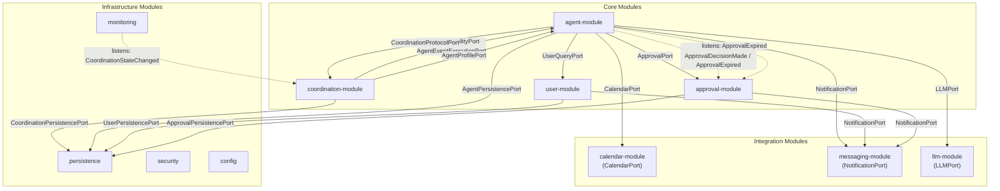

**Critical observation:** There is no arrow from coordination-module to calendar-module. This is the Agent Sovereignty principle enforced at the dependency graph level. The coordination-module accesses calendar data exclusively through the agent-module via AgentAvailabilityPort and AgentEventExecutionPort.

### Synchronous Call Path (Deterministic Coordination Flow)

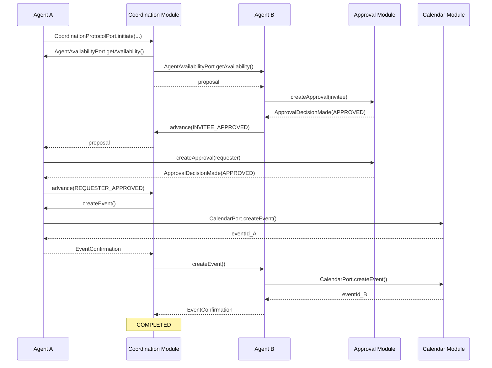

## 5.4 Internal Communication Model

CoAgent4U uses a hybrid internal communication model:

### 1. Deterministic Workflow Execution (Synchronous)

Used for:
- Coordination state transitions
- Availability queries via AgentAvailabilityPort
- Saga event creation via AgentEventExecutionPort
- Approval decision processing

Mechanism:
- Direct port-to-port synchronous calls
- Transactionally persisted state transitions
- No async gaps in state machine progression

Guarantee:
- Deterministic, auditable, state-safe execution

---

### 2. Side Effects & Observability (Asynchronous)

Used for:
- AgentActivity logging
- Metrics emission
- Slack notifications
- Timeout scheduling

Mechanism:
- In-memory domain event bus
- DomainEventPublisher
- Non-blocking event listeners

Guarantee:
- Non-critical operations never block coordination workflow
- Failures in side effects do not alter state machine outcome
