# 06 — Runtime View

## Table of Contents

- [1. Overview](#1-overview)
- [2. Runtime Enforcement of Agent Sovereignty](#2-runtime-enforcement-of-agent-sovereignty)
- [3. Synchronous vs Asynchronous Flow Classification](#3-synchronous-vs-asynchronous-flow-classification)
- [4. Personal Scheduling Flow](#4-personal-scheduling-flow)
  - [4.1 Happy Path — No Conflict](#41-happy-path--no-conflict)
  - [4.2 Conflict Detection and Approval](#42-conflict-detection-and-approval)
  - [4.3 Personal Approval Timeout](#43-personal-approval-timeout)
- [5. A2A Collaborative Coordination Flow](#5-a2a-collaborative-coordination-flow)
  - [5.1 Full Coordination Sequence — Happy Path](#51-full-coordination-sequence--happy-path)
  - [5.2 Availability Phase](#52-availability-phase)
  - [5.3 Matching and Proposal Phase](#53-matching-and-proposal-phase)
  - [5.4 Dual Approval Phase](#54-dual-approval-phase)
  - [5.5 Saga Phase — Atomic Event Creation](#55-saga-phase--atomic-event-creation)
- [6. Coordination State Machine](#6-coordination-state-machine)
  - [6.1 State Machine Diagram](#61-state-machine-diagram)
  - [6.2 State Transition Table](#62-state-transition-table)
- [7. Approval Workflow](#7-approval-workflow)
  - [7.1 Approval Lifecycle Sequence](#71-approval-lifecycle-sequence)
  - [7.2 Approval Domain Event Routing](#72-approval-domain-event-routing)
  - [7.3 12-Hour Timeout Expiration](#73-12-hour-timeout-expiration)
- [8. Saga Compensation Scenarios](#8-saga-compensation-scenarios)
  - [8.1 Total Failure — Agent A Creation Fails](#81-total-failure--agent-a-creation-fails)
  - [8.2 Partial Failure — Agent B Creation Fails, Compensation Succeeds](#82-partial-failure--agent-b-creation-fails-compensation-succeeds)
  - [8.3 Compensation Failure — Agent A Deletion Fails](#83-compensation-failure--agent-a-deletion-fails)
- [9. Error Handling Scenarios](#9-error-handling-scenarios)
  - [9.1 Calendar API Unavailable During Availability Check](#91-calendar-api-unavailable-during-availability-check)
  - [9.2 LLM Fallback Failure](#92-llm-fallback-failure)
  - [9.3 Slack Notification Delivery Failure](#93-slack-notification-delivery-failure)
  - [9.4 Concurrent Approval and Timeout Race Condition](#94-concurrent-approval-and-timeout-race-condition)
- [10. Intent Parsing Runtime Flow](#10-intent-parsing-runtime-flow)
- [11. Asynchronous Side Effect Flows](#11-asynchronous-side-effect-flows)
  - [11.1 Audit Logging](#111-audit-logging)
  - [11.2 Notification Delivery](#112-notification-delivery)
  - [11.3 Metrics Emission](#113-metrics-emission)

---

## 1. Overview

This section documents the runtime behavior of the CoAgent4U platform through sequence diagrams, state machine diagrams, and narrative descriptions of every significant interaction path. Each scenario is traced through the hexagonal layer structure defined in `05-building-block-view.md` and follows the architectural strategies established in `04-solution-strategy.md`.

Every runtime flow documented here enforces the **Agent Sovereignty Principle** (§2.8 of `04-solution-strategy.md`). The `coordination-module` never directly accesses `CalendarPort`, `ApprovalPort`, `NotificationPort`, user persistence, or any external integration. All user-scoped operations are mediated exclusively through agent capability ports (`AgentAvailabilityPort`, `AgentEventExecutionPort`, `AgentProfilePort`, `AgentApprovalPort`), with each user's agent acting as the sole gateway to their data and connected services. Coordination state advances are driven exclusively by agents calling `CoordinationProtocolPort` — the `coordination-module` never subscribes directly to approval events.

Runtime flows are categorized into two execution paths: the **synchronous deterministic path** (coordination state transitions, agent capability calls, saga execution) and **asynchronous side effects** (notifications, audit logging, metrics). This separation is maintained throughout all diagrams and narratives.

---

## 2. Runtime Enforcement of Agent Sovereignty

The Agent Sovereignty Principle imposes strict runtime constraints that govern every interaction documented in this section. Calendar mutation authority exists only inside `agent-module`. Even the `approval-module` cannot create calendar events directly; it only publishes domain events.

**Coordination Orchestrates Agents, Not Infrastructure:**

The `coordination-module`'s `CoordinationOrchestrator` and `CoordinationSaga` never interact with `CalendarPort`, `ApprovalPort`, `NotificationPort`, `UserPersistencePort`, or any adapter that touches external systems. During the availability phase, the orchestrator calls `AgentAvailabilityPort.getAvailability(agentId, dateRange, constraints)` for each participant. The `agent-module` receives this call, internally resolves the user's credentials, fetches calendar data via `CalendarPort`, computes free/busy blocks, and returns `List<AvailabilityBlock>` — a domain value object that contains no raw calendar event data. The `coordination-module` receives availability abstractions, never raw calendar events.

**Agents Are the Sole Gateway to User Data and Approvals:**

During the approval phase, the `coordination-module` returns the proposal to each participant's agent via `AgentApprovalPort.requestApproval(agentId, approvalType, proposal)`. The `agent-module` internally delegates to `ApprovalPort.createApproval()` to create the approval and trigger the approval prompt via the `approval-module`'s own notification delivery. The `coordination-module` never calls `ApprovalPort` or `NotificationPort` directly.

During the saga phase, the `CoordinationSaga` calls `AgentEventExecutionPort.createEvent(agentId, timeSlot, eventDetails)` to instruct each agent to create a calendar event. The agent internally delegates to `CalendarPort.createEvent()` and returns an `EventConfirmation` containing the external event ID. The `coordination-module` stores this event ID for potential compensation but never interacts with Google Calendar directly. Compensation (event deletion) follows the same pattern — the saga instructs the agent to delete the event via `AgentEventExecutionPort.deleteEvent(agentId, eventId)`.

**Coordination Never Subscribes to Approval Events:**

When the `approval-module` publishes `ApprovalDecisionMade` or `ApprovalExpired` events for collaborative approvals, these events are consumed by the `agent-module` — not the `coordination-module`. The `agent-module`'s `CollaborativeApprovalDecisionHandler` receives the event and calls `CoordinationProtocolPort.advance(coordinationId, decision)` or `CoordinationProtocolPort.terminate(coordinationId, reason)` to drive the coordination state machine forward. This ensures the `coordination-module`'s only inbound triggers are agent capability port calls and the `CoordinationProtocolPort` interface.

**Coordination Never Holds OAuth Tokens:**

The `coordination-module` never sees, stores, or transmits OAuth tokens, refresh tokens, or any credential material. Token management is entirely within the `agent-module`'s internal delegation to `CalendarPort`, which in turn delegates to the `GoogleCalendarAdapter` in the `calendar-module`.

**User Metadata for Proposals via `AgentProfilePort`:**

When the `coordination-module` needs display-safe user metadata (display name, timezone, locale) for formatting proposals, it calls `AgentProfilePort.getProfile(agentId)` rather than `UserQueryPort`. This ensures the `coordination-module` has no dependency on `user-module` persistence. The `agent-module` internally delegates to `UserQueryPort` for persistence access but exposes only presentation-safe metadata via `AgentProfilePort`. `coordination-module` never accesses `UserQueryPort` directly.

**Runtime Boundary Summary:**

| Operation | Coordination-Module Calls | Agent-Module Internally Delegates To |
|---|---|---|
| Check availability | `AgentAvailabilityPort.getAvailability()` | `CalendarPort.getEvents()` → `ConflictDetector` |
| Create calendar event | `AgentEventExecutionPort.createEvent()` | `CalendarPort.createEvent()` |
| Delete calendar event (compensation) | `AgentEventExecutionPort.deleteEvent()` | `CalendarPort.deleteEvent()` |
| Get user display info | `AgentProfilePort.getProfile()` | `UserQueryPort.findUserById()` |
| Request approval | `AgentApprovalPort.requestApproval()` | `ApprovalPort.createApproval()` |
| Send notification | Publishes domain event (e.g., `CoordinationCompleted`) | Async `NotificationEventHandler` → `NotificationPort` |
| Advance coordination (approval result) | — (receives via `CoordinationProtocolPort.advance()`) | Agent consumes `ApprovalDecisionMade`, calls `CoordinationProtocolPort` |

---

## 3. Synchronous vs Asynchronous Flow Classification

Every runtime interaction falls into one of two categories. This classification is maintained in all diagrams throughout this section.

**Synchronous Deterministic Path** (solid arrows in diagrams):

| Flow Type | Examples |
|---|---|
| Coordination state transitions | `INITIATED → CHECKING_AVAILABILITY_A → ... → COMPLETED` |
| Agent capability calls | `AgentAvailabilityPort`, `AgentEventExecutionPort`, `AgentProfilePort`, `AgentApprovalPort` |
| Saga execution | Sequential event creation with compensation on failure |
| Coordination protocol calls | `CoordinationProtocolPort.advance()`, `.terminate()` |
| Intent parsing pipeline | Rule-based parser → optional LLM fallback |

These calls are transactional, blocking, and their success or failure directly determines the coordination state machine's next transition. The deterministic guarantee of the system depends on these paths being synchronous and predictable.

**Asynchronous Side Effects** (dashed arrows in diagrams):

| Flow Type | Examples |
|---|---|
| Domain event publication | `CoordinationStateChanged`, `CoordinationCompleted`, `CoordinationFailed`, `ApprovalDecisionMade`, `ApprovalExpired` |
| Notification delivery | Slack messages for approvals, confirmations, errors |
| Audit log writes | Append-only entries to `coordination_state_log` and `audit_logs` |
| Metrics emission | Micrometer counters and timers |

If an asynchronous handler fails (e.g., Slack is unreachable), the coordination state machine is unaffected. The coordination can be `COMPLETED` even if the confirmation notification fails to deliver. Failed side effects are logged and retried by their respective modules.

---

## 4. Personal Scheduling Flow

The personal scheduling flow involves a single user interacting with their personal agent via Slack. The `coordination-module` is not involved in this flow. The `agent-module` handles intent parsing, conflict detection, and (upon approval) event creation — all via `CalendarPort`. Each user has exactly one `Agent` aggregate provisioned at registration. The `Agent` holds a reference to the owning `userId` but encapsulates all calendar access and scheduling capabilities. All personal scheduling operations are executed within the `agent-module`. No other module can perform personal calendar mutations.

### 4.1 Happy Path — No Conflict

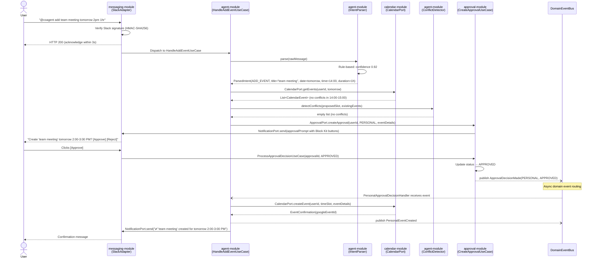

The `agent-module` is the sole consumer of `CalendarPort` in this flow. The `approval-module` publishes an `ApprovalDecisionMade` domain event; the `agent-module`'s `PersonalApprovalDecisionHandler` consumes it and triggers the actual calendar event creation. This event-driven decoupling ensures the `approval-module` never touches `CalendarPort`. Note that in personal flows, the `agent-module` calls `ApprovalPort.createApproval()` directly — this is the accepted pattern for personal scheduling where no coordination is involved. The `approval-module`'s use of `NotificationPort` for sending approval prompts is part of the approval lifecycle and is an accepted exemption from Agent Sovereignty, which governs `coordination-module` boundaries specifically.

### 4.2 Conflict Detection and Approval

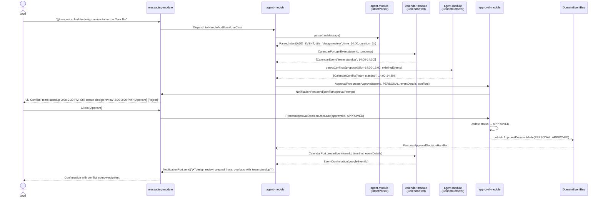

### 4.3 Personal Approval Timeout

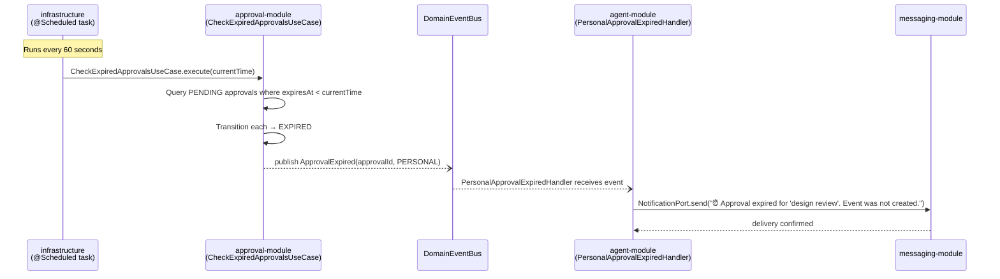

No calendar event is created. The `agent-module` handles the notification. No `coordination-module` involvement in personal flows.

---

## 5. A2A Collaborative Coordination Flow

The collaborative coordination flow involves two users whose personal agents are orchestrated by the `coordination-module`'s state machine. The `coordination-module` interacts only with agent capability ports (`AgentAvailabilityPort`, `AgentEventExecutionPort`, `AgentProfilePort`, `AgentApprovalPort`) and `DomainEventPublisher` — never with `CalendarPort`, `ApprovalPort`, `NotificationPort`, `UserPersistencePort`, or any external system adapter directly. Approval results reach the `coordination-module` exclusively via agents calling `CoordinationProtocolPort`.

### 5.1 Full Coordination Sequence — Happy Path

```mermaid
sequenceDiagram
    actor UserA as User A (Requester)
    participant SlackIn as messaging-module<br/>(SlackAdapter Inbound)
    participant AgentA_Parse as agent-module<br/>(IntentParser)
    participant Coord as coordination-module<br/>(CoordinationOrchestrator)
    participant AgentA_Avail as agent-module<br/>(AgentAvailabilityPort - Agent A)
    participant AgentB_Avail as agent-module<br/>(AgentAvailabilityPort - Agent B)
    participant CalA as calendar-module<br/>(CalendarPort - User A)
    participant CalB as calendar-module<br/>(CalendarPort - User B)
    participant Matcher as coordination-module<br/>(AvailabilityMatcher)
    participant Proposal as coordination-module<br/>(ProposalGenerator)
    participant ProfileB as agent-module<br/>(AgentProfilePort - Agent B)
    participant ProfileA as agent-module<br/>(AgentProfilePort - Agent A)
    participant AgentB_Appr as agent-module<br/>(AgentApprovalPort - Agent B)
    participant AgentA_Appr as agent-module<br/>(AgentApprovalPort - Agent A)
    participant ApprovalMod as approval-module
    participant EventBus as DomainEventBus
    participant AgentA_Exec as agent-module<br/>(AgentEventExecutionPort - Agent A)
    participant AgentB_Exec as agent-module<br/>(AgentEventExecutionPort - Agent B)
    participant SlackOut as messaging-module<br/>(NotificationPort)
    actor UserB as User B (Invitee)

    Note over Coord: === PHASE 1: INTENT & INITIATION ===
    UserA->>SlackIn: "@coagent schedule meeting with @UserB this week"
    SlackIn->>SlackIn: Verify Slack signature
    SlackIn-->>UserA: HTTP 200 (3s ack)
    SlackIn->>AgentA_Parse: Dispatch to HandleCollaborativeIntentUseCase
    AgentA_Parse->>AgentA_Parse: IntentParser → SCHEDULE_MEETING (confidence 0.88)
    AgentA_Parse->>Coord: InitiateSchedulingUseCase(agentIdA, agentIdB, thisWeek, 30min)

    Note over Coord: State: INITIATED

    Note over Coord: === PHASE 2: AVAILABILITY (via Agents) ===
    Coord->>Coord: Transition → CHECKING_AVAILABILITY_A
    Coord->>AgentA_Avail: AgentAvailabilityPort.getAvailability(agentIdA, thisWeek, constraints)
    AgentA_Avail->>CalA: CalendarPort.getEvents(userIdA, thisWeek)
    CalA-->>AgentA_Avail: List<CalendarEvent>
    AgentA_Avail->>AgentA_Avail: ConflictDetector → compute free blocks
    AgentA_Avail-->>Coord: List<AvailabilityBlock> for User A

    Coord->>Coord: Transition → CHECKING_AVAILABILITY_B
    Coord->>AgentB_Avail: AgentAvailabilityPort.getAvailability(agentIdB, thisWeek, constraints)
    AgentB_Avail->>CalB: CalendarPort.getEvents(userIdB, thisWeek)
    CalB-->>AgentB_Avail: List<CalendarEvent>
    AgentB_Avail->>AgentB_Avail: ConflictDetector → compute free blocks
    AgentB_Avail-->>Coord: List<AvailabilityBlock> for User B

    Note over Coord: === PHASE 3: MATCHING & PROPOSAL ===
    Coord->>Coord: Transition → MATCHING
    Coord->>Matcher: match(availabilityA, availabilityB)
    Matcher-->>Coord: List<TimeSlot> overlapping windows (sorted chronologically)
    Coord->>Proposal: generate(overlappingSlots, duration=30min)
    Proposal-->>Coord: MeetingProposal(earliest slot, "Meeting: User A + User B")
    Coord->>Coord: Transition → PROPOSAL_GENERATED

    Note over Coord: === PHASE 4: DUAL APPROVAL (via Agents) ===
    Coord->>ProfileB: AgentProfilePort.getProfile(agentIdB)
    ProfileB-->>Coord: AgentProfile(displayName, timezone, locale)
    Coord->>AgentB_Appr: AgentApprovalPort.requestApproval(agentIdB, COLLABORATIVE_INVITEE, proposal)
    AgentB_Appr->>ApprovalMod: ApprovalPort.createApproval(userIdB, COLLABORATIVE_INVITEE, proposal)
    ApprovalMod->>SlackOut: NotificationPort.send(inviteeApprovalPrompt)
    SlackOut-->>UserB: "📅 User A wants to meet: Wed 3:00-3:30 PM. [Approve] [Reject]"
    AgentB_Appr-->>Coord: ApprovalRequestConfirmation(approvalId)
    Coord->>Coord: Transition → AWAITING_APPROVAL_B

    UserB->>SlackIn: Clicks [Approve]
    SlackIn->>ApprovalMod: ProcessApprovalDecisionUseCase(approvalId, APPROVED)
    ApprovalMod--)EventBus: publish ApprovalDecisionMade(COLLABORATIVE_INVITEE, APPROVED)

    EventBus--)AgentB_Appr: CollaborativeApprovalDecisionHandler receives event
    AgentB_Appr->>Coord: CoordinationProtocolPort.advance(coordinationId, INVITEE_APPROVED)
    Coord->>Coord: Transition → APPROVED_BY_B

    Coord->>ProfileA: AgentProfilePort.getProfile(agentIdA)
    ProfileA-->>Coord: AgentProfile(displayName, timezone, locale)
    Coord->>AgentA_Appr: AgentApprovalPort.requestApproval(agentIdA, COLLABORATIVE_REQUESTER, proposal)
    AgentA_Appr->>ApprovalMod: ApprovalPort.createApproval(userIdA, COLLABORATIVE_REQUESTER, proposal)
    ApprovalMod->>SlackOut: NotificationPort.send(requesterApprovalPrompt)
    SlackOut-->>UserA: "📅 Confirm meeting with User B: Wed 3:00-3:30 PM. [Approve] [Reject]"
    AgentA_Appr-->>Coord: ApprovalRequestConfirmation(approvalId)
    Coord->>Coord: Transition → AWAITING_APPROVAL_A

    UserA->>SlackIn: Clicks [Approve]
    SlackIn->>ApprovalMod: ProcessApprovalDecisionUseCase(approvalId, APPROVED)
    ApprovalMod--)EventBus: publish ApprovalDecisionMade(COLLABORATIVE_REQUESTER, APPROVED)

    EventBus--)AgentA_Appr: CollaborativeApprovalDecisionHandler receives event
    AgentA_Appr->>Coord: CoordinationProtocolPort.advance(coordinationId, REQUESTER_APPROVED)
    Coord->>Coord: Transition → APPROVED_BY_BOTH

    Note over Coord: === PHASE 5: SAGA (via Agent Capability Ports) ===
    Coord->>Coord: Transition → CREATING_EVENT_A
    Coord->>AgentA_Exec: AgentEventExecutionPort.createEvent(agentIdA, timeSlot, details)
    AgentA_Exec->>CalA: CalendarPort.createEvent(userIdA, timeSlot, details)
    CalA-->>AgentA_Exec: EventConfirmation(googleEventId_A)
    AgentA_Exec-->>Coord: EventConfirmation(eventId_A)

    Coord->>Coord: Transition → CREATING_EVENT_B
    Coord->>AgentB_Exec: AgentEventExecutionPort.createEvent(agentIdB, timeSlot, details)
    AgentB_Exec->>CalB: CalendarPort.createEvent(userIdB, timeSlot, details)
    CalB-->>AgentB_Exec: EventConfirmation(googleEventId_B)
    AgentB_Exec-->>Coord: EventConfirmation(eventId_B)

    Coord->>Coord: Transition → COMPLETED

    Coord--)EventBus: publish CoordinationCompleted(coordinationId, eventIdA, eventIdB)

    Note over EventBus: Async notification delivery (see §11.2)
```

### 5.2 Availability Phase

The availability phase demonstrates the Agent Sovereignty principle at runtime. The `coordination-module` requests availability from each user's agent. Agents internally fetch calendar data, compute free/busy blocks, and return domain value objects. The `coordination-module` never sees raw calendar events.

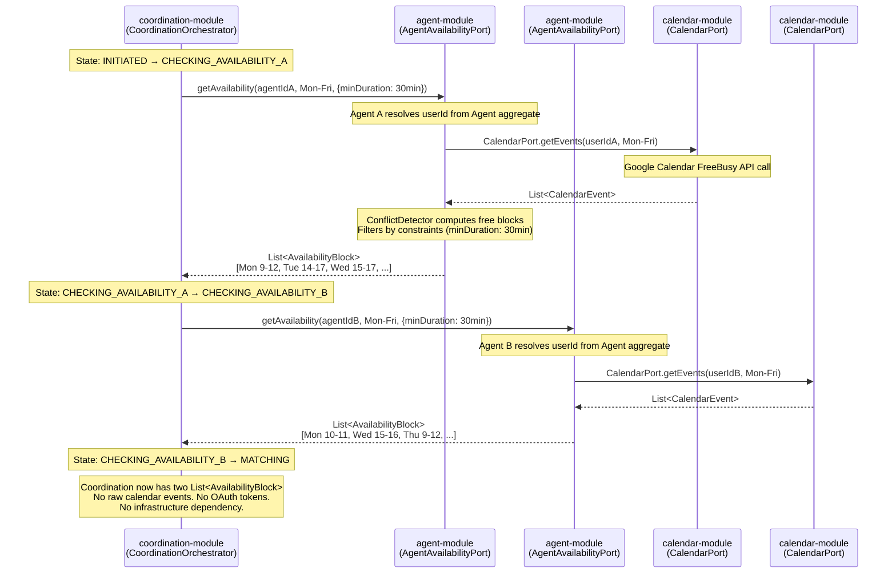

**What the `coordination-module` sees:** `List<AvailabilityBlock>` — each containing a `TimeSlot` (start, end) and availability metadata. No event titles, no event descriptions, no attendee lists, no Google Calendar API response artifacts.

**What the `coordination-module` does NOT see:** Raw `CalendarEvent` objects, OAuth tokens, Google API responses, user email addresses, or any infrastructure-level data.

### 5.3 Matching and Proposal Phase

The matching and proposal phase is pure domain logic within the `coordination-module`. No external calls are made. The `AvailabilityMatcher` and `ProposalGenerator` are domain services that operate on the `List<AvailabilityBlock>` data obtained from agents in the previous phase.

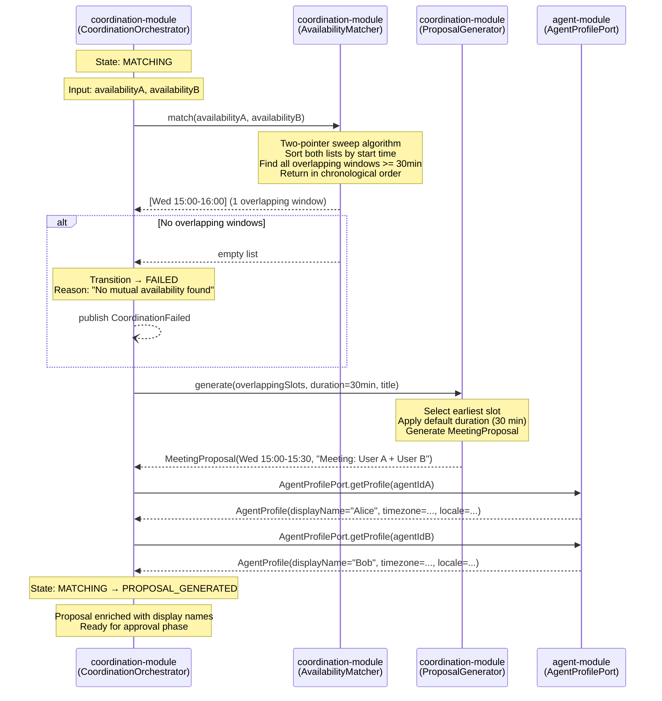

The `AvailabilityMatcher` algorithm is deterministic: given the same two availability lists, it always produces the same overlapping windows in the same order. The `ProposalGenerator` is deterministic: it always selects the earliest available slot with the configured default duration. No randomness, no AI, no probabilistic logic.

### 5.4 Dual Approval Phase

The dual approval phase delegates approval creation to each participant's agent via `AgentApprovalPort`. The `coordination-module` never calls `ApprovalPort` or `NotificationPort` directly. Approval decisions reach the `coordination-module` asynchronously via the agent-mediated `CoordinationProtocolPort`.

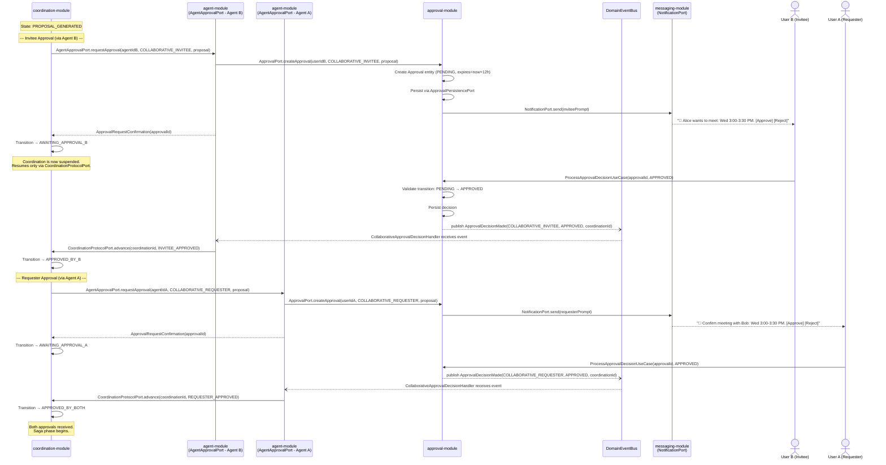

**Rejection path:** If either user clicks [Reject], the `approval-module` publishes `ApprovalDecisionMade` with decision `REJECTED`. The `agent-module`'s `CollaborativeApprovalDecisionHandler` receives it and calls `CoordinationProtocolPort.advance(coordinationId, INVITEE_REJECTED)` or `CoordinationProtocolPort.advance(coordinationId, REQUESTER_REJECTED)`. The `coordination-module` transitions to `REJECTED`, persists the state, and publishes `CoordinationRejected`. Notifications to both users are handled by the async `NotificationEventHandler` (see §11.2). No calendar events are created.

### 5.5 Saga Phase — Atomic Event Creation

The saga phase demonstrates the Agent Sovereignty principle in the most critical path: calendar mutation. The `CoordinationSaga` instructs agents to create events; agents internally delegate to `CalendarPort`. The `coordination-module` never touches `CalendarPort`. The saga uses intermediate states (`CREATING_EVENT_A`, `CREATING_EVENT_B`) to provide observable progress for crash recovery.

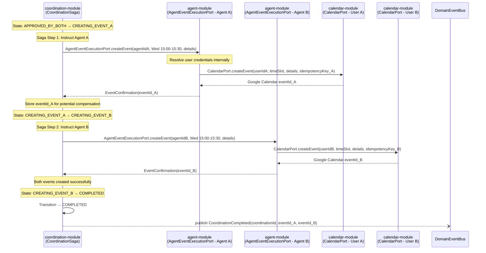

---

## 6. Coordination State Machine

### 6.1 State Machine Diagram

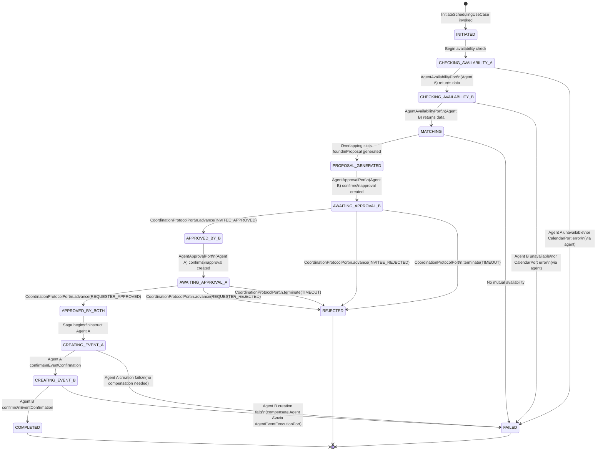

### 6.2 State Transition Table

| From State | Trigger | Guard Condition | To State | Actions |
|---|---|---|---|---|
| — | `InitiateSchedulingUseCase` invoked | Both agentIds valid and active | `INITIATED` | Create Coordination entity, persist, publish `CoordinationInitiated` |
| `INITIATED` | Orchestrator begins | — | `CHECKING_AVAILABILITY_A` | Call `AgentAvailabilityPort.getAvailability(agentA)` |
| `CHECKING_AVAILABILITY_A` | Agent A returns availability | Response non-empty | `CHECKING_AVAILABILITY_B` | Store availability A, call `AgentAvailabilityPort.getAvailability(agentB)` |
| `CHECKING_AVAILABILITY_A` | Agent A reports error | CalendarPort error surfaced through agent | `FAILED` | Persist failure, publish `CoordinationFailed` |
| `CHECKING_AVAILABILITY_B` | Agent B returns availability | Response non-empty | `MATCHING` | Store availability B, invoke `AvailabilityMatcher` |
| `CHECKING_AVAILABILITY_B` | Agent B reports error | CalendarPort error surfaced through agent | `FAILED` | Persist failure, publish `CoordinationFailed` |
| `MATCHING` | Matcher returns overlapping slots | At least one overlap ≥ min duration | `PROPOSAL_GENERATED` | Invoke `ProposalGenerator`, store proposal |
| `MATCHING` | Matcher returns empty list | No overlapping windows | `FAILED` | Persist "no mutual availability", publish `CoordinationFailed` |
| `PROPOSAL_GENERATED` | Agent B confirms approval created | `AgentApprovalPort.requestApproval()` returns confirmation | `AWAITING_APPROVAL_B` | Persist state with `approvalId` |
| `AWAITING_APPROVAL_B` | `CoordinationProtocolPort.advance(INVITEE_APPROVED)` | — | `APPROVED_BY_B` | Log transition |
| `AWAITING_APPROVAL_B` | `CoordinationProtocolPort.advance(INVITEE_REJECTED)` | — | `REJECTED` | Persist, publish `CoordinationRejected` |
| `AWAITING_APPROVAL_B` | `CoordinationProtocolPort.terminate(TIMEOUT)` | 12h since approval creation | `REJECTED` | Persist, publish `CoordinationRejected` |
| `APPROVED_BY_B` | Agent A confirms approval created | `AgentApprovalPort.requestApproval()` returns confirmation | `AWAITING_APPROVAL_A` | Persist state with `approvalId` |
| `AWAITING_APPROVAL_A` | `CoordinationProtocolPort.advance(REQUESTER_APPROVED)` | — | `APPROVED_BY_BOTH` | Begin saga |
| `AWAITING_APPROVAL_A` | `CoordinationProtocolPort.advance(REQUESTER_REJECTED)` | — | `REJECTED` | Persist, publish `CoordinationRejected` |
| `AWAITING_APPROVAL_A` | `CoordinationProtocolPort.terminate(TIMEOUT)` | 12h since approval creation | `REJECTED` | Persist, publish `CoordinationRejected` |
| `APPROVED_BY_BOTH` | Saga begins | — | `CREATING_EVENT_A` | Call `AgentEventExecutionPort.createEvent(agentA)` |
| `CREATING_EVENT_A` | Agent A confirms `EventConfirmation` | `eventId_A` received | `CREATING_EVENT_B` | Store `eventId_A`, call `AgentEventExecutionPort.createEvent(agentB)` |
| `CREATING_EVENT_A` | Agent A reports `EventCreationFailure` | — | `FAILED` | No compensation needed, publish `CoordinationFailed(TOTAL_FAILURE)` |
| `CREATING_EVENT_B` | Agent B confirms `EventConfirmation` | `eventId_B` received | `COMPLETED` | Store `eventId_B`, publish `CoordinationCompleted` |
| `CREATING_EVENT_B` | Agent B reports `EventCreationFailure` | — | `FAILED` | Compensate: `AgentEventExecutionPort.deleteEvent(agentA, eventId_A)`, publish `CoordinationFailed` |

Every state transition is persisted to the `coordination_state_log` table as an append-only record containing `from_state`, `to_state`, `transition_reason`, and `timestamp`. This is handled by the async audit handler subscribing to `CoordinationStateChanged` events.

---

## 7. Approval Workflow

### 7.1 Approval Lifecycle Sequence

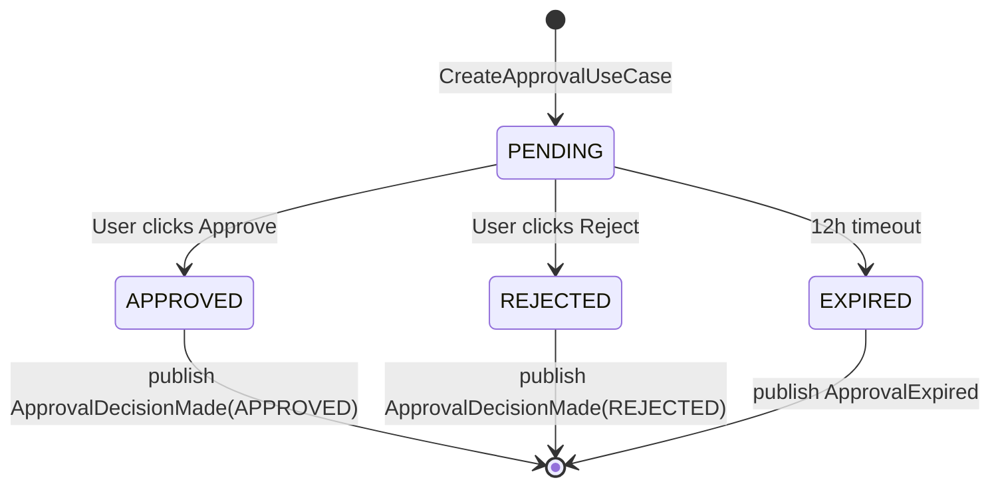

### 7.2 Approval Domain Event Routing

The `approval-module` publishes domain events. It does not know who consumes them. Routing is determined by event type and approval context. For collaborative approvals, the `agent-module` consumes all events and mediates coordination state advances via `CoordinationProtocolPort`. The `coordination-module` never subscribes to approval events directly.

| Event | Approval Type | Consumer | Action Taken |
|---|---|---|---|
| `ApprovalDecisionMade(APPROVED)` | `PERSONAL` | `agent-module` → `PersonalApprovalDecisionHandler` | Creates calendar event via `CalendarPort` |
| `ApprovalDecisionMade(REJECTED)` | `PERSONAL` | `agent-module` → `PersonalApprovalDecisionHandler` | Sends cancellation notification via `NotificationPort` |
| `ApprovalDecisionMade(APPROVED)` | `COLLABORATIVE_INVITEE` | `agent-module` → `CollaborativeApprovalDecisionHandler` | Calls `CoordinationProtocolPort.advance(coordinationId, INVITEE_APPROVED)` |
| `ApprovalDecisionMade(REJECTED)` | `COLLABORATIVE_INVITEE` | `agent-module` → `CollaborativeApprovalDecisionHandler` | Calls `CoordinationProtocolPort.advance(coordinationId, INVITEE_REJECTED)` |
| `ApprovalDecisionMade(APPROVED)` | `COLLABORATIVE_REQUESTER` | `agent-module` → `CollaborativeApprovalDecisionHandler` | Calls `CoordinationProtocolPort.advance(coordinationId, REQUESTER_APPROVED)` |
| `ApprovalDecisionMade(REJECTED)` | `COLLABORATIVE_REQUESTER` | `agent-module` → `CollaborativeApprovalDecisionHandler` | Calls `CoordinationProtocolPort.advance(coordinationId, REQUESTER_REJECTED)` |
| `ApprovalExpired` | `PERSONAL` | `agent-module` → `PersonalApprovalExpiredHandler` | Notifies user of expiration via `NotificationPort` |
| `ApprovalExpired` | `COLLABORATIVE_INVITEE` | `agent-module` → `CollaborativeApprovalExpiredHandler` | Calls `CoordinationProtocolPort.terminate(coordinationId, TIMEOUT)` |
| `ApprovalExpired` | `COLLABORATIVE_REQUESTER` | `agent-module` → `CollaborativeApprovalExpiredHandler` | Calls `CoordinationProtocolPort.terminate(coordinationId, TIMEOUT)` |

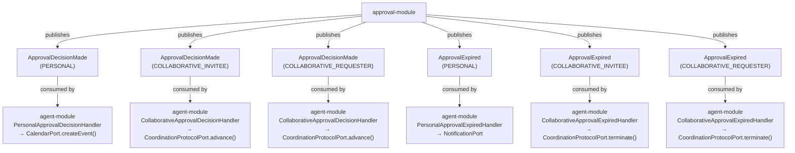

### 7.3 12-Hour Timeout Expiration

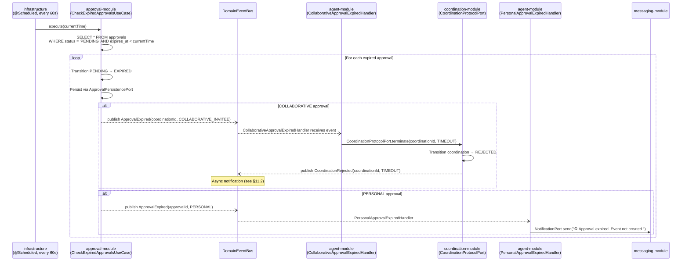

---

## 8. Saga Compensation Scenarios

All saga compensation operations go through agent capability ports. The `coordination-module`'s `CoordinationSaga` instructs agents to perform compensating actions — it never calls `CalendarPort.deleteEvent()` directly. Notifications for all saga failures are delivered asynchronously via `NotificationEventHandler` consuming `CoordinationFailed` domain events (see §11.2).

### 8.1 Total Failure — Agent A Creation Fails

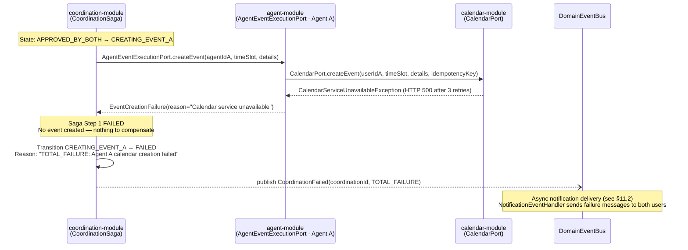

### 8.2 Partial Failure — Agent B Creation Fails, Compensation Succeeds

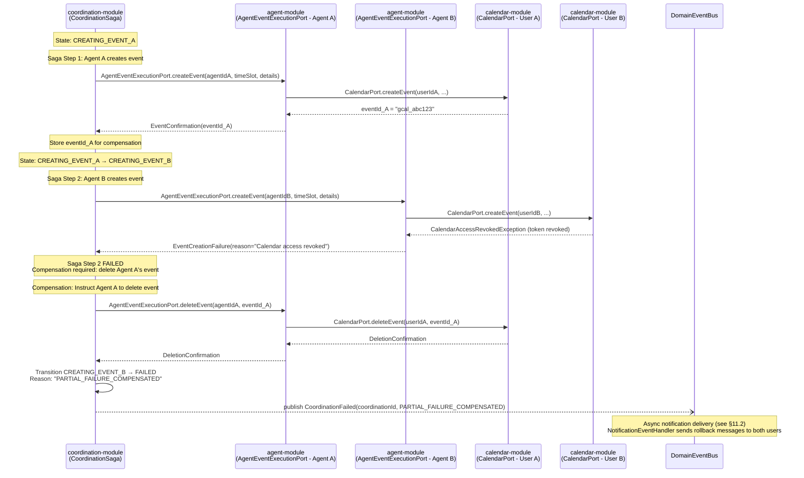

### 8.3 Compensation Failure — Agent A Deletion Fails

This is the worst-case scenario: the saga partially failed and the compensating action also failed, leaving an orphaned event in User A's calendar.

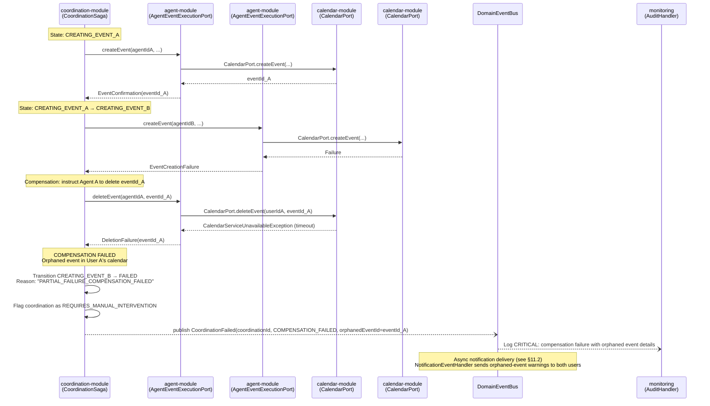

The `REQUIRES_MANUAL_INTERVENTION` flag is stored on the `Coordination` entity and surfaced on the web dashboard. The audit log entry includes the orphaned Google Calendar event ID, the user whose calendar contains it, and the timestamp — enabling manual cleanup.

---

## 9. Error Handling Scenarios

### 9.1 Calendar API Unavailable During Availability Check

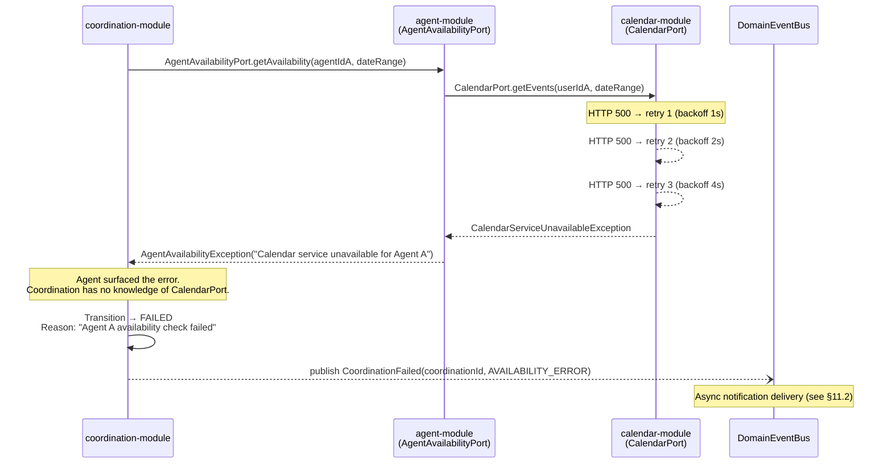

The `coordination-module` receives a domain-level exception from the agent capability port. It has no awareness that the root cause was a Google Calendar HTTP 500 — it only knows the agent could not provide availability. The retry logic (3 attempts with exponential backoff) is encapsulated within the `calendar-module` adapter, invisible to both the `agent-module`'s domain and the `coordination-module`.

### 9.2 LLM Fallback Failure

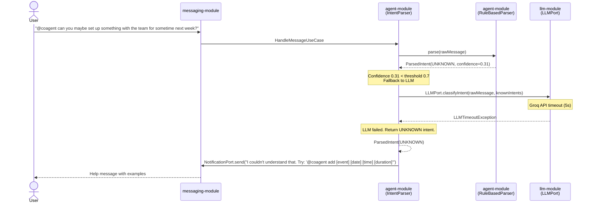

The LLM failure never blocks or breaks the coordination engine. Intent parsing is entirely within the `agent-module`. The `coordination-module` is not involved. The user receives a helpful error message with command examples.

### 9.3 Slack Notification Delivery Failure

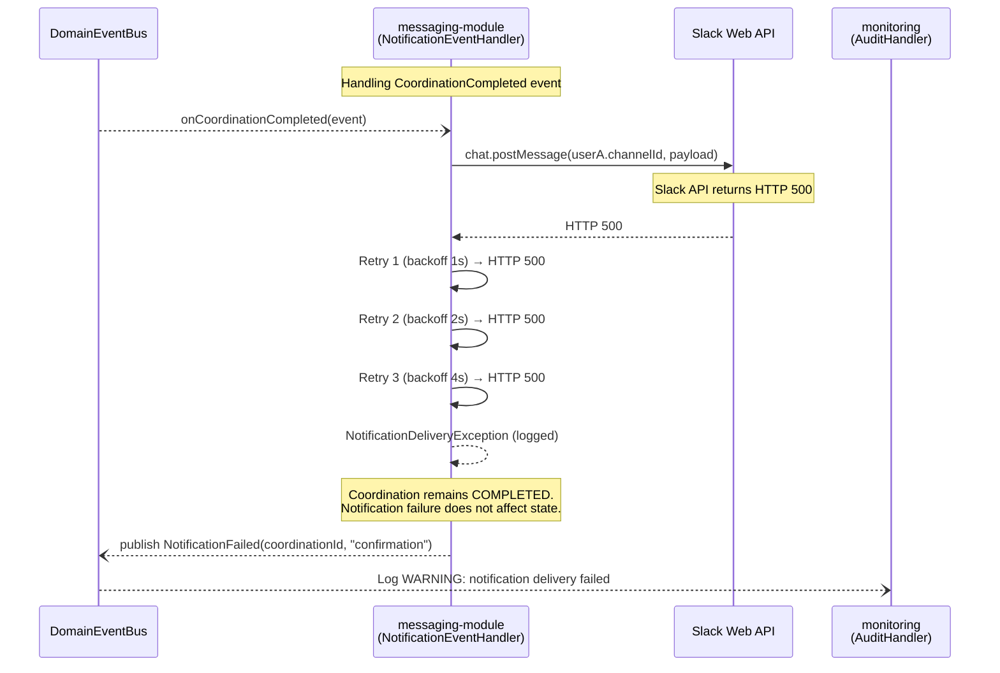

The notification is a side effect. The coordination's terminal state (`COMPLETED`) is already persisted. The calendar events exist in both users' calendars. The failed notification is logged for monitoring and can be retried manually or by a scheduled reconciliation task. Note that `NotificationFailed` is published by the `NotificationEventHandler` in the `messaging-module` — the `coordination-module` is not involved.

### 9.4 Concurrent Approval and Timeout Race Condition

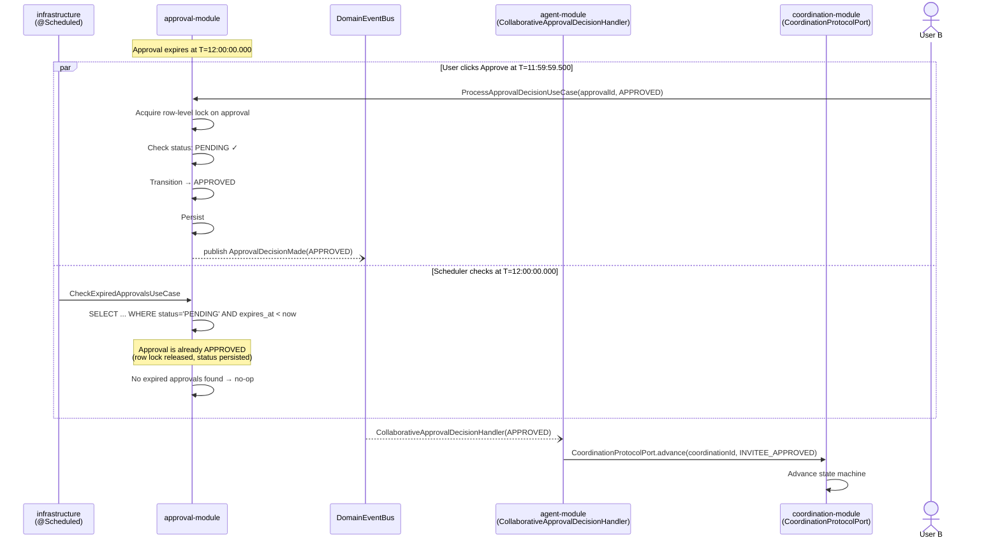

The race condition is resolved by PostgreSQL row-level locking. The `ProcessApprovalDecisionUseCase` acquires a pessimistic write lock on the approval row before checking status. If the scheduler's `CheckExpiredApprovalsUseCase` runs concurrently, it sees the approval as already transitioned (no longer `PENDING`) and skips it. If the scheduler wins the lock first and expires the approval, the user's subsequent approval attempt finds `status=EXPIRED` and is rejected as a no-op (idempotency enforcement). Only one of the two outcomes can occur — never both.

---

## 10. Intent Parsing Runtime Flow

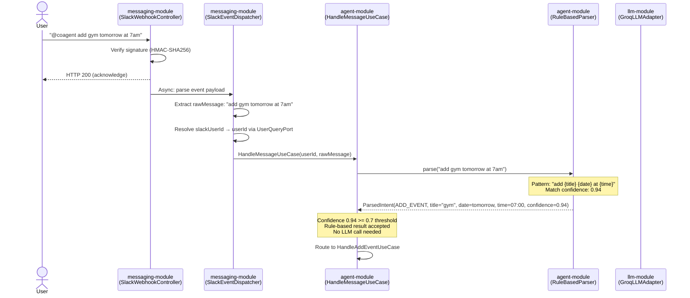

The `SlackEventDispatcher` in the `messaging-module` resolves Slack user IDs to internal user IDs via `UserQueryPort` (read-only). This is an inbound adapter concern — mapping external identities to internal ones before dispatching to core modules.

```mermaid
sequenceDiagram
    actor User
    participant Agent as agent-module<br/>(HandleMessageUseCase)
    participant RBP as agent-module<br/>(RuleBasedParser)
    participant LLM as llm-module<br/>(GroqLLMAdapter)

    User->>Agent: "hey can you maybe block off some time for lunch next tuesday?"

    Agent->>RBP: parse(rawMessage)
    Note over RBP: Partial pattern match<br/>Confidence: 0.42

    RBP-->>Agent: ParsedIntent(ADD_EVENT, confidence=0.42)

    Note over Agent: Confidence 0.42 < 0.7 threshold<br/>Fallback to LLM

    Agent->>LLM: LLMPort.classifyIntent(rawMessage, [ADD_EVENT, CHECK_SCHEDULE, SCHEDULE_MEETING, HELP])
    Note over LLM: Groq API call<br/>Model: llama3-70b<br/>Temperature: 0.1

    LLM-->>Agent: ParsedIntent(ADD_EVENT, title="lunch", date=next tuesday, confidence=0.91)

    Note over Agent: LLM result accepted<br/>Route to HandleAddEventUseCase
```

---

## 11. Asynchronous Side Effect Flows

All flows in this section are asynchronous, non-blocking, and failure-tolerant. They do not affect coordination state machine transitions. `coordination-module` notifications are delivered exclusively through this async pathway — the `coordination-module` never calls `NotificationPort` directly.

### 11.1 Audit Logging

```mermaid
sequenceDiagram
    participant Coord as coordination-module
    participant EventBus as DomainEventBus<br/>(SpringEventPublisherAdapter)
    participant Audit as monitoring<br/>(AuditEventHandler)
    participant DB as persistence<br/>(AuditLogPersistencePort)

    Coord--)EventBus: publish CoordinationStateChanged(coordId, MATCHING → PROPOSAL_GENERATED, reason)

    Note over EventBus: Async dispatch (@Async)

    EventBus--)Audit: onCoordinationStateChanged(event)

    Audit->>DB: AuditLogPersistencePort.append({<br/>  logId: UUID,<br/>  userId: null,<br/>  agentId: null,<br/>  actionType: "COORDINATION_STATE_CHANGE",<br/>  actionDetails: {coordId, from, to, reason},<br/>  timestamp: event.timestamp,<br/>  correlationId: event.correlationId<br/>})

    Audit->>DB: CoordinationPersistencePort.appendStateLog({<br/>  coordId, from=MATCHING, to=PROPOSAL_GENERATED,<br/>  reason="1 overlapping slot found", timestamp<br/>})
```

Audit logging is append-only and immutable. Both the `audit_logs` and `coordination_state_log` tables receive entries for every coordination state transition. The audit handler runs in its own transaction — if it fails, the coordination state is unaffected.

### 11.2 Notification Delivery

This is the exclusive pathway for `coordination-module` notifications. The `coordination-module` publishes domain events (`CoordinationCompleted`, `CoordinationFailed`, `CoordinationRejected`); the `messaging-module`'s `NotificationEventHandler` consumes them and delivers Slack messages.

```mermaid
sequenceDiagram
    participant Coord as coordination-module
    participant EventBus as DomainEventBus
    participant NotifHandler as messaging-module<br/>(NotificationEventHandler)
    participant Formatter as messaging-module<br/>(SlackBlockKitFormatter)
    participant SlackAPI as Slack Web API

    Coord--)EventBus: publish CoordinationCompleted(coordId, eventIdA, eventIdB)

    EventBus--)NotifHandler: onCoordinationCompleted(event)

    NotifHandler->>Formatter: formatCompletionMessage(proposal, participants)
    Formatter-->>NotifHandler: Block Kit JSON payload

    NotifHandler->>SlackAPI: chat.postMessage(userA.channelId, payload)
    SlackAPI-->>NotifHandler: ok

    NotifHandler->>SlackAPI: chat.postMessage(userB.channelId, payload)
    SlackAPI-->>NotifHandler: ok
```

```mermaid
sequenceDiagram
    participant Coord as coordination-module
    participant EventBus as DomainEventBus
    participant NotifHandler as messaging-module<br/>(NotificationEventHandler)
    participant Formatter as messaging-module<br/>(SlackBlockKitFormatter)
    participant SlackAPI as Slack Web API

    Coord--)EventBus: publish CoordinationFailed(coordId, PARTIAL_FAILURE_COMPENSATED)

    EventBus--)NotifHandler: onCoordinationFailed(event)

    NotifHandler->>Formatter: formatFailureMessage(reason, participants)
    Formatter-->>NotifHandler: Block Kit JSON payload

    NotifHandler->>SlackAPI: chat.postMessage(userA.channelId, payload)
    SlackAPI-->>NotifHandler: ok

    NotifHandler->>SlackAPI: chat.postMessage(userB.channelId, payload)
    SlackAPI-->>NotifHandler: ok
```

The `NotificationEventHandler` handles all coordination lifecycle events: `CoordinationCompleted` produces confirmation messages ("✅ Meeting confirmed"), `CoordinationFailed` produces failure messages ("❌ Meeting could not be created") with reason-specific details, and `CoordinationRejected` produces rejection messages ("📅 Meeting request was declined" or "⏰ Approval timed out"). The handler resolves user Slack channel IDs and formats messages using Block Kit. If delivery fails after retries, the handler publishes a `NotificationFailed` event for audit logging (see §9.3).

### 11.3 Metrics Emission

```mermaid
sequenceDiagram
    participant Coord as coordination-module
    participant EventBus as DomainEventBus
    participant Metrics as monitoring<br/>(MetricsEventHandler)
    participant Micrometer as Micrometer Registry

    Coord--)EventBus: publish CoordinationCompleted(coordId, duration=47s)

    EventBus--)Metrics: onCoordinationCompleted(event)

    Metrics->>Micrometer: counter("coordination.completed").increment()
    Metrics->>Micrometer: timer("coordination.duration").record(47, SECONDS)
    Metrics->>Micrometer: counter("saga.success").increment()
```

| Metric | Type | Description |
|---|---|---|
| `coordination.completed` | Counter | Total successful coordinations |
| `coordination.failed` | Counter | Total failed coordinations (by reason tag) |
| `coordination.rejected` | Counter | Total rejected coordinations (by approval stage) |
| `coordination.duration` | Timer | End-to-end coordination duration (`INITIATED` → terminal state) |
| `saga.success` | Counter | Successful saga completions |
| `saga.partial_failure` | Counter | Sagas requiring compensation |
| `saga.compensation_failure` | Counter | Sagas where compensation also failed (CRITICAL) |
| `approval.response_time` | Timer | Time from approval creation to user decision |
| `approval.timeout` | Counter | Approvals expired by 12h timeout |
| `intent.rule_based_hit` | Counter | Intents resolved by rule-based parser (no LLM) |
| `intent.llm_fallback` | Counter | Intents requiring LLM fallback |
| `intent.llm_failure` | Counter | LLM fallback failures |
| `agent.availability_latency` | Timer | Agent availability port response time |
| `agent.event_execution_latency` | Timer | Agent event creation/deletion response time |

---

*End of 06-runtime-view.md*
