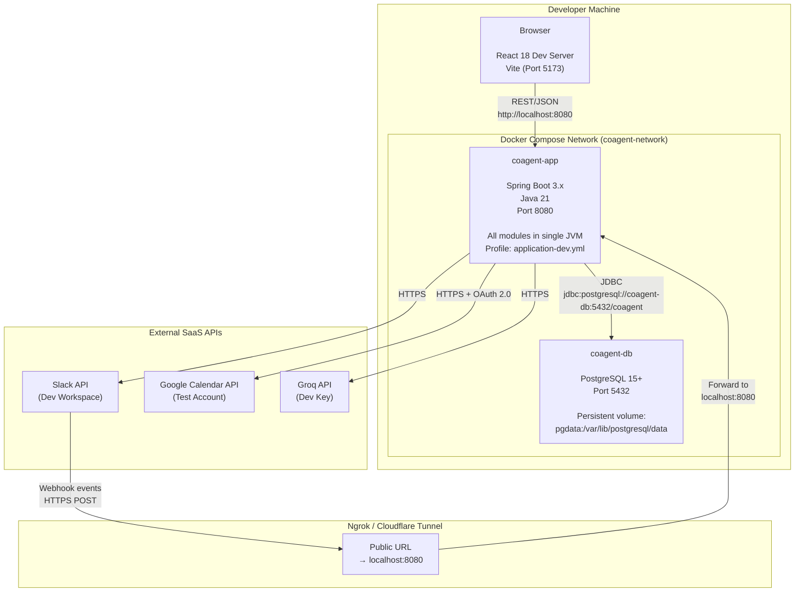
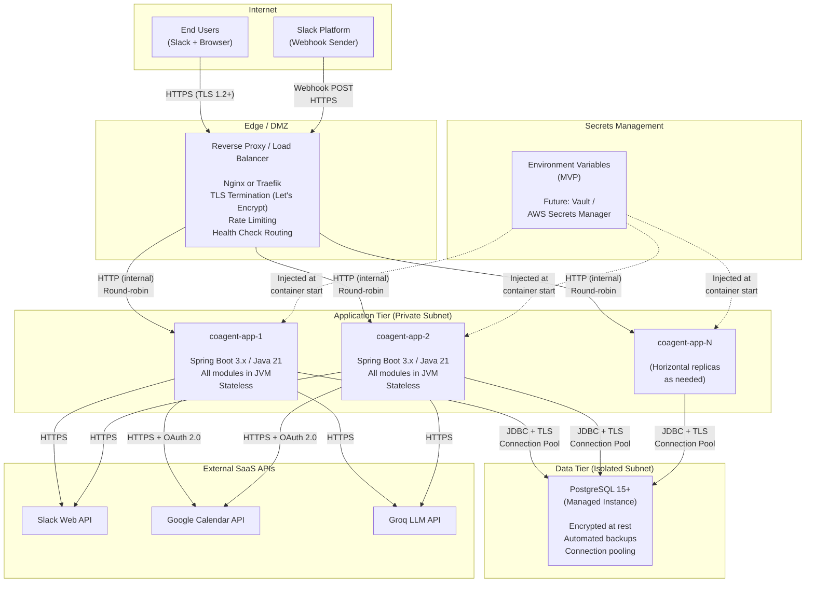
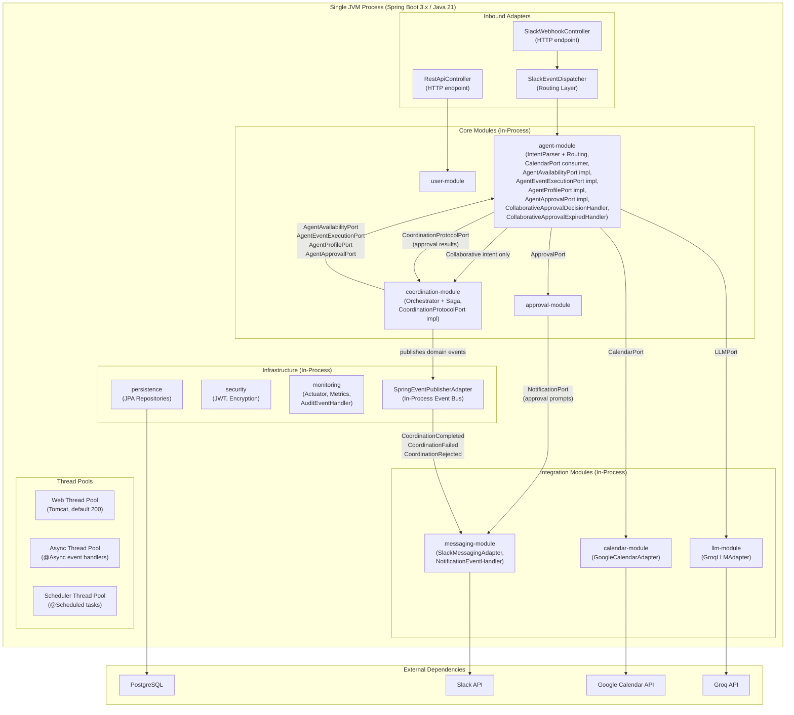
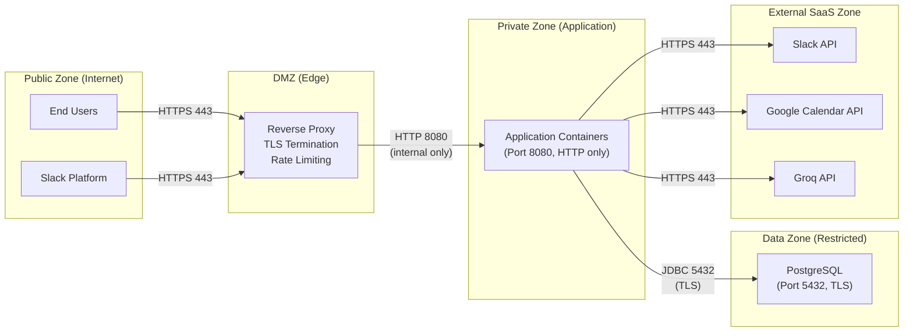
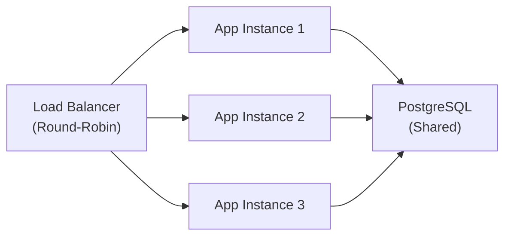
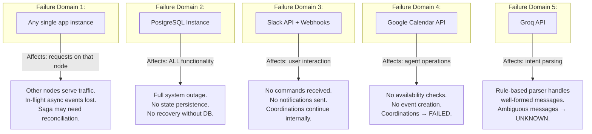

# 07 — Deployment View

## Table of Contents

- [1. Overview](#1-overview)
- [2. Deployment Topology — Development Environment](#2-deployment-topology--development-environment)
  - [2.1 Development Architecture Diagram](#21-development-architecture-diagram)
  - [2.2 Development Networking Model](#22-development-networking-model)
  - [2.3 Development Configuration](#23-development-configuration)
- [3. Deployment Topology — Production Environment](#3-deployment-topology--production-environment)
  - [3.1 Production Architecture Diagram](#31-production-architecture-diagram)
  - [3.2 Production Component Descriptions](#32-production-component-descriptions)
  - [3.3 TLS and Certificate Management](#33-tls-and-certificate-management)
  - [3.4 Secrets Injection](#34-secrets-injection)
  - [3.5 Health Checks and Readiness](#35-health-checks-and-readiness)
- [4. Runtime Node Breakdown](#4-runtime-node-breakdown)
  - [4.1 Application Node Internals](#41-application-node-internals)
  - [4.2 In-Process Domain Event Bus](#42-in-process-domain-event-bus)
  - [4.3 Saga Execution Model](#43-saga-execution-model)
  - [4.4 Statelessness Guarantee](#44-statelessness-guarantee)
- [5. Infrastructure Boundaries](#5-infrastructure-boundaries)
  - [5.1 Security Zones](#51-security-zones)
  - [5.2 Network Segregation](#52-network-segregation)
  - [5.3 Database Isolation](#53-database-isolation)
  - [5.4 Credential and Token Security](#54-credential-and-token-security)
  - [5.5 Inbound Request Validation](#55-inbound-request-validation)
- [6. Scaling Strategy](#6-scaling-strategy)
  - [6.1 Horizontal Application Scaling](#61-horizontal-application-scaling)
  - [6.2 Database Scaling](#62-database-scaling)
  - [6.3 Determinism Under Horizontal Scaling](#63-determinism-under-horizontal-scaling)
  - [6.4 Session Affinity](#64-session-affinity)
- [7. Failure Domains](#7-failure-domains)
  - [7.1 Failure Domain Map](#71-failure-domain-map)
  - [7.2 Application Node Failure](#72-application-node-failure)
  - [7.3 Database Failure](#73-database-failure)
  - [7.4 Slack Platform Outage](#74-slack-platform-outage)
  - [7.5 Google Calendar API Outage](#75-google-calendar-api-outage)
  - [7.6 Groq LLM API Outage](#76-groq-llm-api-outage)
  - [7.7 Graceful Degradation Summary](#77-graceful-degradation-summary)
- [8. Deployment Constraints](#8-deployment-constraints)
  - [8.1 Constraint Summary](#81-constraint-summary)
  - [8.2 Cloud Portability](#82-cloud-portability)
  - [8.3 Future Extraction Readiness](#83-future-extraction-readiness)
- [9. CI/CD Pipeline](#9-cicd-pipeline)
  - [9.1 Pipeline Stages](#91-pipeline-stages)
  - [9.2 Pipeline Diagram](#92-pipeline-diagram)
  - [9.3 Environment Promotion](#93-environment-promotion)

---

## 1. Overview

This section documents how the CoAgent4U Modular Monolith is deployed across development and production environments. It maps the logical building blocks described in `05-building-block-view.md` and the runtime interactions documented in `06-runtime-view.md` onto physical infrastructure nodes, containers, and network boundaries.

CoAgent4U is deployed as a single Spring Boot application packaged in a Docker container. All core modules (`user-module`, `agent-module`, `coordination-module`, `approval-module`), all integration modules (`calendar-module`, `messaging-module`, `llm-module`), and all infrastructure modules (persistence, security, config, monitoring) run within a single JVM process. There is no distributed coordination, no external message broker, and no service mesh. The domain event bus is in-process. The saga does not span a single long-running database transaction. Each step persists the coordination state in its own transaction before proceeding to the next external call. This simplicity is a deliberate architectural choice driven by the founding team constraint (OC-01) and budget minimization (OC-03), while the internal module structure preserves extraction readiness for future scaling needs.

The deployment view covers the development environment (Docker Compose on the developer's machine), the production environment (cloud-agnostic containerized deployment behind a reverse proxy), scaling strategy, failure domains, infrastructure security boundaries, and the CI/CD pipeline.

---

## 2. Deployment Topology — Development Environment

### 2.1 Development Architecture Diagram



### 2.2 Development Networking Model

All containers run on a single Docker Compose bridge network named `coagent-network`. The Spring Boot application resolves the PostgreSQL host by container name (`coagent-db`), eliminating the need for IP configuration. The React development server runs outside Docker Compose on the host machine using Vite's built-in dev server (port 5173) and proxies API calls to `localhost:8080`.

Slack requires a publicly accessible URL for webhook delivery. During development, an ingress tunnel (ngrok or Cloudflare Tunnel) exposes the local application's Slack webhook endpoints to the internet. This tunnel is used exclusively for Slack webhook reception — all other external API calls (Google Calendar, Groq) are outbound HTTPS calls initiated by the application.

### 2.3 Development Configuration

| Configuration | Value | Source |
|---|---|---|
| Spring Profile | `dev` | `application-dev.yml` |
| Database URL | `jdbc:postgresql://coagent-db:5432/coagent` | Docker Compose service name |
| Database Credentials | `coagent_dev / coagent_dev_pass` | `docker-compose.yml` environment |
| Slack Signing Secret | Dev workspace secret | `.env` file (gitignored) |
| Google OAuth Client | Test project credentials | `.env` file |
| Groq API Key | Dev tier key | `.env` file |
| JWT Signing Key | Random dev key | `.env` file |
| AES Encryption Key | Random dev key | `.env` file |
| Log Level | `DEBUG` | `application-dev.yml` |
| Flyway | Auto-migrate on startup | `spring.flyway.enabled=true` |
| Actuator | All endpoints exposed | `management.endpoints.web.exposure.include=*` |

The `docker-compose.yml` file defines the complete development stack:

```yaml
# docker-compose.yml (structure reference)
version: "3.9"
services:
  coagent-app:
    build: .
    ports:
      - "8080:8080"
    environment:
      - SPRING_PROFILES_ACTIVE=dev
      - DATABASE_URL=jdbc:postgresql://coagent-db:5432/coagent
      - DATABASE_USERNAME=coagent_dev
      - DATABASE_PASSWORD=coagent_dev_pass
    env_file:
      - .env
    depends_on:
      coagent-db:
        condition: service_healthy
    networks:
      - coagent-network

  coagent-db:
    image: postgres:15-alpine
    ports:
      - "5432:5432"
    environment:
      - POSTGRES_DB=coagent
      - POSTGRES_USER=coagent_dev
      - POSTGRES_PASSWORD=coagent_dev_pass
    volumes:
      - pgdata:/var/lib/postgresql/data
    healthcheck:
      test: ["CMD-SHELL", "pg_isready -U coagent_dev"]
      interval: 5s
      timeout: 5s
      retries: 5
    networks:
      - coagent-network

volumes:
  pgdata:

networks:
  coagent-network:
    driver: bridge
```

---

## 3. Deployment Topology — Production Environment

### 3.1 Production Architecture Diagram



### 3.2 Production Component Descriptions

| Component | Role | Configuration |
|---|---|---|
| Reverse Proxy / Load Balancer | TLS termination, request routing, health-check-based failover, basic rate limiting at the edge | Nginx or Traefik. Terminates TLS using Let's Encrypt certificates. Routes `/api/**` and `/slack/**` to the application tier. Serves static React assets from a CDN or directly. Performs HTTP health checks against `/actuator/health` on each app node. |
| Application Containers (N replicas) | Run the full Modular Monolith. Each instance is identical and stateless. | Spring Boot 3.x on Java 21. Profile: `application-prod.yml`. All secrets injected via environment variables. Connection pool: HikariCP with max 10 connections per instance. Each instance runs its own in-process domain event bus — events are local to the JVM. |
| PostgreSQL (Managed) | Primary data store for all modules. Single database, schema-per-module ownership. | PostgreSQL 15+. Encrypted at rest (provider-managed). Automated daily backups with 7-day retention. Connection limit sized to total app instances × pool size. |
| External SaaS APIs | Slack, Google Calendar, Groq. Accessed over HTTPS from the application tier. | No inbound access required from SaaS to app tier except Slack webhooks (routed through load balancer). All outbound calls use Spring WebClient with timeouts, retries, and circuit breakers. |

### 3.3 TLS and Certificate Management

All external communication uses TLS 1.2 or higher. TLS termination occurs at the reverse proxy layer. Internal communication between the reverse proxy and application containers runs over HTTP within the private subnet — this is acceptable because the private subnet is not exposed to the public internet and all nodes are under the same trust boundary. If the deployment environment requires end-to-end encryption (e.g., compliance requirements), TLS can be enabled on the Spring Boot instances using a JKS keystore, with certificates injected as mounted secrets.

The JDBC connection between the application tier and the PostgreSQL instance uses TLS when the managed database provider supports it (which all major providers do). The connection string includes `sslmode=require`.

### 3.4 Secrets Injection

For the MVP, all secrets are injected via environment variables at container startup. The following secrets are required per application instance:

| Secret | Purpose | Rotation Policy |
|---|---|---|
| `DATABASE_URL` | PostgreSQL connection string | On credential rotation |
| `DATABASE_USERNAME` | PostgreSQL username | On credential rotation |
| `DATABASE_PASSWORD` | PostgreSQL password | On credential rotation |
| `SLACK_SIGNING_SECRET` | Slack webhook signature verification | On Slack app reinstallation |
| `SLACK_BOT_TOKEN` | Slack Web API authentication | On Slack app reinstallation |
| `GOOGLE_CLIENT_ID` | Google OAuth 2.0 client identifier | On Google project reconfiguration |
| `GOOGLE_CLIENT_SECRET` | Google OAuth 2.0 client secret | On Google project reconfiguration |
| `GROQ_API_KEY` | Groq API authentication | On key rotation |
| `JWT_SIGNING_KEY` | JWT token signing (HS256) | Quarterly rotation |
| `AES_ENCRYPTION_KEY` | AES-256-GCM encryption for OAuth tokens at rest | On rotation (requires re-encryption migration) |

The architecture accommodates future migration to a dedicated secrets management service (HashiCorp Vault, AWS Secrets Manager) by replacing the environment variable injection with a secrets adapter. The config infrastructure module abstracts secret resolution — application code references configuration properties, not environment variables directly.

### 3.5 Health Checks and Readiness

Each application instance exposes Spring Boot Actuator endpoints for health monitoring.

| Endpoint | Purpose | Used By |
|---|---|---|
| `/actuator/health` | Liveness probe — confirms JVM is running and responsive | Load balancer, orchestrator |
| `/actuator/health/readiness` | Readiness probe — confirms database connectivity and Flyway migration completion | Load balancer (routing decisions) |
| `/actuator/health/liveness` | Liveness probe — confirms application thread pool is not deadlocked | Orchestrator (restart decisions) |
| `/actuator/metrics` | Micrometer metrics endpoint | Monitoring infrastructure |
| `/actuator/info` | Application version, git commit, build timestamp | Operational dashboards |

Custom health indicators are registered for external dependencies:

| Health Indicator | Checks | Failure Impact |
|---|---|---|
| `PostgresHealthIndicator` | Database connection pool status and simple query execution | `DOWN` → instance removed from load balancer rotation |
| `SlackHealthIndicator` | Slack API `auth.test` endpoint (lightweight ping) | `DEGRADED` → instance still serves traffic but Slack features flagged |
| `GoogleCalendarHealthIndicator` | Google Calendar API availability (lightweight discovery call) | `DEGRADED` → coordination requests return "calendar temporarily unavailable" |

---

## 4. Runtime Node Breakdown

### 4.1 Application Node Internals

Each application container runs a single JVM hosting the complete Modular Monolith. The following diagram shows the internal runtime structure of one application node, mapping the building blocks from `05-building-block-view.md` onto the JVM process.

`SlackWebhookController` never calls `coordination-module` directly. All user intents are first routed to `agent-module`, which performs intent parsing and delegates to `coordination-module` only when a collaborative scheduling intent is detected. The `coordination-module` never calls `ApprovalPort`, `NotificationPort`, or `CalendarPort` directly — all user-scoped operations are mediated through agent capability ports (`AgentAvailabilityPort`, `AgentEventExecutionPort`, `AgentProfilePort`, `AgentApprovalPort`), and approval results reach coordination exclusively via agents calling `CoordinationProtocolPort`.



### 4.2 In-Process Domain Event Bus

The domain event bus is implemented using Spring's `ApplicationEventPublisher`, wrapped by the `SpringEventPublisherAdapter` that implements the `DomainEventPublisher` port from `common-domain`. All event publication and consumption occurs within the same JVM process. There is no external message broker.

Events published by one module are dispatched to subscribed `@EventListener` methods in other modules within the same JVM. Asynchronous event handlers use the `@Async` annotation and execute on a dedicated thread pool (`async-event-pool`, configurable size, default 4 threads). If the application node crashes, in-flight async events are lost — this is acceptable because async events are side effects (notifications, audit, metrics) and do not affect coordination state. The coordination state machine transitions are persisted synchronously before any event is published.

The event bus carries several categories of domain events. Coordination lifecycle events (`CoordinationCompleted`, `CoordinationFailed`, `CoordinationRejected`, `CoordinationStateChanged`) are published by the `coordination-module` and consumed by `NotificationEventHandler` (`messaging-module`), `AuditEventHandler` (monitoring), and `MetricsEventHandler` (monitoring). Approval lifecycle events (`ApprovalDecisionMade`, `ApprovalExpired`) are published by the `approval-module` and consumed by `agent-module` handlers (`PersonalApprovalDecisionHandler`, `CollaborativeApprovalDecisionHandler`, `PersonalApprovalExpiredHandler`, `CollaborativeApprovalExpiredHandler`). For collaborative approvals, the `agent-module` handlers translate approval events into `CoordinationProtocolPort` calls, which advance the coordination state machine synchronously.

Implication for horizontal scaling: Each application instance has its own independent event bus. An event published in Instance 1 is not visible to Instance 2. This is correct for the CoAgent4U architecture because events are local side effects of a request that completed on a specific instance. There is no cross-instance event coordination requirement. The database is the sole source of truth for state. The only event flow that triggers a state-affecting action — approval events consumed by agents that call `CoordinationProtocolPort` — always originates on the same instance that processed the approval callback, so cross-instance visibility is not required.

### 4.3 Saga Execution Model

The `CoordinationSaga` executes entirely within a single application node. The saga is triggered when the coordination state machine reaches `APPROVED_BY_BOTH` (driven by an agent calling `CoordinationProtocolPort.advance(coordinationId, REQUESTER_APPROVED)`). It executes the following steps synchronously and sequentially on the thread handling the `CoordinationProtocolPort` call:

**Step 1:** Transition to `CREATING_EVENT_A`, persist. Call `AgentEventExecutionPort.createEvent(agentA, ...)` — agent internally calls `CalendarPort` → Google Calendar API.

**Step 2:** If successful, store `eventId_A` in the coordination entity, transition to `CREATING_EVENT_B`, persist. Call `AgentEventExecutionPort.createEvent(agentB, ...)`.

**Step 3a:** If successful, store `eventId_B`, transition to `COMPLETED`, persist, publish `CoordinationCompleted`.

**Step 3b:** If failed, call `AgentEventExecutionPort.deleteEvent(agentA, eventId_A)` for compensation, transition to `FAILED`, persist, publish `CoordinationFailed`.

The saga uses intermediate states (`CREATING_EVENT_A`, `CREATING_EVENT_B`) to provide observable progress for crash recovery. Each step persists the coordination entity with the current state and accumulated event IDs within a single transaction before proceeding to the next external call. This means that if the application crashes between Step 1 and Step 2, the coordination is persisted in state `CREATING_EVENT_A` with `eventId_A`. On recovery, a scheduled reconciliation task can detect coordinations stuck in intermediate saga states and initiate compensation.

### 4.4 Statelessness Guarantee

Application nodes are stateless. All durable state resides in PostgreSQL. The following table enumerates what is and is not stored in the application node's memory:

| Data | Location | Survives Node Restart? |
|---|---|---|
| Coordination state | PostgreSQL (`coordinations` table) | ✅ Yes |
| Approval status | PostgreSQL (`approvals` table) | ✅ Yes |
| Audit logs | PostgreSQL (`audit_logs`, `coordination_state_log`) | ✅ Yes |
| User profiles, agent state | PostgreSQL | ✅ Yes |
| OAuth tokens (encrypted) | PostgreSQL (`service_connections`) | ✅ Yes |
| Caffeine cache entries | JVM heap | ❌ No (rebuilt on demand) |
| In-flight async events | JVM thread pool | ❌ No (acceptable loss — side effects only) |
| Active WebClient connections | JVM network stack | ❌ No (re-established on demand) |

---

## 5. Infrastructure Boundaries

### 5.1 Security Zones



### 5.2 Network Segregation

| Zone | Ingress Rules | Egress Rules |
|---|---|---|
| Public (Internet) | Unrestricted inbound to DMZ on port 443 | — |
| DMZ (Reverse Proxy) | Port 443 from Internet | Port 8080 to Application Zone only |
| Application Zone | Port 8080 from DMZ only | Port 5432 to Data Zone. Port 443 to External SaaS. No direct internet access except HTTPS to known API endpoints. |
| Data Zone | Port 5432 from Application Zone only. No public access. No DMZ access. | No egress (PostgreSQL does not initiate outbound connections). |

### 5.3 Database Isolation

The PostgreSQL instance is not accessible from the public internet or the DMZ. Only application containers within the private application zone can establish JDBC connections. Database credentials are injected via environment variables and never logged or exposed through API responses. Connection pooling (HikariCP) limits the total connection count per application instance, preventing connection exhaustion under load.

Each core module owns its tables exclusively as defined in `05-building-block-view.md`. Repository implementations do not perform cross-module JOIN queries. Foreign keys exist for referential integrity but do not imply cross-module query access. This table ownership model means that if a module is extracted into a separate service in the future, its tables can be migrated to a dedicated database without schema entanglement.

### 5.4 Credential and Token Security

OAuth tokens (Google Calendar access tokens and refresh tokens) are encrypted using AES-256-GCM before storage in PostgreSQL. The encryption key is injected via the `AES_ENCRYPTION_KEY` environment variable. The `AesEncryptionService` (implementing `EncryptionPort`) handles encryption and decryption. The `agent-module` requests decryption when it needs to make a `CalendarPort` call — the decrypted token exists only in JVM memory for the duration of the API call and is never persisted in plaintext.

The JWT signing key is similarly injected via environment variable. JWT tokens are short-lived (24 hours), contain only `sub` (userId) and `username` claims, and are stored in Secure HttpOnly cookies with `SameSite=Strict` policy.

### 5.5 Inbound Request Validation

Every inbound request is validated before reaching the application layer:

| Entry Point | Validation | Enforcement Location |
|---|---|---|
| Slack webhooks | HMAC-SHA256 signature verification using `SLACK_SIGNING_SECRET` | `SlackSignatureVerifier` in security module, called by `SlackWebhookController` |
| Slack interactive callbacks | Same signature verification | Same as above |
| REST API (dashboard) | JWT token validation from Secure HttpOnly cookie | Spring Security filter chain |
| REST API (GDPR exports) | JWT + user-scoped authorization (user can only export own data) | Application-layer authorization in use case |
| Actuator endpoints | Restricted to internal network (no public exposure) | Reverse proxy configuration |

---

## 6. Scaling Strategy

### 6.1 Horizontal Application Scaling

Application nodes are stateless and identical. Horizontal scaling is achieved by adding more container replicas behind the load balancer. Each new instance connects to the same PostgreSQL database, runs the same Flyway migrations (idempotent — already-applied migrations are skipped), and begins accepting traffic once the readiness probe passes.



The load balancer distributes requests using round-robin. No session affinity is required (see §6.4). Each Slack webhook, REST API call, or interactive callback can be handled by any instance.

### 6.2 Database Scaling

PostgreSQL scales vertically for the MVP and early growth phase. The expected data volume for the MVP (hundreds of users, thousands of coordinations per month) is well within the capacity of a single PostgreSQL instance with modest hardware. The index strategy defined in `05-building-block-view.md` ensures query performance for the common access patterns: lookup by `userId`, `agentId`, `coordinationId`, and approval status.

If read throughput becomes a bottleneck in the future, read replicas can be added behind the persistence adapters without changing domain or application code — the `PersistencePort` implementations can be configured to route read queries to replicas and write queries to the primary.

### 6.3 Determinism Under Horizontal Scaling

The coordination state machine remains deterministic under horizontal scaling because state transitions are serialized through PostgreSQL. When a coordination reaches `AWAITING_APPROVAL_B` and an approval decision arrives, the Slack interactive callback is handled by whichever application instance receives it from the load balancer. That instance's `approval-module` processes the decision and publishes `ApprovalDecisionMade`. The `agent-module`'s `CollaborativeApprovalDecisionHandler` on the same instance consumes the in-process event and calls `CoordinationProtocolPort.advance()`. The `coordination-module` loads the coordination entity from PostgreSQL, acquires a row-level lock (pessimistic write), validates the state transition, persists the new state, and releases the lock. If two instances somehow attempt to advance the same coordination concurrently (e.g., approval callback on one instance and timeout scheduler on another), the row-level lock ensures only one succeeds — the other receives a stale state and is rejected by the state machine's guard condition.

The 12-hour approval timeout is handled by a `@Scheduled` task that runs on every application instance. To prevent duplicate timeout processing across instances, the `CheckExpiredApprovalsUseCase` uses a `SELECT ... FOR UPDATE SKIP LOCKED` query pattern. Each instance claims a batch of expired approvals exclusively — if another instance has already locked an approval, it is skipped. This ensures exactly-once timeout processing without requiring distributed locks or leader election. The expired approval event is consumed locally by the `agent-module`'s `CollaborativeApprovalExpiredHandler`, which calls `CoordinationProtocolPort.terminate()` to transition the coordination to `REJECTED`.

### 6.4 Session Affinity

No session affinity (sticky sessions) is required. The reasons are as follows. JWT authentication is stateless — the token contains all claims and is verified independently by every instance. The coordination state machine is database-backed — any instance can load, transition, and persist coordination state. The Caffeine cache is a performance optimization, not a correctness requirement — cache misses simply result in a database query. The in-process event bus is per-instance, but this is correct because events are side effects of a request already completed on that instance. The approval-to-coordination flow (approval event → agent handler → `CoordinationProtocolPort`) completes entirely within the instance that received the approval callback, so no cross-instance event visibility is needed.

---

## 7. Failure Domains

### 7.1 Failure Domain Map



### 7.2 Application Node Failure

If a single application node crashes, the load balancer detects the failure via health check (default: 3 consecutive failures at 10-second intervals) and removes the node from rotation. All subsequent requests are routed to healthy nodes. In-flight async events on the crashed node (notifications, audit writes) are lost. The coordination state, however, was persisted to PostgreSQL before the event was published, so no coordination state is lost.

If the crash occurs during a saga execution (between creating the event in Agent A's calendar and Agent B's calendar), the coordination entity is persisted with the intermediate saga state (`CREATING_EVENT_A` with `eventId_A`, or `CREATING_EVENT_B` with both event details). A scheduled reconciliation task runs every 5 minutes, identifies coordinations stuck in intermediate saga states (`CREATING_EVENT_A` or `CREATING_EVENT_B`) for longer than a configurable threshold (default: 2 minutes), and initiates compensation by instructing the appropriate agent to delete the orphaned event via `AgentEventExecutionPort.deleteEvent()`.

### 7.3 Database Failure

PostgreSQL failure is a total system outage. No requests can be processed because all state reads and writes depend on the database. The application nodes will report `DOWN` on their readiness probes, causing the load balancer to return `503` to all incoming requests. Slack webhooks will be retried by Slack (up to 3 times with increasing backoff) — if the database recovers within Slack's retry window, the events will be processed. If not, the Slack events are lost and the user must re-issue their command.

Mitigation is through managed PostgreSQL with automated backups, failover replicas (if supported by the provider), and monitoring alerts on connection pool exhaustion and query latency.

### 7.4 Slack Platform Outage

If Slack is down, no new user commands arrive (the user cannot send messages). Outbound notifications (approval prompts, confirmations) fail and are retried by the `messaging-module`'s `NotificationEventHandler` retry logic (3 attempts with exponential backoff). If all retries fail, the notification failure is logged via a `NotificationFailed` domain event and the coordination state machine is unaffected — the coordination can be `COMPLETED` even if the confirmation message has not been delivered. The user will see the result when Slack recovers and they check their pending messages or the web dashboard.

Active coordinations in the `AWAITING_APPROVAL_*` states will continue waiting. The 12-hour timeout mechanism operates independently of Slack availability.

### 7.5 Google Calendar API Outage

If the Google Calendar API is unavailable, the `agent-module`'s internal delegation to `CalendarPort` will fail after retries. The agent surfaces this as a domain-level exception to the `coordination-module` via the agent capability port. The `coordination-module` transitions to `FAILED` with reason "Agent availability check failed" or "Agent event creation failed" and publishes a `CoordinationFailed` domain event. Both users are notified asynchronously via the `NotificationEventHandler` (if Slack is available).

Personal scheduling operations also fail — the agent cannot check conflicts or create events. The user receives an error message suggesting they try again later.

### 7.6 Groq LLM API Outage

If the Groq API is unavailable, the two-tier intent parsing strategy degrades gracefully. The rule-based parser handles all well-formed messages (the majority of inputs). Only messages where the rule-based parser's confidence falls below threshold will be affected — these will receive an `UNKNOWN` intent classification and the user will be prompted to rephrase their message using a more structured format. No coordination logic is affected because the LLM is never in the coordination path.

### 7.7 Graceful Degradation Summary

| Failure | Impact | Degradation | Recovery |
|---|---|---|---|
| Single app node crash | Requests on that node fail | Other nodes serve traffic. Saga reconciliation recovers orphaned states. | Auto-restart by orchestrator. Health check re-adds to rotation. |
| PostgreSQL down | Full outage | 503 on all requests. Slack retries buffer. | Restore from failover or backup. Slack retries deliver queued events. |
| Slack outage | No user commands or notifications | Coordinations continue internally. Dashboard remains functional. | Slack recovery. Failed notifications logged for manual review. |
| Google Calendar outage | No availability or event operations | Active coordinations → FAILED. Personal scheduling unavailable. | Users retry. Coordination can be re-initiated. |
| Groq API outage | Ambiguous messages unclassifiable | Rule-based parser handles structured messages. Ambiguous → UNKNOWN. | Groq recovery. No coordination impact. |

---

## 8. Deployment Constraints

### 8.1 Constraint Summary

| Constraint | Description | Source |
|---|---|---|
| Modular Monolith | The system is deployed as a single Docker container. No microservices, no service mesh, no distributed coordination. | TC-16, OC-01 |
| Single Database | One PostgreSQL instance shared by all modules. Each module owns its tables exclusively. | TC-04, OC-03 |
| No External Message Broker | Domain events are in-process (Spring `ApplicationEventPublisher`). No RabbitMQ, Kafka, or SQS. | OC-01, OC-03 |
| No Distributed Transactions | The saga pattern provides business-level atomicity. No XA transactions, no two-phase commit. | §2.6 of `04-solution-strategy.md` |
| Docker Required | All environments use Docker for containerization. `docker-compose` for development, container orchestrator for production. | TC-15 |
| Cloud Agnostic | The deployment architecture does not depend on any specific cloud provider's services. | OC-04 |
| Secrets via Environment Variables (MVP) | Secrets are injected at container startup. Architecture supports future migration to Vault/Secrets Manager. | TC-22 |
| Stateless Application Nodes | All durable state in PostgreSQL. Application nodes hold only caches and in-flight processing. | §4.4 |

### 8.2 Cloud Portability

The deployment architecture is designed to run on any infrastructure that supports Docker containers and managed PostgreSQL. The following table maps the deployment components to common providers without requiring any application code changes:

| Component | AWS | GCP | Azure | Self-Hosted |
|---|---|---|---|---|
| Reverse Proxy | ALB / CloudFront | Cloud Load Balancing | Application Gateway | Nginx / Traefik |
| App Containers | ECS Fargate / EKS | Cloud Run / GKE | Container Apps / AKS | Docker Swarm / K8s |
| PostgreSQL | RDS PostgreSQL | Cloud SQL | Azure Database for PostgreSQL | Self-managed PostgreSQL |
| Secrets | AWS Secrets Manager | Secret Manager | Key Vault | HashiCorp Vault |
| TLS Certificates | ACM | Managed SSL | App Service Certs | Let's Encrypt / Certbot |
| Container Registry | ECR | Artifact Registry | ACR | Docker Hub / Self-hosted |

No application code, configuration property, or port interface changes are required to move between these providers. The only changes are infrastructure configuration files (Terraform, CloudFormation, docker-compose, or Kubernetes manifests).

### 8.3 Future Extraction Readiness

The deployment architecture supports future module extraction without redesigning the infrastructure.

| Current State | Future State | What Changes |
|---|---|---|
| Single Docker container | Multiple containers (one per extracted service) | New Dockerfiles per service. Load balancer routes split by path prefix. |
| In-process event bus | External message broker (RabbitMQ / Kafka) | `SpringEventPublisherAdapter` replaced with broker-backed adapter. `DomainEventPublisher` port unchanged. |
| Single PostgreSQL | Database-per-service | Extracted module's tables migrate to a dedicated PostgreSQL instance. Connection strings change in configuration. |
| In-process agent capability ports | HTTP/gRPC agent service API | `AgentAvailabilityPort`, `AgentEventExecutionPort`, `AgentProfilePort`, and `AgentApprovalPort` adapters change from in-process calls to HTTP clients. Port interfaces unchanged. |
| In-process `CoordinationProtocolPort` | HTTP/gRPC coordination service API | `CoordinationProtocolPort` adapter changes from in-process call to HTTP client. Port interface unchanged. |
| `CalendarPort` inside JVM | Calendar Gateway service | `Agent-module`'s `CalendarPort` adapter changes from in-process to HTTP client. Port interface unchanged. |

The key enabler: all cross-module communication goes through port interfaces. Replacing an in-process adapter with a network adapter is a localized infrastructure change that does not touch domain or application logic.

---

## 9. CI/CD Pipeline

### 9.1 Pipeline Stages

| Stage | Description | Tools | Gate Condition |
|---|---|---|---|
| Source | Push to `main` or PR merge triggers pipeline | GitHub Actions / GitLab CI | Conventional Commit format validated |
| Build | Compile all Maven modules, run annotation processors | Maven 3.9+, Java 21 | Compilation succeeds with zero warnings (warnings-as-errors) |
| Unit Tests | Domain-layer tests (plain JUnit, no Spring context), application-layer tests (mocked ports) | JUnit 5, Mockito | 100% pass, coverage ≥ 80% on domain and application layers |
| Integration Tests | Adapter-layer tests with real PostgreSQL (Testcontainers) and mocked external APIs (WireMock) | Testcontainers, WireMock, Spring Boot Test | 100% pass |
| Architecture Tests | Fitness functions verifying hexagonal dependency rules, Agent Sovereignty enforcement (`coordination-module` never imports `CalendarPort`, `ApprovalPort`, `NotificationPort`, `UserQueryPort`), `CoordinationProtocolPort` ownership, shared kernel purity | ArchUnit | Zero violations |
| Static Analysis | Code quality, security vulnerability scanning | SpotBugs, OWASP Dependency Check | Zero high/critical findings |
| Docker Build | Build production Docker image | Docker (multi-stage build) | Image builds successfully, size within threshold |
| Staging Deploy | Deploy to staging environment, run Flyway migrations | docker-compose or orchestrator | Health check passes, migration succeeds |
| Smoke Tests | Verify critical paths: Slack webhook reception, personal scheduling, A2A coordination happy path | RestAssured or Playwright | All smoke tests pass |
| Production Deploy | Rolling deployment to production (zero-downtime) | Orchestrator-managed rolling update | Health checks pass on new instances before old instances are drained |

### 9.2 Pipeline Diagram

```mermaid
flowchart LR
    SRC["Source<br/>(git push / PR merge)"]
    BUILD["Build<br/>(Maven compile)"]
    UNIT["Unit Tests<br/>(Domain + App)"]
    INTEG["Integration Tests<br/>(Testcontainers + WireMock)"]
    ARCH["Architecture Tests<br/>(ArchUnit)"]
    STATIC["Static Analysis<br/>(SpotBugs + OWASP)"]
    DOCKER["Docker Build<br/>(Multi-stage)"]
    STAGING["Staging Deploy<br/>(Flyway + Smoke)"]
    PROD["Production Deploy<br/>(Rolling Update)"]

    SRC --> BUILD
    BUILD --> UNIT
    UNIT --> INTEG
    INTEG --> ARCH
    ARCH --> STATIC
    STATIC --> DOCKER
    DOCKER --> STAGING
    STAGING -->|"Manual approval gate"| PROD
```



### 9.3 Environment Promotion

| Environment | Trigger | Configuration Profile | Database | External APIs |
|---|---|---|---|---|
| Local Dev | `docker-compose up` | `application-dev.yml` | Local PostgreSQL container | Dev Slack workspace, test Google account, Groq dev key |
| CI | PR push / merge | `application-dev.yml` | Testcontainers (ephemeral) | WireMock stubs |
| Staging | CI pipeline (automatic) | `application-staging.yml` | Staging PostgreSQL (persistent, resettable) | Staging Slack workspace, staging Google project, Groq dev key |
| Production | Manual approval after staging smoke tests | `application-prod.yml` | Production PostgreSQL (managed, backed up) | Production Slack app, production Google project, Groq production key |

---

*End of 07-deployment-view.md*
