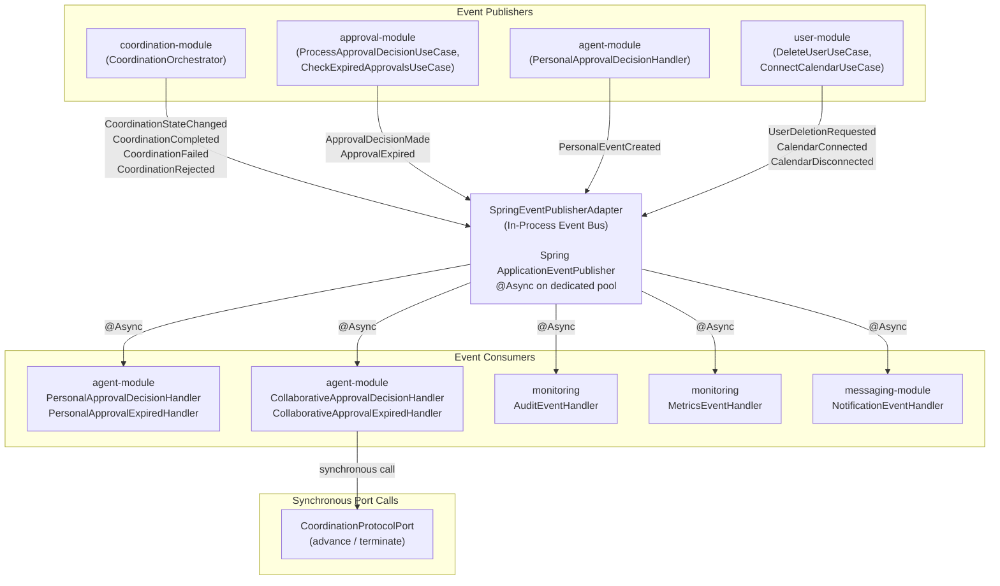
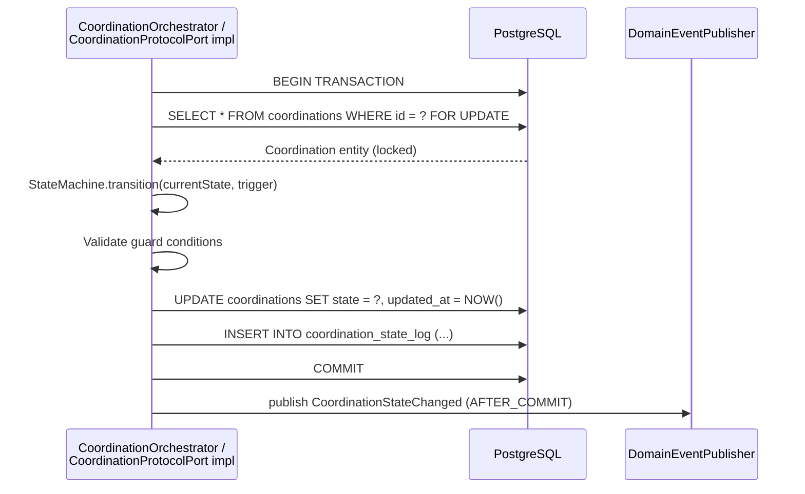
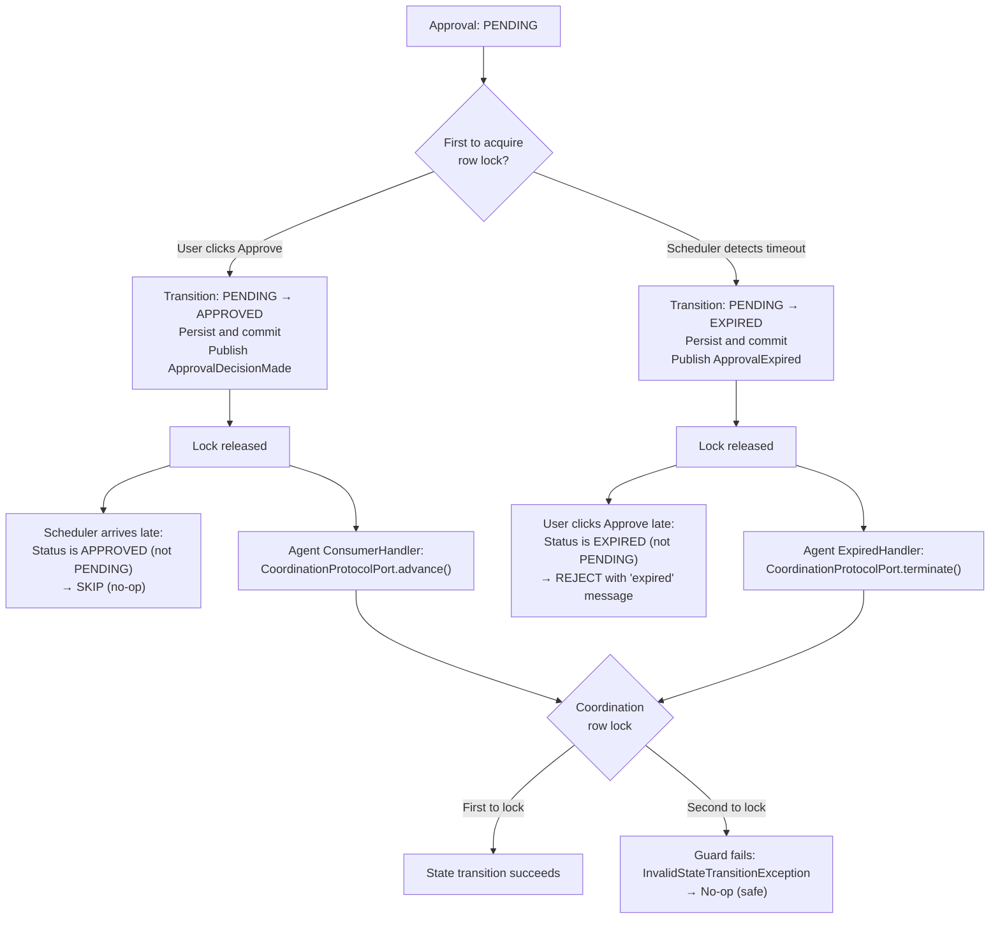
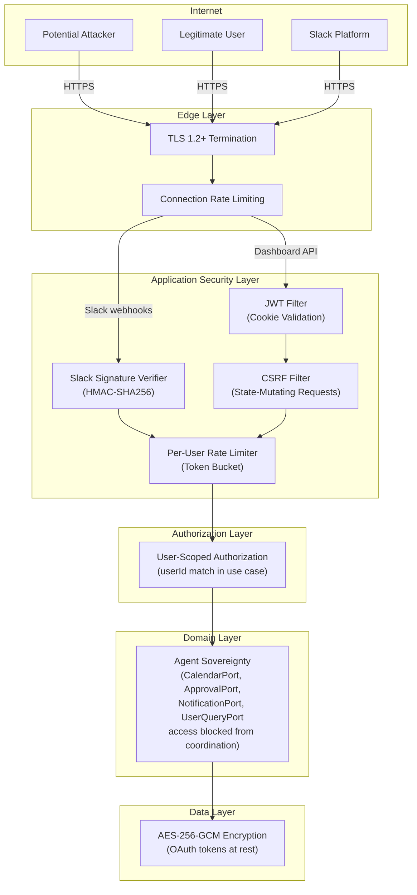
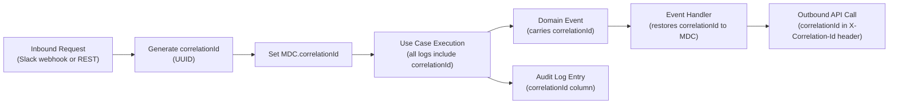
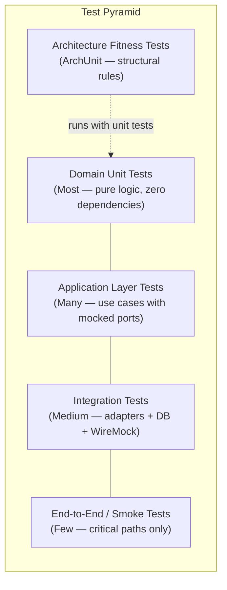

# 08 — Cross-Cutting Concepts

## Table of Contents

- [1. Domain Event Architecture](#1-domain-event-architecture)
  - [1.1 Event Bus Implementation](#11-event-bus-implementation)
  - [1.2 Event Routing Map](#12-event-routing-map)
  - [1.3 Event Delivery Guarantees](#13-event-delivery-guarantees)
  - [1.4 Event Architecture Diagram](#14-event-architecture-diagram)
- [2. Transaction Management Strategy](#2-transaction-management-strategy)
  - [2.1 Transaction Boundaries](#21-transaction-boundaries)
  - [2.2 State Machine Transaction Model](#22-state-machine-transaction-model)
  - [2.3 Saga Transaction Model](#23-saga-transaction-model)
  - [2.4 Timeout Handling Transaction Model](#24-timeout-handling-transaction-model)
- [3. Concurrency Control Model](#3-concurrency-control-model)
  - [3.1 Pessimistic Locking Strategy](#31-pessimistic-locking-strategy)
  - [3.2 Race Condition Resolution](#32-race-condition-resolution)
  - [3.3 Horizontal Scaling Determinism](#33-horizontal-scaling-determinism)
- [4. Security Model](#4-security-model)
  - [4.1 Security Layer Architecture](#41-security-layer-architecture)
  - [4.2 Slack Webhook Verification](#42-slack-webhook-verification)
  - [4.3 JWT Authentication](#43-jwt-authentication)
  - [4.4 Authorization Model](#44-authorization-model)
  - [4.5 CSRF Protection](#45-csrf-protection)
  - [4.6 Security Layer Diagram](#46-security-layer-diagram)
- [5. Encryption Strategy](#5-encryption-strategy)
  - [5.1 Token Encryption at Rest](#51-token-encryption-at-rest)
  - [5.2 Encryption Port Abstraction](#52-encryption-port-abstraction)
  - [5.3 Key Management](#53-key-management)
- [6. Error Handling Strategy](#6-error-handling-strategy)
  - [6.1 Exception Hierarchy](#61-exception-hierarchy)
  - [6.2 Retry Policies](#62-retry-policies)
  - [6.3 Circuit Breaker Strategy](#63-circuit-breaker-strategy)
  - [6.4 Coordination Error Handling](#64-coordination-error-handling)
- [7. Logging and Correlation](#7-logging-and-correlation)
  - [7.1 Structured Logging](#71-structured-logging)
  - [7.2 Correlation ID Propagation](#72-correlation-id-propagation)
  - [7.3 Log Level Policy](#73-log-level-policy)
  - [7.4 Audit Log Separation](#74-audit-log-separation)
- [8. Observability and Metrics](#8-observability-and-metrics)
  - [8.1 Metrics Framework](#81-metrics-framework)
  - [8.2 Metrics Inventory](#82-metrics-inventory)
  - [8.3 Health Indicators](#83-health-indicators)
- [9. Validation Strategy](#9-validation-strategy)
  - [9.1 Validation Layers](#91-validation-layers)
  - [9.2 State Machine Guards](#92-state-machine-guards)
- [10. Configuration Management](#10-configuration-management)
  - [10.1 Profile Strategy](#101-profile-strategy)
  - [10.2 Configuration Properties](#102-configuration-properties)
  - [10.3 Domain Layer Isolation](#103-domain-layer-isolation)
- [11. Caching Strategy](#11-caching-strategy)
  - [11.1 Cache Implementation](#111-cache-implementation)
  - [11.2 Cache Policies](#112-cache-policies)
  - [11.3 Cache Boundaries](#113-cache-boundaries)
- [12. Idempotency Guarantees](#12-idempotency-guarantees)
  - [12.1 Slack Event Deduplication](#121-slack-event-deduplication)
  - [12.2 Approval Decision Idempotency](#122-approval-decision-idempotency)
  - [12.3 Calendar Mutation Idempotency](#123-calendar-mutation-idempotency)
- [13. Rate Limiting Strategy](#13-rate-limiting-strategy)
  - [13.1 Edge-Level Rate Limiting](#131-edge-level-rate-limiting)
  - [13.2 Application-Level Rate Limiting](#132-application-level-rate-limiting)
  - [13.3 Slack Retry Storm Protection](#133-slack-retry-storm-protection)
- [14. Determinism Guarantees](#14-determinism-guarantees)
  - [14.1 Deterministic Components](#141-deterministic-components)
  - [14.2 Non-Deterministic Boundaries](#142-non-deterministic-boundaries)
- [15. Data Ownership and Module Boundaries](#15-data-ownership-and-module-boundaries)
  - [15.1 Table Ownership](#151-table-ownership)
  - [15.2 Cross-Module Access Rules](#152-cross-module-access-rules)
  - [15.3 Agent Sovereignty Enforcement](#153-agent-sovereignty-enforcement)
- [16. Audit and Compliance](#16-audit-and-compliance)
  - [16.1 Audit Log Architecture](#161-audit-log-architecture)
  - [16.2 GDPR Compliance](#162-gdpr-compliance)
  - [16.3 Data Retention Policies](#163-data-retention-policies)
- [17. Testing Strategy Overview](#17-testing-strategy-overview)
  - [17.1 Test Pyramid](#171-test-pyramid)
  - [17.2 Test Layer Inventory](#172-test-layer-inventory)
  - [17.3 Architecture Fitness Functions](#173-architecture-fitness-functions)

---

## 1. Domain Event Architecture

### 1.1 Event Bus Implementation

The CoAgent4U platform uses an in-process domain event bus implemented via Spring's `ApplicationEventPublisher`. The `SpringEventPublisherAdapter` in the infrastructure layer implements the `DomainEventPublisher` port defined in `core/common-domain/`. All event publication and consumption occurs within the same JVM process. There is no external message broker — no RabbitMQ, no Kafka, no SQS.

Domain events are used for side-effect decoupling and for asynchronous cross-module reactions. They are never used to directly advance the coordination state machine; any workflow progression is performed synchronously via CoordinationProtocolPort calls invoked by agents. They are published after the primary state change has been persisted to PostgreSQL within a committed transaction. Events are never used for primary coordination workflow orchestration — the coordination state machine advances through synchronous port calls (agent capability ports and `CoordinationProtocolPort`), not events. The `ApprovalDecisionMade` event bridges the `approval-module` and the `agent-module`: for personal approvals the agent handles the event directly, and for collaborative approvals the agent's handler translates the event into a synchronous `CoordinationProtocolPort.advance()` call that advances the coordination state machine. Similarly, `ApprovalExpired` events for collaborative approvals are consumed by the `agent-module`'s handler which calls `CoordinationProtocolPort.terminate()`. In all cases, the approval state transition is persisted before the event is published, ensuring no data loss if the event handler fails.

Event handlers annotated with `@EventListener` run synchronously on the publishing thread by default. Handlers annotated with `@Async` execute on a dedicated thread pool (`async-event-pool`, 4 threads by default). Asynchronous handlers are used for notifications, audit logging, and metrics emission — all of which are side effects that must not block the critical path. The collaborative approval event handlers (`CollaborativeApprovalDecisionHandler`, `CollaborativeApprovalExpiredHandler`) are also `@Async` because the `approval-module`'s transaction must complete independently of coordination state machine advancement; the handler then performs its own synchronous `CoordinationProtocolPort` call within its own thread.

### 1.2 Event Routing Map

| Event | Publisher | Consumer(s) | Delivery | Purpose |
|---|---|---|---|---|
| `ApprovalDecisionMade(PERSONAL, APPROVED)` | `approval-module` | `agent-module` (`PersonalApprovalDecisionHandler`) | Async | Agent creates calendar event via `CalendarPort` |
| `ApprovalDecisionMade(PERSONAL, REJECTED)` | `approval-module` | `agent-module` (`PersonalApprovalDecisionHandler`) | Async | Agent sends rejection notification |
| `ApprovalDecisionMade(COLLABORATIVE_INVITEE)` | `approval-module` | `agent-module` (`CollaborativeApprovalDecisionHandler`) | Async | Agent calls `CoordinationProtocolPort.advance()` to advance coordination state machine |
| `ApprovalDecisionMade(COLLABORATIVE_REQUESTER)` | `approval-module` | `agent-module` (`CollaborativeApprovalDecisionHandler`) | Async | Agent calls `CoordinationProtocolPort.advance()` to advance coordination state machine |
| `ApprovalExpired(PERSONAL)` | `approval-module` | `agent-module` (`PersonalApprovalExpiredHandler`) | Async | Notify user of expiration |
| `ApprovalExpired(COLLABORATIVE)` | `approval-module` | `agent-module` (`CollaborativeApprovalExpiredHandler`) | Async | Agent calls `CoordinationProtocolPort.terminate()` → coordination transitions to `REJECTED` |
| `CoordinationStateChanged` | `coordination-module` | `monitoring` (`AuditEventHandler`) | Async | Append to `coordination_state_log` and `audit_logs` |
| `CoordinationCompleted` | `coordination-module` | `monitoring` (`MetricsEventHandler`), `messaging-module` (`NotificationEventHandler`) | Async | Emit metrics, send confirmations to both users |
| `CoordinationFailed` | `coordination-module` | `monitoring` (`MetricsEventHandler`), `messaging-module` (`NotificationEventHandler`) | Async | Emit metrics, send failure notifications to both users |
| `CoordinationRejected` | `coordination-module` | `monitoring` (`MetricsEventHandler`), `messaging-module` (`NotificationEventHandler`) | Async | Emit metrics, send rejection notifications |
| `PersonalEventCreated` | `agent-module` | `monitoring` (`AuditEventHandler`) | Async | Audit log entry |
| `UserRegistered` | `user-module` | `monitoring` (`AuditEventHandler`) | Async | Audit log entry |
| `UserDeletionRequested` | `user-module` | `agent-module`, `coordination-module` | Async | Cascading cleanup |
| `CalendarConnected` | `user-module` | `agent-module` | Async | Agent provisioning trigger |
| `CalendarDisconnected` | `user-module` | `agent-module` | Async | Agent deactivation trigger |

### 1.3 Event Delivery Guarantees

| Guarantee | Status | Justification |
|---|---|---|
| At-most-once delivery | ✅ Provided | In-process publish — no redelivery mechanism |
| At-least-once delivery | ❌ Not provided | If handler fails or JVM crashes, event is lost |
| Ordering | ✅ Per-publisher thread | Events from a single synchronous flow are ordered |
| Durability | ❌ Not provided | Events are not persisted; they exist only in JVM memory |

This is acceptable because all domain events in the current architecture are side effects or trigger idempotent state transitions. The primary state (coordination state, approval state, user data) is persisted synchronously before any event is published. If a side-effect event is lost (due to async handler failure or JVM crash), the system state remains correct. Lost notifications or audit entries can be detected and reconciled through scheduled tasks comparing database state against expected side-effect outcomes. For collaborative approval events consumed by agent handlers that call `CoordinationProtocolPort`, loss of the event means the coordination stays in its current awaiting state; the 12-hour timeout scheduler serves as the ultimate backstop, transitioning the coordination to `REJECTED` if the approval event was never processed.

### 1.4 Event Architecture Diagram



---

## 2. Transaction Management Strategy

### 2.1 Transaction Boundaries

All database-mutating operations use Spring's `@Transactional` annotation at the application-layer use case level. Each use case method represents a single unit of work that either commits entirely or rolls back entirely. The domain layer contains no transaction annotations — transaction demarcation is strictly an application-layer concern.

| Transaction Scope | Use Case Examples | Isolation Level |
|---|---|---|
| Single aggregate mutation | `RegisterUserUseCase`, `ConnectCalendarUseCase`, `CreateApprovalUseCase` | `READ_COMMITTED` (PostgreSQL default) |
| State machine transition | `CoordinationOrchestrator` advancing state, `CoordinationProtocolPort` implementations | `READ_COMMITTED` with pessimistic row lock |
| Approval decision | `ProcessApprovalDecisionUseCase` | `READ_COMMITTED` with pessimistic row lock |
| Timeout batch | `CheckExpiredApprovalsUseCase` | `READ_COMMITTED` with `SKIP LOCKED` |

Domain events are published after the transaction commits, using Spring's `@TransactionalEventListener(phase = AFTER_COMMIT)`. This guarantees that if the transaction rolls back, no events are published. If the transaction commits but the event handler fails, the database state is correct and the side effect can be reconciled.

### 2.2 State Machine Transaction Model

Each coordination state transition is executed within a single database transaction. The `CoordinationOrchestrator` (or `CoordinationProtocolPort` implementation, depending on the trigger source) loads the `Coordination` entity with a pessimistic write lock (`SELECT ... FOR UPDATE`), validates the transition through the `CoordinationStateMachine` domain service, applies the transition, persists the updated entity, and commits. The domain event (`CoordinationStateChanged`) is published after commit.



### 2.3 Saga Transaction Model

The `CoordinationSaga` does not execute within a single database transaction spanning both calendar operations. Instead, it uses a sequence of individual transactions with intermediate state persistence. This ensures that if the application crashes between saga steps, the coordination entity reflects exactly how far the saga progressed. The saga is triggered when the coordination state machine reaches `APPROVED_BY_BOTH` (driven by an agent calling `CoordinationProtocolPort.advance()`).

| Step | Transaction | Persisted State After Commit |
|---|---|---|
| Pre-saga | Transition to `APPROVED_BY_BOTH` via `CoordinationProtocolPort.advance()` | `state=APPROVED_BY_BOTH` |
| Agent A creates event | Transition to `CREATING_EVENT_A`, call `AgentEventExecutionPort.createEvent(agentA, ...)`, persist `eventId_A` | `state=CREATING_EVENT_A`, `eventId_A=...` |
| Agent B creates event (success) | Transition to `CREATING_EVENT_B`, call `AgentEventExecutionPort.createEvent(agentB, ...)`, persist `eventId_B`, transition to `COMPLETED` | `state=COMPLETED`, `eventId_A=...`, `eventId_B=...` |
| Agent B creates event (failure) | Initiate compensation | `state=CREATING_EVENT_B`, `saga_step=COMPENSATING` |
| Compensation: Agent A deletes event | Call `AgentEventExecutionPort.deleteEvent(agentA, eventId_A)`, transition to `FAILED` | `state=FAILED`, `saga_step=COMPENSATED` |

A scheduled reconciliation task runs every 5 minutes, identifies coordinations stuck in intermediate saga states (`CREATING_EVENT_A` or `CREATING_EVENT_B`) for longer than 2 minutes (configurable), and initiates compensation or retry as appropriate.

### 2.4 Timeout Handling Transaction Model

The `CheckExpiredApprovalsUseCase` uses `SELECT ... FOR UPDATE SKIP LOCKED` to claim batches of expired approvals across horizontally scaled application instances without conflicts. Each instance processes a non-overlapping set of expired approvals within its own transaction.

```sql
SELECT * FROM approvals
WHERE status = 'PENDING'
  AND expires_at < NOW()
ORDER BY expires_at ASC
LIMIT 50
FOR UPDATE SKIP LOCKED;
```

Within the transaction, each claimed approval transitions from `PENDING` to `EXPIRED`, is persisted, and an `ApprovalExpired` domain event is published after commit. For collaborative approvals, this event is consumed by the `agent-module`'s `CollaborativeApprovalExpiredHandler`, which calls `CoordinationProtocolPort.terminate()` to transition the coordination to `REJECTED`. If the transaction fails, the rows are released and become available to other instances on the next scheduler cycle.

---

## 3. Concurrency Control Model

### 3.1 Pessimistic Locking Strategy

The system uses pessimistic write locks (PostgreSQL `SELECT ... FOR UPDATE`) for entities that are subject to concurrent modification. This strategy is chosen over optimistic locking because coordination and approval state transitions must be strictly serialized — a retry loop on `OptimisticLockException` would add latency and complexity to the critical path without benefit.

| Entity | Lock Type | Lock Acquisition Point | Concurrent Access Scenario |
|---|---|---|---|
| Coordination | `FOR UPDATE` | `CoordinationOrchestrator` or `CoordinationProtocolPort` implementation before any state transition | Multiple approval callbacks targeting same coordination; approval callback vs. timeout scheduler via agent handlers |
| Approval | `FOR UPDATE` | `ProcessApprovalDecisionUseCase` before decision recording | User approval click vs. scheduler timeout |
| Approval (batch) | `FOR UPDATE SKIP LOCKED` | `CheckExpiredApprovalsUseCase` during timeout scan | Multiple app instances running timeout schedulers |
| User | `FOR UPDATE` | `DeleteUserUseCase` during cascading deletion | Concurrent deletion requests |

### 3.2 Race Condition Resolution

The primary race condition in the system occurs between a user's approval decision and the 12-hour timeout scheduler. The resolution is detailed in `06-runtime-view.md` S9.4. The PostgreSQL row-level lock ensures mutual exclusion. Only one outcome is recorded — either the user's decision (`APPROVED`/`REJECTED`) or the timeout (`EXPIRED`). The losing path encounters a non-`PENDING` status and is handled as a no-op (idempotency enforcement).

A secondary race condition exists for collaborative approvals at the coordination level: both an approval callback (via agent's `CollaborativeApprovalDecisionHandler` → `CoordinationProtocolPort.advance()`) and a timeout expiry (via agent's `CollaborativeApprovalExpiredHandler` → `CoordinationProtocolPort.terminate()`) may attempt to advance the same coordination concurrently. The coordination entity's `FOR UPDATE` row lock serializes these attempts. The coordination state machine's guard condition ensures that only the first valid transition succeeds — the second attempt finds an unexpected current state and is rejected with `InvalidStateTransitionException`.



### 3.3 Horizontal Scaling Determinism

Under horizontal scaling, multiple application instances may receive requests that target the same coordination or approval entity. Determinism is preserved through the following mechanisms.

PostgreSQL row-level locks serialize all state transitions for a given entity across all application instances. The `SKIP LOCKED` pattern for batch timeout processing ensures each expired approval is processed by exactly one instance. The coordination state machine rejects invalid transitions at the domain level — if two instances somehow attempt the same transition, the lock ensures only one proceeds, and the state machine in the second instance rejects the transition because the guard condition (expected current state) no longer holds. The agent-mediated approval-to-coordination flow (approval event → agent handler → `CoordinationProtocolPort`) always originates on the same instance that processed the Slack callback or timeout, so cross-instance event visibility is not required.

No distributed locking mechanism (Redis, ZooKeeper) is required. PostgreSQL is the single point of serialization, which is consistent with the Modular Monolith deployment model where all instances share the same database.

---

## 4. Security Model

### 4.1 Security Layer Architecture

Security is enforced at multiple layers: the network edge (reverse proxy), the application entry points (Spring Security filter chain), and within the domain logic (user-scoped authorization). Each layer addresses a different threat category.

| Layer | Threats Mitigated | Implementation |
|---|---|---|
| Edge (Reverse Proxy) | DDoS, TLS downgrade, basic request flooding | TLS termination, connection rate limiting, IP allowlisting for management endpoints |
| Webhook Entry (Slack) | Request forgery, replay attacks | HMAC-SHA256 signature verification, timestamp validation (±5 minutes) |
| REST Entry (Dashboard) | Unauthorized access, session hijacking, CSRF | JWT in Secure HttpOnly cookies, CSRF tokens, `SameSite=Strict` |
| Application Layer | Privilege escalation, data leakage across users | User-scoped authorization in use cases — users can only access their own data |
| Domain Layer | Agent sovereignty violations | Coordination-module access restricted to agent capability ports; `coordination-module` has no compile-time dependency on `CalendarPort`, `ApprovalPort`, `NotificationPort`, or `UserQueryPort` |
| Data Layer | Token theft from database | AES-256-GCM encryption for OAuth tokens at rest |

### 4.2 Slack Webhook Verification

Every inbound Slack webhook request is verified before any application processing begins. The `SlackSignatureVerifier` in the security module performs the following steps.

1. Extract the `X-Slack-Signature` and `X-Slack-Request-Timestamp` headers.
2. Reject if the timestamp is more than 5 minutes old (replay protection).
3. Construct the signature base string: `v0:{timestamp}:{request_body}`.
4. Compute the HMAC-SHA256 digest using the `SLACK_SIGNING_SECRET`.
5. Compare the computed digest with the provided signature using a constant-time comparison function.
6. If verification fails, return HTTP 401 and log the attempt.
7. If verification succeeds, pass the request to the `SlackWebhookController`.

### 4.3 JWT Authentication

Dashboard REST API requests are authenticated using JWT tokens stored in Secure HttpOnly cookies. The `JwtTokenProvider` in the security module handles both issuance and validation.

| Property | Value |
|---|---|
| Algorithm | HS256 (HMAC-SHA256) |
| Signing Key | Injected via `JWT_SIGNING_KEY` environment variable |
| Token Lifetime | 24 hours |
| Claims | `sub` (userId), `username`, `iat`, `exp` |
| Storage | Secure, HttpOnly, `SameSite=Strict` cookie |
| Refresh | Not implemented in MVP — user re-authenticates via Slack OAuth |

### 4.4 Authorization Model

CoAgent4U enforces user-scoped authorization at the application layer. There are no roles or permission hierarchies in the MVP. Every use case that accesses user data validates that the authenticated user ID matches the target user ID. A user cannot view, modify, or delete another user's data, events, or coordinations.

The Agent Sovereignty principle reinforces this authorization model at the architectural level: the `coordination-module` cannot access user data or calendar data directly, so there is no code path through which one user's coordination request could inadvertently access another user's calendar data. The agent acts as a sovereignty boundary — it validates that only operations authorized by its owner are executed, and the `coordination-module` interacts with user-scoped resources exclusively through agent capability ports.

### 4.5 CSRF Protection

CSRF protection is enabled for all state-mutating REST API endpoints (POST, PUT, DELETE). Spring Security's default CSRF token mechanism is used. The CSRF token is included in the initial page load and sent with every subsequent mutating request as a header. Slack webhook endpoints are excluded from CSRF protection because they use their own signature-based verification.

### 4.6 Security Layer Diagram



---

## 5. Encryption Strategy

### 5.1 Token Encryption at Rest

All OAuth tokens (Google Calendar access tokens and refresh tokens) are encrypted before storage in the `service_connections` table. The columns `oauth_token_encrypted` and `oauth_refresh_token_encrypted` contain AES-256-GCM ciphertext. Plaintext tokens never exist in the database, in application log files, or in API responses.

| Property | Value |
|---|---|
| Algorithm | AES-256-GCM |
| Key Size | 256 bits |
| IV Generation | Random 12-byte IV per encryption operation |
| Authentication Tag | 128-bit GCM authentication tag |
| Key Source | `AES_ENCRYPTION_KEY` environment variable |
| Encoding | Base64 encoding of IV + ciphertext + tag |

### 5.2 Encryption Port Abstraction

The `EncryptionPort` interface is defined in the `user-module` application layer. The `AesEncryptionService` in the security infrastructure module implements this port. The domain layer never references the encryption implementation — it stores and retrieves opaque encrypted strings.

The `agent-module` requests decryption when it needs to make a `CalendarPort` call to Google Calendar. The decrypted access token exists only in JVM heap memory for the duration of the HTTP request to Google's API. It is not logged, cached, or passed to any module other than the `GoogleCalendarAdapter`. After the API call completes, the decrypted token becomes eligible for garbage collection.

### 5.3 Key Management

For the MVP, the AES encryption key is injected via environment variable. The architecture supports future migration to a key management service (AWS KMS, HashiCorp Vault Transit) by replacing the `AesEncryptionService` adapter with a KMS-backed implementation. The `EncryptionPort` interface remains unchanged.

Key rotation requires a data migration that re-encrypts all stored tokens with the new key. This is implemented as a Flyway migration or a dedicated administrative command that reads each encrypted token with the old key, re-encrypts with the new key, and updates the row within a transaction.

---

## 6. Error Handling Strategy

### 6.1 Exception Hierarchy

Exceptions are categorized into two layers: domain exceptions (thrown by domain logic and application use cases) and infrastructure exceptions (thrown by adapters and external systems). Infrastructure exceptions are caught at the adapter boundary and translated into domain exceptions before reaching the application layer.

| Category | Exception | Thrown By | Handling |
|---|---|---|---|
| Domain | `InvalidStateTransitionException` | `CoordinationStateMachine` | Reject the operation, return error to caller |
| Domain | `ApprovalAlreadyDecidedException` | `Approval` aggregate | No-op (idempotency), return current status |
| Domain | `AgentNotActiveException` | `Agent` aggregate | Coordination → `FAILED` |
| Domain | `NoMutualAvailabilityException` | `AvailabilityMatcher` | Coordination → `FAILED`, notify users |
| Infrastructure | `CalendarServiceUnavailableException` | `GoogleCalendarAdapter` | Retry with backoff, then surface to agent as domain exception |
| Infrastructure | `CalendarAccessRevokedException` | `GoogleCalendarAdapter` | No retry — token permanently invalid. Agent deactivation. |
| Infrastructure | `SlackDeliveryException` | `SlackMessagingAdapter` | Retry with backoff, then log and continue (side effect) |
| Infrastructure | `LLMTimeoutException` | `GroqLLMAdapter` | Return `ParsedIntent(UNKNOWN)`, prompt user to rephrase |
| Infrastructure | `DatabaseConnectionException` | JPA/HikariCP | Application health → `DOWN`, request fails with 503 |

### 6.2 Retry Policies

| External System | Max Retries | Backoff Strategy | Timeout per Attempt | Failure Outcome |
|---|---|---|---|---|
| Google Calendar API | 3 | Exponential: 1s, 2s, 4s | 5 seconds | `CalendarServiceUnavailableException` |
| Slack Web API | 3 | Exponential: 1s, 2s, 4s | 5 seconds | `SlackDeliveryException` (logged, not blocking) |
| Groq LLM API | 1 | None | 5 seconds | `ParsedIntent(UNKNOWN)` |
| PostgreSQL | 0 (connection pool handles) | HikariCP connection retry | 30 seconds (connection timeout) | `DatabaseConnectionException` |

### 6.3 Circuit Breaker Strategy

Circuit breakers are implemented using Spring WebClient's built-in timeout and retry mechanisms combined with Caffeine-backed failure counters. The circuit breaker pattern is applied per external system, not per request.

| External System | Failure Threshold | Open Duration | Half-Open Behavior |
|---|---|---|---|
| Google Calendar API | 5 consecutive failures within 60 seconds | 30 seconds | Allow 1 probe request; if success → CLOSED, if failure → OPEN |
| Slack Web API | 5 consecutive failures within 60 seconds | 30 seconds | Same as above |
| Groq LLM API | 3 consecutive failures within 60 seconds | 60 seconds | Same as above |

When a circuit breaker is open, requests to that external system fail immediately with the appropriate exception. For Google Calendar, this means agent capability port calls (`AgentAvailabilityPort`, `AgentEventExecutionPort`) return an error immediately, and the coordination transitions to `FAILED`. For Slack, notifications are queued for later retry by the `NotificationEventHandler`. For Groq, the rule-based parser handles all intent classification.

### 6.4 Coordination Error Handling

The coordination state machine handles errors by transitioning to the `FAILED` or `REJECTED` state with a recorded reason. The `CoordinationOrchestrator` catches domain and infrastructure exceptions at each phase boundary and applies the appropriate transition. Errors during the approval phase are communicated to the `coordination-module` via agent handlers calling `CoordinationProtocolPort.terminate()`.

| Phase | Error | State Transition | User Notification |
|---|---|---|---|
| Availability (Agent A) | `CalendarServiceUnavailableException` surfaced via `AgentAvailabilityPort` | → `FAILED` (reason: "Agent A availability unavailable") | Notify requester via `CoordinationFailed` event |
| Availability (Agent B) | Same | → `FAILED` | Notify requester via `CoordinationFailed` event |
| Matching | `NoMutualAvailabilityException` | → `FAILED` (reason: "No mutual availability") | Notify both via `CoordinationFailed` event |
| Approval | Timeout (12h) | → `REJECTED` (via agent's `CollaborativeApprovalExpiredHandler` → `CoordinationProtocolPort.terminate()`) | Notify both via `CoordinationRejected` event |
| Approval | User rejects | → `REJECTED` (via agent's `CollaborativeApprovalDecisionHandler` → `CoordinationProtocolPort.advance()`) | Notify both via `CoordinationRejected` event |
| Saga Step 1 | Agent A event creation failure via `AgentEventExecutionPort` | → `FAILED` (reason: "TOTAL_FAILURE") | Notify both via `CoordinationFailed` event |
| Saga Step 2 | Agent B event creation failure via `AgentEventExecutionPort` | → `FAILED` (reason: "PARTIAL_FAILURE_COMPENSATED" or "COMPENSATION_FAILED") | Notify both via `CoordinationFailed` event |

---

## 7. Logging and Correlation

### 7.1 Structured Logging

All application logging uses structured JSON format via Logback with the `logstash-logback-encoder`. Each log entry is a self-contained JSON object that can be ingested by centralized logging systems (ELK, Loki, CloudWatch Logs) without parsing.

```json
{
  "timestamp": "2025-02-15T14:32:01.123Z",
  "level": "INFO",
  "logger": "com.coagent4u.coordination.application.CoordinationOrchestrator",
  "message": "Coordination state transition",
  "correlationId": "a1b2c3d4-e5f6-7890-abcd-ef1234567890",
  "coordinationId": "f7e6d5c4-b3a2-1098-7654-321fedcba098",
  "fromState": "MATCHING",
  "toState": "PROPOSAL_GENERATED",
  "thread": "async-event-pool-2"
}
```

### 7.2 Correlation ID Propagation

A correlation ID is generated at the entry point of every request (Slack webhook or REST API call) and propagated through the entire processing chain using SLF4J's Mapped Diagnostic Context (MDC). The correlation ID is included in every log entry, every domain event, every audit log record, and every outbound API call header.



For asynchronous event handlers running on the `async-event-pool`, the correlation ID is extracted from the domain event payload and restored to the MDC before handler execution. This ensures that log entries from async handlers are traceable back to the originating request. This is especially important for collaborative approval event handlers (`CollaborativeApprovalDecisionHandler`, `CollaborativeApprovalExpiredHandler`) that trigger `CoordinationProtocolPort` calls — the correlation ID traces the full chain from the original Slack approval callback through the agent handler into the coordination state transition.

### 7.3 Log Level Policy

| Level | Usage | Examples |
|---|---|---|
| `ERROR` | Unrecoverable failures, compensation failures, data integrity violations | Saga compensation failure, database connection loss, encryption key missing |
| `WARN` | Recoverable failures, degraded functionality | External API retry, circuit breaker open, LLM fallback to UNKNOWN, notification delivery failure |
| `INFO` | Business-significant events, state transitions | Coordination state changes, approval decisions, user registration, agent provisioning |
| `DEBUG` | Detailed operational data for troubleshooting | Parsed intent details, availability block lists, SQL queries, HTTP request/response headers |
| `TRACE` | Extremely verbose data for development | Full HTTP bodies, full domain event payloads, cache hit/miss details |

| Environment | Default Level | Override Mechanism |
|---|---|---|
| Development | `DEBUG` | `application-dev.yml` |
| Staging | `DEBUG` | `application-staging.yml` |
| Production | `INFO` | `application-prod.yml`, overridable per-logger via environment variable |

### 7.4 Audit Log Separation

Business audit records are written to dedicated database tables (`audit_logs`, `coordination_state_log`), not to application log files. This separation ensures that audit data is queryable, retained according to compliance policies, and not affected by log rotation or volume limits.

Application logs are operational and ephemeral — they serve troubleshooting and monitoring. Audit logs are compliance-critical and durable — they serve regulatory and user trust requirements. The two systems share correlation IDs for cross-referencing but are otherwise independent.

---

## 8. Observability and Metrics

### 8.1 Metrics Framework

Metrics are collected using Micrometer, which is integrated with Spring Boot Actuator. Micrometer provides a vendor-neutral metrics facade that supports export to Prometheus, Datadog, CloudWatch, or any other supported backend via configuration. The default export is via the `/actuator/prometheus` endpoint for pull-based scraping.

### 8.2 Metrics Inventory

| Metric Name | Type | Description | Tags |
|---|---|---|---|
| `coordination.initiated` | Counter | Coordinations started | — |
| `coordination.completed` | Counter | Coordinations successfully completed | — |
| `coordination.failed` | Counter | Coordinations that reached `FAILED` | `reason` (TOTAL_FAILURE, PARTIAL_FAILURE, NO_AVAILABILITY) |
| `coordination.rejected` | Counter | Coordinations rejected by users or expired | `stage` (INVITEE, REQUESTER) |
| `coordination.duration` | Timer | End-to-end duration from `INITIATED` to terminal state | `outcome` (COMPLETED, FAILED, REJECTED) |
| `saga.success` | Counter | Successful saga completions | — |
| `saga.partial_failure` | Counter | Sagas requiring compensation | — |
| `saga.compensation_failure` | Counter | Sagas where compensation also failed | — |
| `approval.response_time` | Timer | Duration from approval creation to user decision | `type` (PERSONAL, COLLABORATIVE_INVITEE, COLLABORATIVE_REQUESTER) |
| `approval.timeout` | Counter | Approvals expired by 12-hour timeout | `type` |
| `agent.availability_latency` | Timer | `AgentAvailabilityPort` response time | — |
| `agent.event_execution_latency` | Timer | `AgentEventExecutionPort` response time | `operation` (CREATE, DELETE) |
| `agent.profile_latency` | Timer | `AgentProfilePort` response time | — |
| `agent.approval_latency` | Timer | `AgentApprovalPort` response time | `operation` (CREATE_APPROVAL) |
| `coordination.protocol_latency` | Timer | `CoordinationProtocolPort` call response time | `operation` (ADVANCE, TERMINATE) |
| `intent.rule_based_hit` | Counter | Intents resolved by rule-based parser | `intent_type` |
| `intent.llm_fallback` | Counter | Intents requiring LLM fallback | `intent_type` |
| `intent.llm_failure` | Counter | LLM fallback failures | — |
| `calendar.api_latency` | Timer | Google Calendar API response time | `operation` (GET_EVENTS, CREATE, DELETE) |
| `calendar.api_errors` | Counter | Google Calendar API errors | `status_code` |
| `slack.api_latency` | Timer | Slack Web API response time | `method` |
| `slack.api_errors` | Counter | Slack API errors | `status_code` |
| `notification.sent` | Counter | Notifications successfully delivered | `type` (CONFIRMATION, FAILURE, REJECTION, APPROVAL_PROMPT) |
| `notification.failed` | Counter | Notifications that failed after all retries | `type` |

### 8.3 Health Indicators

Custom health indicators supplement the default Spring Boot Actuator health checks. These are documented in `07-deployment-view.md` S3.5.

| Indicator | Health Check Method | DOWN Impact |
|---|---|---|
| `PostgresHealthIndicator` | Execute `SELECT 1` via connection pool | Instance removed from load balancer |
| `SlackHealthIndicator` | Call `auth.test` endpoint | Instance marked `DEGRADED` (still serves traffic) |
| `GoogleCalendarHealthIndicator` | Call Discovery API endpoint | Instance marked `DEGRADED` |

---

## 9. Validation Strategy

### 9.1 Validation Layers

Validation is enforced at every architectural boundary to ensure that invalid data is rejected as early as possible and that the domain layer operates only on well-formed inputs.

| Layer | Validation Type | Mechanism | Examples |
|---|---|---|---|
| REST Adapter | Structural and format validation | Bean Validation (`@NotNull`, `@Size`, `@Email`, `@Pattern`) on DTO classes | Username format, email format, non-null required fields |
| Slack Adapter | Payload integrity | Slack signature verification + structural validation of event JSON | Missing event type, malformed interactive payload |
| Application Layer (Port Boundary) | Business precondition validation | Programmatic checks in use case implementations | User exists and is active, agent is provisioned, coordination is in valid state |
| Domain Layer | Invariant enforcement | Constructor and factory method validation in entities and value objects | `TimeSlot.end > TimeSlot.start`, `Username` matches `^[a-z0-9_]+$`, Approval status transition validity |
| State Machine | Guard conditions | `CoordinationStateMachine.validateTransition()` | Current state must match expected state for trigger |

### 9.2 State Machine Guards

Every coordination state transition has an explicit guard condition evaluated by the `CoordinationStateMachine` domain service. If the guard fails, an `InvalidStateTransitionException` is thrown and the state remains unchanged.

| Transition | Guard Condition |
|---|---|
| → `INITIATED` | Both agent IDs are valid and active |
| `INITIATED` → `CHECKING_AVAILABILITY_A` | Coordination just created (no prior state) |
| `CHECKING_AVAILABILITY_A` → `CHECKING_AVAILABILITY_B` | Agent A availability data is present and non-empty |
| `CHECKING_AVAILABILITY_B` → `MATCHING` | Agent B availability data is present and non-empty |
| `MATCHING` → `PROPOSAL_GENERATED` | At least one overlapping time slot exists |
| `PROPOSAL_GENERATED` → `AWAITING_APPROVAL_B` | Approval request successfully created for invitee's agent via `AgentApprovalPort` |
| `AWAITING_APPROVAL_B` → `APPROVED_BY_B` | Invitee's agent calls `CoordinationProtocolPort.advance()` with `INVITEE_APPROVED` |
| `AWAITING_APPROVAL_B` → `REJECTED` | Invitee's agent calls `CoordinationProtocolPort.advance()` with `INVITEE_REJECTED`, or agent calls `CoordinationProtocolPort.terminate()` on expiry |
| `APPROVED_BY_B` → `AWAITING_APPROVAL_A` | Approval request successfully created for requester's agent via `AgentApprovalPort` |
| `AWAITING_APPROVAL_A` → `APPROVED_BY_BOTH` | Requester's agent calls `CoordinationProtocolPort.advance()` with `REQUESTER_APPROVED` |
| `AWAITING_APPROVAL_A` → `REJECTED` | Requester's agent calls `CoordinationProtocolPort.advance()` with `REQUESTER_REJECTED`, or agent calls `CoordinationProtocolPort.terminate()` on expiry |
| `APPROVED_BY_BOTH` → `CREATING_EVENT_A` | Saga initiated, transitioning to first calendar operation |
| `CREATING_EVENT_A` → `CREATING_EVENT_B` | `eventId_A` received from `AgentEventExecutionPort` |
| `CREATING_EVENT_B` → `COMPLETED` | `eventId_B` received from `AgentEventExecutionPort` |
| `APPROVED_BY_BOTH` → `FAILED` | Agent reports event creation failure via `AgentEventExecutionPort` |
| `CREATING_EVENT_A` → `FAILED` | Agent A event creation failure |
| `CREATING_EVENT_B` → `FAILED` | Agent B event creation failure, compensation initiated |

---

## 10. Configuration Management

### 10.1 Profile Strategy

Spring Boot profiles are used to manage environment-specific configuration. Each profile overrides the base `application.yml` with environment-appropriate values.

| Profile | Activation | Purpose |
|---|---|---|
| `default` | `application.yml` | Base configuration with sensible defaults |
| `dev` | `application-dev.yml` | Local development — debug logging, relaxed security, local DB |
| `staging` | `application-staging.yml` | Staging — production-like with debug logging enabled |
| `prod` | `application-prod.yml` | Production — strict security, info logging, connection pool tuning |

### 10.2 Configuration Properties

All module-specific configuration is encapsulated in dedicated `@ConfigurationProperties` classes within the `infrastructure/config` module. These classes are type-safe and validated at startup using Bean Validation annotations.

| Properties Class | Prefix | Key Properties |
|---|---|---|
| `SlackProperties` | `coagent.slack` | `signing-secret`, `bot-token`, `app-token` |
| `GoogleProperties` | `coagent.google` | `client-id`, `client-secret`, `redirect-uri`, `scopes` |
| `GroqProperties` | `coagent.groq` | `api-key`, `model`, `temperature`, `max-tokens`, `timeout` |
| `JwtProperties` | `coagent.jwt` | `signing-key`, `expiration` |
| `EncryptionProperties` | `coagent.encryption` | `aes-key` |
| `CoordinationProperties` | `coagent.coordination` | `approval-timeout-hours`, `saga-reconciliation-interval`, `scheduler-interval` |
| `CacheProperties` | `coagent.cache` | `user-profile-ttl`, `user-profile-max-size` |
| `IntentParserProperties` | `coagent.intent` | `confidence-threshold`, `llm-enabled` |

### 10.3 Domain Layer Isolation

The domain layer has zero access to configuration properties, Spring profiles, or environment variables. All configurable values that affect domain behavior (e.g., approval timeout duration, default meeting duration, intent confidence threshold) are injected into domain services through their constructors at application startup. The application-layer use case classes read configuration properties and pass them to domain services as constructor arguments. This preserves the domain layer's zero-dependency guarantee.

---

## 11. Caching Strategy

### 11.1 Cache Implementation

CoAgent4U uses Caffeine as the in-process caching library. Caffeine provides a high-performance, near-optimal local cache with configurable eviction policies. No distributed cache (Redis, Memcached) is used — caching is per-JVM instance.

### 11.2 Cache Policies

| Cache Name | Cached Data | TTL | Max Size | Eviction | Invalidation Trigger |
|---|---|---|---|---|---|
| `user-profiles` | User display information (userId, username, email) | 5 minutes | 1,000 entries | LRU | `UserDeletionRequested` event, profile update |
| `agent-status` | Agent active/inactive status | 2 minutes | 1,000 entries | LRU | Agent provisioning/deactivation events |
| `slack-user-mapping` | `SlackUserId` → `UserId` mapping | 15 minutes | 5,000 entries | LRU | User deletion |

### 11.3 Cache Boundaries

The following data is never cached.

| Data | Reason |
|---|---|
| Coordination state | Must always reflect database truth; caching could cause state machine inconsistency |
| Approval status | Subject to concurrent modification; must use database with row lock |
| Calendar events | Transiently fetched by agents; data changes frequently outside CoAgent4U |
| OAuth tokens (decrypted) | Security risk — decrypted tokens must exist in memory only for API call duration |
| Saga intermediate state | Must reflect committed database state for crash recovery |

Caches are a performance optimization only. A cache miss results in a database query — the system is fully correct with cold caches. Under horizontal scaling, each instance maintains its own independent cache. Slight staleness across instances is acceptable for the cached data types (user display names, agent status) because they change infrequently and the 2-5 minute TTL bounds the inconsistency window.

---

## 12. Idempotency Guarantees

### 12.1 Slack Event Deduplication

Slack may deliver the same event multiple times due to network issues or timeouts. The `SlackEventDispatcher` in the `messaging-module` maintains an in-memory set of recently processed Slack event IDs (Caffeine cache, 10-minute TTL, max 10,000 entries). If an incoming event's `event_id` is already in the set, the event is acknowledged (HTTP 200) but not processed.

### 12.2 Approval Decision Idempotency

The `ProcessApprovalDecisionUseCase` enforces idempotency at the domain level. When processing a decision, it acquires a row lock on the approval entity and checks the current status. If the status is not `PENDING`, the decision is rejected as a no-op — the response indicates the approval has already been decided. This prevents duplicate approval button clicks from causing errors or double-processing.

| Current Status | Incoming Decision | Result |
|---|---|---|
| `PENDING` | `APPROVED` | Transition to `APPROVED`, publish event |
| `PENDING` | `REJECTED` | Transition to `REJECTED`, publish event |
| `APPROVED` | Any | No-op, return current status |
| `REJECTED` | Any | No-op, return current status |
| `EXPIRED` | Any | No-op, return "expired" message |

For collaborative approvals, the downstream `CoordinationProtocolPort` call is also idempotent: the coordination state machine's guard conditions reject any transition attempt if the coordination is no longer in the expected state.

### 12.3 Calendar Mutation Idempotency

Every calendar event creation request sent by the `agent-module`'s internal `CalendarPort` call includes an idempotency key. The `GoogleCalendarAdapter` generates a deterministic idempotency key based on the coordination ID and the participant's agent ID. Google Calendar's `If-None-Match` and request ID mechanisms prevent duplicate event creation if the same request is retried due to a network timeout where the response was lost but the event was created.

The idempotency key format is: `coagent-{coordinationId}-{agentId}-{timestamp_hash}`.

---

## 13. Rate Limiting Strategy

### 13.1 Edge-Level Rate Limiting

The reverse proxy (Nginx or Traefik) applies connection-level rate limiting to all inbound traffic. This protects the application from volumetric attacks that would otherwise exhaust Tomcat's thread pool.

| Rule | Limit | Scope |
|---|---|---|
| Connection rate | 50 new connections/second per IP | Per source IP |
| Request rate | 200 requests/second total | Global |
| Actuator endpoints | 10 requests/second | Per source IP, restricted to internal network |

### 13.2 Application-Level Rate Limiting

The `RateLimitFilter` in the security module applies per-user rate limiting using a Caffeine-backed token bucket. Each authenticated user has an independent bucket.

| Parameter | Value |
|---|---|
| Rate | 100 requests/minute per user |
| Burst allowance | 20 additional requests |
| Bucket implementation | Caffeine cache with Token Bucket algorithm |
| Identification | UserId from JWT claims or Slack user mapping |
| Exceeded response | HTTP 429 with `Retry-After` header |

### 13.3 Slack Retry Storm Protection

When the CoAgent4U application returns non-200 responses to Slack webhooks (e.g., during a brief outage), Slack retries the delivery up to 3 times with increasing backoff. If the application recovers during this retry window, it may receive a burst of retried events. The Slack event deduplication mechanism (S12.1) prevents duplicate processing. The application-level rate limiter ensures that even a burst of retried events does not overwhelm the system.

Additionally, the `SlackWebhookController` returns HTTP 200 immediately after signature verification and dispatches event processing asynchronously. This means the Slack platform receives a timely acknowledgment even if internal processing is slow, preventing unnecessary retries.

---

## 14. Determinism Guarantees

### 14.1 Deterministic Components

The following components are designed to produce identical outputs given identical inputs, regardless of execution timing, instance identity, or external state.

| Component | Determinism Guarantee | Mechanism |
|---|---|---|
| `CoordinationStateMachine` | Same state + same trigger → same next state | Explicit transition table, guard conditions, no randomness |
| `AvailabilityMatcher` | Same two availability lists → same overlapping slots | Two-pointer sweep sorted by start time, deterministic comparison |
| `ProposalGenerator` | Same overlapping slots → same proposal | Always selects earliest slot, applies fixed default duration |
| `RuleBasedParser` | Same input message → same parsed intent | Pattern matching with fixed rule set, deterministic confidence scoring |
| `ApprovalTimeoutChecker` | Same approval + same current time → same expiration decision | Timestamp comparison, no randomness |

### 14.2 Non-Deterministic Boundaries

Non-determinism exists only at the boundaries of the system and is explicitly contained.

| Boundary | Source of Non-Determinism | Containment |
|---|---|---|
| LLM intent classification | LLM output varies across calls (temperature=0.1 mitigates but does not eliminate) | LLM is fallback only; rule-based parser handles majority of messages; LLM result mapped to fixed `IntentType` enum |
| External API latency | Google Calendar and Slack response times vary | Timeouts and retries produce deterministic outcomes (success or classified failure) |
| Event handler ordering | Async event handlers may execute in different orders | Events are side effects only; ordering does not affect coordination state. Collaborative approval handlers produce synchronous `CoordinationProtocolPort` calls with row-level locking, so ordering between handlers targeting different coordinations is irrelevant, and the lock serializes handlers targeting the same coordination. |
| Cache state | Cache content varies across instances and across time | Cache is performance optimization only; correctness depends on database, not cache |

The critical path — coordination state machine transitions, availability matching, proposal generation, and saga execution — is fully deterministic. Non-determinism is confined to presentation (LLM summaries), infrastructure (timing, retries), and side effects (notification ordering).

---

## 15. Data Ownership and Module Boundaries

### 15.1 Table Ownership

Each core module owns its database tables exclusively. The persistence infrastructure module provides JPA repository implementations, but the table schema and access patterns are dictated by the owning module's persistence port contract.

| Module | Owned Tables | Access Pattern |
|---|---|---|
| `user-module` | `users`, `slack_identities`, `service_connections` | Only `user-module` persistence adapter reads/writes. Other modules access via `UserQueryPort`. |
| `agent-module` | `agents` | Only `agent-module` persistence adapter reads/writes. Other modules access via `AgentAvailabilityPort`, `AgentEventExecutionPort`, `AgentProfilePort`, `AgentApprovalPort`. |
| `coordination-module` | `coordinations`, `coordination_state_log` | Only `coordination-module` persistence adapter reads/writes. Other modules access via `CoordinationProtocolPort`. |
| `approval-module` | `approvals` | Only `approval-module` persistence adapter reads/writes. Other modules access via `ApprovalPort`, `ApprovalQueryPort`. |
| Infrastructure | `audit_logs` | Written by monitoring audit handler. Read by dashboard export. |

### 15.2 Cross-Module Access Rules

| Rule | Description |
|---|---|
| No cross-module JOINs | Repository implementations must not join tables owned by different modules. A `JpaCoordinationRepository` query must not `JOIN` the `users` table. |
| Ports for cross-module reads | If `coordination-module` needs user display names, it calls `AgentProfilePort.getProfile(agentId)`, not a direct SQL query against `users`. |
| Foreign keys for integrity only | Foreign keys exist in the schema for referential integrity enforcement at the database level. They do not authorize cross-module queries. |
| Event-based cross-module reactions | When one module needs to react to a state change in another, it subscribes to a domain event — it does not poll the other module's tables. |
| Agent-mediated coordination access | The `coordination-module` never calls `ApprovalPort`, `CalendarPort`, `NotificationPort`, or `UserQueryPort` directly. All user-scoped and approval operations are mediated through agent capability ports or handled asynchronously via domain events consumed by the `messaging-module`'s `NotificationEventHandler`. |

### 15.3 Agent Sovereignty Enforcement

The Agent Sovereignty principle is enforced at multiple levels.

| Enforcement Level | Mechanism |
|---|---|
| Maven module dependencies | `coordination-module` has no compile-time dependency on `calendar-module`, `approval-module`, `messaging-module`, or `user-module`. The import fails at build time. |
| ArchUnit fitness functions | Architectural tests verify that no class in `com.coagent4u.coordination` imports any class from `com.coagent4u.calendar`, `com.coagent4u.approval`, `com.coagent4u.messaging`, or `com.coagent4u.user`. |
| Port interface design | `AgentAvailabilityPort` and `AgentEventExecutionPort` return domain value objects (`AvailabilityBlock`, `EventConfirmation`), not raw calendar data. `AgentProfilePort` returns display-safe profile data. `AgentApprovalPort` creates approval requests through the agent, not directly. `CoordinationProtocolPort` provides a controlled interface for agents to advance or terminate coordination state. The `coordination-module` cannot access calendar events, approval records, or user data even if it wanted to. |
| Code review checklist | Pull request template includes: "Does this change introduce a direct dependency from `coordination-module` to any integration module, `approval-module`, or `user-module`?" |

---

## 16. Audit and Compliance

### 16.1 Audit Log Architecture

The audit system consists of two complementary storage mechanisms.

The `coordination_state_log` table records every state transition for every coordination instance. Each record contains the coordination ID, from-state, to-state, transition reason, trigger source (e.g., "orchestrator", "agent-via-protocol-port", "timeout-scheduler"), and timestamp. This table is append-only — records are never updated or deleted (except during GDPR-mandated data purge after retention expiry).

The `audit_logs` table records all significant business events across all modules. Each record contains a log ID, optional user ID, optional agent ID, action type, action details (JSONB), timestamp, and correlation ID. Action types include user registration, calendar connection, coordination initiation, approval creation, approval decision, event creation, data export, and account deletion.

Both tables are populated asynchronously by the `AuditEventHandler` in the monitoring module, which subscribes to domain events. This decoupling ensures that audit logging does not block the critical path.

### 16.2 GDPR Compliance

| GDPR Requirement | Implementation |
|---|---|
| Right to Access | `ExportUserDataUseCase` aggregates all user data across modules via query ports and returns a structured JSON document. Accessible from the web dashboard. |
| Right to Erasure | `DeleteUserUseCase` triggers cascading deletion: user profile, Slack identity, service connections (encrypted tokens), agent, coordination records where user is participant. Audit logs are anonymized (`user_id` → `NULL`, `action_details` scrubbed of PII). Completes within 30 days. |
| Data Minimization | Calendar event content is read transiently by agents during availability checks and is not persisted. Only metadata (time slots, participant IDs, coordination state) is stored. |
| Consent | Slack OAuth and Google Calendar OAuth flows constitute explicit user consent for data access. Users can revoke consent by disconnecting services or deleting their account. |
| Breach Notification | Structured logging and audit trails enable rapid identification of affected data in the event of a breach. Correlation IDs trace every access to user data. |

### 16.3 Data Retention Policies

| Data Type | Active Retention | Archive Retention | Purge |
|---|---|---|---|
| Coordination records | 90 days | 90 days (read-only) | After 180 days total |
| Coordination state log | Same as parent coordination | Same | Same |
| Approval records | Same as parent coordination or 90 days for personal | Same | Same |
| Audit logs | 1 year | 1 year (read-only) | After 2 years total |
| User profiles | Until deletion request | 30-day grace period | Permanent deletion after grace period |
| OAuth tokens | Until disconnection or deletion | None | Immediate deletion on disconnection |

A scheduled purge task runs weekly, identifies records past their retention date, and deletes them in batches. The purge respects foreign key constraints and processes parent records after child records.

---

## 17. Testing Strategy Overview

### 17.1 Test Pyramid



### 17.2 Test Layer Inventory

| Layer | Scope | Dependencies | Framework | Coverage Target |
|---|---|---|---|---|
| Domain Unit Tests | Entities, value objects, domain services | None — plain Java objects | JUnit 5 | ≥ 90% line coverage |
| Application Layer Tests | Use case orchestrators, event handlers | Mocked port interfaces | JUnit 5, Mockito | ≥ 80% line coverage |
| Integration Tests | Persistence adapters, external API adapters | Real PostgreSQL (Testcontainers), mocked external APIs (WireMock) | Spring Boot Test, Testcontainers, WireMock | All repository methods, all adapter error paths |
| Architecture Fitness Tests | Dependency rules, hexagonal layering, Agent Sovereignty | Class analysis | ArchUnit | Zero violations |
| End-to-End / Smoke Tests | Critical paths: Slack → Coordination → Calendar | Full application with mocked external APIs | RestAssured or Playwright | Happy path + primary error paths |

Domain Unit Tests verify the following without any Spring context or database.

| Test Category | Examples |
|---|---|
| State machine transitions | Every valid transition (including `CREATING_EVENT_A`, `CREATING_EVENT_B`), every invalid transition rejection |
| Availability matching | Overlapping windows, no overlap, edge cases (adjacent slots, single-minute overlap) |
| Proposal generation | Earliest slot selection, duration application |
| Conflict detection | Full overlap, partial overlap, no overlap, adjacent events |
| Intent parsing (rule-based) | Pattern matching for all intent types, confidence scoring |
| Value object validation | `TimeSlot` (end > start), `Username` (format regex), `Email` (format validation) |
| Approval status transitions | All valid transitions, all invalid transition rejections |

Application Layer Tests verify use case orchestration with all outbound ports mocked.

| Test Category | Examples |
|---|---|
| Coordination orchestrator | Full happy path with mocked agent capability ports (`AgentAvailabilityPort`, `AgentEventExecutionPort`, `AgentProfilePort`, `AgentApprovalPort`), failure at each phase |
| `CoordinationProtocolPort` implementation | `advance()` with valid triggers, `advance()` with invalid state (guard rejection), `terminate()` for expiry, concurrent advance/terminate |
| Saga execution | Success path, Agent A failure, Agent B failure with compensation, compensation failure, intermediate state persistence |
| Approval decision processing | `APPROVED` path, `REJECTED` path, idempotent duplicate, expired approval |
| Event handler routing | `ApprovalDecisionMade(COLLABORATIVE)` routed to `CollaborativeApprovalDecisionHandler` which calls `CoordinationProtocolPort.advance()`; `ApprovalDecisionMade(PERSONAL)` routed to `PersonalApprovalDecisionHandler` |
| `CollaborativeApprovalExpiredHandler` | Verifies `CoordinationProtocolPort.terminate()` is called on collaborative approval expiry |

Integration Tests verify adapter implementations against real infrastructure.

| Test Category | Examples |
|---|---|
| JPA repositories | CRUD operations, query correctness, JSONB serialization, `FOR UPDATE SKIP LOCKED` |
| Google Calendar adapter | WireMock-simulated FreeBusy response, event creation, token refresh, error codes |
| Slack adapter | WireMock-simulated `chat.postMessage`, signature verification with known test vectors |
| Groq adapter | WireMock-simulated intent classification response, timeout, malformed response |
| Flyway migrations | Full migration chain on empty database, idempotent re-run |

### 17.3 Architecture Fitness Functions

ArchUnit tests enforce structural rules at compile time. These tests run as part of the unit test suite and fail the build if any violation is detected.

| Rule | ArchUnit Assertion |
|---|---|
| Hexagonal inward-only | Classes in `*.domain.*` must not import from `org.springframework.*`, `javax.persistence.*`, or `jakarta.persistence.*` |
| Agent Sovereignty (calendar) | Classes in `com.coagent4u.coordination.*` must not import from `com.coagent4u.calendar.*` |
| Agent Sovereignty (approval) | Classes in `com.coagent4u.coordination.*` must not import from `com.coagent4u.approval.*` |
| Agent Sovereignty (messaging) | Classes in `com.coagent4u.coordination.*` must not import from `com.coagent4u.messaging.*` |
| Agent Sovereignty (user) | Classes in `com.coagent4u.coordination.*` must not import from `com.coagent4u.user.*` |
| `CoordinationProtocolPort` ownership | `CoordinationProtocolPort` interface must reside in `com.coagent4u.coordination.application.port.in` |
| Shared kernel purity | Classes in `com.coagent4u.shared.*` must not import from any module package |
| No cross-module persistence | Classes in `com.coagent4u.persistence.coordination.*` must not reference JPA entities from `com.coagent4u.persistence.user.*`, `com.coagent4u.persistence.approval.*`, etc. |
| Port interface location | All interfaces ending in `Port` or `UseCase` must reside in `*.application.*` or `*.application.port.*` packages |
| Domain event base type | All classes implementing `DomainEvent` must reside in `*.domain.event.*` packages |
| No circular dependencies | No cyclic module dependencies between `user-module`, `agent-module`, `coordination-module`, `approval-module` |

---

*End of 08-cross-cutting-concepts.md*
