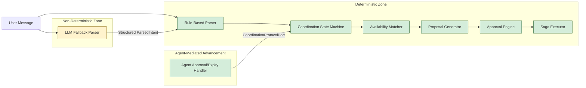
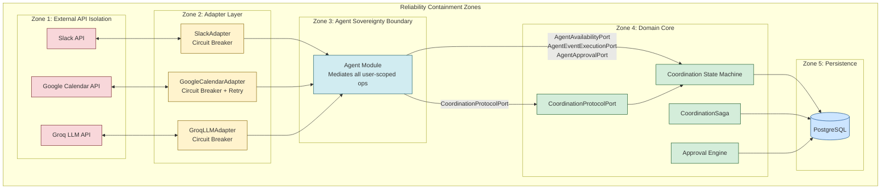
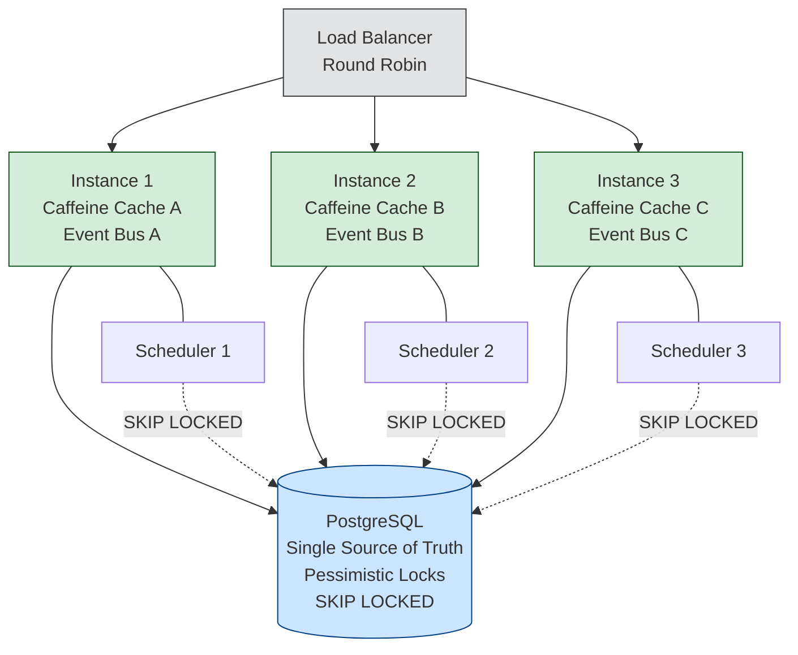

# 10. Quality Requirements

## Table of Contents

- [1. Quality Goals Overview](#1-quality-goals-overview)
- [2. Quality Scenario Format](#2-quality-scenario-format)
- [3. Determinism Scenarios](#3-determinism-scenarios)
  - [QS-D1 — Concurrent Approval vs. Timeout Resolution](#qs-d1--concurrent-approval-vs-timeout-resolution)
  - [QS-D2 — Identical Availability Data Produces Identical Proposal](#qs-d2--identical-availability-data-produces-identical-proposal)
  - [QS-D3 — Saga Produces Same Outcome on Replay](#qs-d3--saga-produces-same-outcome-on-replay)
  - [QS-D4 — LLM Failure Does Not Affect Deterministic Downstream](#qs-d4--llm-failure-does-not-affect-deterministic-downstream)
  - [QS-D5 — Horizontal Scaling Does Not Alter State Machine Outcome](#qs-d5--horizontal-scaling-does-not-alter-state-machine-outcome)
  - [QS-D6 — Agent-Mediated Approval Creation Produces Deterministic State Transition](#qs-d6--agent-mediated-approval-creation-produces-deterministic-state-transition)
- [4. Reliability Scenarios](#4-reliability-scenarios)
  - [QS-R1 — Google Calendar Outage During Availability Check](#qs-r1--google-calendar-outage-during-availability-check)
  - [QS-R2 — Partial Saga Failure with Successful Compensation](#qs-r2--partial-saga-failure-with-successful-compensation)
  - [QS-R3 — Compensation Failure Escalation](#qs-r3--compensation-failure-escalation)
  - [QS-R4 — Slack API Outage During Notification Delivery](#qs-r4--slack-api-outage-during-notification-delivery)
  - [QS-R5 — Database Connection Exhaustion Under Load](#qs-r5--database-connection-exhaustion-under-load)
  - [QS-R6 — Agent-Mediated Approval Creation Failure](#qs-r6--agent-mediated-approval-creation-failure)
- [5. Performance Scenarios](#5-performance-scenarios)
  - [QS-P1 — Slack Webhook Acknowledgment Latency](#qs-p1--slack-webhook-acknowledgment-latency)
  - [QS-P2 — Rule-Based Intent Parsing Latency](#qs-p2--rule-based-intent-parsing-latency)
  - [QS-P3 — LLM Fallback Parsing Latency](#qs-p3--llm-fallback-parsing-latency)
  - [QS-P4 — End-to-End Coordination Duration](#qs-p4--end-to-end-coordination-duration)
  - [QS-P5 — Approval Timeout Batch Processing Throughput](#qs-p5--approval-timeout-batch-processing-throughput)
  - [QS-P6 — CoordinationProtocolPort Advancement Latency](#qs-p6--coordinationprotocolport-advancement-latency)
- [6. Scalability Scenarios](#6-scalability-scenarios)
  - [QS-S1 — Horizontal Instance Addition](#qs-s1--horizontal-instance-addition)
  - [QS-S2 — Scheduler Work Distribution Under Scaling](#qs-s2--scheduler-work-distribution-under-scaling)
  - [QS-S3 — Database Connection Pool Saturation Boundary](#qs-s3--database-connection-pool-saturation-boundary)
  - [QS-S4 — Cache Independence Across Nodes](#qs-s4--cache-independence-across-nodes)
- [7. Security Scenarios](#7-security-scenarios)
  - [QS-SEC1 — Slack Request Signature Verification](#qs-sec1--slack-request-signature-verification)
  - [QS-SEC2 — JWT Stateless Authentication](#qs-sec2--jwt-stateless-authentication)
  - [QS-SEC3 — OAuth Token Encryption at Rest](#qs-sec3--oauth-token-encryption-at-rest)
  - [QS-SEC4 — Agent Sovereignty Cross-User Data Isolation](#qs-sec4--agent-sovereignty-cross-user-data-isolation)
  - [QS-SEC5 — Agent Sovereignty Enforcement on Approval Creation](#qs-sec5--agent-sovereignty-enforcement-on-approval-creation)
- [8. Auditability & Compliance Scenarios](#8-auditability--compliance-scenarios)
  - [QS-A1 — State Transition Log Completeness](#qs-a1--state-transition-log-completeness)
  - [QS-A2 — Correlation ID End-to-End Propagation](#qs-a2--correlation-id-end-to-end-propagation)
  - [QS-A3 — GDPR Data Export Completeness](#qs-a3--gdpr-data-export-completeness)
  - [QS-A4 — Saga Compensation Audit Trail](#qs-a4--saga-compensation-audit-trail)
  - [QS-A5 — Agent-Mediated Approval Advancement Audit Trail](#qs-a5--agent-mediated-approval-advancement-audit-trail)
- [9. Modularity & Extraction Readiness Scenarios](#9-modularity--extraction-readiness-scenarios)
  - [QS-M1 — No Cross-Module JOIN Guarantee](#qs-m1--no-cross-module-join-guarantee)
  - [QS-M2 — No Coordination-to-Calendar/Approval/Messaging Dependency](#qs-m2--no-coordination-to-calendarapprovalmessaging-dependency)
  - [QS-M3 — Module Extraction Feasibility](#qs-m3--module-extraction-feasibility)
  - [QS-M4 — Calendar Provider Replacement](#qs-m4--calendar-provider-replacement)
  - [QS-M5 — Approval Module Replacement Independence](#qs-m5--approval-module-replacement-independence)
- [10. Observability Scenarios](#10-observability-scenarios)
  - [QS-O1 — Coordination Outcome Metrics Emission](#qs-o1--coordination-outcome-metrics-emission)
  - [QS-O2 — Health Check Failure Detection](#qs-o2--health-check-failure-detection)
  - [QS-O3 — Circuit Breaker State Monitoring](#qs-o3--circuit-breaker-state-monitoring)
  - [QS-O4 — LLM Fallback Rate Monitoring](#qs-o4--llm-fallback-rate-monitoring)
  - [QS-O5 — CoordinationProtocolPort Call Metrics](#qs-o5--coordinationprotocolport-call-metrics)
- [11. Usability Scenarios](#11-usability-scenarios)
  - [QS-U1 — Approval Timeout UX Behavior](#qs-u1--approval-timeout-ux-behavior)
  - [QS-U2 — LLM Ambiguity Fallback UX](#qs-u2--llm-ambiguity-fallback-ux)
  - [QS-U3 — Notification Failure Non-Blocking UX](#qs-u3--notification-failure-non-blocking-ux)
- [12. Quality Trade-Off Summary](#12-quality-trade-off-summary)

---

## 1. Quality Goals Overview

The following table defines CoAgent4U's quality attributes in strict priority order. Every quality goal traces to at least one Architecture Decision Record (ADR) and drives specific measurable scenarios in subsequent sections.

| Priority | Quality Attribute | ID | Architectural Driver | Explanation |
|----------|-------------------|----|----------------------|-------------|
| 1 — Highest | Determinism | Q1 | ADR-04 (State Machine), ADR-07 (Pessimistic Locking), ADR-10 (Two-Tier Parsing), ADR-13 (CoordinationProtocolPort) | Given identical inputs, the system must produce identical outputs. The coordination state machine, approval resolution, and saga execution must be fully reproducible. Non-determinism is confined to the LLM fallback tier. Agent-mediated state advancement via CoordinationProtocolPort uses the same deterministic state machine and pessimistic locking as the orchestrator path. |
| 2 | Reliability | Q2 | ADR-05 (Saga + Compensation), ADR-11 (Timeout Mechanism) | External system failures must not corrupt internal state. Partial failures in the dual-calendar saga must be compensated. Approval timeouts must fire regardless of user responsiveness. |
| 3 | Auditability | Q3 | ADR-04 (State Machine), ADR-08 (Table Ownership), ADR-13 (CoordinationProtocolPort) | Every coordination state transition, approval decision, and saga step must be recorded in an append-only audit trail with correlation IDs. Transitions advanced via CoordinationProtocolPort are logged with trigger source "agent-via-protocol-port". Regulatory and GDPR data export must be satisfiable from the audit store. |
| 4 | Modularity | Q4 | ADR-01 (Modular Monolith), ADR-02 (Hexagonal), ADR-03 (Agent Sovereignty), ADR-13 (CoordinationProtocolPort), ADR-14 (AgentApprovalPort) | Module boundaries are enforced at compile time and verified by fitness functions. CoordinationProtocolPort and AgentApprovalPort formalize the agent↔coordination boundary — coordination-module has zero compile-time dependency on approval-module or messaging-module. Any module can be extracted to an independent service by replacing in-process port calls with network calls. |
| 5 | Testability | Q5 | ADR-02 (Hexagonal), ADR-03 (Agent Sovereignty), ADR-13 (CoordinationProtocolPort), ADR-14 (AgentApprovalPort) | Domain logic is testable without Spring context, database, or external services. Every state machine transition, saga path, and guard condition is unit-testable in isolation. CoordinationProtocolPort and AgentApprovalPort can be tested with pure mocks — no approval-module or notification infrastructure required. |
| 6 | Security | Q6 | ADR-03 (Agent Sovereignty), ADR-09 (Stateless Nodes) | All inbound requests are authenticated and authorized. OAuth tokens are encrypted at rest. Agent Sovereignty prevents cross-user data leakage. JWT authentication is stateless and verifiable on any instance. |
| 7 | Performance | Q7 | ADR-06 (In-Process Events), ADR-10 (Two-Tier Parsing) | Slack webhook acknowledgment within 3 seconds. Rule-based intent parsing under 50ms. End-to-end coordination bounded by external API latency, not internal processing. |
| 8 | Scalability | Q8 | ADR-09 (Stateless Nodes), ADR-07 (SKIP LOCKED), ADR-08 (Single PostgreSQL) | Horizontal scaling via stateless container replicas behind a load balancer. Database connection pooling per instance. Scheduler work distribution via SKIP LOCKED without leader election. |
| 9 | Portability | Q9 | ADR-12 (Cloud-Agnostic Deployment) | The application runs on any Docker-compatible host. No cloud-vendor-specific services in the application layer. Infrastructure configuration is external to the application artifact. |
| 10 | Cost Efficiency | Q10 | ADR-01 (Modular Monolith), ADR-06 (In-Process Events), ADR-10 (Two-Tier Parsing) | Minimal infrastructure footprint: one database, one application container, no message broker. LLM API calls minimized through rule-based-first parsing. Solo developer operational burden kept low. |

---

## 2. Quality Scenario Format

Every quality scenario in this document uses the following six-part structure, derived from the SEI quality attribute scenario model.

| Element | Definition |
|---------|------------|
| Source | The actor or system that generates the stimulus (user, scheduler, external API, developer). |
| Stimulus | The event or condition that triggers the scenario (request, failure, concurrent access, deployment action). |
| Environment | The system state when the stimulus occurs (normal operation, degraded mode, horizontal scaling, deployment). |
| Artifact | The specific architectural component or module affected. |
| Response | The observable system behavior in response to the stimulus. |
| Response Measure | The quantitative or binary criterion by which the response is evaluated as acceptable or unacceptable. |

---

## 3. Determinism Scenarios

Determinism is the highest-priority quality attribute. The coordination critical path — from intent parsing through availability matching, proposal generation, dual approval, and saga-based event creation — must produce identical outcomes given identical inputs. Non-determinism is confined to the LLM fallback tier, which is excluded from all downstream decision logic. Agent-mediated state advancement through CoordinationProtocolPort (ADR-13) uses the same deterministic CoordinationStateMachine domain service and pessimistic locking strategy as the orchestrator-driven path, ensuring both entry points to the state machine are equally deterministic.

The LLM's output is coerced into a fixed `ParsedIntent` structure with an enum `IntentType` before entering the deterministic zone. Once inside the deterministic zone, no probabilistic computation occurs. Agent-mediated advancement (approval decisions and expiration events flowing through CoordinationProtocolPort) enters the same deterministic state machine through a lock-protected synchronous call.

### QS-D1 — Concurrent Approval vs. Timeout Resolution

| Element | Description |
|---------|-------------|
| Source | User A (approval click routed through `CollaborativeApprovalDecisionHandler` → `CoordinationProtocolPort.advance()`) and Timeout Scheduler (batch expiration routed through `CollaborativeApprovalExpiredHandler` → `CoordinationProtocolPort.terminate()`) |
| Stimulus | Both attempt to transition the same coordination entity simultaneously — one via `advance()` with an approval decision, the other via `terminate()` with an expiration reason |
| Environment | Normal operation, two application instances, PostgreSQL under normal load |
| Artifact | `CoordinationProtocolPort`, `CoordinationStateMachine` domain service, coordination entity row with pessimistic lock |
| Response | Exactly one transition occurs. The pessimistic row lock (`SELECT ... FOR UPDATE`) on the coordination entity serializes access. The first transaction to acquire the lock evaluates the state machine transition and commits. The second transaction reads the updated state, finds the guard condition unsatisfied (coordination is no longer in an approval-awaiting state), and performs a no-op. Both paths are logged with their respective trigger sources ("agent-via-protocol-port" for approval, "timeout-via-protocol-port" for expiration). |
| Response Measure | Zero occurrences of dual-write. Zero `OptimisticLockException` retry loops. Database state reflects exactly one terminal transition per coordination approval phase. `coordination_state_log` contains exactly one transition entry for the contested state. Verifiable via integration test with concurrent threads calling `CoordinationProtocolPort`. |

---

### QS-D2 — Identical Availability Data Produces Identical Proposal

| Element | Description |
|---------|-------------|
| Source | `CoordinationOrchestrator` application service |
| Stimulus | Two coordination requests with identical participant availability blocks and identical scheduling parameters (duration, date range) |
| Environment | Normal operation |
| Artifact | `AvailabilityMatcher` domain service, `ProposalGenerator` domain service |
| Response | Both requests produce the same ranked list of proposed time slots. The matching algorithm uses deterministic sorting (earliest start time, then shortest gap) with no randomization or probabilistic scoring. |
| Response Measure | Unit tests assert byte-identical `ProposalResult` objects for identical inputs across 1,000 invocations. No `Random`, `UUID.randomUUID()`, or `System.currentTimeMillis()` calls in matching or proposal logic. |

---

### QS-D3 — Saga Produces Same Outcome on Replay

| Element | Description |
|---------|-------------|
| Source | Reconciliation scheduler (crash recovery) |
| Stimulus | Application crashes after saga Step 1 (Agent A event created via `AgentEventExecutionPort`, `eventId_A` persisted) but before Step 2 |
| Environment | Recovery after JVM crash, new instance reads persisted saga state |
| Artifact | `CoordinationSaga` domain service, coordination entity with persisted intermediate state (`CREATING_EVENT_A` or `CREATING_EVENT_B`) |
| Response | Reconciliation scheduler detects the coordination in an intermediate saga state (stuck > 2 minutes). It resumes at the appropriate step: attempts Agent B event creation via `AgentEventExecutionPort`. Outcome is identical to what would have occurred without the crash — either `COMPLETED` (both events) or `FAILED` with compensation (Agent B failed, Agent A event deleted via `AgentEventExecutionPort`). |
| Response Measure | No orphaned events remain after reconciliation completes. Saga terminal state matches the state that a non-interrupted execution would have produced given the same external API responses. |

---

### QS-D4 — LLM Failure Does Not Affect Deterministic Downstream

| Element | Description |
|---------|-------------|
| Source | User sends ambiguous message, Groq API is unavailable |
| Stimulus | Rule-based parser returns confidence < 0.7, LLM fallback call times out |
| Environment | Groq API degraded or unreachable |
| Artifact | `IntentParser` domain service, `LLMPort` outbound port |
| Response | `ParsedIntent(UNKNOWN)` is returned. The user receives a structured rephrasing prompt. No coordination workflow is initiated. The deterministic zone is never entered with ambiguous input. |
| Response Measure | Zero coordination entities created from `UNKNOWN` intents. LLM timeout does not propagate as an exception to the coordination state machine. Circuit breaker on `LLMPort` opens after 3 consecutive failures. |

---

### QS-D5 — Horizontal Scaling Does Not Alter State Machine Outcome

| Element | Description |
|---------|-------------|
| Source | Two application instances processing events for the same coordination |
| Stimulus | Instance A processes orchestrator-driven availability checking; Instance B processes an agent-mediated approval callback via `CoordinationProtocolPort.advance()` |
| Environment | Two container replicas behind round-robin load balancer |
| Artifact | `CoordinationStateMachine` domain service, `CoordinationProtocolPort`, coordination entity row in PostgreSQL |
| Response | Both instances acquire the pessimistic lock sequentially. Each transition is evaluated against the current persisted state by the same `CoordinationStateMachine` domain service. The state machine produces the same sequence of transitions regardless of which instance executes each step or which entry point (orchestrator vs. protocol port) is used. |
| Response Measure | `coordination_state_log` shows a linear, non-branching sequence of transitions. No duplicate transitions. No skipped states. Trigger source column distinguishes orchestrator-driven vs. agent-mediated transitions. Verifiable via load test with 2+ instances and audit log analysis. |

---

### QS-D6 — Agent-Mediated Approval Creation Produces Deterministic State Transition

| Element | Description |
|---------|-------------|
| Source | `CoordinationOrchestrator` transitioning from `PROPOSAL_GENERATED` to `AWAITING_APPROVAL` |
| Stimulus | Orchestrator calls `AgentApprovalPort.createApprovalRequest()` to create approval for the target user |
| Environment | Normal operation |
| Artifact | `AgentApprovalPort` (ADR-14), agent-module (implementer), approval-module (internal delegation), `CoordinationStateMachine` |
| Response | `AgentApprovalPort` delegates to the target user's agent, which internally calls `ApprovalPort` to create the approval entity. The coordination state machine transitions to the appropriate awaiting-approval state only after receiving `ApprovalRequestConfirmation`. The coordination-module never interacts with approval-module directly — the agent mediates the entire interaction. |
| Response Measure | State transition to `AWAITING_APPROVAL` occurs if and only if `ApprovalRequestConfirmation` is returned. Zero partial states where approval was not created but coordination advanced. ArchUnit verifies zero imports from coordination-module to approval-module. |

---

## 4. Reliability Scenarios

Reliability ensures that external system failures do not corrupt CoAgent4U's internal state and that partial failures are compensated.

Zone 1 failures are contained in Zone 2 by circuit breakers and timeouts. Zone 3 (Agent Sovereignty boundary, ADR-03) ensures the coordination-module never directly encounters infrastructure exceptions — agents translate adapter failures into domain-level results before reaching Zone 4. Zone 4 never sees raw infrastructure exceptions — only domain-level failure results. Zone 5 is the single source of truth; its failure is a total system failure with no mitigation beyond database-level replication.

### QS-R1 — Google Calendar Outage During Availability Check

| Element | Description |
|---------|-------------|
| Source | Google Calendar API |
| Stimulus | HTTP 503 response or connection timeout during availability fetch via `AgentAvailabilityPort` |
| Environment | Normal operation, Google Calendar experiencing partial outage |
| Artifact | `GoogleCalendarAdapter`, agent-module (`CalendarPort` consumer), `AgentAvailabilityPort`, `CoordinationOrchestrator` |
| Response | Adapter retries once with exponential backoff (1s). If retry fails, circuit breaker records failure. Agent translates the failure into an `AvailabilityResult.UNAVAILABLE` domain result returned via `AgentAvailabilityPort`. `CoordinationOrchestrator` transitions the coordination to `FAILED` state. User is notified via domain event → messaging-module's `NotificationEventHandler`. The coordination-module never sees the Google Calendar exception. |
| Response Measure | No coordination entity left in an intermediate state. `FAILED` state recorded in `coordination_state_log` with trigger source "orchestrator". Slack notification sent within 5 seconds of failure determination. Circuit breaker opens after 5 failures within a 60-second window. |

---

### QS-R2 — Partial Saga Failure with Successful Compensation

| Element | Description |
|---------|-------------|
| Source | Google Calendar API (Agent B's calendar) |
| Stimulus | Event creation for Agent B returns HTTP 500 after Agent A's event was successfully created via `AgentEventExecutionPort` |
| Environment | Normal operation, one Google Calendar endpoint degraded |
| Artifact | `CoordinationSaga`, `AgentEventExecutionPort`, coordination entity |
| Response | Saga detects Step 2 failure. Initiates compensation: calls `AgentEventExecutionPort.deleteEvent(eventId_A)` to remove Agent A's event. Coordination transitions to `FAILED`. `CoordinationFailed` domain event published. Both users notified via messaging-module's `NotificationEventHandler` that scheduling failed and neither calendar was modified. |
| Response Measure | Agent A's calendar contains zero orphaned events. Coordination terminal state is `FAILED`. Compensation execution logged in `coordination_state_log` with `eventId_A` reference. Total saga + compensation duration < 15 seconds. |

---

### QS-R3 — Compensation Failure Escalation

| Element | Description |
|---------|-------------|
| Source | Google Calendar API (Agent A's calendar, during compensation) |
| Stimulus | Agent B event creation fails (Step 2), and Agent A event deletion via `AgentEventExecutionPort` also fails (compensation step) |
| Environment | Google Calendar experiencing widespread outage |
| Artifact | `CoordinationSaga`, coordination entity |
| Response | Saga transitions coordination to `REQUIRES_MANUAL_INTERVENTION`. Orphaned `eventId_A` is persisted on the coordination entity. `CRITICAL`-level audit log entry emitted. Reconciliation scheduler will retry compensation via `AgentEventExecutionPort` on each cycle until successful or manually resolved. |
| Response Measure | Zero silent data inconsistency — the orphaned event is tracked explicitly. `REQUIRES_MANUAL_INTERVENTION` state visible in monitoring dashboard. Reconciliation retry interval: every 5 minutes. Alert emitted to operator channel. |

---

### QS-R4 — Slack API Outage During Notification Delivery

| Element | Description |
|---------|-------------|
| Source | Slack API |
| Stimulus | HTTP 429 or 503 when messaging-module's `NotificationEventHandler` attempts to deliver a coordination outcome notification |
| Environment | Coordination has reached a terminal state (`COMPLETED`, `FAILED`, `REJECTED`), Slack is degraded |
| Artifact | `SlackMessagingAdapter`, `NotificationPort`, `NotificationEventHandler` (subscribes to `CoordinationCompleted`/`Failed`/`Rejected` events) |
| Response | Notification delivery failure does not affect the coordination state — the state transition was already committed to PostgreSQL before the domain event was published. The notification handler logs the failure, and the circuit breaker records it. A reconciliation task detects coordinations with `notification_sent = false` and retries delivery. |
| Response Measure | Coordination state remains in its committed terminal state — no state machine corruption. No rollback of calendar events due to notification failure. Notification retry within 5 minutes. User eventually receives the notification. |

---

### QS-R5 — Database Connection Exhaustion Under Load

| Element | Description |
|---------|-------------|
| Source | Application under sustained high request volume |
| Stimulus | HikariCP connection pool reaches maximum size (default: 10 connections per instance) |
| Environment | Peak load, multiple concurrent coordination workflows |
| Artifact | HikariCP connection pool, all persistence adapters |
| Response | New connection requests block for up to `connectionTimeout` (30 seconds). If timeout expires, `SQLTransientConnectionException` propagates. Use case returns HTTP 503 to caller. No partial state changes — the transaction was never started. |
| Response Measure | Zero data corruption. Connection pool utilization metric exceeds 90% threshold, triggering alert. P99 response time degrades beyond 5 seconds. Horizontal scaling (add instance) resolves contention within 2 minutes of deployment. |

---

### QS-R6 — Agent-Mediated Approval Creation Failure

| Element | Description |
|---------|-------------|
| Source | approval-module persistence layer or agent-module internal delegation |
| Stimulus | `AgentApprovalPort.createApprovalRequest()` fails due to database constraint violation or internal error |
| Environment | Normal operation, approval-module experiencing transient failure |
| Artifact | `AgentApprovalPort` (ADR-14), agent-module, `CoordinationOrchestrator` |
| Response | Agent-module catches the internal failure and returns a failure result via `AgentApprovalPort`. `CoordinationOrchestrator` transitions the coordination to `FAILED` state. No approval entity is left in a partial state. The coordination-module never sees approval-module internals — the agent boundary contains the failure. |
| Response Measure | Zero orphaned approval entities. Coordination transitions to `FAILED` atomically within the same transaction. `coordination_state_log` records the failure reason. Users notified via `CoordinationFailed` domain event. |

---

## 5. Performance Scenarios

### QS-P1 — Slack Webhook Acknowledgment Latency

| Element | Description |
|---------|-------------|
| Source | Slack API (webhook delivery) |
| Stimulus | Slack sends a slash command or interaction payload to CoAgent4U |
| Environment | Normal operation |
| Artifact | `SlackWebhookController` (inbound adapter), `IntentParser` domain service |
| Response | The controller acknowledges the webhook with HTTP 200 within Slack's required window. Heavy processing (availability checks, coordination orchestration) is dispatched asynchronously after acknowledgment. |
| Response Measure | Webhook acknowledgment latency P99 < 2,500ms. P50 < 500ms. Zero Slack timeout retries (Slack retries after 3 seconds). |

---

### QS-P2 — Rule-Based Intent Parsing Latency

| Element | Description |
|---------|-------------|
| Source | User message via Slack |
| Stimulus | Well-formed command matching rule-based patterns (e.g., "schedule meeting with @user tomorrow 2pm 30min") |
| Environment | Normal operation |
| Artifact | `IntentParser` domain service (Tier 1) |
| Response | `ParsedIntent` returned with confidence ≥ 0.7. No LLM call made. |
| Response Measure | Parsing latency P99 < 50ms. P50 < 5ms. Zero external API calls. Memory allocation < 1KB per parse invocation. |

---

### QS-P3 — LLM Fallback Parsing Latency

| Element | Description |
|---------|-------------|
| Source | User message via Slack |
| Stimulus | Ambiguous message, rule-based confidence < 0.7, LLM fallback invoked |
| Environment | Normal operation, Groq API responsive |
| Artifact | `GroqLLMAdapter`, `LLMPort` outbound port |
| Response | `ParsedIntent` returned from LLM classification within acceptable latency bound. |
| Response Measure | LLM round-trip P99 < 3,000ms. P50 < 1,000ms. Timeout threshold: 5 seconds. Circuit breaker opens after 3 consecutive timeouts. |

---

### QS-P4 — End-to-End Coordination Duration

| Element | Description |
|---------|-------------|
| Source | Initiating user |
| Stimulus | User initiates collaborative scheduling; both participants approve within minutes |
| Environment | Normal operation, both Google Calendars responsive, both users approve immediately |
| Artifact | Full coordination pipeline: intent parsing → availability (via `AgentAvailabilityPort`) → matching → proposal → approval (via `AgentApprovalPort`) → agent-mediated approval decision (via `CoordinationProtocolPort`) → saga (via `AgentEventExecutionPort`) |
| Response | Calendar events created on both calendars, coordination in `COMPLETED` state. |
| Response Measure | Total automated processing time (excluding human approval wait time) < 30 seconds. Availability checks: < 5 seconds each (Google Calendar API-bound). Approval creation via `AgentApprovalPort`: < 1 second. Saga execution: < 10 seconds (two sequential Google Calendar writes via `AgentEventExecutionPort`). |

---

### QS-P5 — Approval Timeout Batch Processing Throughput

| Element | Description |
|---------|-------------|
| Source | Scheduled timeout checker |
| Stimulus | 100 approvals expire simultaneously (burst scenario) |
| Environment | Two application instances, normal database load |
| Artifact | `CheckExpiredApprovalsUseCase`, `SKIP LOCKED` query, `CollaborativeApprovalExpiredHandler` → `CoordinationProtocolPort.terminate()` |
| Response | All 100 expired approvals transitioned to `EXPIRED` within two scheduler cycles. Each instance processes a non-overlapping subset via `SKIP LOCKED`. For collaborative approvals, the `CollaborativeApprovalExpiredHandler` calls `CoordinationProtocolPort.terminate()` to transition the coordination to the appropriate terminal state. |
| Response Measure | Processing rate ≥ 50 approvals per instance per 60-second cycle (batch size: 50). Total clearance time < 120 seconds. Zero deadlocks. Zero duplicate transitions. Each `CoordinationProtocolPort.terminate()` call completes within 500ms. |

---

### QS-P6 — CoordinationProtocolPort Advancement Latency

| Element | Description |
|---------|-------------|
| Source | Agent-module handler (`CollaborativeApprovalDecisionHandler`) |
| Stimulus | Approval decision received, agent calls `CoordinationProtocolPort.advance()` |
| Environment | Normal operation, single coordination entity targeted |
| Artifact | `CoordinationProtocolPort`, `CoordinationStateMachine`, pessimistic row lock |
| Response | Lock acquired, state machine transition evaluated, new state persisted, audit log entry written, domain event published — all within a single transaction. |
| Response Measure | `CoordinationProtocolPort.advance()` latency P99 < 200ms. P50 < 50ms. Lock acquisition time P99 < 100ms under normal contention. Zero state machine evaluations outside the lock boundary. |

---

## 6. Scalability Scenarios

Each instance operates independently. Caches are local and non-shared — cache misses increase database load proportionally to instance count. Schedulers on all instances compete for work via `SKIP LOCKED`, ensuring exactly-once processing without distributed coordination. Agent-mediated `CoordinationProtocolPort` calls from any instance use the same pessimistic locking mechanism, ensuring correct serialization regardless of which instance processes the approval callback.

### QS-S1 — Horizontal Instance Addition

| Element | Description |
|---------|-------------|
| Source | Operations team (or autoscaler) |
| Stimulus | Third application instance added to the deployment |
| Environment | Two instances running, database connection pool at 60% utilization per instance |
| Artifact | Load balancer, HikariCP, PostgreSQL `max_connections` |
| Response | New instance registers with load balancer, acquires its own connection pool, and begins serving requests. No configuration change on existing instances. No session migration. |
| Response Measure | New instance serves traffic within 30 seconds of container startup (Spring Boot startup + health check pass). Total database connections increase by `pool_size` (default 10). PostgreSQL `max_connections` must accommodate `instance_count × pool_size + overhead`. No request failures during scaling event. |

---

### QS-S2 — Scheduler Work Distribution Under Scaling

| Element | Description |
|---------|-------------|
| Source | Timeout scheduler on each instance |
| Stimulus | 200 approvals expire within the same 60-second scheduler window across 3 instances |
| Environment | Three instances, all running scheduler threads |
| Artifact | `CheckExpiredApprovalsUseCase`, `SELECT ... FOR UPDATE SKIP LOCKED LIMIT 50`, `CollaborativeApprovalExpiredHandler` → `CoordinationProtocolPort.terminate()` |
| Response | Each instance claims up to 50 approvals per cycle. Approvals claimed by Instance 1 are invisible to Instance 2 and Instance 3 due to `SKIP LOCKED`. For collaborative approvals, the agent handler on the processing instance calls `CoordinationProtocolPort.terminate()`, which acquires its own pessimistic lock on the coordination row — ensuring correct serialization even when the approval and coordination are processed on different instances. |
| Response Measure | All 200 approvals processed within 3 scheduler cycles (180 seconds worst case). Zero duplicate processing — each approval transitioned exactly once. Zero deadlocks — `SKIP LOCKED` eliminates lock contention on approval rows; pessimistic coordination locks are held briefly. |

---

### QS-S3 — Database Connection Pool Saturation Boundary

| Element | Description |
|---------|-------------|
| Source | Sustained concurrent request load |
| Stimulus | 50 concurrent coordination workflows, each holding a pessimistic lock for 200ms average transaction duration |
| Environment | Five instances, 10 connections per pool, 50 total connections |
| Artifact | HikariCP pool, PostgreSQL connection handler |
| Response | Under steady state, 50 connections can sustain 250 transactions/second (50 connections ÷ 0.2s per transaction). Beyond this rate, requests queue at the connection pool. |
| Response Measure | P99 latency remains < 5 seconds at 200 transactions/second. At 300 transactions/second, connection wait time exceeds 1 second and alerts fire. Scaling from 5 to 7 instances restores P99 < 2 seconds. |

---

### QS-S4 — Cache Independence Across Nodes

| Element | Description |
|---------|-------------|
| Source | New application instance (cold start) |
| Stimulus | Instance starts with an empty Caffeine cache while other instances have warm caches |
| Environment | Horizontal scaling event |
| Artifact | Caffeine local cache, `UserQueryPort` persistence adapter |
| Response | Cold instance serves all requests correctly — cache is a performance optimization, not a correctness requirement. Cache misses result in database queries that return authoritative data. |
| Response Measure | Cold-start cache miss rate: 100% (expected). Database query volume from new instance: elevated for the first 5 minutes, then normalizes as cache warms. Zero functional errors due to cache miss. No stale data served (cache TTL: 5 minutes). |

---

## 7. Security Scenarios

### QS-SEC1 — Slack Request Signature Verification

| Element | Description |
|---------|-------------|
| Source | Inbound HTTP request to Slack webhook endpoint |
| Stimulus | Request arrives with `X-Slack-Signature` header |
| Environment | Normal operation |
| Artifact | `SlackSignatureVerificationFilter` (inbound adapter, security layer) |
| Response | Filter computes HMAC-SHA256 of the request body using the Slack signing secret and compares against the provided signature. Timestamp replay window: 5 minutes. Invalid signature results in HTTP 401 with no further processing. |
| Response Measure | 100% of unsigned or incorrectly signed requests rejected. Zero false rejections of valid Slack requests. Signature verification latency < 1ms. |

---

### QS-SEC2 — JWT Stateless Authentication

| Element | Description |
|---------|-------------|
| Source | Authenticated user making API request |
| Stimulus | Request with `Authorization: Bearer <jwt>` header |
| Environment | Any application instance (no session affinity) |
| Artifact | `JwtAuthenticationFilter`, `SecurityPort` |
| Response | JWT signature verified using shared signing key. Claims extracted (user ID, roles, expiration). Expired or tampered tokens rejected with HTTP 401. No database lookup required for authentication. |
| Response Measure | Token verification latency < 2ms. Expired tokens rejected 100% of the time. Token tampering (modified payload) detected 100% of the time. Any instance can verify any token independently. |

---

### QS-SEC3 — OAuth Token Encryption at Rest

| Element | Description |
|---------|-------------|
| Source | OAuth flow completing token exchange |
| Stimulus | Google Calendar OAuth access and refresh tokens received |
| Environment | Normal operation |
| Artifact | `EncryptionPort`, `AESEncryptionAdapter`, `oauth_tokens` table |
| Response | Tokens encrypted with AES-256-GCM before persistence. Decrypted only at the moment of Google Calendar API call within the `GoogleCalendarAdapter` (inside agent-module's delegation path). Encryption key stored as environment variable, never in source code or database. |
| Response Measure | Zero plaintext tokens in database. Database dump reveals only ciphertext. Key rotation procedure documented and executable without application downtime (decrypt-with-old, encrypt-with-new migration). |

---

### QS-SEC4 — Agent Sovereignty Cross-User Data Isolation

| Element | Description |
|---------|-------------|
| Source | coordination-module requesting User B's calendar data |
| Stimulus | Coordination orchestrator needs User B's availability |
| Environment | Normal operation |
| Artifact | `AgentAvailabilityPort` (ADR-03), agent-module, `CalendarPort` |
| Response | Coordination-module calls `AgentAvailabilityPort` which delegates to User B's agent. The agent internally calls `CalendarPort` using User B's encrypted OAuth token. The coordination-module never sees the raw token, raw calendar event data, or User B's `CalendarPort` instance. It receives only `List<AvailabilityBlock>` domain value objects. |
| Response Measure | ArchUnit test verifies zero imports from `com.coagent4u.coordination` to `com.coagent4u.calendar`, `com.coagent4u.approval`, `com.coagent4u.messaging`, or `com.coagent4u.user`. Maven dependency graph has no compile-time path from coordination-module to calendar-module, approval-module, or messaging-module. Zero OAuth tokens accessible outside agent-module and calendar-module adapters. |

---

### QS-SEC5 — Agent Sovereignty Enforcement on Approval Creation

| Element | Description |
|---------|-------------|
| Source | coordination-module needing to create an approval request for a user |
| Stimulus | Coordination transitions to approval phase, calls `AgentApprovalPort.createApprovalRequest()` |
| Environment | Normal operation |
| Artifact | `AgentApprovalPort` (ADR-14), agent-module, approval-module |
| Response | Coordination-module calls `AgentApprovalPort` (declared in coordination-module, implemented by agent-module). The agent validates the request against its owner's authorization scope, then internally delegates to `ApprovalPort` (implemented by approval-module). The coordination-module has zero compile-time dependency on approval-module. The agent acts as a sovereignty boundary ensuring only authorized approval requests are created. |
| Response Measure | ArchUnit test verifies zero imports from `com.coagent4u.coordination` to `com.coagent4u.approval`. Maven dependency graph confirms no compile-time path. Agent validates that the target user matches its owner before delegating to `ApprovalPort`. |

---

## 8. Auditability & Compliance Scenarios

### QS-A1 — State Transition Log Completeness

| Element | Description |
|---------|-------------|
| Source | Any state transition in coordination or approval entities |
| Stimulus | `CoordinationStateMachine.transition()` invoked — either by `CoordinationOrchestrator` (synchronous phases) or via `CoordinationProtocolPort` (agent-mediated phases) |
| Environment | Normal operation |
| Artifact | `coordination_state_log` table, `approval_state_log` table |
| Response | Append-only log entry written within the same transaction as the state change. Entry contains: `correlation_id`, `entity_id`, `from_state`, `to_state`, `trigger`, `trigger_source`, `guard_result`, `actor_id`, `timestamp`. The `trigger_source` field distinguishes "orchestrator" (synchronous advancement), "agent-via-protocol-port" (approval decisions), and "timeout-via-protocol-port" (expiration events). |
| Response Measure | 100% of state transitions logged. Zero orphan transitions (state changed without log entry). Log entries are immutable — no `UPDATE` or `DELETE` operations permitted on log tables (enforced by database role permissions). Log count matches transition count per coordination entity. `trigger_source` is never null. |

---

### QS-A2 — Correlation ID End-to-End Propagation

| Element | Description |
|---------|-------------|
| Source | Inbound Slack webhook |
| Stimulus | Request arrives, `MDC.put("correlationId", ...)` set in filter |
| Environment | Normal operation |
| Artifact | All log statements, all database audit entries, all external API call logs |
| Response | The same correlation ID appears in the Slack webhook receipt log, intent parsing log, coordination state log (including entries with trigger_source "agent-via-protocol-port"), agent capability call logs (`AgentAvailabilityPort`, `AgentEventExecutionPort`, `AgentApprovalPort`), approval state log, saga step logs, Google Calendar API call logs, and Slack notification delivery logs. |
| Response Measure | Given a correlation ID, grep across structured logs reconstructs the full request lifecycle including agent-mediated phases. Correlation ID present in 100% of log entries related to a single user interaction. Async event handlers inherit the correlation ID via `EventContext`. `CoordinationProtocolPort` calls propagate the correlation ID from the originating approval event. |

---

### QS-A3 — GDPR Data Export Completeness

| Element | Description |
|---------|-------------|
| Source | User submitting a GDPR data export request |
| Stimulus | Data export API invoked for a specific user ID |
| Environment | Normal operation |
| Artifact | `UserDataExportService`, all module-owned tables |
| Response | Export includes: user profile, agent configuration, all coordination participations (as initiator or target), all approval records (including those created via `AgentApprovalPort`), all state transition logs where the user is an actor or the `trigger_source` references the user's agent, and all calendar events created on the user's behalf via `AgentEventExecutionPort`. OAuth tokens are excluded (infrastructure secrets). |
| Response Measure | Export covers 100% of user-attributable data across all module-owned tables. Export format: JSON. Export generation time < 30 seconds for a user with 500 historical coordinations. |

---

### QS-A4 — Saga Compensation Audit Trail

| Element | Description |
|---------|-------------|
| Source | Saga compensation triggered by Step 2 failure |
| Stimulus | `CoordinationSaga` executes compensation (instruct Agent A to delete event via `AgentEventExecutionPort`) |
| Environment | Partial failure during saga execution |
| Artifact | `coordination_state_log`, coordination entity |
| Response | Audit trail records: transition to `CREATING_EVENT_A` (with `eventId_A`, trigger_source "orchestrator"), transition to `CREATING_EVENT_B` (trigger_source "orchestrator"), transition to `FAILED` with compensation detail (`eventId_A` deletion confirmation or compensation failure), or transition to `REQUIRES_MANUAL_INTERVENTION` (with compensation error). Each saga step logged via the same state machine logging mechanism. |
| Response Measure | Every saga step produces a state transition log entry with `trigger_source`. The full saga history is reconstructable from the log. Compensation actions include the `eventId` being deleted for traceability. |

---

### QS-A5 — Agent-Mediated Approval Advancement Audit Trail

| Element | Description |
|---------|-------------|
| Source | `CollaborativeApprovalDecisionHandler` in agent-module |
| Stimulus | Approval decision event consumed, agent calls `CoordinationProtocolPort.advance()` |
| Environment | Normal operation |
| Artifact | `coordination_state_log`, `CoordinationProtocolPort` |
| Response | State transition log entry records: `from_state` (e.g., `AWAITING_APPROVAL_B`), `to_state` (e.g., `APPROVED_BY_B` or `AWAITING_APPROVAL_A`), `trigger` (approval decision details), `trigger_source` "agent-via-protocol-port", `actor_id` (the agent's associated user ID), and `timestamp`. |
| Response Measure | Every `CoordinationProtocolPort.advance()` and `terminate()` call produces a state transition log entry. The `trigger_source` "agent-via-protocol-port" is distinguishable from "orchestrator" entries. Given a coordination ID, the audit trail shows the complete interleaving of orchestrator-driven and agent-mediated transitions. |

---

## 9. Modularity & Extraction Readiness Scenarios

### QS-M1 — No Cross-Module JOIN Guarantee

| Element | Description |
|---------|-------------|
| Source | Developer writing a new repository query |
| Stimulus | Attempt to write a JPA query that joins `coordinations` table with `users` table |
| Environment | Development / CI pipeline |
| Artifact | Repository implementations, ArchUnit fitness functions |
| Response | ArchUnit test detects that `CoordinationRepository` (in coordination-module) references `User` entity (in user-module) and fails the build. Developer must use `AgentProfilePort` (not `UserQueryPort` directly) to fetch user data through the agent sovereignty boundary. |
| Response Measure | CI build fails within 60 seconds of push. Zero cross-module JOINs in production codebase. ArchUnit rule coverage: all repository classes in all modules. |

---

### QS-M2 — No Coordination-to-Calendar/Approval/Messaging Dependency

| Element | Description |
|---------|-------------|
| Source | Developer modifying coordination-module |
| Stimulus | Attempt to import `com.coagent4u.calendar.*`, `com.coagent4u.approval.*`, `com.coagent4u.messaging.*`, or `com.coagent4u.user.*` — or declare Maven dependency on any of these modules |
| Environment | Development / CI pipeline |
| Artifact | Maven module POM, ArchUnit rules |
| Response | Maven compilation fails (no dependency declared) or ArchUnit test fails (import rule violation). Developer must route operations through the appropriate agent capability port: `AgentAvailabilityPort` (availability), `AgentEventExecutionPort` (events), `AgentApprovalPort` (approvals), `AgentProfilePort` (user metadata). State advancement from approval decisions must flow through `CoordinationProtocolPort`. |
| Response Measure | Zero compile-time paths from coordination-module to calendar-module, approval-module, messaging-module, or user-module in the Maven dependency graph. ArchUnit enforces zero package-level imports. Agent Sovereignty violation is a build-breaking event. |

---

### QS-M3 — Module Extraction Feasibility

| Element | Description |
|---------|-------------|
| Source | Architecture team deciding to extract agent-module as an independent service |
| Stimulus | Extraction initiated as a planned architectural evolution |
| Environment | Post-MVP, team has grown |
| Artifact | agent-module, all port interfaces (`AgentAvailabilityPort`, `AgentEventExecutionPort`, `AgentProfilePort`, `AgentApprovalPort`, `CoordinationProtocolPort`) |
| Response | Extraction requires: (1) deploy agent-module as a standalone Spring Boot application with its own database containing agent-owned tables, (2) implement `AgentAvailabilityPort`, `AgentEventExecutionPort`, `AgentProfilePort`, and `AgentApprovalPort` as HTTP client adapters in coordination-module pointing to the new agent service, (3) expose `CoordinationProtocolPort` as an HTTP endpoint in coordination-module that the extracted agent service calls, (4) remove agent-module Maven dependency from coordination-module. Domain logic, application logic, and port interface contracts require zero changes. |
| Response Measure | Extraction achievable within 2 developer-weeks (estimated). Zero domain or application layer code modifications. Only adapter layer (inbound + outbound) implementations change. All existing unit and integration tests pass after extraction with adapter replacement. `CoordinationProtocolPort` becomes a REST endpoint; `AgentApprovalPort` becomes a REST client — both maintaining the same contract. |

---

### QS-M4 — Calendar Provider Replacement

| Element | Description |
|---------|-------------|
| Source | Product decision to support Microsoft Outlook alongside Google Calendar |
| Stimulus | New `OutlookCalendarAdapter` implementing existing `CalendarPort` interface |
| Environment | Development |
| Artifact | `CalendarPort` outbound port, calendar-module adapter layer |
| Response | New adapter implements `CalendarPort.fetchAvailability()`, `CalendarPort.createEvent()`, and `CalendarPort.deleteEvent()` using Microsoft Graph API. Agent-module selects the appropriate adapter based on user configuration. Coordination-module is unaware of the change — it interacts only with agent capability ports (`AgentAvailabilityPort`, `AgentEventExecutionPort`). |
| Response Measure | Zero changes to coordination-module, approval-module, or agent-module domain/application layers. New adapter passes existing `CalendarPort` integration test suite (parameterized by provider). |

---

### QS-M5 — Approval Module Replacement Independence

| Element | Description |
|---------|-------------|
| Source | Product decision to replace approval storage or approval workflow engine |
| Stimulus | New approval persistence mechanism or approval logic |
| Environment | Development |
| Artifact | `ApprovalPort`, approval-module |
| Response | Changes are isolated to approval-module internals and agent-module's delegation logic. Coordination-module is completely unaffected — it interacts with approvals only through `AgentApprovalPort` (creation, ADR-14) and `CoordinationProtocolPort` (decision advancement, ADR-13). Neither port exposes approval-module internals. |
| Response Measure | Zero changes to coordination-module. Zero changes to `AgentApprovalPort` or `CoordinationProtocolPort` contracts. Agent-module's internal delegation updated to use new `ApprovalPort` implementation. All coordination-module unit tests pass without modification. |

---

## 10. Observability Scenarios

### QS-O1 — Coordination Outcome Metrics Emission

| Element | Description |
|---------|-------------|
| Source | `CoordinationOrchestrator` or `CoordinationProtocolPort` completing a coordination workflow |
| Stimulus | Coordination reaches any terminal state (`COMPLETED`, `FAILED`, `REJECTED`, `REQUIRES_MANUAL_INTERVENTION`) — whether via orchestrator-driven saga completion or agent-mediated protocol port termination |
| Environment | Normal operation |
| Artifact | Micrometer metrics registry, `/actuator/prometheus` endpoint |
| Response | Counter `coordination.completed.total` incremented with tags: `outcome={completed\|failed\|rejected\|intervention}`, `trigger_source={orchestrator\|agent-via-protocol-port\|timeout-via-protocol-port}`, `duration_bucket={<30s\|30-60s\|>60s}`. |
| Response Measure | 100% of terminal coordinations emit a metric. Prometheus scrape interval: 15 seconds. Grafana dashboard displays real-time completion rate, failure rate, and duration percentiles, segmented by trigger source. |

---

### QS-O2 — Health Check Failure Detection

| Element | Description |
|---------|-------------|
| Source | Load balancer health check probe |
| Stimulus | `GET /actuator/health` returns non-200 status |
| Environment | Database connection lost, or Slack API circuit breaker open |
| Artifact | Spring Boot Actuator health indicators: `db` (PostgreSQL), `slack` (circuit breaker status), `googleCalendar` (circuit breaker status), `groq` (circuit breaker status) |
| Response | Health endpoint reports `DOWN` with the specific failing component identified. Load balancer removes the instance from rotation. Container orchestrator schedules a restart after configurable failure threshold. |
| Response Measure | Health check response time < 500ms. Database health check verifies connection with `SELECT 1`. Failed instance removed from load balancer within 2 health check intervals (default: 20 seconds). |

---

### QS-O3 — Circuit Breaker State Monitoring

| Element | Description |
|---------|-------------|
| Source | External API adapter experiencing consecutive failures |
| Stimulus | Google Calendar adapter fails 5 consecutive requests within 60 seconds |
| Environment | Google Calendar partial outage |
| Artifact | Resilience4j circuit breaker on `GoogleCalendarAdapter`, Micrometer metrics |
| Response | Circuit breaker transitions from `CLOSED` to `OPEN`. Metric `resilience4j.circuitbreaker.state` changes to `open` for `googleCalendar` circuit. All subsequent `CalendarPort` calls fail-fast with `CircuitBreakerOpenException` (no network call attempted). After 30-second wait, circuit breaker enters `HALF_OPEN` and permits one probe request. |
| Response Measure | State transition visible in Prometheus within 15 seconds. Grafana alert fires when any circuit breaker enters `OPEN` state. `OPEN`-state duration and transition history retained for 30 days. |

---

### QS-O4 — LLM Fallback Rate Monitoring

| Element | Description |
|---------|-------------|
| Source | `IntentParser` domain service |
| Stimulus | Rule-based parser returns confidence < 0.7, triggering LLM fallback |
| Environment | Normal operation |
| Artifact | Micrometer counter `intent.parsing.tier` with tags `tier={rule_based\|llm_fallback\|unknown}` |
| Response | Each intent parsing invocation increments the appropriate tier counter. Dashboard displays the ratio of rule-based to LLM-fallback to unknown classifications. |
| Response Measure | Tier distribution visible in real-time. If LLM fallback rate exceeds 40% of total parses, alert fires — this indicates that rule-based patterns need expansion. If unknown rate exceeds 15%, alert fires — this indicates UX guidance needs improvement. |

---

### QS-O5 — CoordinationProtocolPort Call Metrics

| Element | Description |
|---------|-------------|
| Source | Agent-module handlers calling `CoordinationProtocolPort` |
| Stimulus | `CoordinationProtocolPort.advance()` or `terminate()` invoked |
| Environment | Normal operation |
| Artifact | Micrometer timer `coordination.protocol.port` with tags `operation={advance\|terminate}`, `outcome={success\|no_op\|error}` |
| Response | Each protocol port invocation is timed and tagged. Dashboard displays call rate, latency percentiles, and no-op rate (indicating stale or duplicate calls). |
| Response Measure | Latency P99 visible in Prometheus. No-op rate > 5% triggers investigation (may indicate duplicate event delivery or race conditions being correctly handled). Error rate > 1% triggers alert. |

---

## 11. Usability Scenarios

### QS-U1 — Approval Timeout UX Behavior

| Element | Description |
|---------|-------------|
| Source | User who did not respond to an approval request within 12 hours |
| Stimulus | Approval expires (batch scheduler → `CollaborativeApprovalExpiredHandler` → `CoordinationProtocolPort.terminate()`), coordination transitions to `REJECTED` |
| Environment | Normal operation |
| Artifact | `CoordinationProtocolPort`, `CoordinationRejected` domain event, messaging-module `NotificationEventHandler` |
| Response | `CoordinationProtocolPort.terminate()` transitions coordination to `REJECTED` and publishes `CoordinationRejected` event. The messaging-module's `NotificationEventHandler` delivers a Slack message to both participants explaining that the scheduling request expired due to non-response. The message includes: the original proposed time slots, the name of the non-responding participant (if permitted by privacy settings), and a suggestion to re-initiate the scheduling request. |
| Response Measure | Notification delivered within 120 seconds of expiration processing. Message text is clear and actionable — no technical jargon. User can re-initiate with a single command. |

---

### QS-U2 — LLM Ambiguity Fallback UX

| Element | Description |
|---------|-------------|
| Source | User sends a message that neither the rule-based parser nor the LLM can classify |
| Stimulus | Final `ParsedIntent` has type `UNKNOWN` |
| Environment | Normal operation or LLM degraded |
| Artifact | `SlackResponseFormatter`, `MessagingPort` |
| Response | User receives a structured response listing the supported command types with examples: "I didn't understand that. Here's what I can do: [add an event, check your schedule, schedule a meeting with someone]. Try something like: 'schedule meeting with @jane tomorrow 2pm 30min'." |
| Response Measure | Help response delivered within 3 seconds. Response includes at least 3 concrete example commands. User retry rate after receiving help > 60% (measured via follow-up message within 2 minutes). |

---

### QS-U3 — Notification Failure Non-Blocking UX

| Element | Description |
|---------|-------------|
| Source | Slack API returning errors during notification delivery |
| Stimulus | Coordination completes successfully (both events created via `AgentEventExecutionPort`) but Slack notification via messaging-module's `NotificationEventHandler` fails |
| Environment | Slack degraded, coordination workflow nominal |
| Artifact | `NotificationEventHandler` (`@TransactionalEventListener(AFTER_COMMIT)`), `MessagingPort`, `SlackMessagingAdapter` |
| Response | Calendar events are present on both users' calendars (the primary outcome is successful). The `CoordinationCompleted` domain event was published after the saga committed. Notification failure is logged and queued for retry. Users can verify the meeting exists by checking their calendars directly. When Slack recovers, the notification is delivered with a note indicating it was delayed. |
| Response Measure | Calendar event creation is never blocked or rolled back due to notification failure. Retry delivers the notification within 10 minutes of Slack recovery. Zero user-facing errors — the calendar mutation (the primary value) succeeded. |

---

## 12. Quality Trade-Off Summary

Every architectural decision optimizes for certain quality attributes at the expense of others. The following table documents these trade-offs explicitly so that future architects can evaluate whether the balance remains appropriate as the system evolves.

| Decision | Improves | Sacrifices | Mitigation for Sacrifice |
|----------|----------|------------|--------------------------|
| Modular Monolith (ADR-01) | Simplicity, cost efficiency, debuggability, solo-developer productivity | Independent module scaling, fault isolation between modules | Extraction-ready module boundaries; horizontal scaling of entire monolith sufficient at MVP scale |
| Hexagonal Architecture (ADR-02) | Testability, adapter replaceability, domain purity | Structural overhead (port/adapter count), initial development velocity | Port proliferation bounded by module count (~20 ports total); templates reduce boilerplate |
| Agent Sovereignty (ADR-03) | Data isolation, extraction readiness, security (credential containment) | Additional indirection (one extra method call hop per agent interaction), increased port count (5 agent-facing ports) | In-process call overhead is sub-millisecond; each port has a narrow, well-defined contract; becomes a network call only post-extraction |
| Deterministic State Machine (ADR-04) | Determinism, auditability, exhaustive testability | Flexibility (adding states requires migration), no parallel availability checks | Sequential availability checks add ~5 seconds; parallel execution deferred to post-MVP |
| Saga with Compensation (ADR-05) | Consistency (both-or-neither calendar guarantee) | Latency (two sequential API calls + potential compensation), complexity | Saga complexity contained in one domain service; idempotency keys prevent duplicate events |
| In-Process Event Bus (ADR-06) | Simplicity, zero infrastructure, sub-millisecond dispatch | Event durability, cross-instance event sharing, replay capability | Events are side effects only; reconciliation scheduler detects and repairs missed side effects |
| Pessimistic Locking (ADR-07) | Determinism, no retry loops, strict serialization | Throughput under extreme contention, database connection hold time | Contention limited to coordination-level granularity; `SKIP LOCKED` eliminates batch deadlocks |
| Single PostgreSQL (ADR-08) | Operational simplicity, referential integrity, single backup target | Module-level fault isolation, independent scaling of module data stores | Table ownership enforced by convention + ArchUnit; extraction migrates owned tables |
| Stateless Nodes (ADR-09) | Horizontal scaling, failover simplicity, no session migration | Cold-start cache penalty, all reads require database access | Caffeine cache warms within minutes; connection pooling handles query load |
| Two-Tier Intent Parsing (ADR-10) | Cost efficiency (fewer LLM calls), determinism for common commands | NLP flexibility for edge cases, rule-based maintenance burden | LLM fallback catches ambiguous inputs; rule-based patterns expanded based on observability data |
| 12-Hour Approval Timeout (ADR-11) | Deterministic expiration, no stale coordinations | ±60 second accuracy, batch processing latency | 60-second tolerance acceptable for a 12-hour window; batch size tunable |
| Cloud-Agnostic Containers (ADR-12) | Portability, no vendor lock-in, reproducible builds | Cloud-native service optimizations (managed scaling, integrated monitoring) | Docker Compose for development; managed PostgreSQL and container hosting available on all major clouds |
| CoordinationProtocolPort (ADR-13) | Modularity (coordination ↔ approval decoupling), auditability (trigger_source tracking), determinism (same state machine + locking for both paths) | Additional port interface (~50 LOC), two entry points to state machine require careful testing | Both paths use identical `CoordinationStateMachine` domain service and pessimistic locking; integration tests cover concurrent orchestrator + protocol port access |
| AgentApprovalPort (ADR-14) | Modularity (zero coordination→approval compile-time dependency), security (agent validates authorization), extraction readiness | Additional indirection for approval creation (~30 LOC), agent-module scope grows | Agent-module already mediates all user-scoped operations; `ApprovalPort` delegation is consistent with `CalendarPort` and `NotificationPort` delegation patterns |

---

*End of Quality Requirements Documentation*
