# CoAgent4U — C4 Architecture Reference

**Version:** 1.0
**Date:** February 14, 2026
**Status:** Draft — MVP Specification

---

## Table of Contents

- [Overview](#overview)
- [C4 Level 1 — System Context](#c4-level-1--system-context)
- [C4 Level 2 — Container Diagram](#c4-level-2--container-diagram)
- [C4 Level 3 — Component Diagram: Backend Application](#c4-level-3--component-diagram-backend-application)
- [C4 Level 4 — Code: CoordinationModule](#c4-level-4--code-coordinationmodule)
- [C4 Level 4 — Code: AgentModule](#c4-level-4--code-agentmodule)
- [C4 Level 4 — Code: UserModule](#c4-level-4--code-usermodule)
- [C4 Level 4 — Code: ApprovalModule](#c4-level-4--code-approvalmodule)
- [C4 Level 4 — Code: CalendarIntegrationModule](#c4-level-4--code-calendarintegrationmodule)
- [C4 Level 4 — Code: MessagingIntegrationModule](#c4-level-4--code-messagingintegrationmodule)
- [C4 Level 4 — Code: LLMIntegrationModule](#c4-level-4--code-llmintegrationmodule)
- [C4 Level 4 — Code: InfrastructurePersistence](#c4-level-4--code-infrastructurepersistence)
- [C4 Level 4 — Code: InfrastructureSecurity](#c4-level-4--code-infrastructuresecurity)
- [C4 Level 4 — Code: InfrastructureMonitoring](#c4-level-4--code-infrastructuremonitoring)
- [C4 Level 4 — Code: InfrastructureConfig](#c4-level-4--code-infrastructureconfig)
- [Document Control](#document-control)

---

## Overview

This document is the authoritative C4 architecture reference for CoAgent4U — a **Deterministic Personal Agent Coordination Platform** that enables two users to coordinate shared tasks through personal agents operating within Slack. The architecture spans four levels of abstraction: System Context, Container, Component, and Code. Each level zooms into greater detail without contradicting the levels above it.

The diagrams in this document are organized as follows:

- **Level 1** — Where CoAgent4U sits in relation to users and external systems
- **Level 2** — The deployable containers within the CoAgent4U platform
- **Level 3** — The internal modules of the Backend Application
- **Level 4** — The code-level structure of each individual module

Three architectural constraints are non-negotiable at every level and must be visually verifiable in these diagrams:

1. **`CalendarPort` has exactly one consumer: `core/agent-module`.** No other module may access it.
2. **`CoordinationModule` has zero dependency on any external integration adapter.** It only calls `agent-module` through outbound ports.
3. **LLM is a fallback only.** It never participates in coordination decisions, state transitions, or proposal selection.

---

## C4 Level 1 — System Context

### What This Diagram Shows

The highest-level view of CoAgent4U: who uses it, what it does, and which external systems it depends on. It answers the question: *"What is CoAgent4U and how does it connect to the world?"*

### Key Relationships

- The **End User** interacts with the system through two surfaces: Slack (for commands, approvals, and notifications — the primary operational interface) and the CoAgent4U Web Dashboard (for monitoring, configuration, and GDPR-related actions via HTTPS).
- **Slack Platform** acts as the primary inbound channel — it delivers webhook events and interactive button callbacks to CoAgent4U, and CoAgent4U sends messages and approval prompts back via the Slack Web API.
- **Google Calendar** is the source of truth for user availability and calendar state. CoAgent4U performs FreeBusy queries and event CRUD operations against it via HTTPS + OAuth 2.0. Critically, all calendar access is mediated through Agent capability ports — no module accesses Google Calendar directly except through the defined port contract.
- **Groq LLM API** is used exclusively as a fallback for intent classification when the rule-based parser has low confidence. It has no role in coordination logic, proposal selection, or state machine decisions.

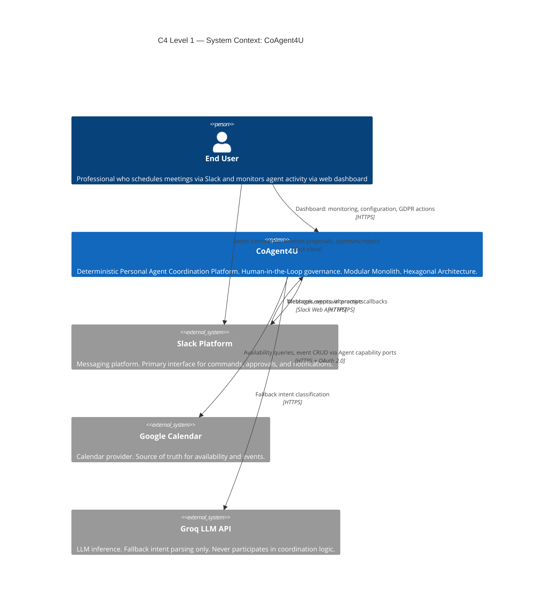

---

## C4 Level 2 — Container Diagram

### What This Diagram Shows

The deployable containers within the CoAgent4U platform boundary. It answers: *"What runs, where does it run, and how do containers communicate?"*

### Key Design Decisions

**Backend Application (Modular Monolith):** The entire platform backend is a single deployable JAR — Java 21, Spring Boot 3.x, Maven. It contains all core domain modules, integration adapter modules, and infrastructure modules. This is a deliberate MVP choice: the hexagonal boundaries drawn at Level 3 allow future extraction into separate services without rewriting business logic.

**Web Dashboard (Thin Client):** React 18, TypeScript, Shadcn/UI, Vite. It contains no business logic whatsoever. Its sole responsibilities are: displaying monitoring data, allowing configuration changes, and initiating GDPR export/deletion flows — all via REST calls to the backend.

**Database (PostgreSQL 15+ with Flyway):** A single relational database instance. The critical design constraint is that each module owns its tables exclusively — there are no cross-module foreign key constraints and no cross-schema joins. Module data isolation is enforced at the database schema level, not just the application level.

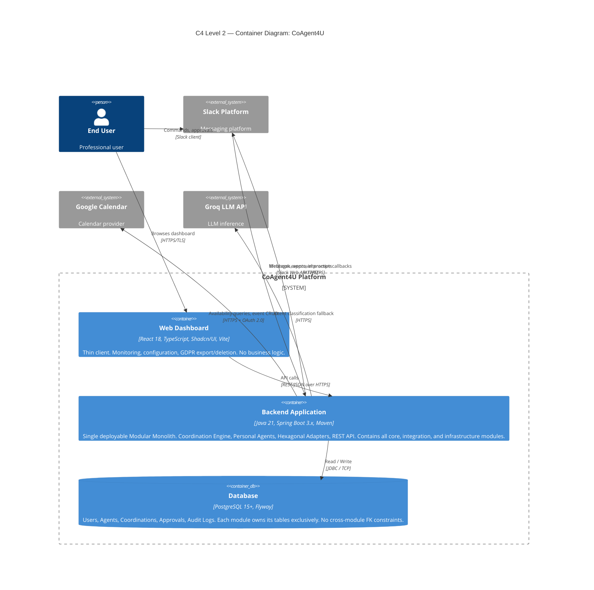

---

## C4 Level 3 — Component Diagram: Backend Application

### What This Diagram Shows

All modules inside the single Backend Application, organized into three internal boundaries, and the port-based relationships between them. It answers: *"What modules exist inside the backend, who owns what, and how do they communicate?"*

### Module Boundaries

**Core Domain Modules** contain all business logic and domain rules. They are technology-agnostic and have no direct dependencies on frameworks or external systems. They communicate with the outside world exclusively through port interfaces.

**Integration Adapter Modules** contain the implementations of outbound ports that connect to external systems (Slack, Google Calendar, Groq). They are driven by core modules through port contracts — they never initiate calls into core modules.

**Infrastructure Modules** handle cross-cutting concerns: persistence, security, configuration, and monitoring. They implement persistence port contracts consumed by core modules, and provide security services (JWT, HMAC, encryption, rate limiting) consumed by both core and integration layers.

### Critical Architectural Rules

- `core/agent-module` is the **sole consumer of `CalendarPort`**. The labels `coordination-module: ❌`, `approval-module: ❌`, `user-module: ❌` are hard constraints, not suggestions.
- `CoordinationModule` reaches into `agent-module` **only via outbound ports** (`AgentAvailabilityPort`, `AgentEventExecutionPort`, `AgentProfilePort`, `AgentApprovalPort`). This preserves agent sovereignty — the Coordination Engine never touches a calendar or an approval store directly.
- `LLMPort` is consumed only by `agent-module` and only as a fallback. The annotation `(fallback only)` means the LLM result never feeds into the coordination state machine.
- `NotificationPort` is a shared outbound port implemented by `SlackOutboundAdapter` and consumed independently by `agent-module`, `approval-module`, and `user-module`.
- `AuditPersistencePort` is consumed **asynchronously** by `infrastructure/monitoring` — audit writes are non-blocking and never on the critical coordination path.

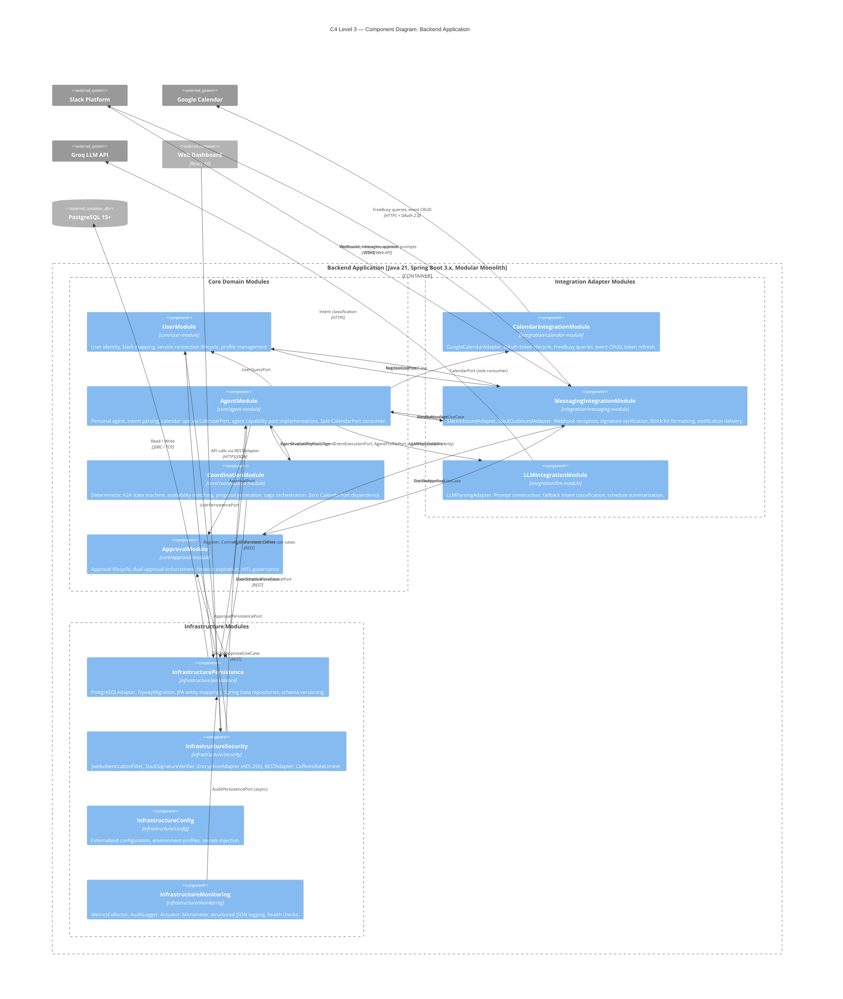

---

## C4 Level 4 — Code: CoordinationModule

### What This Diagram Shows

The internal code-level structure of `core/coordination-module` — the heart of the deterministic A2A engine. It answers: *"What classes/services exist inside CoordinationModule, what are their responsibilities, and what ports do they expose and consume?"*

### Key Design Decisions

**`CoordinationProtocolPort` (Inbound):** The single entry point into this module. It exposes `initiate()`, `advance()`, and `terminate()` operations. The warning annotation `⚠ agent-module invocation only` is a hard rule — no external adapter or other core module may call this port directly.

**`CoordinationOrchestrator` (Application Service):** Implements `CoordinationProtocolPort`. Sequences all domain services in the correct order. It holds no domain state itself — it delegates to the domain layer and communicates results through outbound ports.

**Domain Layer:** Five collaborating components make up the coordination domain:
- `CoordinationStateMachine` — enforces all legal state transitions from `INITIATED` through `COMPLETED`. Any illegal transition is rejected.
- `AvailabilityMatcher` — performs deterministic overlap computation. It operates exclusively on `AvailabilityBlock` value objects; it has no awareness of Google Calendar or any external API.
- `ProposalGenerator` — constructs a `MeetingProposal` value object from the matched `TimeSlot` and participant `AgentProfile` data.
- `CoordinationSaga` — manages dual-agent event creation with compensating transaction logic. If Agent A's event is created but Agent B's creation fails, the saga triggers a compensating delete on Agent A's event.
- `Coordination` — the aggregate root that holds coordination identity and state.

**Outbound Ports — Implemented by `core/agent-module`:** The four agent-facing ports (`AgentAvailabilityPort`, `AgentEventExecutionPort`, `AgentApprovalPort`, `AgentProfilePort`) are defined here but implemented in `core/agent-module`. This inversion preserves agent sovereignty: the coordination engine calls agents, but agents own their own data and capabilities.

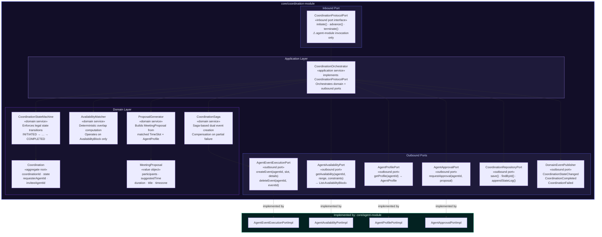

---

## C4 Level 4 — Code: AgentModule

### What This Diagram Shows

The internal code-level structure of `core/agent-module` — the personal agent engine and the sole owner of `CalendarPort`. It answers: *"How does the personal agent work internally, and how does it serve both user-facing requests and CoordinationModule's capability requests?"*

### Key Design Decisions

**Dual Inbound Boundary:** The module has two distinct categories of inbound ports. The `UserInbound` ports (`HandleMessageUseCase`, `ViewScheduleUseCase`, `CreatePersonalEventUseCase`) are called by `MessagingIntegrationModule` and `InfrastructureSecurity`. The `CapInbound` ports are capability implementations called by `CoordinationModule` — these are the ports that CoordinationModule defines and AgentModule implements.

**`AgentCommandService` (Application Service):** A single application service implementing all six inbound interfaces. It is the central coordinator for all agent operations, delegating to domain services as needed.

**`IntentParser` (Domain Service):** Rule-based parsing is the primary strategy. The `LLMPort` fallback is only triggered when the rule-based parser's confidence score falls below 0.7. The LLM result feeds only into intent classification — it never propagates into coordination decisions.

**`ConflictDetector` (Domain Service):** Operates on a list of `CalendarEvent` objects (fetched via `CalendarPort`) and computes free/busy windows, returning `AvailabilityBlock` value objects. This abstraction is what `AgentAvailabilityPortImpl` uses when serving `CoordinationModule`'s `AgentAvailabilityPort` requests.

**`CalendarPort` Ownership:** The annotation `🔒 Sole owner — no other module` is a non-negotiable architectural constraint. The `GoogleCalendarAdapter` (in `integration/calendar-module`) implements this port, and only this module may call it.

```mermaid
flowchart TB
    subgraph AgentModule["core/agent-module"]
        direction TB

        subgraph UserInbound["Inbound Ports (User-Facing)"]
            HM["HandleMessageUseCase\n«inbound port»"]
            VS["ViewScheduleUseCase\n«inbound port»"]
            CPE["CreatePersonalEventUseCase\n«inbound port»"]
        end

        subgraph CapInbound["Agent Capability Ports (Inbound from CoordinationModule)"]
            AAPI["AgentAvailabilityPortImpl\n«capability port impl»\nFetches events via CalendarPort →\nConflictDetector → AvailabilityBlock"]
            AEPI["AgentEventExecutionPortImpl\n«capability port impl»\nCreates/deletes events via CalendarPort →\nEventConfirmation"]
            APPI["AgentProfilePortImpl\n«capability port impl»\nReturns AgentProfile value object"]
            AAPPI["AgentApprovalPortImpl\n«capability port impl»\nDelegates to ApprovalPort"]
        end

        subgraph AppLayer_A["Application Layer"]
            ACS["AgentCommandService\n«application service»\nimplements HandleMessageUseCase,\nViewScheduleUseCase,\nCreatePersonalEventUseCase"]
        end

        subgraph DomainLayer_A["Domain Layer"]
            AG["Agent\n«aggregate root»\nagentId · userId · status"]
            IP_D["IntentParser\n«domain service»\nRule-based primary strategy\nLLMPort fallback on low confidence"]
            CD["ConflictDetector\n«domain service»\nComputes free/busy from\nList‹CalendarEvent›"]
            AB["AvailabilityBlock\n«value object»\nstart · end · status"]
            EC["EventConfirmation\n«value object»\nagentId · eventId · calendarId"]
            AGP["AgentProfile\n«value object»\ndisplayName · timezone · locale"]
        end

        subgraph OutboundPorts_A["Outbound Ports"]
            CP_A["CalendarPort\n«outbound port»\ngetEvents() · createEvent() · deleteEvent()\n🔒 Sole owner — no other module"]
            LP_A["LLMPort\n«outbound port»\nclassifyIntent() · summarizeSchedule()\nFallback only"]
            APRT["ApprovalPort\n«outbound port»\ncreateApproval()"]
            NP_A["NotificationPort\n«outbound port»\nsendMessage() · sendApprovalRequest()"]
            ARP["AgentPersistencePort\n«outbound port»\nsave() · findById() · findByUserId()"]
            UQP["UserQueryPort\n«outbound port»\nfindById() · findBySlackUserId()"]
            DEP_A["DomainEventPublisher\n«outbound port»\nPersonalEventCreated\nAgentProvisioned"]
        end

        HM --> ACS
        VS --> ACS
        CPE --> ACS

        AAPI --> ACS
        AEPI --> ACS
        APPI --> ACS
        AAPPI --> ACS

        ACS --> AG
        ACS --> IP_D
        ACS --> CD
        CD --> AB
        AEPI -.->|"returns"| EC
        APPI -.->|"returns"| AGP

        ACS --> CP_A
        ACS --> LP_A
        ACS --> APRT
        ACS --> NP_A
        ACS --> ARP
        ACS --> UQP
        ACS --> DEP_A
    end

    subgraph ExtAdapters["Driven Adapters (Zone 4)"]
        GCA["GoogleCalendarAdapter\nimplements CalendarPort\n«integration/calendar-module»"]
        GLA["GroqLLMAdapter\nimplements LLMPort\n«integration/llm-module»"]
    end

    CP_A -.->|"implemented by"| GCA
    LP_A -.->|"implemented by"| GLA

    style AgentModule fill:#120e28,stroke:#818cf8,color:#e0e7ff,stroke-width:2px
    style UserInbound fill:#1e1a3a,stroke:#6366f1,color:#c7d2fe
    style CapInbound fill:#1e1a3a,stroke:#38bdf8,color:#bae6fd
    style AppLayer_A fill:#1e1a3a,stroke:#a78bfa,color:#ede9fe
    style DomainLayer_A fill:#16122e,stroke:#7c3aed,color:#ede9fe
    style OutboundPorts_A fill:#1e1a3a,stroke:#6366f1,color:#c7d2fe
    style ExtAdapters fill:#032221,stroke:#10b981,color:#d1fae5
```

---

## C4 Level 4 — Code: UserModule

### What This Diagram Shows

The internal code-level structure of `core/user-module` — responsible for user identity, Slack identity mapping, Google Calendar OAuth connection lifecycle, and GDPR-compliant data deletion. It answers: *"How does the system manage user registration, service connections, and account deletion?"*

### Key Design Decisions

**`DeleteUserUseCase` (GDPR):** The cascading deletion entry point. It removes the user's profile, all linked `SlackIdentity` entities, and all `ServiceConnection` entities (which hold OAuth tokens). This satisfies the GDPR right to erasure requirement directly at the domain level.

**`ServiceConnection` (Entity):** Stores encrypted OAuth `accessToken` and `refreshToken`. The `(enc)` annotation signals that these fields are never stored in plaintext — they are encrypted by `EncryptionAdapter` (AES-256-GCM in `infrastructure/security`) before persistence and decrypted on read.

**`UserQueryPort` (Shared Read Port):** Annotated `🔓 Consumed by agent-module`. This is the only port in `user-module` that is intentionally exposed for cross-module consumption. `UserPersistencePort` (write operations) is private to this module. This separation enforces the rule that only `user-module` may mutate user state.

**Notification Flows:** `UserCommandService` uses `NotificationPort` to send welcome messages on registration, connection status updates on OAuth connect/disconnect, and deletion confirmations. All three notification types are delivered via `SlackOutboundAdapter`.

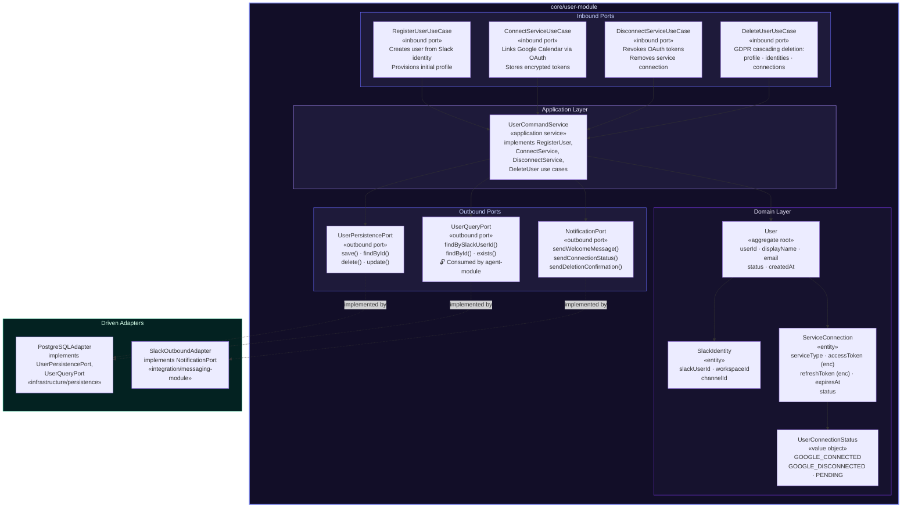

---

## C4 Level 4 — Code: ApprovalModule

### What This Diagram Shows

The internal code-level structure of `core/approval-module` — the Human-in-the-Loop governance layer that enforces mandatory approval for all agent actions. It answers: *"How are approval requests created, decided, and expired, and how does the rest of the system react to those decisions?"*

### Key Design Decisions

**`CreateApprovalUseCase` (Invoked via `ApprovalPort`):** The `🔓` annotation means this port is intentionally accessible from `agent-module` via the `ApprovalPort` outbound port. It is the bridge by which the agent requests a human decision before executing an action.

**`DecideApprovalUseCase`:** Handles both Slack interactive button callbacks (routed via `MessagingIntegrationModule → SlackInboundAdapter`) and direct REST decisions from the dashboard (routed via `InfrastructureSecurity → RESTAdapter`). Both paths converge here.

**`ApprovalTimeoutScheduler` (Application Service):** A scheduled task that periodically scans for `PENDING` approvals whose `expiresAt` timestamp has passed. The 12-hour default timeout is configured in `InfrastructureConfig`. Expired approvals trigger `ApprovalExpired` domain events.

**`ApprovalType` (Value Object):** Distinguishes `PERSONAL` approvals (user approving their own agent's action) from `COLLABORATIVE` approvals (user approving a meeting proposal as part of the A2A coordination flow). This type drives the downstream event handling logic in `agent-module`.

**Domain Event Flow:** `ApprovalDecisionMade` and `ApprovalExpired` events are published via `DomainEventPublisher` (implemented by `InMemoryEventBus`) and consumed by `core/agent-module`. The event type determines the action: a `PERSONAL` decision triggers direct personal event execution; a `COLLABORATIVE` decision calls `CoordinationProtocolPort.advance()` to progress the state machine.

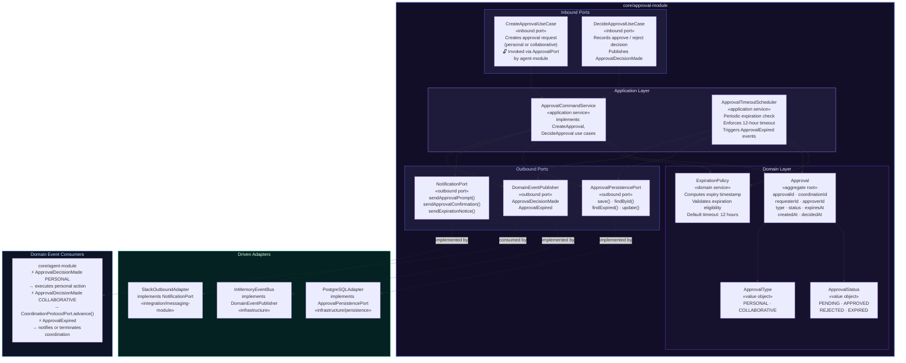

---

## C4 Level 4 — Code: CalendarIntegrationModule

### What This Diagram Shows

The internal structure of `integration/calendar-module` — the adapter that bridges `CalendarPort` to the Google Calendar API. It answers: *"How does the system talk to Google Calendar, who is allowed to trigger it, and what resilience mechanisms are in place?"*

### Key Design Decisions

**`CalendarPort` (Port Contract):** Defines three operations: `getEvents()`, `createEvent()`, and `deleteEvent()`. This interface is defined here in the integration module and implemented by `GoogleCalendarAdapter`. It is the only interface through which any part of the system may interact with Google Calendar.

**`GoogleCalendarAdapter` (Adapter):** Handles the full complexity of the Google Calendar integration, completely shielded from the domain layer: transparent OAuth 2.0 token refresh before every API call, FreeBusy API queries for availability checks, `Events.insert` with a deterministic `eventId` for idempotency (safe retries without duplicate calendar entries), and `Events.delete` for saga compensation. Circuit breaker, retry with exponential backoff, and timeout are applied to all outbound calls.

**Sole Consumer:** The diagram explicitly labels `coordination-module: ❌`, `approval-module: ❌`, and `user-module: ❌` to enforce that only `core/agent-module` may invoke `CalendarPort`. This is a hard architectural constraint, not a convention.

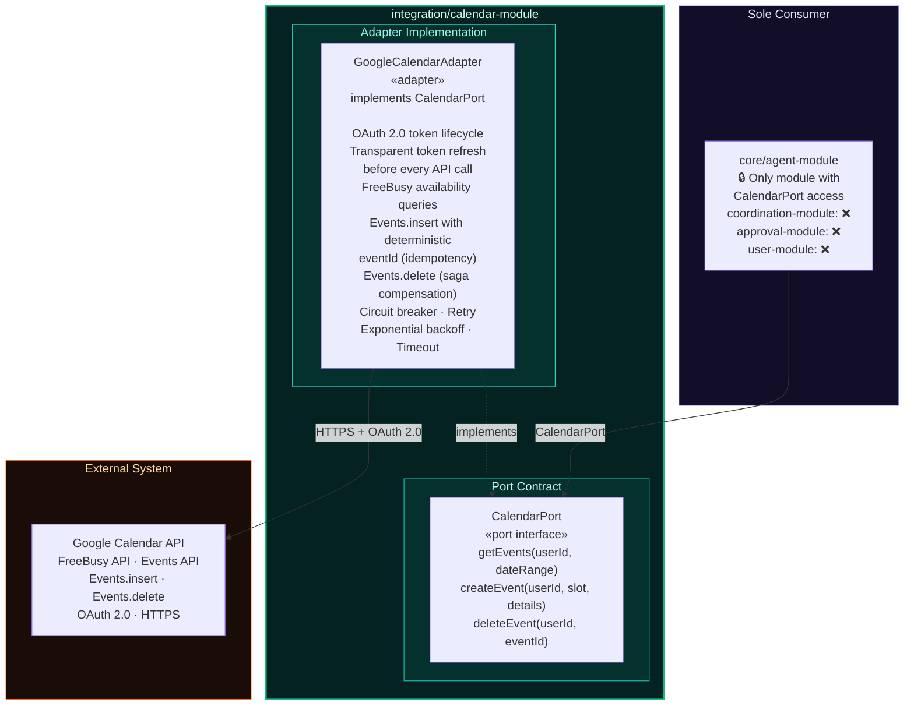

---

## C4 Level 4 — Code: MessagingIntegrationModule

### What This Diagram Shows

The internal structure of `integration/messaging-module` — the bidirectional Slack adapter. It answers: *"How does the system receive Slack events and send Slack messages, and what are the routing and security rules?"*

### Key Design Decisions

**`SlackInboundAdapter` (Driving Adapter):** Receives all inbound Slack traffic — both Events API webhooks and Interactive Messages callbacks. It must acknowledge every webhook within **3 seconds** (Constraint PC-03 from the PRD); processing is therefore dispatched asynchronously after the ack. Signature verification is **delegated** to `SlackSignatureVerifier` in `infrastructure/security` — the adapter never performs cryptographic operations itself.

**Inbound Routing:** After verification, the adapter dispatches events to three distinct core module use cases based on event type: message events go to `HandleMessageUseCase` in `agent-module`; interactive button callbacks go to `DecideApprovalUseCase` in `approval-module`; app home events trigger `RegisterUserUseCase` in `user-module`.

**`SlackOutboundAdapter` (Driven Adapter):** Implements `NotificationPort` for all three core modules. Handles `chat.postMessage` and `chat.update` with Block Kit JSON formatting, approval button rendering, and full resilience (circuit breaker, retry, timeout) on outbound Slack Web API calls.

**`NotificationPort` (Shared Interface):** A single outbound port interface consumed independently by `agent-module`, `approval-module`, and `user-module`. All three share the same adapter implementation (`SlackOutboundAdapter`) but invoke it through their own module-scoped `NotificationPort` reference.

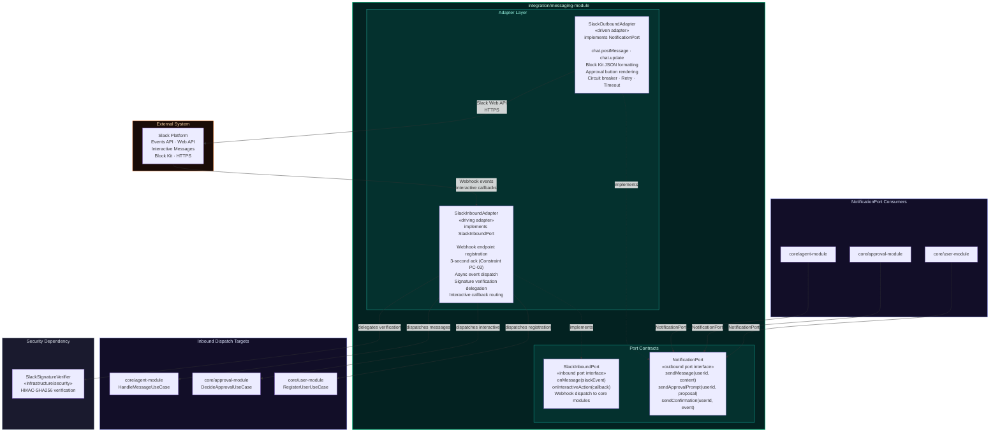

---

## C4 Level 4 — Code: LLMIntegrationModule

### What This Diagram Shows

The internal structure of `integration/llm-module` — the tightly bounded LLM fallback adapter. It answers: *"Where and how is the LLM used, and what are the strict constraints on its scope?"*

### Key Design Decisions

**`LLMPort` (Port Contract):** Exposes two operations: `classifyIntent()` for intent parsing fallback, and `summarizeSchedule()` for converting a list of calendar events into a human-readable summary. Both are stateless, read-only operations — neither operation modifies any system state.

**`LLMParsingAdapter`:** Constructs structured prompts, calls the Groq API (`llama3-70b` by default, configurable via `InfrastructureConfig`), and parses the response into a `ParsedIntent` value object. On any failure — network error, timeout, malformed response — it returns `UNKNOWN` intent and never propagates exceptions. A circuit breaker is applied to prevent cascading failures from LLM API degradation.

**Scope Constraints (Sole Consumer box):** The constraints annotated in the diagram are absolute: `LLMPort` is consumed only when confidence is below 0.7; it never influences coordination logic, never selects proposals, and never advances the coordination state machine. The LLM is an intent interpretation aid only, not a decision maker.

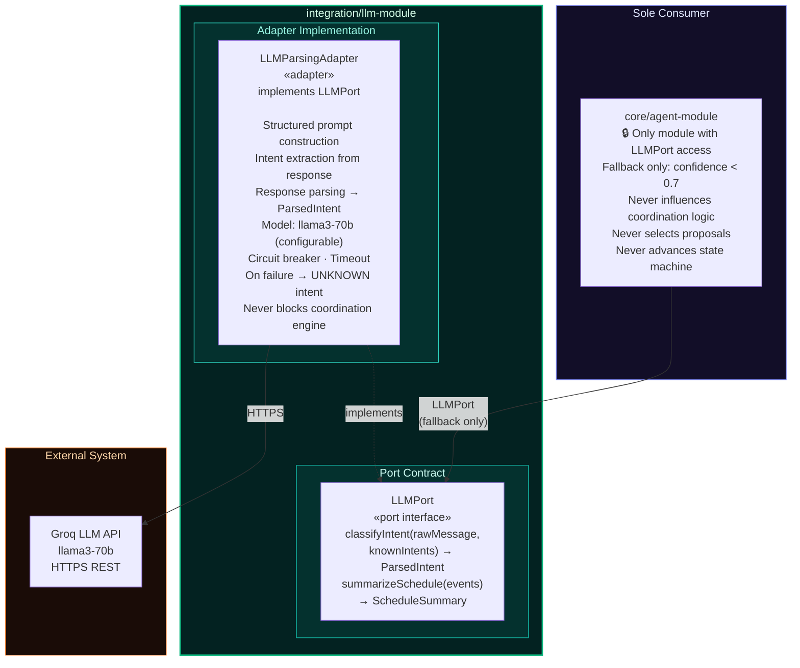

---

## C4 Level 4 — Code: InfrastructurePersistence

### What This Diagram Shows

The internal structure of `infrastructure/persistence` — the single PostgreSQL adapter that implements all persistence port contracts across all modules. It answers: *"How is data stored, which module owns which tables, and how is module data isolation enforced at the persistence level?"*

### Key Design Decisions

**Single Adapter, Multiple Contracts:** `PostgreSQLAdapter` implements five distinct persistence port interfaces — one per owning module. This is the only point in the system where all persistence contracts converge into a single physical implementation. The port interfaces themselves are defined in their respective owning modules; this module only contains the implementations.

**Module-Scoped Table Ownership:** Each module owns its tables exclusively. The constraints `⚠ No cross-module FK constraints` and `⚠ No cross-schema joins` are hard rules. If data from two modules must be associated, the association is maintained at the application layer through domain identifiers (e.g., `userId`), not through database-level foreign keys.

**Flyway Schema Management:** Each module has its own versioned Flyway migration scripts. Schema evolution, rollback, and baseline-on-first-deploy are all managed through Flyway, ensuring the database schema is always in sync with the application code and auditable in version control.

**Async Audit Writes:** `AuditPersistencePort` (consumed by `infrastructure/monitoring`) is the only port where writes are explicitly asynchronous and non-blocking. Audit log writes never add latency to the critical coordination or approval paths.

```mermaid
flowchart TB
    subgraph PersistModule["infrastructure/persistence"]
        direction TB

        subgraph PortContracts_P["Port Contracts (Implemented)"]
            UPP_P["UserPersistencePort\n«port interface»\nOwner: user-module\nTables: users · slack_identities\nservice_connections"]
            APP_P["AgentPersistencePort\n«port interface»\nOwner: agent-module\nTables: agents"]
            CPP_P["CoordinationPersistencePort\n«port interface»\nOwner: coordination-module\nTables: coordinations\ncoordination_state_log"]
            APPP_P["ApprovalPersistencePort\n«port interface»\nOwner: approval-module\nTables: approvals"]
            AUPP_P["AuditPersistencePort\n«port interface»\nOwner: monitoring\nTables: audit_logs"]
        end

        subgraph Components_P["Components"]
            PSQL["PostgreSQLAdapter\n«adapter»\nimplements all PersistencePort\ncontracts\nJPA entity mappings\nSpring Data repositories\nModule-scoped table ownership\n⚠ No cross-module FK constraints\n⚠ No cross-schema joins"]
            FW["FlywayMigration\n«schema management»\nVersioned migrations per module\nSchema evolution · Rollback\nBaseline on first deploy"]
        end

        PSQL -. implements .-> UPP_P
        PSQL -. implements .-> APP_P
        PSQL -. implements .-> CPP_P
        PSQL -. implements .-> APPP_P
        PSQL -. implements .-> AUPP_P
    end

    subgraph Consumers_P["Port Consumers (Core Modules)"]
        UM_P["core/user-module\nUserPersistencePort"]
        AM_P["core/agent-module\nAgentPersistencePort"]
        CM_P["core/coordination-module\nCoordinationPersistencePort"]
        APM_P["core/approval-module\nApprovalPersistencePort"]
        MON_P["infrastructure/monitoring\nAuditPersistencePort"]
    end

    subgraph ExtResource_P["External Resource"]
        DB["PostgreSQL 15+\nSingle database instance\nFlyway-managed schema\nJDBC / TCP"]
    end

    UM_P -->|"UserPersistencePort"| UPP_P
    AM_P -->|"AgentPersistencePort"| APP_P
    CM_P -->|"CoordinationPersistencePort"| CPP_P
    APM_P -->|"ApprovalPersistencePort"| APPP_P
    MON_P -->|"AuditPersistencePort"| AUPP_P
    PSQL -->|"JDBC / TCP"| DB
    FW -->|"Schema migrations"| DB

    style PersistModule fill:#1a1a2e,stroke:#94a3b8,color:#e2e8f0,stroke-width:2px
    style PortContracts_P fill:#1e1e38,stroke:#64748b,color:#cbd5e1
    style Components_P fill:#1e1e38,stroke:#64748b,color:#cbd5e1
    style Consumers_P fill:#120e28,stroke:#818cf8,color:#e0e7ff
    style ExtResource_P fill:#1a0c07,stroke:#f97316,color:#fed7aa
```

---

## C4 Level 4 — Code: InfrastructureSecurity

### What This Diagram Shows

The internal structure of `infrastructure/security` — the cross-cutting security layer that handles REST API entry, JWT authentication, Slack webhook verification, OAuth token encryption, and rate limiting. It answers: *"How is the system secured, and which security services are consumed by which parts of the system?"*

### Key Design Decisions

**`RESTAdapter` (Driving Adapter):** The single REST entry point for dashboard API calls from the Web Dashboard. All routes are JWT-protected. The adapter routes authenticated requests to the correct core module use cases in `user-module`, `agent-module`, and `approval-module`. Rate limiting is enforced at this layer via `CaffeineRateLimiter` before any business logic executes.

**`JwtAuthenticationFilter`:** Handles stateless JWT issuance and validation for all dashboard sessions. Spring Security integration ensures all REST routes are gated behind this filter.

**`SlackSignatureVerifier`:** Implements HMAC-SHA256 verification of the `X-Slack-Signature` header with timestamp replay protection. This component is **consumed by `MessagingIntegrationModule`** — the `SlackInboundAdapter` delegates all verification here rather than implementing it internally.

**`EncryptionAdapter`:** AES-256-GCM encryption and decryption for OAuth tokens stored in PostgreSQL and for any PII fields. **Consumed by `CalendarIntegrationModule`** — the `GoogleCalendarAdapter` decrypts tokens here before making Google Calendar API calls.

**`CaffeineRateLimiter`:** Token bucket algorithm enforcing 100 requests per minute per user. Applied at the REST adapter layer, backed by Caffeine in-memory cache.

```mermaid
flowchart TB
    subgraph SecurityModule["infrastructure/security"]
        direction TB

        subgraph DrivingAdapter_SEC["Driving Adapter"]
            RIP["RESTInboundPort\n«inbound port interface»\nDashboard API entry point"]
            RA["RESTAdapter\n«driving adapter»\nimplements RESTInboundPort\nRoutes HTTPS/JSON API calls\nto core module use cases\nJWT-protected endpoints"]
            RA -. implements .-> RIP
        end

        subgraph SecurityComponents_SEC["Security Components"]
            JWT["JwtAuthenticationFilter\n«security filter»\nToken issuance · validation\nDashboard session management\nStateless authentication\nSpring Security integration"]
            SSV["SlackSignatureVerifier\n«security filter»\nHMAC-SHA256 verification\nX-Slack-Signature header\nTimestamp replay protection\nAll inbound Slack webhooks"]
            ENC["EncryptionAdapter\n«security service»\nAES-256-GCM\nOAuth token encryption at rest\nPII encryption in PostgreSQL\nKey management"]
            RL["CaffeineRateLimiter\n«security service»\nToken bucket algorithm\n100 req/min/user\nREST adapter layer enforcement\nCaffeine cache-backed"]
        end

        RA --> JWT
        RA --> RL
    end

    subgraph CoreTargets_SEC["Core Module Endpoints"]
        UM_S["core/user-module\nRegister · Connect\nDisconnect · Delete"]
        AM_S["core/agent-module\nViewSchedule\nCreatePersonalEvent"]
        APM_S["core/approval-module\nDecideApproval"]
    end

    subgraph ExternalClient_SEC["External Client"]
        WD["Web Dashboard\nReact 18 · TypeScript\nShadcn/UI · Vite\nHTTPS/TLS"]
    end

    subgraph SecConsumers_SEC["Security Service Consumers"]
        MSG_S["integration/messaging-module\nSlackInboundAdapter\nuses SlackSignatureVerifier"]
        CAL_S["integration/calendar-module\nGoogleCalendarAdapter\nuses EncryptionAdapter\nfor token decryption"]
    end

    WD -->|"REST/JSON\nHTTPS"| RIP
    RA -->|"authenticated"| UM_S
    RA -->|"authenticated"| AM_S
    RA -->|"authenticated"| APM_S
    MSG_S -->|"signature verification"| SSV
    CAL_S -->|"token decryption"| ENC

    style SecurityModule fill:#1a1a2e,stroke:#94a3b8,color:#e2e8f0,stroke-width:2px
    style DrivingAdapter_SEC fill:#1e1e38,stroke:#64748b,color:#cbd5e1
    style SecurityComponents_SEC fill:#1e1e38,stroke:#64748b,color:#cbd5e1
    style CoreTargets_SEC fill:#120e28,stroke:#818cf8,color:#e0e7ff
    style ExternalClient_SEC fill:#0c1425,stroke:#3b82f6,color:#bfdbfe
    style SecConsumers_SEC fill:#032221,stroke:#10b981,color:#d1fae5
```

---

## C4 Level 4 — Code: InfrastructureMonitoring

### What This Diagram Shows

The internal structure of `infrastructure/monitoring` — the observability layer handling metrics collection and async audit logging. It answers: *"How is the system observed, and how is the full coordination lifecycle recorded for audit purposes?"*

### Key Design Decisions

**`MetricsCollector`:** Uses Micrometer for dimensional metrics exposed via Spring Boot Actuator endpoints (`/health`, `/info`, `/metrics`). Tracks coordination duration, approval latency, agent response times, and database connectivity. These metrics are intended for consumption by Prometheus and visualization in Grafana dashboards.

**`AuditLogger` (Async Event Consumer):** Subscribes to domain events published by `core/coordination-module` (`CoordinationStateChanged`, `CoordinationCompleted`, `CoordinationFailed`). The `-.->` dashed arrow with the label `async domain events / non-blocking` indicates that audit log writes never block the coordination flow. Each log entry includes a correlation ID for full lifecycle tracing across state transitions.

**`AuditPersistencePort`:** The only outbound port in this module. Implemented by `PostgreSQLAdapter` in `infrastructure/persistence`, writing to the `audit_logs` table. The `queryAuditLogs()` operation supports the Web Dashboard's audit trail display and GDPR data export feature.

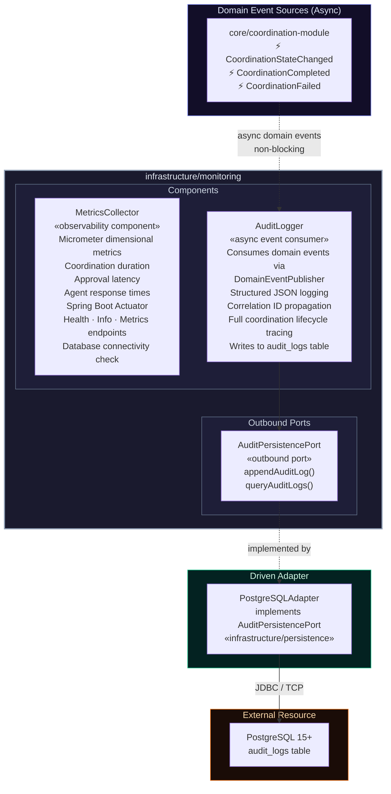

---

## C4 Level 4 — Code: InfrastructureConfig

### What This Diagram Shows

The internal structure of `infrastructure/config` — the externalized configuration layer that supplies environment-specific properties, secrets, and feature flags to all modules. It answers: *"How is the system configured across environments, and where are sensitive values managed?"*

### Key Design Decisions

**`EnvironmentProfileManager`:** Manages the three deployment profiles — `dev`, `staging`, and `production`. Spring profile activation controls which property sources are loaded and which beans are conditionally wired. This enables environment-specific behavior (e.g., relaxed rate limits in dev, strict encryption key requirements in production) without code changes.

**`SecretsInjector`:** Binds environment variables to Spring configuration properties at startup. All sensitive values — API keys, database credentials, OAuth client secrets — are injected this way, never hardcoded. The comment `Future: Vault / AWS Secrets Manager via adapter swap` indicates this component is designed for easy replacement with a secrets management service without changing any consumer code.

**`ExternalizedConfiguration`:** Manages `application.yml` and its profile-specific overrides. Critically, it owns the three configurable thresholds that drive runtime behavior across the system:
- **LLM confidence threshold:** `0.7` — the cutoff below which `IntentParser` falls back to the LLM.
- **Approval timeout:** `12h` — the expiration window enforced by `ApprovalTimeoutScheduler`.
- **Rate limit:** `100 req/min/user` — enforced by `CaffeineRateLimiter` in `InfrastructureSecurity`.

All three of these constants are visible in the diagram as the authoritative source — changing them here changes behavior system-wide.

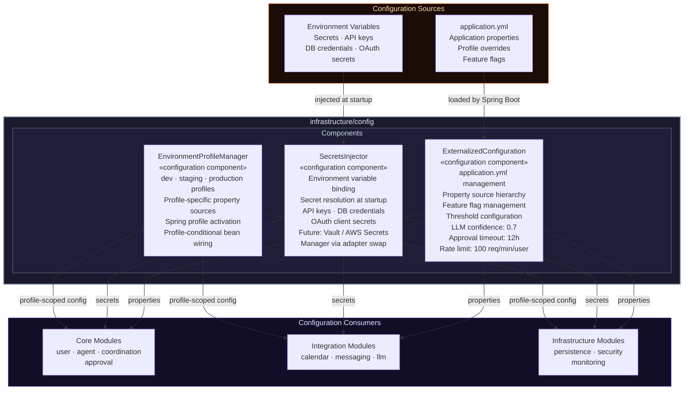

---

## Document Control

**Version:** 1.0
**Last Updated:** February 14, 2026
**Source:** Derived from CoAgent4U PRD v1.0 and C4 Architecture Diagrams
**Next Review:** Post-MVP launch (Week 6)

*This document contains the canonical C4 architecture diagrams for CoAgent4U. All diagrams are authoritative. Any implementation decision that contradicts a constraint annotated in these diagrams requires explicit architecture review and an update to this document.*
