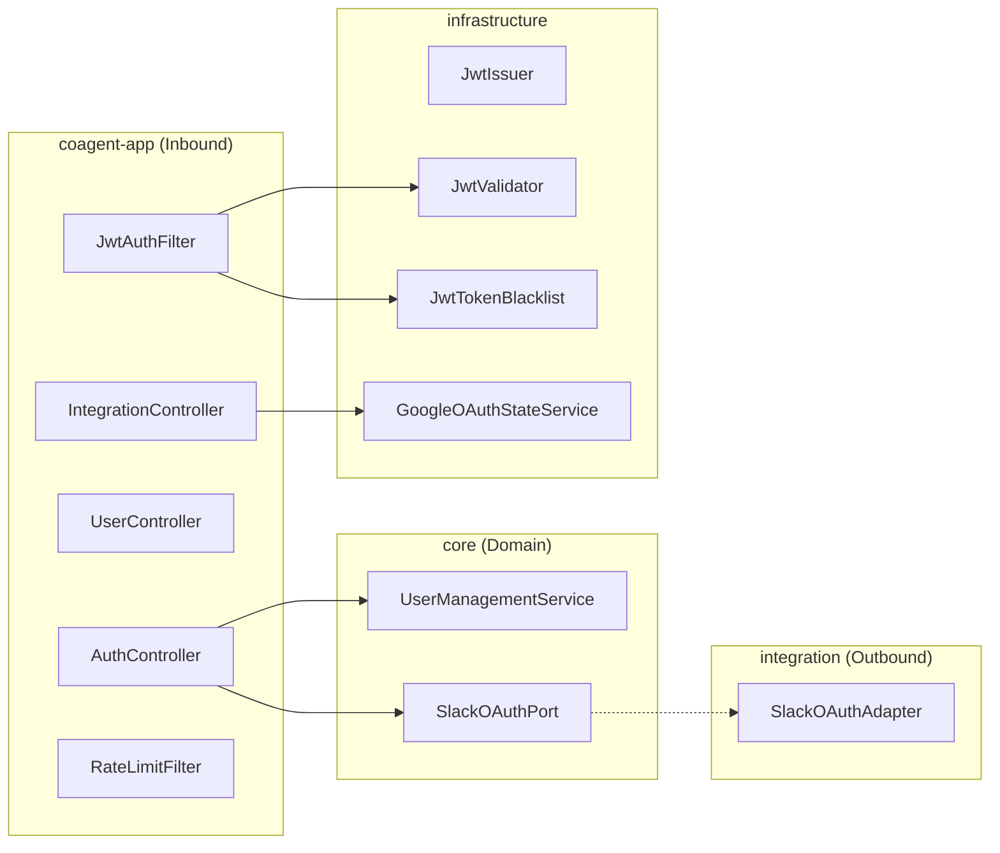

# Walkthrough — Auth, Session & Integration Backend

## What Was Built

Complete authentication, session management, and integration layer for CoAgent4U, enabling the frontend to support:

- **Slack OAuth Login** (OpenID Connect)
- **JWT Session Management** (HTTPOnly secure cookies, 24h TTL)
- **Username-based Onboarding** (new user registration + agent provisioning)
- **Logout** with token revocation
- **Session Verification** endpoint
- **Google Calendar OAuth** with CSRF-safe signed state tokens
- **Rate Limiting** by userId + endpoint
- **CORS** for frontend development

---

## Architecture

All changes follow the existing hexagonal architecture:



---

## API Endpoints

| Method | Path | Auth | Description |
|--------|------|------|-------------|
| GET | `/auth/slack/start` | No | Redirects to Slack OAuth |
| GET | `/auth/slack/callback` | No | Handles Slack OAuth callback |
| POST | `/auth/username` | Pending JWT | Completes registration |
| POST | `/auth/logout` | Yes | Revokes JWT, clears cookie |
| GET | `/auth/session` | Optional | Returns session status |
| GET | `/integrations/google/authorize` | Yes | Redirects to Google OAuth |
| GET | `/integrations/google/callback` | No | Google OAuth callback |
| DELETE | `/integrations/google/disconnect` | Yes | Revokes Google Calendar |
| GET | `/integrations/google/status` | Yes | Connection status |
| GET | `/me` | Yes | User profile |

---

## Files Changed

### New (13 files)

| Module | File | Purpose |
|--------|------|---------|
| security | [JwtTokenBlacklist.java](file:///e:/CoAgent4U/infrastructure/security/src/main/java/com/coagent4u/security/JwtTokenBlacklist.java) | Token revocation cache |
| user-module | [SlackOAuthPort.java](file:///e:/CoAgent4U/core/user-module/src/main/java/com/coagent4u/user/port/out/SlackOAuthPort.java) | Outbound port |
| messaging | [SlackOAuthAdapter.java](file:///e:/CoAgent4U/integration/messaging-module/src/main/java/com/coagent4u/messaging/SlackOAuthAdapter.java) | OpenID Connect adapter |
| coagent-app | [AuthController.java](file:///e:/CoAgent4U/coagent-app/src/main/java/com/coagent4u/app/rest/AuthController.java) | Auth endpoints |
| coagent-app | [IntegrationController.java](file:///e:/CoAgent4U/coagent-app/src/main/java/com/coagent4u/app/rest/IntegrationController.java) | Google Calendar endpoints |
| coagent-app | [UserController.java](file:///e:/CoAgent4U/coagent-app/src/main/java/com/coagent4u/app/rest/UserController.java) | /me endpoint |
| coagent-app | [JwtAuthenticationFilter.java](file:///e:/CoAgent4U/coagent-app/src/main/java/com/coagent4u/app/filter/JwtAuthenticationFilter.java) | Cookie-based JWT auth |
| coagent-app | [RateLimitFilter.java](file:///e:/CoAgent4U/coagent-app/src/main/java/com/coagent4u/app/filter/RateLimitFilter.java) | userId+endpoint rate limiting |
| coagent-app | [AuthenticatedUser.java](file:///e:/CoAgent4U/coagent-app/src/main/java/com/coagent4u/app/security/AuthenticatedUser.java) | Request attribute record |
| coagent-app | [GoogleOAuthStateService.java](file:///e:/CoAgent4U/coagent-app/src/main/java/com/coagent4u/app/security/GoogleOAuthStateService.java) | Signed state tokens |
| coagent-app | [CorsConfig.java](file:///e:/CoAgent4U/coagent-app/src/main/java/com/coagent4u/app/config/CorsConfig.java) | CORS for frontend |
| coagent-app | [FilterRegistrationConfig.java](file:///e:/CoAgent4U/coagent-app/src/main/java/com/coagent4u/app/config/FilterRegistrationConfig.java) | Filter + bean wiring |
| persistence | [V10__auth_session_tables.sql](file:///e:/CoAgent4U/infrastructure/persistence/src/main/resources/db/migration/V10__auth_session_tables.sql) | revoked_tokens table |

### Modified (7 files)

| File | What Changed |
|------|--------------|
| [JwtIssuer.java](file:///e:/CoAgent4U/infrastructure/security/src/main/java/com/coagent4u/security/JwtIssuer.java) | Added `username` + `pending_registration` claims |
| [JwtValidator.java](file:///e:/CoAgent4U/infrastructure/security/src/main/java/com/coagent4u/security/JwtValidator.java) | Added [JwtClaims](file:///e:/CoAgent4U/infrastructure/security/src/main/java/com/coagent4u/security/JwtValidator.java#47-55) record + [validateFull()](file:///e:/CoAgent4U/infrastructure/security/src/main/java/com/coagent4u/security/JwtValidator.java#56-86) |
| [CoagentProperties.java](file:///e:/CoAgent4U/infrastructure/config/src/main/java/com/coagent4u/config/CoagentProperties.java) | Added Slack OAuth + `frontendUrl` |
| [SecurityBeanConfig.java](file:///e:/CoAgent4U/infrastructure/config/src/main/java/com/coagent4u/config/SecurityBeanConfig.java) | Added [JwtTokenBlacklist](file:///e:/CoAgent4U/infrastructure/security/src/main/java/com/coagent4u/security/JwtTokenBlacklist.java#16-46) bean |
| [application.yml](file:///e:/CoAgent4U/infrastructure/config/src/main/resources/application.yml) | New Slack OAuth + updated Google redirect |
| [application.properties](file:///e:/CoAgent4U/coagent-app/src/main/resources/application.properties) | New env vars |
| [coordination-module/pom.xml](file:///e:/CoAgent4U/core/coordination-module/pom.xml) | Pre-existing fix: test dependency |

---

## Test Results

```
Tests run: 16, Failures: 0, Errors: 0, Skipped: 0
BUILD SUCCESS
```

- **SecurityTests** (8 tests): JWT round-trip, AES encrypt/decrypt, Slack signature verification, rate limiter
- **RestApiControllerTest** (8 tests): User registration, profile, health, OAuth callbacks

---

## Required Environment Variables

```bash
SLACK_CLIENT_ID=your-slack-app-client-id
SLACK_CLIENT_SECRET=your-slack-app-client-secret
SLACK_REDIRECT_URI=http://localhost:8080/auth/slack/callback  # default
FRONTEND_URL=http://localhost:3000  # default
```

> [!TIP]
> Your Slack App must have OpenID Connect scopes: `openid`, `profile`, `email` and the redirect URI set to `http://localhost:8080/auth/slack/callback`.
